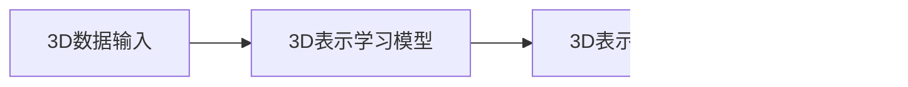

# 一切皆是映射：3D建模与深度学习技术的融合

## 1.背景介绍

### 1.1 3D建模的重要性

在当今数字时代,三维(3D)建模技术已经广泛应用于各个领域,如计算机动画、视频游戏、工业设计、建筑规划、医学可视化等。3D模型不仅能够逼真地呈现物体的外观和结构,还可以模拟物理属性和运动,为虚拟现实(VR)、增强现实(AR)等新兴技术提供支撑。

### 1.2 深度学习的兴起

近年来,深度学习作为一种基于人工神经网络的机器学习技术,在计算机视觉、自然语言处理、语音识别等领域取得了突破性进展。深度学习能够自动从大量数据中提取特征,并对复杂模式进行建模,展现出超越传统方法的强大能力。

### 1.3 融合的必要性

尽管3D建模和深度学习分别在各自领域取得了长足进展,但将它们结合在一起,可以释放出前所未有的潜力。一方面,深度学习可以辅助3D建模过程,提高效率和质量;另一方面,3D数据也为深度学习算法提供了新的应用场景和挑战。

## 2.核心概念与联系  

### 2.1 3D表示学习

3D表示学习(3D Representation Learning)旨在从3D数据(如点云、网格、体素等)中学习出有意义的表示,捕捉物体的几何和拓扑结构。这种表示可用于下游任务,如3D目标检测、分割、重建等。



### 2.2 生成对抗网络

生成对抗网络(Generative Adversarial Networks, GANs)是一种基于深度学习的生成模型,由生成器和判别器组成。生成器旨在生成逼真的样本(如3D模型),而判别器则判断样本是真实的还是生成的。通过对抗训练,两者相互促进,最终生成器可以产生高质量的输出。


### 2.3 3D数据增强

3D数据增强是指对现有的3D数据进行变换(如旋转、缩放、噪声添加等),以产生更多的训练样本,从而提高模型的泛化能力和鲁棒性。这在3D数据量有限的情况下尤为重要。


### 2.4 多模态融合

多模态融合指的是将来自不同模态(如3D模型、2D图像、文本描述等)的信息整合在一起,以获得更丰富、更全面的表示。这种方法可以提高模型的理解能力,并在各种任务中发挥作用。


## 3.核心算法原理具体操作步骤

### 3.1 点云处理

点云是一种常见的3D数据表示形式,由一组无序的点集合组成。处理点云数据的关键步骤包括:

1. 点云采样和预处理
2. 特征提取(如PointNet++提取局部和全局特征)
3. 点云分割、分类或其他下游任务


### 3.2 网格处理

网格是另一种常见的3D表示,由顶点、边和面组成。处理网格数据的典型步骤包括:

1. 网格简化和修复
2. 卷积网络提取局部和全局特征
3. 网格分割、形状生成等任务


### 3.3 体素处理

体素是将3D空间划分为规则的体元格状结构。处理体素数据的流程类似于处理2D图像数据:

1. 体素化:将3D数据转换为体素格式
2. 3D卷积网络提取特征
3. 体素分类、重建等任务


### 3.4 GAN生成3D模型

生成对抗网络可用于生成3D模型,主要步骤包括:

1. 设计生成器和判别器网络结构
2. 定义生成器和判别器损失函数
3. 对抗训练,生成器努力生成逼真样本,判别器努力区分真伪
4. 生成高质量的3D模型输出


## 4.数学模型和公式详细讲解举例说明

### 4.1 点云特征提取

PointNet++是一种流行的点云特征提取网络,它使用了集合层(Set Abstraction Layer)来提取局部和全局特征。集合层的数学表达式如下:

局部特征:
$$f_{local}(\{x_i\}_{i\in\mathcal{N}(p_t)}) = \gamma\left(\max\limits_{i\in\mathcal{N}(p_t)}\{h_{\Theta}(x_i)\}\right)$$

其中,$\mathcal{N}(p_t)$表示以$p_t$为中心的邻域点集,$h_{\Theta}$是一个多层感知机网络,用于提取每个点的局部特征。$\gamma$是一个全连接层,用于组合邻域点的最大特征。

全局特征:
$$f_{global}(\{x_i\}_{i=1}^{N}) = \max\limits_{i=1}^{N}\{h_{\Theta}(x_i)\}$$

通过取所有点的最大特征,可以获得整个点云的全局特征表示。

### 4.2 网格卷积

对于网格数据,可以使用基于图卷积的方法提取特征。定义网格上的卷积核权重$\mathbf{W}$,对于每个顶点$v_i$,其特征向量$\mathbf{x}_i$由邻域顶点特征的加权和计算得到:

$$\mathbf{x}_i = \sum\limits_{j\in\mathcal{N}(i)}\mathbf{W}_{ij}\mathbf{x}_j$$

其中,$\mathcal{N}(i)$表示$v_i$的邻域顶点集合。通过堆叠多层这种卷积操作,可以提取出高层次的特征表示。

### 4.3 体素生成模型

生成对抗网络可以用于生成3D体素模型。假设生成器网络为$G$,判别器网络为$D$,生成器的目标是最小化下式:

$$\min\limits_G \mathbb{E}_{\mathbf{z}\sim p_\mathbf{z}(\mathbf{z})}[\log(1-D(G(\mathbf{z})))]$$

判别器的目标是最大化下式:

$$\max\limits_D \mathbb{E}_{\mathbf{x}\sim p_\text{data}(\mathbf{x})}[\log D(\mathbf{x})] + \mathbb{E}_{\mathbf{z}\sim p_\mathbf{z}(\mathbf{z})}[\log(1-D(G(\mathbf{z})))]$$

其中,$\mathbf{z}$是随机噪声向量,$\mathbf{x}$是真实的3D体素数据。通过交替优化生成器和判别器,最终可以得到能够生成逼真3D模型的生成器网络$G$。

## 5.项目实践：代码实例和详细解释说明

以下是一个使用PyTorch实现的简单3D点云分类示例:

```python
import torch
import torch.nn as nn
import torch.nn.functional as F

# PointNet++网络
class PointNet2(nn.Module):
    def __init__(self, num_classes):
        super(PointNet2, self).__init__()
        
        # 编码器
        self.conv1 = nn.Conv1d(3, 64, 1)
        self.conv2 = nn.Conv1d(64, 128, 1)
        self.conv3 = nn.Conv1d(128, 1024, 1)
        
        # 集合层
        self.sa1 = SA_Module(1024)
        self.sa2 = SA_Module(256)
        
        # 分类器
        self.fc1 = nn.Linear(256, 128)
        self.fc2 = nn.Linear(128, num_classes)
        
    def forward(self, x):
        # 编码
        x = F.relu(self.conv1(x))
        x = F.relu(self.conv2(x))
        x = self.conv3(x)
        
        # 集合层
        x = self.sa1(x)
        x = self.sa2(x)
        
        # 分类
        x = torch.max(x, 2, keepdim=True)[0]
        x = x.view(-1, 256)
        x = F.relu(self.fc1(x))
        x = self.fc2(x)
        
        return x

# 集合层模块
class SA_Module(nn.Module):
    def __init__(self, in_channels):
        super(SA_Module, self).__init__()
        self.conv = nn.Conv1d(in_channels, in_channels//4, 1)
        self.bn = nn.BatchNorm1d(in_channels//4)
        
    def forward(self, x):
        # 局部特征
        local_feat = F.max_pool1d(x, kernel_size=16, stride=16)
        local_feat = self.conv(local_feat)
        local_feat = self.bn(local_feat)
        local_feat = F.relu(local_feat)
        
        # 全局特征
        global_feat = torch.max(x, 2, keepdim=True)[0]
        global_feat = global_feat.expand(-1, -1, x.size(2))
        
        # concatenate
        feat = torch.cat([local_feat, global_feat], dim=1)
        
        return feat
```

在这个示例中,我们定义了一个PointNet++网络,用于对点云数据进行分类。网络包括以下几个主要部分:

1. **编码器**:由一系列1D卷积层组成,用于提取点云的初始特征。
2. **集合层**:包含两个SA_Module,分别用于提取局部和全局特征,并将它们级联。
3. **分类器**:由全连接层组成,将提取的特征映射到分类标签。

SA_Module的作用是实现PointNet++论文中提出的集合层操作。它包含以下步骤:

1. 使用最大池化获取局部特征。
2. 通过1D卷积和BN层进一步提取和规范化局部特征。
3. 使用全局最大池化获取全局特征。
4. 将局部和全局特征级联,作为该层的输出。

在前向传播时,点云数据首先通过编码器提取初始特征,然后经过两个集合层提取更高层次的局部和全局特征。最后,这些特征被馈送到分类器,输出分类预测结果。

您可以使用任何点云数据集(如ModelNet)来训练和评估这个网络。在实际应用中,您可能还需要进行数据预处理、数据增强、超参数调整等步骤,以获得更好的性能。

## 6.实际应用场景

### 6.1 计算机动画和视频游戏

在计算机动画和视频游戏领域,3D建模与深度学习技术的融合可以带来多方面的优势:

1. **自动化3D建模**:使用生成对抗网络或其他深度生成模型,可以自动生成各种3D模型,如角色、场景、道具等,大大提高了制作效率。
2. **动作捕捉和动画**:通过深度学习对人体运动数据进行建模,可以实现高质量的动作捕捉和角色动画。
3. **材质和渲染**:深度学习可以模拟复杂的材质和光线传输,提高渲染质量