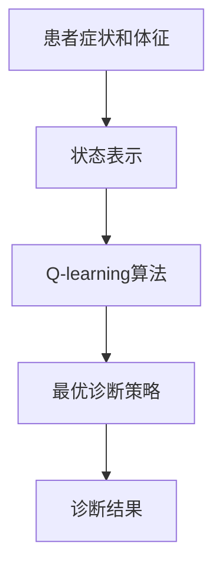

# 一切皆是映射：AI Q-learning在医疗诊断中的应用

## 1. 背景介绍
### 1.1 医疗诊断中的挑战
医疗诊断是医疗行业中一个极具挑战性的领域。面对复杂多变的疾病症状和体征，即使是经验丰富的医生，也难免会出现误诊或漏诊的情况。这不仅给患者带来了身心的伤害，也给医疗系统带来了沉重的负担。

### 1.2 人工智能在医疗领域的应用
近年来，人工智能技术的飞速发展为医疗诊断带来了新的曙光。机器学习算法能够从海量的医疗数据中自动提取特征，并建立起高效准确的诊断模型。尤其是强化学习算法，通过不断地与环境交互，可以在复杂多变的诊断任务中不断优化和提升性能。

### 1.3 Q-learning算法简介
Q-learning是强化学习领域中一种经典的算法，其核心思想是通过不断地试错和学习，在状态空间中寻找最优的决策路径。在医疗诊断中，我们可以将疾病的症状和体征看作状态，将诊断结果看作动作，通过Q-learning算法来学习最优的诊断策略。

## 2. 核心概念与联系
### 2.1 强化学习的基本概念
- 状态(State)：表示智能体所处的环境状态。
- 动作(Action)：表示智能体在某个状态下可以采取的行为。
- 奖励(Reward)：表示智能体采取某个动作后，环境给予的反馈。
- 策略(Policy)：表示智能体在每个状态下采取动作的规则。

### 2.2 Q-learning的核心思想
Q-learning的核心是学习一个Q函数，用来估计在某个状态下采取某个动作的长期回报。具体来说，Q函数定义为：
$$Q(s,a) = r + \gamma \max_{a'} Q(s',a')$$

其中，$s$表示当前状态，$a$表示在状态$s$下采取的动作，$r$表示采取动作$a$后环境给予的即时奖励，$\gamma$是折扣因子，$s'$表示采取动作$a$后转移到的下一个状态，$a'$表示在状态$s'$下可以采取的动作。

通过不断地更新Q函数，智能体可以逐步学习到最优的决策策略。

### 2.3 Q-learning在医疗诊断中的应用
在医疗诊断中，我们可以将疾病的症状和体征看作状态，将诊断结果看作动作。通过Q-learning算法，我们可以学习到一个最优的诊断策略，根据患者的症状和体征，给出最可能的诊断结果。

下图展示了Q-learning在医疗诊断中的应用流程：



## 3. 核心算法原理具体操作步骤
Q-learning算法的核心步骤如下：
1. 初始化Q函数，可以将所有的Q值初始化为0。
2. 在每个时间步t：
   - 根据当前状态$s_t$，使用$\epsilon-greedy$策略选择一个动作$a_t$。即以$\epsilon$的概率随机选择动作，以$1-\epsilon$的概率选择Q值最大的动作。
   - 执行动作$a_t$，观察环境给予的奖励$r_t$和下一个状态$s_{t+1}$。
   - 更新Q函数：
   $$Q(s_t,a_t) \leftarrow Q(s_t,a_t) + \alpha [r_t + \gamma \max_a Q(s_{t+1},a) - Q(s_t,a_t)]$$
   其中，$\alpha$是学习率，控制每次更新的幅度。
3. 重复步骤2，直到达到最大时间步或满足收敛条件。

在医疗诊断中，我们可以将患者的症状和体征编码为一个状态向量，将可能的诊断结果编码为动作空间。在每个时间步，智能体根据当前的症状和体征选择一个诊断动作，然后观察实际的诊断结果，并据此更新Q函数。不断重复这个过程，智能体最终可以学习到一个最优的诊断策略。

## 4. 数学模型和公式详细讲解举例说明
Q-learning算法的核心是更新Q函数，下面我们通过一个具体的例子来说明Q函数的更新过程。

假设我们有一个简单的医疗诊断问题，状态空间为{发烧，咳嗽，正常}，动作空间为{感冒，肺炎，健康}。我们定义即时奖励函数如下：
- 如果诊断正确，奖励为1。
- 如果诊断错误，奖励为-1。

假设当前状态为"发烧"，智能体选择动作"感冒"，观察到的下一个状态为"咳嗽"，实际的诊断结果为"感冒"，则即时奖励为1。假设折扣因子$\gamma=0.9$，学习率$\alpha=0.1$。

根据Q-learning的更新公式，我们可以计算：

$$
\begin{aligned}
Q(发烧,感冒) &\leftarrow Q(发烧,感冒) + \alpha [r + \gamma \max_a Q(咳嗽,a) - Q(发烧,感冒)]\\
&= Q(发烧,感冒) + 0.1 [1 + 0.9 \max_a Q(咳嗽,a) - Q(发烧,感冒)]
\end{aligned}
$$

假设$Q(咳嗽,感冒)=0.5$，$Q(咳嗽,肺炎)=0.3$，$Q(咳嗽,健康)=0.1$，则：

$$
\begin{aligned}
Q(发烧,感冒) &= Q(发烧,感冒) + 0.1 [1 + 0.9 \times 0.5 - Q(发烧,感冒)]\\
&= 0.9 Q(发烧,感冒) + 0.145
\end{aligned}
$$

通过这样的更新过程，Q函数可以不断地向最优值收敛，最终得到最优的诊断策略。

## 5. 项目实践：代码实例和详细解释说明
下面我们通过一个简单的Python代码实例来演示Q-learning在医疗诊断中的应用。

```python
import numpy as np

# 定义状态空间和动作空间
states = ['发烧', '咳嗽', '正常']
actions = ['感冒', '肺炎', '健康']

# 定义奖励函数
rewards = np.array([[1, -1, -1], 
                    [-1, 1, -1],
                    [-1, -1, 1]])

# 初始化Q函数
Q = np.zeros((len(states), len(actions)))

# 定义折扣因子和学习率
gamma = 0.9
alpha = 0.1

# 定义训练轮数
num_episodes = 1000

# 开始训练
for episode in range(num_episodes):
    # 随机选择一个初始状态
    state = np.random.randint(0, len(states))
    
    while True:
        # 使用epsilon-greedy策略选择动作
        if np.random.uniform(0, 1) < 0.1:
            action = np.random.randint(0, len(actions))
        else:
            action = np.argmax(Q[state, :])
        
        # 执行动作，观察下一个状态和奖励
        next_state = np.random.randint(0, len(states))
        reward = rewards[state, action]
        
        # 更新Q函数
        Q[state, action] += alpha * (reward + gamma * np.max(Q[next_state, :]) - Q[state, action])
        
        # 转移到下一个状态
        state = next_state
        
        # 如果达到终止状态，结束循环
        if state == len(states) - 1:
            break

# 输出最优策略
policy = {}
for i, state in enumerate(states):
    policy[state] = actions[np.argmax(Q[i, :])]
    
print('最优诊断策略：', policy)
```

在这个例子中，我们定义了一个简单的医疗诊断问题，状态空间为{发烧，咳嗽，正常}，动作空间为{感冒，肺炎，健康}。我们使用一个二维数组来表示奖励函数，其中`rewards[i,j]`表示在状态`i`下采取动作`j`的即时奖励。

我们首先初始化Q函数为全零数组，然后开始训练过程。在每一轮训练中，我们随机选择一个初始状态，然后使用$\epsilon-greedy$策略选择动作。接着，我们执行动作，观察下一个状态和即时奖励，并根据Q-learning的更新公式更新Q函数。不断重复这个过程，直到达到终止状态或达到最大训练轮数。

最后，我们根据学习到的Q函数，输出最优的诊断策略。对于每个状态，我们选择Q值最大的动作作为最优动作。

通过这个简单的例子，我们演示了Q-learning算法在医疗诊断中的应用流程。在实际应用中，我们需要根据具体的诊断任务，合理地设计状态空间、动作空间和奖励函数，并使用更大规模的数据进行训练和测试。

## 6. 实际应用场景
Q-learning算法在医疗诊断领域有广泛的应用前景，下面列举几个具体的应用场景：

### 6.1 辅助诊断系统
利用Q-learning算法，我们可以开发智能辅助诊断系统。该系统可以根据患者的症状和体征，给出可能的诊断结果，辅助医生进行诊断决策。这不仅可以提高诊断的准确率，还可以减轻医生的工作负担。

### 6.2 远程医疗诊断
在偏远地区或医疗资源匮乏的地区，利用Q-learning算法可以实现远程医疗诊断。患者可以通过互联网将自己的症状和体征输入到诊断系统中，系统可以自动给出诊断结果，并提供相应的治疗建议。这可以大大提高医疗服务的可及性和效率。

### 6.3 疾病预测和预防
Q-learning算法还可以应用于疾病预测和预防领域。通过分析患者的历史医疗数据，我们可以训练出一个疾病预测模型。该模型可以根据患者的当前状态，预测未来可能出现的疾病风险，并给出相应的预防措施。这对于慢性病管理和早期干预具有重要意义。

## 7. 工具和资源推荐
对于Q-learning算法的实现和应用，我们推荐以下工具和资源：

- Python及其科学计算库NumPy和SciPy：提供了强大的数值计算和数据处理功能，是实现Q-learning算法的首选工具。
- TensorFlow和PyTorch：流行的深度学习框架，提供了完善的强化学习工具包，可以方便地实现Q-learning算法。
- OpenAI Gym：强化学习领域的标准测试平台，提供了丰富的环境和任务，可以用于测试和评估Q-learning算法的性能。
- Sutton和Barto的《强化学习》一书：强化学习领域的经典教材，系统地介绍了Q-learning等算法的原理和实现。

## 8. 总结：未来发展趋势与挑战
Q-learning算法在医疗诊断领域展现出了广阔的应用前景，但同时也面临着一些挑战和未来的发展方向：

### 8.1 个性化诊断
目前的Q-learning算法主要针对一般人群进行训练和应用，缺乏对个体差异的考虑。未来的发展方向是结合患者的个体特征，如基因、生活方式等，实现个性化的诊断和治疗。

### 8.2 数据隐私和安全
医疗数据涉及患者的隐私，在使用Q-learning算法时需要特别注意数据的保护和安全。如何在保证数据隐私的前提下，实现数据的共享和利用，是一个亟待解决的问题。

### 8.3 模型的可解释性
Q-learning算法作为一种黑盒模型，其决策过程往往难以解释。在医疗诊断领域，模型的可解释性尤为重要，医生需要了解诊断结果背后的推理过程。因此，如何设计出可解释的Q-learning算法，是未来研究的一个重点方向。

### 8.4 多模态数据融合