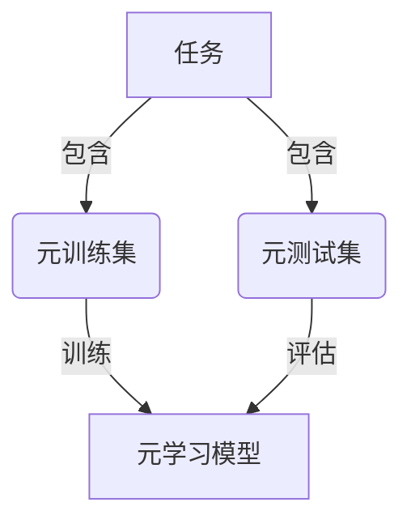

# 一切皆是映射：掌握元学习用于实时战术决策分析

## 1. 背景介绍

### 1.1 战术决策的重要性

在当今瞬息万变的环境中,无论是军事行动、企业竞争还是日常生活,都需要实时做出明智的战术决策。战术决策直接影响着行动的成败,需要综合考虑各种因素,并快速作出判断。传统的决策方式往往依赖人工经验和规则,难以适应复杂多变的情况。

### 1.2 人工智能在决策中的作用

人工智能技术的发展为实时战术决策提供了新的解决方案。通过机器学习算法建模并预测未来情况,辅助决策者做出明智选择。但传统机器学习方法需要大量标注数据进行训练,在实时决策场景下受到限制。

### 1.3 元学习的崛起

元学习(Meta-Learning)作为新兴的机器学习范式,旨在学习如何快速学习新任务,从而在有限数据下快速建模并推理。它模拟人类"学习如何学习"的能力,为实时战术决策提供了新的思路。

## 2. 核心概念与联系

### 2.1 元学习概述

元学习是一种在机器学习中学习的方法,旨在从过去的经验中获取元知识,以便更有效地学习新任务。它包括三个关键概念:

1. **任务(Task)**: 需要学习的具体问题,如分类、回归等。
2. **元训练集(Meta-Training Set)**: 用于训练元学习模型的一组任务。
3. **元测试集(Meta-Testing Set)**: 用于评估元学习模型在新任务上的泛化能力。



### 2.2 元学习在实时决策中的应用

将元学习应用于实时战术决策,可以理解为:

1. **任务**: 每一个实时决策场景,如部队调遣、资源分配等。
2. **元训练集**: 历史上各种决策场景的数据集合。
3. **元测试集**: 新出现的决策场景。

通过在元训练集上训练,元学习模型学习到如何快速适应新的决策场景,从而实现实时决策。

## 3. 核心算法原理具体操作步骤

元学习算法的核心思想是在元训练集上学习一个可迁移的内部表示或初始化,使得在新任务上只需少量数据和训练步骤即可快速适应。主要算法包括:

### 3.1 优化器学习(Optimizer Learning)

优化器学习的目标是学习一个在各种任务上表现良好的优化算法,从而加快新任务的训练过程。具体步骤如下:

1. 在元训练集上,对每个任务进行少量梯度更新。
2. 评估更新后模型在该任务上的性能,作为优化目标。
3. 通过反向传播,更新生成优化算法的参数。
4. 在元测试集上,使用学习到的优化算法快速适应新任务。

### 3.2 模型不可知学习(Model-Agnostic Meta-Learning, MAML)

MAML旨在直接学习一个好的模型初始化,使得在新任务上只需少量梯度步骤即可获得良好性能。算法步骤如下:

1. 从元训练集中采样一批任务。
2. 对每个任务,使用当前模型参数作为初始化,进行少量梯度更新获得适应该任务的模型参数。
3. 在所有任务上,计算适应后模型参数与原始参数的损失,作为优化目标。
4. 通过反向传播,更新原始模型参数,使其更易适应各种任务。
5. 在元测试集上,使用学习到的初始参数快速适应新任务。

### 3.3 关系网络(Relation Networks)

关系网络通过学习数据实例之间的关系,实现快速推理新任务。算法步骤如下:

1. 从元训练集中采样一批任务及其支持集(支持集包含少量标注数据)。
2. 将支持集中的每个实例与查询实例计算关系得分。
3. 对所有关系得分进行聚合,得到查询实例的预测标签。
4. 在所有任务上,计算预测标签与真实标签的损失,作为优化目标。
5. 通过反向传播,更新关系网络参数。
6. 在元测试集上,利用学习到的关系推理能力快速适应新任务。

## 4. 数学模型和公式详细讲解举例说明

### 4.1 MAML 算法数学模型

MAML 算法的核心思想是在元训练集上优化一个易于迁移的初始参数 $\theta$,使得在新任务上只需少量梯度步骤即可获得良好性能。

对于每个任务 $\mathcal{T}_i$,我们将其数据分为支持集 $\mathcal{D}_i^{tr}$ 和查询集 $\mathcal{D}_i^{val}$。我们首先使用当前参数 $\theta$ 在支持集上进行 $k$ 步梯度更新,得到适应该任务的参数:

$$\theta_i' = \theta - \alpha \nabla_\theta \mathcal{L}_{\mathcal{T}_i}(f_\theta, \mathcal{D}_i^{tr})$$

其中 $\alpha$ 为学习率, $\mathcal{L}_{\mathcal{T}_i}$ 为任务损失函数,例如交叉熵损失。

接下来,我们在查询集 $\mathcal{D}_i^{val}$ 上评估适应后的模型 $f_{\theta_i'}$,并将其损失作为优化目标:

$$\min_\theta \sum_{\mathcal{T}_i \sim p(\mathcal{T})} \mathcal{L}_{\mathcal{T}_i}(f_{\theta_i'}, \mathcal{D}_i^{val})$$

通过在元训练集上优化该目标函数,我们可以获得一个易于迁移的初始参数 $\theta$,使得在新任务上只需少量梯度步骤即可快速适应。

### 4.2 关系网络数学模型

关系网络通过学习实例之间的关系,实现快速推理新任务。对于一个 $N$ 路 $K$ 射问题,我们有支持集 $\mathcal{S} = \{(x_i, y_i)\}_{i=1}^{N \times K}$ 和查询实例 $x_q$,目标是预测 $x_q$ 的标签 $y_q$。

首先,我们将查询实例 $x_q$ 与支持集中的每个实例 $x_i$ 计算关系得分:

$$r_i = g(x_q, x_i; \phi)$$

其中 $g$ 为关系函数,由神经网络参数 $\phi$ 决定。

接下来,我们对所有关系得分进行聚合,得到查询实例的预测标签:

$$\hat{y}_q = \sum_{i=1}^{N \times K} s(r_i, y_i)$$

其中 $s$ 为聚合函数,例如软最大函数。

在元训练集上,我们优化关系函数参数 $\phi$,使得预测标签 $\hat{y}_q$ 尽可能接近真实标签 $y_q$。在元测试集上,利用学习到的关系推理能力快速适应新任务。

## 5. 项目实践:代码实例和详细解释说明

以下是使用 PyTorch 实现 MAML 算法的示例代码:

```python
import torch
import torch.nn as nn

# 定义模型
class Model(nn.Module):
    def __init__(self):
        super().__init__()
        self.fc1 = nn.Linear(28 * 28, 256)
        self.fc2 = nn.Linear(256, 10)

    def forward(self, x):
        x = x.view(-1, 28 * 28)
        x = torch.relu(self.fc1(x))
        x = self.fc2(x)
        return x

# MAML 算法实现
def maml(model, optimizer, tasks, k=1, alpha=0.01):
    meta_objective = torch.Tensor([0])
    for task in tasks:
        train_data, val_data = task
        
        # 计算任务特定参数
        params = model.parameters()
        task_params = [p.clone() for p in params]
        for i in range(k):
            optimizer.zero_grad()
            loss = model.forward(train_data)
            loss.backward()
            optimizer.step(task_params)
        
        # 计算元损失
        val_loss = model.forward(val_data, params=task_params)
        meta_objective += val_loss
    
    # 反向传播更新模型参数
    meta_objective.backward()
    optimizer.step(params)
    return meta_objective

# 使用 MAML 算法训练模型
model = Model()
optimizer = torch.optim.SGD(model.parameters(), lr=0.001)
tasks = load_tasks()  # 加载元训练集任务

for epoch in range(100):
    meta_loss = maml(model, optimizer, tasks)
    print(f'Epoch {epoch}, Meta Loss: {meta_loss.item()}')
```

在上述代码中,我们首先定义了一个简单的神经网络模型 `Model`。接下来,我们实现了 MAML 算法的核心逻辑 `maml` 函数:

1. 对于每个任务,我们首先复制当前模型参数作为初始化。
2. 在训练数据上进行 `k` 步梯度更新,获得适应该任务的参数。
3. 在验证数据上评估适应后的模型,计算损失作为元损失。
4. 对所有任务的元损失求和,反向传播更新原始模型参数。

最后,我们使用 MAML 算法训练模型,在每个epoch中遍历元训练集任务,更新模型参数。

需要注意的是,这只是一个简单的示例,实际应用中可能需要进一步优化和调整。

## 6. 实际应用场景

元学习在实时战术决策分析领域有广泛的应用前景,包括但不限于:

### 6.1 军事战术规划

在军事行动中,元学习可以快速适应不同的战场环境、敌方部署和作战目标,为指挥官提供实时的最优战术方案。例如,通过学习历史作战数据,元学习模型可以推理出在新的战场环境下如何高效调遣兵力、选择进攻路线等。

### 6.2 企业决策分析

在商业竞争中,企业需要快速做出产品策略、营销方案等关键决策。元学习可以通过学习历史数据,推理出在新的市场环境下的最佳决策方案,提高企业的竞争力。

### 6.3 智能交通系统

在智能交通系统中,元学习可以根据实时交通状况、天气情况等因素,快速规划最优路线和调度方案,缓解拥堵,提高运输效率。

### 6.4 智能医疗诊断

在医疗领域,元学习可以通过学习大量病例数据,快速诊断新病例,提供个性化的治疗方案。同时,它还可以应用于药物开发、疫情防控等场景。

### 6.5 智能安防系统

在安防领域,元学习可以根据实时监控数据,快速识别潜在威胁,制定应对措施,提高安全防范能力。

## 7. 工具和资源推荐

### 7.1 开源框架

- **Learn2Learn**: 一个用于元学习研究的PyTorch库,提供了多种元学习算法的实现。
- **Meta-Dataset**: 一个用于元学习的大规模数据集,包含了来自多个机器学习任务的数据。
- **Higher**: 一个用于元学习和高阶优化的PyTorch库。

### 7.2 在线课程

- **Meta-Learning: From Few-Shot Learning to Rapid Reinforcement Learning**: 由 Chelsea Finn 教授的斯坦福大学在线公开课程,全面介绍了元学习的理论和实践。
- **Meta-Learning**: 由 Sergey Levine 教授的加州大学伯克利分校在线公开课程,涵盖了元学习在强化学习中的应用。

### 7.3 研讨会和会议

- **Meta-Learning Workshop**: 每年在国际机器学习会议 NeurIPS 上举办的研讨会,汇集了元学习领域的最新研究成果。
- **Meta-Learning and Transfer Learning Workshop**: 每年在国际计算机视觉会议 CVPR 上举办的研讨会,关注元学习在计算机视觉领域的应用。

### 7.4 期刊和预印本

- **Journal of Machine Learning Research (JMLR)**: 机器学习领域顶级