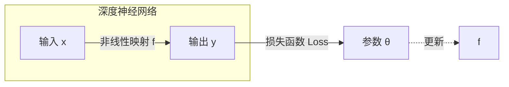
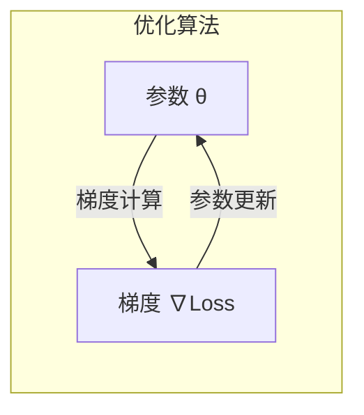

# 一切皆是映射：深度神经网络的调优与优化策略

## 1. 背景介绍

### 1.1 深度学习的兴起

随着大数据时代的到来，海量的数据为机器学习算法提供了充足的燃料。与此同时，计算能力的飞速提升使得训练深层神经网络成为可能。自2012年AlexNet在ImageNet竞赛中取得巨大成功以来，深度学习在计算机视觉、自然语言处理、语音识别等领域展现出了强大的能力,掀起了一场新的人工智能浪潮。

### 1.2 深度神经网络的挑战

尽管深度神经网络取得了令人瞩目的成就,但训练这些庞大的模型并非一蹴而就。由于参数空间的高维性,训练过程往往容易陷入局部最优,导致模型性能受限。此外,过拟合和梯度消失等问题也给训练带来了挑战。因此,如何高效地训练深度神经网络,提高其泛化能力,成为了研究的重点课题。

## 2. 核心概念与联系

### 2.1 深度神经网络的本质

从本质上讲,深度神经网络是一种高度参数化的函数映射。给定输入数据 $x$,神经网络通过一系列非线性变换,学习一个映射函数 $f(x; \theta)$,其中 $\theta$ 代表网络的参数。训练的目标是找到一个最优参数 $\theta^*$,使得 $f(x; \theta^*)$ 能够很好地拟合训练数据,并具有良好的泛化能力。



### 2.2 优化算法的作用

训练深度神经网络实际上是一个高维非凸优化问题。优化算法的作用是根据损失函数的梯度信息,有效地更新网络参数,使得损失函数不断减小,从而找到一个局部最优解。常见的优化算法包括随机梯度下降(SGD)、动量优化、RMSProp、Adam等。



### 2.3 正则化技术

为了防止过拟合,提高模型的泛化能力,通常需要引入正则化技术。常见的正则化方法包括L1/L2正则化、Dropout、BatchNormalization等。这些技术通过限制模型的复杂度或引入噪声,帮助模型捕捉数据的本质特征,从而提高泛化性能。

```mermaid
graph LR
    subgraph 正则化
    model[模型 f] -- 正则化 --> modelReg[正则化模型]
    end
    modelReg -- 泛化能力提升 -->|减少过拟合| performance[性能]
```

## 3. 核心算法原理具体操作步骤

### 3.1 梯度下降算法

梯度下降算法是训练深度神经网络的核心算法。其基本思想是沿着损失函数梯度的反方向,以一定的学习率更新网络参数,使损失函数不断减小。具体操作步骤如下:

1. 初始化网络参数 $\theta_0$
2. 计算损失函数 $L(\theta_t)$ 及其梯度 $\nabla L(\theta_t)$
3. 更新参数 $\theta_{t+1} = \theta_t - \eta \nabla L(\theta_t)$,其中 $\eta$ 为学习率
4. 重复步骤2-3,直至收敛或达到最大迭代次数

```mermaid
graph TD
    start[开始] --> init[初始化参数 θ]
    init --> loss[计算损失函数 L(θ)]
    loss --> grad[计算梯度 ∇L(θ)]
    grad --> update[更新参数 θ = θ - η∇L(θ)]
    update --> conv{是否收敛?}
    conv --否--> loss
    conv --是--> end[结束]
```

### 3.2 动量优化

标准梯度下降算法容易陷入局部最优,动量优化通过引入动量项,帮助优化过程跳出局部最小值。其更新规则为:

$$\begin{align*}
m_{t+1} &= \beta m_t + (1-\beta)\nabla L(\theta_t) \\
\theta_{t+1} &= \theta_t - \eta m_{t+1}
\end{align*}$$

其中 $m_t$ 为动量项, $\beta$ 为动量系数,控制动量项的衰减速度。

### 3.3 自适应学习率优化

不同参数可能需要不同的学习率,自适应学习率优化算法可以根据梯度的历史信息动态调整每个参数的学习率。常见的自适应学习率优化算法包括RMSProp和Adam。以Adam为例,其更新规则为:

$$\begin{align*}
m_{t+1} &= \beta_1 m_t + (1-\beta_1)\nabla L(\theta_t) \\
v_{t+1} &= \beta_2 v_t + (1-\beta_2)(\nabla L(\theta_t))^2 \\
\hat{m}_{t+1} &= \frac{m_{t+1}}{1-\beta_1^t} \\
\hat{v}_{t+1} &= \frac{v_{t+1}}{1-\beta_2^t} \\
\theta_{t+1} &= \theta_t - \eta \frac{\hat{m}_{t+1}}{\sqrt{\hat{v}_{t+1}} + \epsilon}
\end{align*}$$

其中 $m_t$ 和 $v_t$ 分别为一阶矩估计和二阶矩估计, $\beta_1$ 和 $\beta_2$ 为相应的指数衰减率, $\epsilon$ 为一个很小的常数,避免分母为0。

## 4. 数学模型和公式详细讲解举例说明

### 4.1 损失函数

损失函数衡量了模型预测与真实标签之间的差异,是优化算法的驱动力。对于分类任务,常用的损失函数是交叉熵损失:

$$L = -\frac{1}{N}\sum_{i=1}^N\sum_{j=1}^M y_{ij}\log(\hat{y}_{ij})$$

其中 $N$ 为样本数, $M$ 为类别数, $y_{ij}$ 为样本 $i$ 的真实标签(0或1), $\hat{y}_{ij}$ 为模型预测的概率。

对于回归任务,常用的损失函数是均方误差(MSE):

$$L = \frac{1}{N}\sum_{i=1}^N(y_i - \hat{y}_i)^2$$

其中 $y_i$ 为样本 $i$ 的真实值, $\hat{y}_i$ 为模型预测的值。

### 4.2 正则化

L1正则化和L2正则化是最常见的正则化方法,它们通过在损失函数中加入参数范数的惩罚项,来限制模型的复杂度。

L1正则化:
$$L_{reg} = L + \lambda\sum_{i=1}^n|\theta_i|$$

L2正则化:
$$L_{reg} = L + \lambda\sum_{i=1}^n\theta_i^2$$

其中 $\lambda$ 为正则化系数,控制正则化强度。L1正则化倾向于产生稀疏解,而L2正则化倾向于使参数接近0但不为0。

### 4.3 批归一化

批归一化(BatchNormalization)是一种常用的正则化技术,它通过对每一层的输入进行归一化,使得数据分布更加稳定,从而加速收敛并提高泛化能力。

对于一个小批量数据 $\{x_1, x_2, \dots, x_m\}$,批归一化的操作如下:

1. 计算小批量均值 $\mu = \frac{1}{m}\sum_{i=1}^m x_i$
2. 计算小批量方差 $\sigma^2 = \frac{1}{m}\sum_{i=1}^m(x_i - \mu)^2$
3. 归一化 $\hat{x}_i = \frac{x_i - \mu}{\sqrt{\sigma^2 + \epsilon}}$
4. 缩放和平移 $y_i = \gamma\hat{x}_i + \beta$

其中 $\gamma$ 和 $\beta$ 为可学习的参数,用于保留一定的表示能力。

## 5. 项目实践:代码实例和详细解释说明

为了更好地理解深度神经网络的训练过程,我们以MNIST手写数字识别为例,使用PyTorch框架实现一个简单的卷积神经网络。

```python
import torch
import torch.nn as nn
import torch.optim as optim

# 定义网络结构
class Net(nn.Module):
    def __init__(self):
        super(Net, self).__init__()
        self.conv1 = nn.Conv2d(1, 10, kernel_size=5)
        self.conv2 = nn.Conv2d(10, 20, kernel_size=5)
        self.fc1 = nn.Linear(320, 50)
        self.fc2 = nn.Linear(50, 10)

    def forward(self, x):
        x = nn.functional.relu(nn.functional.max_pool2d(self.conv1(x), 2))
        x = nn.functional.relu(nn.functional.max_pool2d(self.conv2(x), 2))
        x = x.view(-1, 320)
        x = nn.functional.relu(self.fc1(x))
        x = self.fc2(x)
        return x

# 加载数据
train_loader = torch.utils.data.DataLoader(...)
test_loader = torch.utils.data.DataLoader(...)

# 初始化模型和优化器
model = Net()
optimizer = optim.Adam(model.parameters(), lr=0.001)

# 训练循环
for epoch in range(10):
    for data, target in train_loader:
        optimizer.zero_grad()
        output = model(data)
        loss = nn.functional.cross_entropy(output, target)
        loss.backward()
        optimizer.step()

    # 测试循环
    correct = 0
    total = 0
    with torch.no_grad():
        for data, target in test_loader:
            output = model(data)
            _, predicted = torch.max(output.data, 1)
            total += target.size(0)
            correct += (predicted == target).sum().item()

    print(f'Epoch {epoch+1}, Accuracy: {100*correct/total:.2f}%')
```

在这个示例中,我们定义了一个简单的卷积神经网络,包含两个卷积层和两个全连接层。我们使用Adam优化器,并在训练循环中计算交叉熵损失,反向传播梯度,更新网络参数。在测试循环中,我们计算模型在测试集上的准确率。

通过调整网络结构、优化器参数、正则化技术等,我们可以进一步提高模型的性能。

## 6. 实际应用场景

深度神经网络在众多领域展现出了强大的能力,下面列举了一些典型的应用场景:

1. **计算机视觉**: 图像分类、目标检测、语义分割、图像生成等。
2. **自然语言处理**: 机器翻译、文本生成、情感分析、问答系统等。
3. **语音识别**: 自动语音识别、语音合成等。
4. **推荐系统**: 个性化推荐、内容推荐等。
5. **金融**: 金融风险预测、欺诈检测等。
6. **医疗**: 医学图像分析、疾病诊断等。
7. **游戏**: 游戏AI、游戏内容生成等。

随着深度学习技术的不断发展,其应用领域也在不断扩展,为我们的生活带来了诸多便利。

## 7. 工具和资源推荐

在深度学习的实践中,有许多优秀的工具和资源可以帮助我们提高效率,下面列举了一些值得推荐的工具和资源:

1. **深度学习框架**: PyTorch、TensorFlow、MXNet等。
2. **GPU加速**: CUDA、cuDNN等。
3. **可视化工具**: TensorBoard、Weights & Biases等。
4. **模型库**: PyTorch Hub、TensorFlow Hub等。
5. **数据集**: ImageNet、COCO、MNIST等。
6. **在线课程**: deeplearning.ai、fast.ai等。
7. **书籍**: "深度学习"(Ian Goodfellow等著)、"模式识别与机器学习"(Christopher Bishop著)等。
8. **论文阅读**: arXiv、IEEE Xplore等。
9. **社区**: Reddit机器学习、知乎深度学习等。

利用好这些工具和资源,可以帮助我们更高效地进行深度学习研究和开发。

## 8. 总结:未来发展趋势与挑战

深度学习