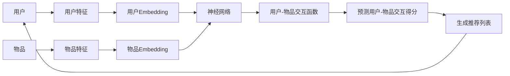

# 一切皆是映射：神经网络在推荐系统中的应用

## 1. 背景介绍

### 1.1 推荐系统概述
#### 1.1.1 推荐系统的定义与目标
#### 1.1.2 推荐系统的发展历程
#### 1.1.3 推荐系统的商业价值

### 1.2 神经网络在推荐系统中的应用现状
#### 1.2.1 神经网络推荐系统的优势
#### 1.2.2 神经网络推荐系统的挑战
#### 1.2.3 神经网络推荐系统的代表性工作

## 2. 核心概念与联系

### 2.1 推荐系统的核心概念
#### 2.1.1 用户-物品交互矩阵
#### 2.1.2 用户与物品的表示学习
#### 2.1.3 Top-N推荐

### 2.2 神经网络的核心概念
#### 2.2.1 人工神经元与激活函数  
#### 2.2.2 前馈神经网络
#### 2.2.3 反向传播算法

### 2.3 神经网络与推荐系统的联系
#### 2.3.1 用神经网络学习用户和物品的隐向量表示
#### 2.3.2 用神经网络建模用户-物品交互
#### 2.3.3 端到端的神经网络推荐模型

## 3. 核心算法原理具体操作步骤

### 3.1 基于MLP的推荐模型
#### 3.1.1 用户与物品的One-hot编码
#### 3.1.2 Embedding层将高维稀疏特征映射为低维稠密特征
#### 3.1.3 MLP层学习用户-物品交互函数
#### 3.1.4 输出层与损失函数

### 3.2 基于CNN的推荐模型  
#### 3.2.1 将用户-物品交互矩阵视作图像
#### 3.2.2 用CNN提取局部特征
#### 3.2.3 全连接层整合特征做出预测

### 3.3 基于RNN的推荐模型
#### 3.3.1 将用户的历史交互序列建模为时间序列
#### 3.3.2 用RNN捕捉用户兴趣的动态变化
#### 3.3.3 Attention机制赋予历史交互不同权重

## 4. 数学模型和公式详细讲解举例说明

### 4.1 矩阵分解模型
#### 4.1.1 用户-物品交互矩阵的低秩分解
$$\mathbf{R} \approx \mathbf{P}\mathbf{Q}^T$$
其中$\mathbf{R}$为用户-物品交互矩阵，$\mathbf{P}$和$\mathbf{Q}$分别为用户和物品的隐向量矩阵。

#### 4.1.2 正则化防止过拟合
$$\underset{\mathbf{P},\mathbf{Q}}{\min}\sum(r_{ui}-\mathbf{p}_u^T\mathbf{q}_i)^2 + \lambda(\|\mathbf{P}\|^2+\|\mathbf{Q}\|^2)$$

### 4.2 MLP的前向传播与反向传播
#### 4.2.1 前向传播
$$\mathbf{h}^{(l)} = \sigma(\mathbf{W}^{(l)}\mathbf{h}^{(l-1)} + \mathbf{b}^{(l)})$$
其中$\mathbf{h}^{(l)}$为第$l$层的隐状态，$\sigma$为激活函数。

#### 4.2.2 反向传播
$$\delta^{(l)} = ((\mathbf{W}^{(l+1)})^T\delta^{(l+1)})\odot\sigma'(\mathbf{z}^{(l)})$$
$$\frac{\partial J}{\partial \mathbf{W}^{(l)}} = \delta^{(l)}(\mathbf{h}^{(l-1)})^T$$
其中$\delta^{(l)}$为第$l$层的误差项，$\odot$为Hadamard积。

### 4.3 CNN中的卷积操作
$$\mathbf{Z}_{i,j}=(\mathbf{X} * \mathbf{K})_{i,j} = \sum_m\sum_n\mathbf{X}_{i+m,j+n}\mathbf{K}_{m,n}$$
其中$\mathbf{Z}$为输出特征图，$\mathbf{X}$为输入特征图，$\mathbf{K}$为卷积核。

## 5. 项目实践：代码实例和详细解释说明

### 5.1 基于PyTorch实现MLP推荐模型
```python
class MLPModel(nn.Module):
    def __init__(self, num_users, num_items, embedding_dim, hidden_dims):
        super().__init__()
        self.user_embedding = nn.Embedding(num_users, embedding_dim)
        self.item_embedding = nn.Embedding(num_items, embedding_dim)
        
        dims = [embedding_dim*2] + hidden_dims + [1]
        layers = []
        for i in range(len(dims)-1):
            layers.append(nn.Linear(dims[i], dims[i+1]))
            if i != len(dims)-2:
                layers.append(nn.ReLU())
        self.mlp = nn.Sequential(*layers)
        
    def forward(self, user, item):
        user_vec = self.user_embedding(user)
        item_vec = self.item_embedding(item)
        input_vec = torch.cat([user_vec, item_vec], dim=-1)
        pred = self.mlp(input_vec).squeeze(-1)
        return pred
```
详细解释：
- 用Embedding层将用户ID和物品ID映射为隐向量
- 将用户隐向量和物品隐向量拼接作为MLP的输入
- MLP中交替使用Linear层和ReLU激活层
- 输出层预测用户-物品交互得分

### 5.2 基于TensorFlow实现CNN推荐模型
```python
class CNNModel(tf.keras.Model):
    def __init__(self, num_users, num_items, embedding_dim, num_filters, filter_sizes):
        super().__init__()
        self.user_embedding = tf.keras.layers.Embedding(num_users, embedding_dim)
        self.item_embedding = tf.keras.layers.Embedding(num_items, embedding_dim)
        
        self.convs = []
        for fs in filter_sizes:
            self.convs.append(tf.keras.layers.Conv2D(num_filters, kernel_size=(fs, fs), activation='relu'))
        self.pool = tf.keras.layers.GlobalMaxPool2D()
        self.fc = tf.keras.layers.Dense(1, activation=None)
        
    def call(self, user, item):
        user_vec = self.user_embedding(user)
        item_vec = self.item_embedding(item)
        interact_mat = tf.expand_dims(tf.matmul(user_vec, item_vec, transpose_b=True), axis=-1)
        
        conv_outs = []
        for conv in self.convs:
            c = conv(interact_mat)
            c = self.pool(c)
            conv_outs.append(c)
        concat = tf.concat(conv_outs, axis=-1)    
        pred = self.fc(concat)
        return pred
```
详细解释：  
- 用户隐向量和物品隐向量通过矩阵乘法计算交互矩阵
- 使用不同大小的卷积核提取交互矩阵的局部特征
- 池化层对每个特征图取最大值得到整体表示
- 全连接层整合各卷积核提取的特征做出预测

## 6. 实际应用场景

### 6.1 电商平台的商品推荐
- 利用用户历史浏览、购买、评价等交互数据训练模型
- 实时预测用户对不同商品的兴趣程度并生成个性化推荐列表
- 典型案例：亚马逊、淘宝、京东等电商平台

### 6.2 视频网站的内容推荐
- 利用用户观看、点赞、收藏等交互数据训练模型  
- 实时预测用户对不同视频的兴趣程度并生成个性化推荐列表
- 典型案例：YouTube、抖音、快手等视频网站

### 6.3 新闻App的文章推荐
- 利用用户阅读、点击、分享等交互数据训练模型
- 实时预测用户对不同文章的兴趣程度并生成个性化推荐列表  
- 典型案例：今日头条、网易新闻等新闻类App

## 7. 工具和资源推荐

### 7.1 深度学习框架
- PyTorch: https://pytorch.org
- TensorFlow: https://www.tensorflow.org
- Keras: https://keras.io

### 7.2 推荐系统相关库
- RecBole: https://recbole.io
- Microsoft Recommenders: https://github.com/microsoft/recommenders 
- Surprise: http://surpriselib.com

### 7.3 相关论文与教程
- 论文："Neural Collaborative Filtering"
- 论文："Deep Matrix Factorization Models for Recommender Systems" 
- 教程："Recommender Systems Handbook"

## 8. 总结：未来发展趋势与挑战

### 8.1 融合多模态数据的推荐
- 结合文本、图像、视频等多模态数据丰富物品表示 
- 利用知识图谱、社交网络等异构信息提升推荐效果

### 8.2 面向可解释性的推荐
- 让推荐模型具备可解释性,使推荐结果更加透明可信
- 基于因果推断、对比学习等技术实现可解释的推荐

### 8.3 推荐系统的公平性问题
- 关注推荐系统潜在的公平性问题,如性别歧视、种族偏见等
- 研究去偏的数据、模型与评估方法,构建更加公平的推荐系统

## 9. 附录：常见问题与解答

### 9.1 神经网络推荐系统相比传统推荐系统有何优势？
- 神经网络具有强大的表示学习能力,可以自动学习用户和物品的隐向量表示,无需人工特征工程。
- 神经网络可以建模复杂的非线性交互关系,挖掘用户-物品交互数据中蕴含的深层次模式。
- 端到端的神经网络推荐模型可以联合优化各个模块,整体性能更优。

### 9.2 如何处理推荐系统中的冷启动问题？
- 利用物品的内容信息(如文本、图像等)构建物品表示,缓解物品冷启动问题。
- 利用用户的社交网络信息进行社会化推荐,缓解用户冷启动问题。 
- 设计主动学习策略,主动向用户询问反馈,快速学习新用户的偏好。

### 9.3 推荐系统如何平衡准确性与多样性？
- 在损失函数中引入多样性正则化项,鼓励推荐列表的多样性。
- 后处理推荐结果,提高推荐列表中物品的覆盖度和新颖度。
- 考虑用户的多样化需求,根据用户的兴趣多样性动态调整推荐策略。

以上是我对"一切皆是映射：神经网络在推荐系统中的应用"这一主题的探讨。神经网络凭借其强大的表示学习和建模能力,在个性化推荐领域展现出了巨大的潜力。未来,推荐系统还将向着融合多模态数据、提供可解释性、关注公平性等方向不断发展。让我们携手共进,用AI的力量为用户带去更加智能、贴心的推荐服务。

作者：禅与计算机程序设计艺术 / Zen and the Art of Computer Programming

