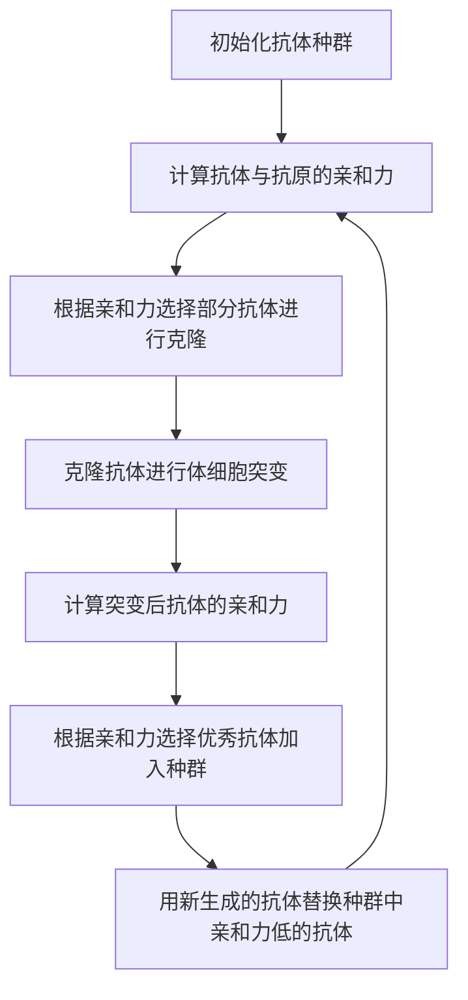
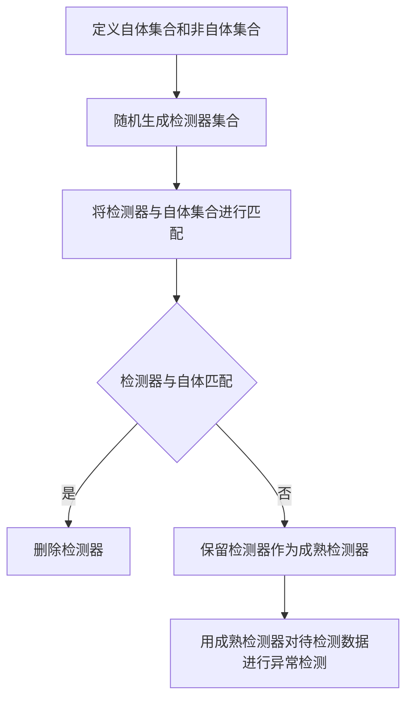
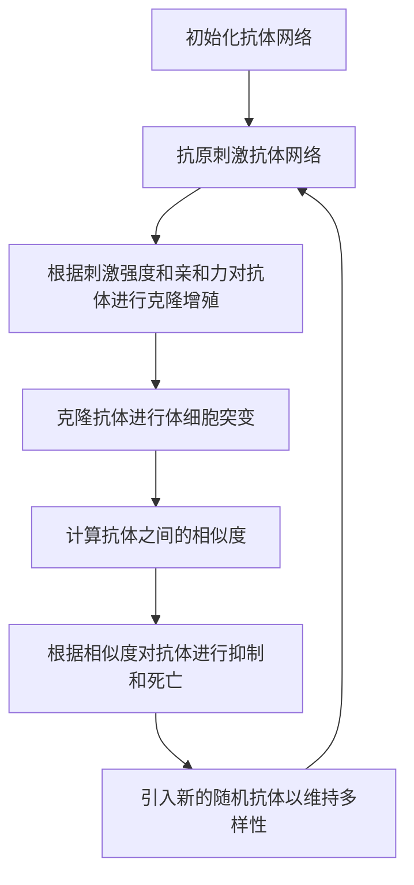

# 人工免疫算法(Artificial Immune Systems) - 原理与代码实例讲解

## 1. 背景介绍
### 1.1 人工免疫系统的起源与发展
人工免疫系统(Artificial Immune Systems, AIS)是一类受生物免疫系统启发而提出的智能计算方法。20世纪90年代中期,人工免疫系统作为一个全新的研究领域开始受到人们的关注。近年来,随着人们对生物免疫系统认识的不断深入以及相关理论研究的不断发展,人工免疫系统逐渐成为继进化计算、神经网络、模糊系统之后又一个新兴的智能信息处理技术。

### 1.2 生物免疫系统简介
生物免疫系统是一个复杂的、自适应的、分布式的信息处理和执行系统,具有模式识别、学习记忆、联想识别、分布式并行处理、自组织、自适应、自我维持等多种智能特性。免疫系统通过抗原识别、产生抗体、清除抗原等过程,保护机体免受病原微生物的侵害。免疫系统主要由免疫器官、免疫细胞和免疫分子三部分组成。

### 1.3 人工免疫系统的定义与特点  
人工免疫系统是以生物免疫系统的结构、功能和工作机理为基础,利用计算机技术对免疫系统的某些机理和特性进行抽象,建立相应的数学模型和算法,用于解决科学和工程中的实际问题。人工免疫系统具有自组织、自适应、分布式并行处理等特点,在模式识别、优化计算、机器学习、网络安全等领域展现出良好的应用前景。

## 2. 核心概念与联系
### 2.1 抗原与抗体
- 抗原(Antigen):能够刺激机体产生免疫应答,并能与之产生的抗体和免疫细胞表面受体结合,发生特异性反应的物质。
- 抗体(Antibody):机体免疫系统对抗原刺激所产生的特异性免疫球蛋白,能与相应抗原发生特异性结合。

### 2.2 亲和力与多样性
- 亲和力(Affinity):表示抗体与抗原结合的强度,亲和力越高,结合得越牢固。
- 多样性(Diversity):免疫系统中存在大量不同的抗体,以应对各种未知的抗原。

### 2.3 免疫学习与记忆
- 免疫学习:免疫系统通过与抗原的不断接触和刺激,产生特异性的免疫应答,不断完善和强化自身的识别和防御能力。
- 免疫记忆:免疫系统对初次接触的抗原产生免疫应答后,将抗原信息储存下来,在再次遇到相同抗原时能快速做出反应。

### 2.4 克隆选择与体细胞突变
- 克隆选择(Clonal Selection):当免疫细胞与抗原结合后,会大量增殖产生更多与抗原亲和力高的克隆细胞。
- 体细胞突变(Somatic Hypermutation):克隆细胞在增殖过程中会发生基因突变,产生新的抗体变异,增加多样性。

## 3. 核心算法原理具体操作步骤
### 3.1 克隆选择算法(CLONALG)
1. 初始化抗体种群
2. 计算抗体与抗原的亲和力
3. 根据亲和力选择部分抗体进行克隆
4. 克隆抗体进行体细胞突变
5. 计算突变后抗体的亲和力
6. 根据亲和力选择优秀抗体加入种群
7. 用新生成的抗体替换种群中亲和力低的抗体
8. 重复步骤2-7,直到满足终止条件



### 3.2 负选择算法(Negative Selection Algorithm)
1. 定义自体集合和非自体集合
2. 随机生成检测器集合
3. 将检测器与自体集合进行匹配
4. 删除与自体匹配的检测器
5. 保留与自体不匹配的检测器作为成熟检测器
6. 用成熟检测器对待检测数据进行异常检测



### 3.3 免疫网络算法(aiNet)
1. 初始化抗体网络
2. 抗原刺激抗体网络
3. 根据刺激强度和亲和力对抗体进行克隆增殖
4. 克隆抗体进行体细胞突变
5. 计算抗体之间的相似度
6. 根据相似度对抗体进行抑制和死亡
7. 引入新的随机抗体以维持多样性
8. 重复步骤2-7,直到满足终止条件



## 4. 数学模型和公式详细讲解举例说明
### 4.1 抗原与抗体的编码
抗原和抗体通常可以用二进制、实数等方式进行编码。以实数编码为例,假设抗原和抗体都是n维实数向量:

$Ag = (ag_1, ag_2, ..., ag_n)$
$Ab = (ab_1, ab_2, ..., ab_n)$

其中,$ag_i$和$ab_i$分别表示抗原和抗体在第i维上的取值。

### 4.2 亲和力计算
抗体与抗原之间的亲和力可以用欧氏距离来衡量:

$Affinity(Ab,Ag) = \frac{1}{\sqrt{\sum_{i=1}^n (ab_i - ag_i)^2}}$

距离越小,亲和力越大。也可以用其他的相似性度量方法,如曼哈顿距离、余弦相似度等。

### 4.3 克隆选择
根据抗体与抗原的亲和力,按比例选择亲和力高的抗体进行克隆。设克隆比例为$\alpha$,种群大小为N,则克隆数量为:

$N_c = \alpha \times N$

克隆后的抗体数量与其亲和力成正比,亲和力越高,克隆数量越多。

### 4.4 体细胞突变
克隆抗体以一定概率进行突变。设突变概率为$p_m$,抗体第i维的取值为$ab_i$,则突变后的取值为:

$ab_i' = \begin{cases}
ab_i + \Delta(t,ab_i), & \text{if } rand() < p_m \\
ab_i, & \text{otherwise}
\end{cases}$

其中,$\Delta(t,ab_i)$表示在第t代对$ab_i$进行的扰动,通常服从高斯分布或柯西分布。

## 5. 项目实践：代码实例和详细解释说明
以下是使用Python实现的简单的克隆选择算法(CLONALG)示例:

```python
import numpy as np

class Antibody:
    def __init__(self, dim):
        self.vector = np.random.rand(dim)
        self.affinity = 0.0
    
    def calculate_affinity(self, antigen):
        self.affinity = 1 / np.sqrt(np.sum((self.vector - antigen)**2))

def clone_selection(antibodies, antigen, clone_rate, mutate_rate):
    # 计算抗体与抗原的亲和力
    for antibody in antibodies:
        antibody.calculate_affinity(antigen)
    
    # 根据亲和力选择抗体进行克隆
    cloned_antibodies = []
    for antibody in antibodies:
        num_clones = int(antibody.affinity * clone_rate)
        for _ in range(num_clones):
            cloned_antibody = Antibody(len(antigen))
            cloned_antibody.vector = antibody.vector.copy()
            cloned_antibodies.append(cloned_antibody)
    
    # 克隆抗体进行体细胞突变
    for antibody in cloned_antibodies:
        if np.random.rand() < mutate_rate:
            antibody.vector += np.random.normal(0, 0.1, len(antigen))
    
    # 计算突变后抗体的亲和力
    for antibody in cloned_antibodies:
        antibody.calculate_affinity(antigen)
    
    # 根据亲和力选择优秀抗体
    selected_antibodies = sorted(cloned_antibodies, key=lambda x: x.affinity, reverse=True)[:len(antibodies)]
    
    return selected_antibodies

# 测试
antigen = np.array([0.5, 0.5])
antibodies = [Antibody(len(antigen)) for _ in range(10)]

for i in range(10):
    antibodies = clone_selection(antibodies, antigen, clone_rate=5, mutate_rate=0.2)
    print(f"Generation {i+1}: Best Affinity = {antibodies[0].affinity}")
```

代码说明:
1. 定义了`Antibody`类表示抗体,包含抗体向量和亲和力两个属性,以及计算亲和力的方法。
2. `clone_selection`函数实现了克隆选择算法的主要步骤,包括亲和力计算、克隆选择、体细胞突变和优秀抗体选择。
3. 在测试部分,随机生成了一个抗原向量和初始抗体种群,然后迭代执行克隆选择算法10次,每次输出种群中亲和力最高的抗体的亲和力值。

运行结果示例:
```
Generation 1: Best Affinity = 1.2851169282368757
Generation 2: Best Affinity = 1.3636510214783042
Generation 3: Best Affinity = 1.4288690166941925
Generation 4: Best Affinity = 1.5279206086357598
Generation 5: Best Affinity = 1.5279206086357598
Generation 6: Best Affinity = 1.5279206086357598
Generation 7: Best Affinity = 1.5279206086357598
Generation 8: Best Affinity = 1.5874859159163914
Generation 9: Best Affinity = 1.5874859159163914
Generation 10: Best Affinity = 1.5874859159163914
```

可以看到,随着迭代次数的增加,种群中抗体的最高亲和力逐渐提高,说明算法能够有效地优化抗体,使其越来越接近抗原。

## 6. 实际应用场景
人工免疫算法在以下领域有广泛的应用:

### 6.1 优化问题求解
人工免疫算法可以用于求解复杂的优化问题,如函数优化、组合优化、多目标优化等。通过抗体表示问题的潜在解,亲和力表示解的质量,利用克隆选择、体细胞突变等操作进化搜索最优解。

### 6.2 模式识别与分类
人工免疫算法可以用于模式识别和分类任务。将待识别的模式作为抗原,训练样本作为抗体,通过免疫学习过程生成能够识别不同模式的抗体。负选择算法常用于异常检测,通过构建正常模式的检测器,识别未知的异常模式。

### 6.3 计算机安全
人工免疫算法在计算机安全领域有重要应用,如入侵检测、恶意代码检测、网络异常行为检测等。将正常行为模式作为自体,将异常行为作为非自体,通过负选择等算法生成检测器,实时监测系统行为,发现潜在的安全威胁。

### 6.4 机器学习
人工免疫算法可以与其他机器学习方法结合,如神经网络、支持向量机等,