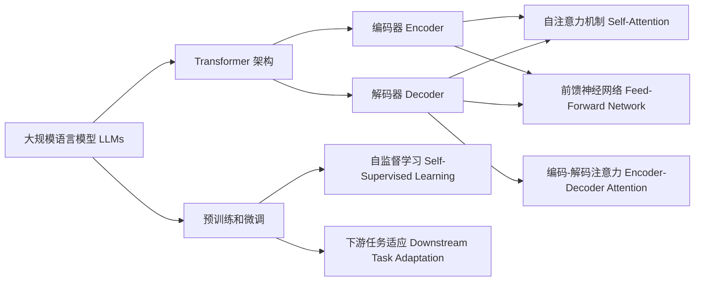

# 从关键概念到应用：深入了解大规模语言模型（LLM）

## 1. 背景介绍
### 1.1 大规模语言模型的兴起
近年来，随着深度学习技术的快速发展，大规模语言模型（Large Language Models，LLMs）在自然语言处理领域取得了突破性进展。LLMs 通过在海量文本数据上进行训练，能够学习到丰富的语言知识和模式，从而在各种自然语言任务上取得了令人瞩目的表现。

### 1.2 LLMs 的应用前景
LLMs 强大的语言理解和生成能力，使其在智能问答、机器翻译、文本摘要、情感分析等领域具有广阔的应用前景。同时，LLMs 也为构建更加智能化的对话系统和知识图谱提供了新的思路和方法。

### 1.3 本文的目的与结构
本文旨在深入探讨大规模语言模型的关键概念、核心算法原理以及实际应用。通过系统性的介绍和分析，帮助读者全面了解 LLMs 的内在机制和发展现状。全文分为以下几个部分：

1. 背景介绍
2. 核心概念与联系
3. 核心算法原理具体操作步骤
4. 数学模型和公式详细讲解举例说明
5. 项目实践：代码实例和详细解释说明
6. 实际应用场景
7. 工具和资源推荐 
8. 总结：未来发展趋势与挑战
9. 附录：常见问题与解答

## 2. 核心概念与联系
### 2.1 Transformer 架构
Transformer 是目前主流的 LLMs 所采用的基础架构。它摒弃了传统的循环神经网络（RNN）结构，转而使用自注意力机制（Self-Attention）来捕捉序列中不同位置之间的依赖关系。Transformer 的核心组件包括：

- 编码器（Encoder）：由多个编码层组成，每个编码层包含自注意力机制和前馈神经网络。
- 解码器（Decoder）：由多个解码层组成，每个解码层除了包含自注意力和前馈神经网络外，还引入了编码-解码注意力机制。

### 2.2 预训练和微调
LLMs 的训练过程通常分为两个阶段：预训练（Pre-training）和微调（Fine-tuning）。

- 预训练：在大规模无标注文本数据上进行自监督学习，让模型学习到通用的语言表征和知识。常见的预训练任务包括语言模型、掩码语言模型等。
- 微调：在特定的下游任务上，使用少量标注数据对预训练模型进行微调，使其适应具体任务的需求。

### 2.3 Tokenization 和 Subword
为了将文本转换为模型可以处理的数字化表示，需要进行 Tokenization。传统的 Tokenization 方法是以单词为单位进行切分，但这会导致词汇表过大的问题。Subword 方法通过将单词划分为更小的单元（如字符、字节对等），能够在保持词汇表大小可控的同时，更好地处理未登录词。

### 2.4 注意力机制
注意力机制（Attention Mechanism）是 LLMs 的核心组件之一。它允许模型在生成每个词时，根据上下文动态地分配不同的权重，从而捕捉到序列中长距离的依赖关系。常见的注意力机制有：

- 点积注意力（Dot-Product Attention）
- 加性注意力（Additive Attention）
- 多头注意力（Multi-Head Attention）

下图展示了 LLMs 中几个核心概念之间的联系：



## 3. 核心算法原理具体操作步骤
### 3.1 Transformer 的编码器
Transformer 的编码器由 N 个相同的层堆叠而成，每一层包括两个子层：

1. 多头自注意力机制（Multi-Head Self-Attention）
   - 将输入序列 X 分别乘以三个权重矩阵 WQ、WK、WV，得到查询向量 Q、键向量 K、值向量 V
   - 计算 Q 与 K 的点积注意力分数，然后除以 $\sqrt{d_k}$（$d_k$ 为 K 的维度），再经过 Softmax 归一化得到注意力权重
   - 将注意力权重与值向量 V 相乘，得到加权求和的结果
   - 对多个头的结果进行拼接，然后乘以权重矩阵 WO，得到多头注意力的输出
2. 前馈神经网络（Feed-Forward Network）
   - 对多头注意力的输出应用两层全连接前馈神经网络，每层之间使用 ReLU 激活函数
   
编码器的每一个子层之后都使用残差连接（Residual Connection）和层归一化（Layer Normalization）来促进训练的稳定性和收敛速度。

### 3.2 Transformer 的解码器
Transformer 的解码器也由 N 个相同的层堆叠而成，每一层包括三个子层：

1. 带掩码的多头自注意力机制（Masked Multi-Head Self-Attention）
   - 与编码器的多头自注意力类似，但在计算注意力分数时，对于当前位置之后的词进行掩码，以避免在生成过程中看到未来的信息
2. 编码-解码注意力机制（Encoder-Decoder Attention）
   - 将解码器的多头自注意力输出作为查询 Q，编码器的输出作为键 K 和值 V，计算注意力分数和加权求和
   - 通过编码-解码注意力，解码器可以根据编码器的输出信息来生成相应的词
3. 前馈神经网络（Feed-Forward Network）
   - 与编码器的前馈神经网络相同

解码器的每一个子层之后也使用残差连接和层归一化。

### 3.3 预训练和微调的流程
1. 预训练阶段
   - 准备大规模无标注文本数据集
   - 选择合适的预训练任务（如语言模型、掩码语言模型等）
   - 使用 Transformer 编码器对文本进行建模，通过最小化预训练任务的损失函数来学习通用的语言表征
   - 保存预训练得到的模型参数
2. 微调阶段
   - 根据具体的下游任务，准备相应的标注数据集
   - 在预训练模型的基础上，添加任务特定的输出层（如分类、序列标注等）
   - 使用标注数据集对模型进行微调，通过最小化任务的损失函数来适应具体任务的需求
   - 评估微调后模型在任务上的性能，并进行必要的超参数调整

## 4. 数学模型和公式详细讲解举例说明
### 4.1 自注意力机制的数学表示
给定一个序列的输入表示 $X \in \mathbb{R}^{n \times d}$，自注意力机制的计算过程如下：

1. 计算查询矩阵 $Q$、键矩阵 $K$、值矩阵 $V$：

$$
\begin{aligned}
Q &= X W^Q \\
K &= X W^K \\
V &= X W^V
\end{aligned}
$$

其中，$W^Q, W^K, W^V \in \mathbb{R}^{d \times d_k}$ 为可学习的权重矩阵。

2. 计算注意力分数和权重：

$$
\text{Attention}(Q, K, V) = \text{softmax}(\frac{QK^T}{\sqrt{d_k}})V
$$

其中，$\frac{QK^T}{\sqrt{d_k}}$ 计算查询和键的相似度，$\sqrt{d_k}$ 用于缩放点积结果，防止 Softmax 函数在较大值时梯度消失。

3. 多头注意力机制：

$$
\begin{aligned}
\text{MultiHead}(Q, K, V) &= \text{Concat}(\text{head}_1, \ldots, \text{head}_h)W^O \\
\text{head}_i &= \text{Attention}(QW_i^Q, KW_i^K, VW_i^V)
\end{aligned}
$$

其中，$W_i^Q, W_i^K, W_i^V \in \mathbb{R}^{d \times d_k}, W^O \in \mathbb{R}^{hd_k \times d}$ 为可学习的权重矩阵，$h$ 为注意力头的数量。

举例说明：假设有一个句子 "The quick brown fox jumps over the lazy dog"，我们要计算单词 "fox" 的自注意力表示。

1. 将句子中的每个单词映射为词向量，得到输入表示 $X$。
2. 通过线性变换计算 $Q$、$K$、$V$。
3. 计算单词 "fox" 与句子中其他单词的注意力分数，得到一个注意力权重向量。
4. 将注意力权重向量与值矩阵 $V$ 相乘，得到加权求和的结果，即单词 "fox" 的自注意力表示。
5. 对多个注意力头的结果进行拼接，然后乘以权重矩阵 $W^O$，得到最终的多头自注意力表示。

这个过程可以捕捉单词 "fox" 与句子中其他单词的依赖关系，从而得到一个更加丰富和上下文相关的表示。

### 4.2 前馈神经网络的数学表示
前馈神经网络可以表示为：

$$
\text{FFN}(x) = \max(0, xW_1 + b_1)W_2 + b_2
$$

其中，$W_1 \in \mathbb{R}^{d \times d_{ff}}, b_1 \in \mathbb{R}^{d_{ff}}, W_2 \in \mathbb{R}^{d_{ff} \times d}, b_2 \in \mathbb{R}^d$ 为可学习的参数，$d_{ff}$ 为前馈神经网络的隐藏层维度，$\max(0, \cdot)$ 为 ReLU 激活函数。

前馈神经网络可以对自注意力机制的输出进行非线性变换，增强模型的表达能力。

## 5. 项目实践：代码实例和详细解释说明
下面是一个使用 PyTorch 实现 Transformer 编码器的代码示例：

```python
import torch
import torch.nn as nn

class MultiHeadAttention(nn.Module):
    def __init__(self, d_model, num_heads):
        super(MultiHeadAttention, self).__init__()
        self.d_model = d_model
        self.num_heads = num_heads
        self.head_dim = d_model // num_heads

        self.query = nn.Linear(d_model, d_model)
        self.key = nn.Linear(d_model, d_model)
        self.value = nn.Linear(d_model, d_model)

        self.out = nn.Linear(d_model, d_model)

    def forward(self, x, mask=None):
        batch_size, seq_len, _ = x.size()

        # 计算 Q、K、V 矩阵
        Q = self.query(x).view(batch_size, seq_len, self.num_heads, self.head_dim).transpose(1, 2)
        K = self.key(x).view(batch_size, seq_len, self.num_heads, self.head_dim).transpose(1, 2)
        V = self.value(x).view(batch_size, seq_len, self.num_heads, self.head_dim).transpose(1, 2)

        # 计算注意力分数和权重
        scores = torch.matmul(Q, K.transpose(-2, -1)) / (self.head_dim ** 0.5)
        if mask is not None:
            scores = scores.masked_fill(mask == 0, float('-inf'))
        weights = nn.functional.softmax(scores, dim=-1)

        # 计算加权求和
        context = torch.matmul(weights, V)
        context = context.transpose(1, 2).contiguous().view(batch_size, seq_len, self.d_model)

        # 计算多头注意力的输出
        output = self.out(context)
        return output

class TransformerEncoderLayer(nn.Module):
    def __init__(self, d_model, num_heads, d_ff, dropout=0.1):
        super(TransformerEncoderLayer, self).__init__()
        self.self_attn = MultiHeadAttention(d_model, num_heads)
        self.feed_forward =