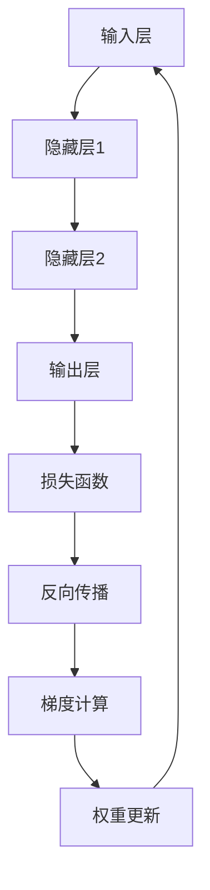

# 从零开始大模型开发与微调：反向传播神经网络两个基础算法详解

## 1. 背景介绍
### 1.1 大模型的兴起与发展
### 1.2 大模型开发面临的挑战
### 1.3 微调在大模型开发中的重要性

## 2. 核心概念与联系
### 2.1 神经网络基础
#### 2.1.1 神经元模型
#### 2.1.2 激活函数
#### 2.1.3 神经网络结构
### 2.2 反向传播算法
#### 2.2.1 损失函数
#### 2.2.2 梯度下降
#### 2.2.3 链式法则
### 2.3 优化算法
#### 2.3.1 随机梯度下降(SGD)
#### 2.3.2 自适应梯度算法(AdaGrad)
#### 2.3.3 均方根传播(RMSProp)
#### 2.3.4 自适应矩估计(Adam)

## 3. 核心算法原理具体操作步骤
### 3.1 前向传播
#### 3.1.1 输入层到隐藏层
#### 3.1.2 隐藏层到输出层
### 3.2 反向传播 
#### 3.2.1 计算输出层误差
#### 3.2.2 计算隐藏层误差
#### 3.2.3 更新权重与偏置
### 3.3 算法伪代码

## 4. 数学模型和公式详细讲解举例说明
### 4.1 损失函数详解
#### 4.1.1 均方误差损失
#### 4.1.2 交叉熵损失
### 4.2 梯度计算推导
#### 4.2.1 输出层梯度推导
#### 4.2.2 隐藏层梯度推导
### 4.3 优化器数学原理
#### 4.3.1 SGD推导
#### 4.3.2 AdaGrad推导
#### 4.3.3 RMSProp推导 
#### 4.3.4 Adam推导

## 5. 项目实践：代码实例和详细解释说明
### 5.1 数据预处理
### 5.2 模型构建
### 5.3 训练过程
### 5.4 模型评估
### 5.5 微调策略

## 6. 实际应用场景
### 6.1 自然语言处理
#### 6.1.1 语言模型
#### 6.1.2 机器翻译
#### 6.1.3 情感分析
### 6.2 计算机视觉
#### 6.2.1 图像分类
#### 6.2.2 目标检测
#### 6.2.3 语义分割
### 6.3 语音识别
### 6.4 推荐系统

## 7. 工具和资源推荐
### 7.1 深度学习框架
#### 7.1.1 TensorFlow
#### 7.1.2 PyTorch
#### 7.1.3 Keras
### 7.2 预训练模型库
#### 7.2.1 BERT
#### 7.2.2 GPT系列
#### 7.2.3 Vision Transformer
### 7.3 数据集资源
#### 7.3.1 ImageNet
#### 7.3.2 COCO
#### 7.3.3 SQuAD
### 7.4 学习资料
#### 7.4.1 在线课程
#### 7.4.2 书籍推荐
#### 7.4.3 论文精选

## 8. 总结：未来发展趋势与挑战
### 8.1 大模型的发展趋势
### 8.2 微调技术的创新方向  
### 8.3 面临的挑战与机遇

## 9. 附录：常见问题与解答
### 9.1 反向传播算法中的梯度消失与梯度爆炸问题
### 9.2 如何选择合适的优化器
### 9.3 微调过程中的超参数设置建议
### 9.4 大模型部署中的性能优化策略

反向传播神经网络是深度学习的核心算法之一，它为训练多层神经网络提供了理论基础。本文将从背景介绍开始，系统地讲解反向传播算法的原理、数学推导以及在大模型开发与微调中的应用。

神经网络是一种模仿生物神经系统的计算模型，由大量的神经元组成。每个神经元接收来自其他神经元的输入信号，经过非线性变换后产生输出信号。通过调整神经元之间的连接权重，神经网络可以学习到输入与输出之间的复杂映射关系。

反向传播算法的核心思想是利用链式法则，将损失函数对输出层的梯度逐层传递到隐藏层和输入层，从而计算出各层权重的梯度，并使用梯度下降等优化算法更新权重，使得网络的预测结果与真实标签之间的误差最小化。

假设我们有一个包含$L$层的前馈神经网络，第$l$层的第$j$个神经元的激活值为$a_j^{(l)}$，对应的偏置为$b_j^{(l)}$，与上一层第$k$个神经元的连接权重为$w_{jk}^{(l)}$。前向传播过程可以表示为：

$$
z_j^{(l)} = \sum_k w_{jk}^{(l)} a_k^{(l-1)} + b_j^{(l)} \\
a_j^{(l)} = \sigma(z_j^{(l)})
$$

其中$\sigma$为激活函数，常见的选择有sigmoid、tanh和ReLU等。

反向传播过程首先计算输出层的误差$\delta^{(L)}$：

$$
\delta_j^{(L)} = \frac{\partial C}{\partial a_j^{(L)}} \odot \sigma'(z_j^{(L)})
$$

其中$C$为损失函数，$\odot$表示Hadamard积（逐元素相乘）。然后利用链式法则，递归地计算隐藏层的误差：

$$
\delta_j^{(l)} = \left(\sum_k w_{kj}^{(l+1)} \delta_k^{(l+1)}\right) \odot \sigma'(z_j^{(l)})
$$

最后根据误差计算梯度并更新权重和偏置：

$$
\frac{\partial C}{\partial w_{jk}^{(l)}} = a_k^{(l-1)} \delta_j^{(l)} \\
\frac{\partial C}{\partial b_j^{(l)}} = \delta_j^{(l)} \\
w_{jk}^{(l)} := w_{jk}^{(l)} - \alpha \frac{\partial C}{\partial w_{jk}^{(l)}} \\ 
b_j^{(l)} := b_j^{(l)} - \alpha \frac{\partial C}{\partial b_j^{(l)}}
$$

其中$\alpha$为学习率。

在实践中，我们通常使用基于梯度的优化算法来加速训练过程，如随机梯度下降(SGD)、AdaGrad、RMSProp和Adam等。以Adam为例，它结合了动量法和自适应学习率的优点，对梯度的一阶矩（均值）和二阶矩（方差）进行估计，并根据估计值动态调整每个参数的学习率。

$$
m_t = \beta_1 m_{t-1} + (1 - \beta_1) g_t \\
v_t = \beta_2 v_{t-1} + (1 - \beta_2) g_t^2 \\
\hat{m}_t = \frac{m_t}{1 - \beta_1^t} \\
\hat{v}_t = \frac{v_t}{1 - \beta_2^t} \\
\theta_t = \theta_{t-1} - \frac{\alpha}{\sqrt{\hat{v}_t} + \epsilon} \hat{m}_t
$$

其中$m_t$和$v_t$分别为梯度的一阶矩和二阶矩估计，$\beta_1$和$\beta_2$为衰减率，$\epsilon$为平滑项，$\theta_t$为参数向量。

在大模型开发中，由于模型参数量巨大，从头训练的成本非常高。因此，我们通常采用预训练+微调的策略，即先在大规模无标注数据上进行自监督预训练，学习通用的特征表示，然后在下游任务的标注数据上进行微调，使模型适应特定的任务。微调过程本质上与从头训练类似，只是初始化权重来自预训练模型，学习率通常设置得较小。

常见的微调技术包括：

1. 全模型微调：将预训练模型的所有参数进行微调。
2. 部分层微调：只微调模型的部分层，如最后几层，其余层的参数保持不变。
3. 指数衰减学习率：随着训练的进行，逐渐降低学习率，使模型在局部最优点附近收敛。
4. 对抗训练：在训练过程中加入对抗样本，提高模型的鲁棒性。
5. 数据增强：通过旋转、裁剪、颜色变换等方式增加训练样本的多样性。

微调后的大模型在各个领域都取得了显著的性能提升，如自然语言处理中的BERT、GPT系列模型，计算机视觉中的Vision Transformer等。这些模型在标准数据集上刷新了多项记录，并在实际应用中得到了广泛的部署。

展望未来，大模型的参数量还将持续增长，训练和部署的效率问题日益突出。因此，如何设计更高效的微调算法，如何在保证性能的同时压缩模型体积，如何利用知识蒸馏、模型剪枝等技术加速推理，都是亟待解决的挑战。此外，大模型的可解释性、公平性、隐私安全等伦理问题也备受关注，需要在技术创新的同时兼顾人文关怀。

总之，反向传播神经网络是深度学习的理论基石，而大模型开发与微调则是将理论转化为生产力的有效途径。掌握这两大核心算法，对于从事人工智能研究和应用的工作者来说至关重要。站在巨人的肩膀上，我们有望推动人工智能技术向着更广阔的领域迈进，造福人类社会。

作者：禅与计算机程序设计艺术 / Zen and the Art of Computer Programming