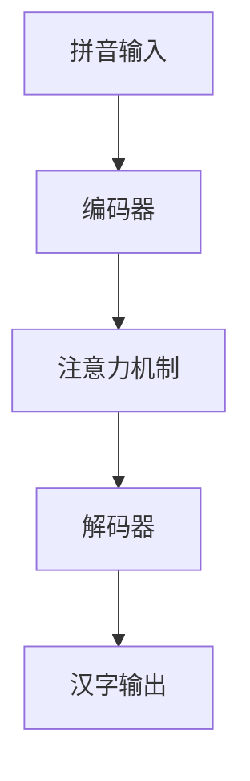

# 从零开始大模型开发与微调：实战编码器：拼音汉字转化模型

## 1. 背景介绍
### 1.1 拼音输入法的历史与发展
### 1.2 拼音汉字转化模型的重要性
### 1.3 本文的主要内容与贡献

## 2. 核心概念与联系
### 2.1 编码器-解码器模型
#### 2.1.1 编码器的作用与原理
#### 2.1.2 解码器的作用与原理
#### 2.1.3 编码器-解码器模型的应用
### 2.2 注意力机制
#### 2.2.1 注意力机制的概念与原理
#### 2.2.2 注意力机制在序列到序列模型中的应用
### 2.3 Transformer模型
#### 2.3.1 Transformer模型的结构与原理
#### 2.3.2 Transformer模型在自然语言处理中的应用

## 3. 核心算法原理具体操作步骤
### 3.1 数据预处理
#### 3.1.1 拼音数据的获取与清洗
#### 3.1.2 汉字数据的获取与清洗
#### 3.1.3 拼音-汉字对齐
### 3.2 模型构建
#### 3.2.1 编码器的构建
#### 3.2.2 解码器的构建
#### 3.2.3 注意力机制的实现
### 3.3 模型训练
#### 3.3.1 训练数据的准备
#### 3.3.2 模型参数的初始化
#### 3.3.3 训练过程与损失函数
### 3.4 模型评估与微调
#### 3.4.1 评估指标的选择
#### 3.4.2 微调策略与技巧

## 4. 数学模型和公式详细讲解举例说明
### 4.1 编码器的数学模型
#### 4.1.1 嵌入层的数学表示
#### 4.1.2 位置编码的数学表示
#### 4.1.3 多头注意力机制的数学表示
### 4.2 解码器的数学模型 
#### 4.2.1 掩码多头注意力机制的数学表示
#### 4.2.2 前馈神经网络的数学表示
### 4.3 损失函数与优化算法
#### 4.3.1 交叉熵损失函数的数学表示
#### 4.3.2 Adam优化算法的数学表示

## 5. 项目实践：代码实例和详细解释说明
### 5.1 数据预处理代码实例
#### 5.1.1 拼音数据的读取与清洗
#### 5.1.2 汉字数据的读取与清洗
#### 5.1.3 拼音-汉字对齐的实现
### 5.2 模型构建代码实例
#### 5.2.1 编码器的构建
#### 5.2.2 解码器的构建 
#### 5.2.3 注意力机制的实现
### 5.3 模型训练代码实例
#### 5.3.1 数据加载与批处理
#### 5.3.2 模型参数初始化
#### 5.3.3 训练循环与损失计算
### 5.4 模型评估与预测代码实例
#### 5.4.1 评估指标的计算
#### 5.4.2 模型预测的实现

## 6. 实际应用场景
### 6.1 拼音输入法
### 6.2 语音识别后的文本纠错
### 6.3 汉字识别与生成

## 7. 工具和资源推荐
### 7.1 开源数据集
### 7.2 开源代码库
### 7.3 相关论文与书籍

## 8. 总结：未来发展趋势与挑战
### 8.1 拼音汉字转化模型的发展趋势
### 8.2 面临的挑战与可能的解决方案
### 8.3 本文的不足与未来工作

## 9. 附录：常见问题与解答
### 9.1 如何处理多音字问题？
### 9.2 如何提高模型的泛化能力？
### 9.3 如何减少模型的训练时间？

拼音汉字转化模型是一个重要的自然语言处理任务，旨在将拼音序列转化为对应的汉字序列。这个任务在拼音输入法、语音识别后的文本纠错、汉字识别与生成等领域有着广泛的应用。

传统的拼音汉字转化模型主要基于统计语言模型，如N-gram模型、隐马尔可夫模型等。这些模型虽然简单有效，但是难以捕捉拼音与汉字之间的长距离依赖关系，且泛化能力有限。近年来，随着深度学习技术的发展，基于神经网络的端到端模型逐渐成为主流，其中尤以编码器-解码器模型和注意力机制最为著名。

编码器-解码器模型由编码器和解码器两部分组成。编码器将输入的拼音序列转化为一个固定长度的向量表示，解码器根据该向量表示生成对应的汉字序列。这种模型结构能够很好地建模拼音与汉字之间的映射关系，但是在处理长序列时仍然存在信息丢失的问题。

为了解决这一问题，研究者引入了注意力机制。注意力机制允许解码器在生成每个汉字时，都能够"注意"到编码器输出的不同部分。这种机制使得模型能够更好地捕捉拼音与汉字之间的长距离依赖关系，提高了转化的准确率。

Transformer模型是一种基于自注意力机制的编码器-解码器模型，它采用了多头注意力机制和位置编码等技术，在机器翻译、语言建模等任务上取得了很好的效果。将Transformer模型应用于拼音汉字转化任务，能够进一步提高转化的准确率。

在实际应用中，我们首先需要对拼音和汉字数据进行预处理，包括数据清洗、对齐等操作。然后根据任务需求构建合适的编码器-解码器模型，并加入注意力机制。模型训练过程中，我们通过最小化交叉熵损失函数来优化模型参数。在模型评估与微调阶段，我们选择合适的评估指标，并通过调整超参数、增加数据等方式来提高模型性能。

下面我们通过一个简单的示例来说明拼音汉字转化模型的数学原理。假设我们的输入拼音序列为"wohenshufu"，对应的汉字序列为"我很舒服"。我们的目标是建立一个模型，能够将拼音序列转化为正确的汉字序列。

首先，我们将拼音序列通过嵌入层映射为实数向量序列：

$$\mathbf{X} = (\mathbf{x}_1, \mathbf{x}_2, \dots, \mathbf{x}_n)$$

其中$\mathbf{x}_i \in \mathbb{R}^d$为第$i$个拼音的嵌入向量，$d$为嵌入维度。

然后，我们通过位置编码将位置信息引入到嵌入向量中：

$$\mathbf{X}' = (\mathbf{x}'_1, \mathbf{x}'_2, \dots, \mathbf{x}'_n)$$

其中$\mathbf{x}'_i = \mathbf{x}_i + \mathbf{p}_i$，$\mathbf{p}_i$为第$i$个位置的位置编码向量。

接下来，编码器通过多头注意力机制对输入序列进行编码：

$$\mathbf{H} = \text{MultiHead}(\mathbf{Q}, \mathbf{K}, \mathbf{V})$$

其中$\mathbf{Q}, \mathbf{K}, \mathbf{V}$分别为查询矩阵、键矩阵和值矩阵，它们都由$\mathbf{X}'$线性变换得到。$\text{MultiHead}$函数将多个注意力头的结果拼接起来。

解码器在生成每个汉字时，都会通过注意力机制与编码器的输出$\mathbf{H}$进行交互：

$$\mathbf{s}_t = \text{Attention}(\mathbf{y}_{t-1}, \mathbf{H})$$

其中$\mathbf{y}_{t-1}$为上一步生成的汉字嵌入向量，$\mathbf{s}_t$为当前步的解码器隐状态。

最后，我们通过线性变换和softmax函数将$\mathbf{s}_t$映射为汉字的概率分布：

$$P(y_t|y_{<t}, \mathbf{X}) = \text{softmax}(\mathbf{W}_o\mathbf{s}_t + \mathbf{b}_o)$$

其中$\mathbf{W}_o, \mathbf{b}_o$为输出层的参数。

模型训练时，我们通过最小化交叉熵损失函数来优化模型参数：

$$\mathcal{L} = -\sum_{t=1}^m \log P(y_t|y_{<t}, \mathbf{X})$$

其中$m$为汉字序列的长度。

在实际应用中，我们还需要考虑如何处理多音字、提高模型泛化能力、加速模型训练等问题。此外，随着预训练语言模型的发展，如何将其应用于拼音汉字转化任务也是一个值得探索的方向。

总的来说，拼音汉字转化模型是一个富有挑战性的自然语言处理任务，需要综合运用编码器-解码器模型、注意力机制、数学建模等技术。随着深度学习技术的不断发展，相信拼音汉字转化模型的性能还会不断提高，为拼音输入法、语音识别等应用带来更多惊喜。

作者：禅与计算机程序设计艺术 / Zen and the Art of Computer Programming