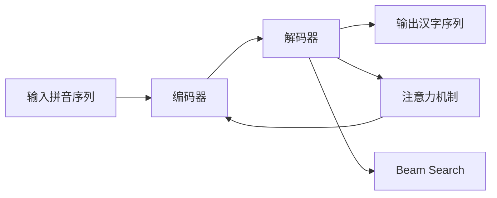

# 从零开始大模型开发与微调：解码器实战—拼音汉字翻译模型

## 1. 背景介绍
### 1.1 大语言模型的发展历程
#### 1.1.1 早期的语言模型
#### 1.1.2 Transformer的出现
#### 1.1.3 预训练语言模型的兴起

### 1.2 解码器在自然语言处理中的应用
#### 1.2.1 机器翻译中的解码器
#### 1.2.2 文本摘要中的解码器 
#### 1.2.3 对话系统中的解码器

### 1.3 拼音汉字转换的研究现状
#### 1.3.1 基于规则的方法
#### 1.3.2 基于统计的方法
#### 1.3.3 基于深度学习的方法

## 2. 核心概念与联系
### 2.1 编码器-解码器架构
#### 2.1.1 编码器的作用
#### 2.1.2 解码器的作用
#### 2.1.3 编码器和解码器的联系

### 2.2 注意力机制
#### 2.2.1 注意力机制的概念
#### 2.2.2 注意力机制的优势
#### 2.2.3 注意力机制在解码器中的应用

### 2.3 Beam Search算法
#### 2.3.1 Beam Search算法的原理
#### 2.3.2 Beam Search算法的优缺点
#### 2.3.3 Beam Search算法在解码器中的应用



## 3. 核心算法原理具体操作步骤
### 3.1 编码器的实现
#### 3.1.1 输入嵌入层
#### 3.1.2 位置编码
#### 3.1.3 自注意力层
#### 3.1.4 前馈神经网络层

### 3.2 解码器的实现  
#### 3.2.1 输出嵌入层
#### 3.2.2 掩码自注意力层
#### 3.2.3 编码器-解码器注意力层
#### 3.2.4 前馈神经网络层

### 3.3 模型训练与优化
#### 3.3.1 损失函数的选择
#### 3.3.2 优化器的选择
#### 3.3.3 学习率调度策略

## 4. 数学模型和公式详细讲解举例说明
### 4.1 自注意力机制的数学原理
#### 4.1.1 查询、键、值的计算
$$Attention(Q,K,V) = softmax(\frac{QK^T}{\sqrt{d_k}})V$$
其中，$Q$表示查询，$K$表示键，$V$表示值，$d_k$表示键的维度。

#### 4.1.2 多头注意力机制
$$MultiHead(Q,K,V) = Concat(head_1,...,head_h)W^O$$
$$head_i = Attention(QW_i^Q, KW_i^K, VW_i^V)$$
其中，$W_i^Q, W_i^K, W_i^V$表示线性变换矩阵，$W^O$表示输出线性变换矩阵。

### 4.2 位置编码的数学原理
$$PE_{(pos,2i)} = sin(pos/10000^{2i/d_{model}})$$
$$PE_{(pos,2i+1)} = cos(pos/10000^{2i/d_{model}})$$
其中，$pos$表示位置，$i$表示维度，$d_{model}$表示模型的维度。

### 4.3 Beam Search算法的数学原理
Beam Search算法在每一步维护一个大小为$k$的候选集合，选择得分最高的$k$个候选作为下一步的输入。最终选择得分最高的候选作为输出。

## 5. 项目实践：代码实例和详细解释说明
### 5.1 数据预处理
```python
def load_data(file_path):
    with open(file_path, 'r', encoding='utf-8') as f:
        lines = f.readlines()
    pinyin_data, hanzi_data = [], []
    for line in lines:
        pinyin, hanzi = line.strip().split('\t')
        pinyin_data.append(pinyin.split(' '))
        hanzi_data.append(hanzi)
    return pinyin_data, hanzi_data
```
该函数用于加载拼音-汉字对应的数据集，并将拼音和汉字分别存储在列表中。

### 5.2 模型定义
```python
class Encoder(nn.Module):
    def __init__(self, vocab_size, embed_dim, num_layers, num_heads, hidden_dim, dropout):
        super().__init__()
        self.embedding = nn.Embedding(vocab_size, embed_dim)
        self.pos_encoding = PositionalEncoding(embed_dim)
        self.layers = nn.ModuleList([
            EncoderLayer(embed_dim, num_heads, hidden_dim, dropout) 
            for _ in range(num_layers)])
        
    def forward(self, x, mask):
        x = self.embedding(x)
        x = self.pos_encoding(x)
        for layer in self.layers:
            x = layer(x, mask)
        return x

class Decoder(nn.Module):
    def __init__(self, vocab_size, embed_dim, num_layers, num_heads, hidden_dim, dropout):
        super().__init__()
        self.embedding = nn.Embedding(vocab_size, embed_dim)
        self.pos_encoding = PositionalEncoding(embed_dim)
        self.layers = nn.ModuleList([
            DecoderLayer(embed_dim, num_heads, hidden_dim, dropout)
            for _ in range(num_layers)])
        self.fc = nn.Linear(embed_dim, vocab_size)
        
    def forward(self, x, enc_output, src_mask, tgt_mask):
        x = self.embedding(x)
        x = self.pos_encoding(x)
        for layer in self.layers:
            x = layer(x, enc_output, src_mask, tgt_mask)
        x = self.fc(x)
        return x
```
定义编码器和解码器的结构，包括嵌入层、位置编码、自注意力层、前馈神经网络层等。

### 5.3 模型训练
```python
def train(model, data_loader, optimizer, criterion, device):
    model.train()
    total_loss = 0
    for src, tgt in data_loader:
        src, tgt = src.to(device), tgt.to(device)
        tgt_input = tgt[:-1, :]
        tgt_output = tgt[1:, :]
        src_mask, tgt_mask = create_masks(src, tgt_input, device)
        output = model(src, tgt_input, src_mask, tgt_mask)
        loss = criterion(output.contiguous().view(-1, output.size(-1)), 
                         tgt_output.contiguous().view(-1))
        optimizer.zero_grad()
        loss.backward()
        optimizer.step()
        total_loss += loss.item()
    return total_loss / len(data_loader)
```
定义模型训练函数，包括前向传播、损失计算、反向传播和参数更新等步骤。

## 6. 实际应用场景
### 6.1 输入法中的拼音汉字转换
#### 6.1.1 移动设备输入法
#### 6.1.2 桌面输入法

### 6.2 语音识别后的文本转换
#### 6.2.1 语音助手
#### 6.2.2 语音搜索

### 6.3 汉字识别后的拼音标注
#### 6.3.1 OCR系统
#### 6.3.2 手写识别系统

## 7. 工具和资源推荐
### 7.1 开源数据集
- 搜狗实验室发布的拼音汉字数据集
- 中文文本上拼音标注数据集

### 7.2 开源工具包
- PyTorch
- TensorFlow
- Fairseq
- OpenNMT

### 7.3 相关论文和资源
- Attention Is All You Need
- Neural Machine Translation by Jointly Learning to Align and Translate
- Transformer-XL: Attentive Language Models Beyond a Fixed-Length Context

## 8. 总结：未来发展趋势与挑战
### 8.1 模型架构的改进
#### 8.1.1 更深层次的模型
#### 8.1.2 更高效的注意力机制
#### 8.1.3 融合知识的模型

### 8.2 训练策略的优化
#### 8.2.1 更大规模的预训练
#### 8.2.2 多任务联合学习
#### 8.2.3 对抗训练

### 8.3 应用场景的拓展
#### 8.3.1 多语言拼音汉字转换
#### 8.3.2 方言拼音汉字转换
#### 8.3.3 拼音汉字纠错

## 9. 附录：常见问题与解答
### 9.1 如何处理拼音多音字问题？
可以通过上下文信息和语言模型来辅助消歧。

### 9.2 如何提高模型的泛化能力？
可以通过增加训练数据的多样性、使用正则化技术、引入先验知识等方式来提高模型的泛化能力。

### 9.3 如何加速模型的推理速度？
可以通过模型剪枝、量化、知识蒸馏等方式来加速模型的推理速度。

本文介绍了如何从零开始开发和微调一个用于拼音汉字转换的解码器模型。我们首先介绍了大语言模型的发展历程和解码器在自然语言处理中的应用，然后详细阐述了编码器-解码器架构、注意力机制和Beam Search算法等核心概念。接着，我们给出了模型的数学原理和代码实现，并讨论了模型在实际应用场景中的价值。最后，我们总结了该领域的未来发展趋势和面临的挑战，并提供了一些常见问题的解答。

希望这篇文章能够为读者提供一个全面、深入的视角，帮助大家更好地理解和实践拼音汉字转换模型的开发和应用。随着自然语言处理技术的不断发展，相信拼音汉字转换模型将会在更多场景中发挥重要作用，让人机交互变得更加自然和便捷。

作者：禅与计算机程序设计艺术 / Zen and the Art of Computer Programming