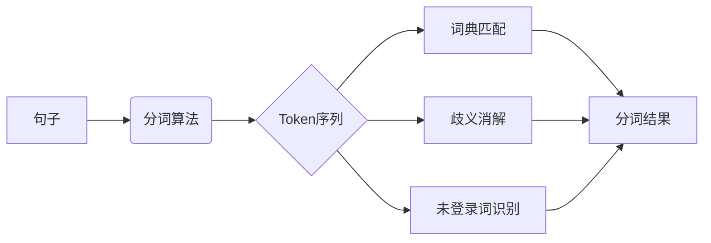

# 分词 原理与代码实例讲解

## 1.背景介绍
### 1.1 什么是分词
分词(Word Segmentation)是自然语言处理(NLP)中的一项基础且关键的任务,指的是将一个句子切分成有意义的基本单元(通常是词)的过程。对于像英语这样的语言,词与词之间天然地以空格作为分隔符,分词相对简单。但对于中文等很多亚洲语言来说,句子中词与词之间没有明显分隔符,因此分词就成为了NLP不可或缺的预处理步骤。

### 1.2 分词的重要性
分词的准确性直接影响到后续NLP任务的效果,如信息检索、机器翻译、情感分析、知识图谱等。没有做好分词,计算机很难准确理解句子的语义。可以说,分词是中文信息处理的基础,是文本挖掘的重要环节。

### 1.3 分词的难点与挑战
中文分词之所以具有挑战性,主要有以下几点原因:

1. 中文词边界模糊。不像英文有空格作为词的分界线,很多情况下中文词语的边界并不明显。
2. 中文歧义现象严重。同一个字面的词在不同语境下可能有完全不同的含义,需要根据上下文来判断。
3. 中文缺乏形态变化。英文有词形变化如单复数等,而中文没有,这给基于规则的分词方法带来困难。
4. 未登录词问题。随着网络新词的大量出现,如何识别出句子中的新词也是一大难点。

## 2.核心概念与联系
### 2.1 Token 
Token指的是句子被分词算法切分后的一个个基本单元,通常是词,但有时也可以是词组或单个字符。分词的结果就是将句子转化为一系列Token的过程。

### 2.2 词典
词典是一些预先定义好的词语的集合。基于词典的分词方法会事先准备好词典,然后在句子中找出匹配词典中词语的Token。词典的质量很大程度上决定了分词算法的效果。

### 2.3 歧义与消歧
由于中文词语边界模糊的特点,同一个句子往往存在多种合理的分词方式,这就是分词中的歧义问题。而从多个可能的分词结果中选取一个最优的,则是消歧的过程。常见的消歧方法有基于规则、统计和深度学习的。

### 2.4 未登录词
未登录词指的是那些在现有词典中找不到的词语,通常包括新词、专业词汇、命名实体等。识别出句子中的未登录词是提高分词准确率的关键。常见方法有基于统计和机器学习的新词发现算法。

### 2.5 概念之间的关系
下图展示了上述几个核心概念之间的关系:



可以看到,句子经过分词算法处理,得到一系列Token。这些Token经过词典匹配、歧义消解和未登录词识别后,最终输出分词结果。其中词典、歧义消解和未登录词识别是分词的核心问题。

## 3.核心算法原理具体操作步骤
常见的中文分词算法主要有以下三类:

### 3.1 基于词典的方法
1. 构建词典,将所有词语放入一个集合(哈希表、Trie树等)
2. 对句子从左到右扫描,寻找可以匹配词典中词语的子串
3. 若存在多个匹配,则选择最长的那个(最长匹配法)
4. 重复步骤2-3,直到句子扫描完毕

基于词典的方法简单高效,但缺点是无法识别未登录词,对词典质量要求很高。

### 3.2 基于统计的方法
1. 人工标注语料,对每个句子标注正确的分词结果 
2. 使用标注语料训练N-gram语言模型,学习词语间的转移概率
3. 对句子生成所有可能的分词结果,计算每个结果出现的概率
4. 选择概率最大的那个作为最终的分词结果

基于统计的方法可以在一定程度上缓解未登录词问题,但需要大量人工标注的语料,而且训练语言模型的计算开销大。

### 3.3 基于深度学习的方法
1. 将分词问题建模为一个序列标注问题,每个字符视为一个待标注的对象
2. 人工标注语料,对每个字符标注"B(词首)、M(词中)、E(词尾)、S(单字成词)"的标签
3. 使用标注语料训练一个序列标注模型(如BiLSTM-CRF),输入句子,输出每个字符的标签
4. 根据预测的标签恢复出分词结果,如"BMMESBME"对应"北京/大学/生/物系"

基于深度学习的方法是目前效果最好的,可以很好地处理歧义和未登录词,但缺点是需要大量标注数据,且训练和预测的速度慢。

## 4.数学模型和公式详细讲解举例说明
这里我们以基于统计的分词方法中的N-gram语言模型为例,来讲解其背后的数学原理。

### 4.1 N-gram语言模型
N-gram语言模型的基本思想是用前面若干个词语出现的概率来估计当前词语出现的概率。形式化地,对于一个句子 $w_1w_2...w_n$,它的概率可以表示为:

$$P(w_1w_2...w_n) = \prod_{i=1}^n P(w_i|w_1w_2...w_{i-1})$$

其中 $P(w_i|w_1w_2...w_{i-1})$ 表示在已知前 $i-1$ 个词的情况下,第 $i$ 个词是 $w_i$ 的条件概率。

当 $n$ 取不同值时,就有不同阶的N-gram模型:

- $n=1$ 时,称为unigram,即 $P(w_1w_2...w_n) = \prod_{i=1}^n P(w_i)$
- $n=2$ 时,称为bigram,即 $P(w_1w_2...w_n) = \prod_{i=1}^n P(w_i|w_{i-1})$
- $n=3$ 时,称为trigram,即 $P(w_1w_2...w_n) = \prod_{i=1}^n P(w_i|w_{i-2}w_{i-1})$

### 4.2 举例说明
假设我们有如下一个已经分好词的句子:
```
我 喜欢 北京 天安门
```
现在要计算其概率。

对于bigram模型,有:
$$\begin{align}
P(我喜欢北京天安门) &= P(我)P(喜欢|我)P(北京|喜欢)P(天安门|北京) \\
                  &= \frac{C(我)}{N} \cdot \frac{C(我,喜欢)}{C(我)} \cdot \frac{C(喜欢,北京)}{C(喜欢)} \cdot \frac{C(北京,天安门)}{C(北京)}
\end{align}$$
其中 $C(*)$ 表示训练语料中某词或词组合出现的次数,$N$ 为训练语料的总词数。

可以看到,利用大规模语料统计得到的N-gram概率,可以较好地评估一个分词序列是否合理。分词时,我们枚举所有可能的分词结果,计算出概率最大的那个。

当然,实际应用中我们还需要考虑平滑、剪枝等问题,这里不再展开。

## 5.项目实践：代码实例和详细解释说明
下面我们使用Python实现一个简单的基于词典的最长匹配分词算法。

```python
class Tokenizer:
    def __init__(self, dict_path):
        self.dictionary = set()
        with open(dict_path, "r", encoding="utf-8") as f:
            for line in f:
                self.dictionary.add(line.strip())

    def tokenize(self, text):
        result = []
        i = 0
        while i < len(text):
            longest_word = text[i]
            for j in range(i + 1, len(text) + 1):
                word = text[i:j]
                if word in self.dictionary:
                    if len(word) > len(longest_word):
                        longest_word = word
            result.append(longest_word)
            i += len(longest_word)
        return result

tokenizer = Tokenizer("dict.txt")
text = "南京市长江大桥"
print(tokenizer.tokenize(text))
```

代码解释:
1. 首先定义了一个`Tokenizer`类,在构造函数中读取词典文件,将所有词语存入一个集合`dictionary`中。
2. `tokenize`函数接受一个字符串`text`,对其进行分词。过程是从左到右扫描,寻找能匹配词典中词语的最长子串,将其加入结果列表,然后继续扫描剩下的部分,直到整个字符串都被扫描完毕。
3. 创建一个`Tokenizer`实例,传入词典路径进行初始化。然后调用`tokenize`函数对句子"南京市长江大桥"进行分词。

假设`dict.txt`中包含词语"南京"、"南京市"、"长江"、"大桥",则输出结果为:
```
['南京市', '长江', '大桥']
```

可以看到,"南京市"和"南京"都匹配,但因为最长匹配的原则,所以选择了"南京市"。

这个分词实现比较简陋,在实际项目中,我们还需要考虑:
1. 使用Trie树等更高效的数据结构来存储词典
2. 在词典中加入词频信息,对于多个匹配优先选择词频高的
3. 引入动态规划等方法,综合考虑整个句子的分词结果,而不是贪心地选择局部最优
4. 使用CRF等机器学习方法,自动学习分词模型,而不完全依赖人工词典

## 6.实际应用场景
中文分词技术在NLP领域有着广泛的应用,下面列举一些常见的场景:

### 6.1 搜索引擎
搜索引擎需要将网页内容和用户查询都进行分词,然后进行关键词匹配。分词的准确性直接影响搜索结果的质量。一些搜索引擎还会利用分词结果进行查询扩展和纠错。

### 6.2 文本分类
对文本进行分类(如情感分析、新闻分类等)时,首先需要将文本进行分词,得到词语特征,再使用分类器进行分类。分词粒度的选择对分类效果有很大影响。

### 6.3 信息抽取
从文本中抽取结构化信息(如人名、地名、关系等)时,需要先对文本分词,再进行命名实体识别和关系抽取。这要求分词要尽可能地将命名实体作为一个整体切分出来。

### 6.4 机器翻译
将一种语言翻译成另一种语言,需要先对源语言文本进行分词,再进行翻译和目标语言的生成。不同语言的分词粒度差异很大,需要进行一定的适配。

### 6.5 文本摘要
从长文本中自动提取关键句子作为摘要,需要对文本进行分词、关键词提取等预处理。摘要的流畅性也依赖于分词质量。

## 7.工具和资源推荐
### 7.1 分词工具
- jieba: https://github.com/fxsjy/jieba
- THULAC: http://thulac.thunlp.org/
- NLPIR: https://github.com/NLPIR-team/NLPIR
- LTP: https://github.com/HIT-SCIR/ltp
- FudanNLP: https://github.com/FudanNLP/fnlp

### 7.2 词典资源
- 搜狗实验室词库: https://pinyin.sogou.com/dict/
- 清华大学开放中文词库: http://thuocl.thunlp.org/
- jieba词库: https://github.com/fxsjy/jieba/tree/master/extra_dict
- 百度停用词表: https://github.com/goto456/stopwords

### 7.3 语料资源
- 人民日报语料: https://github.com/howl-anderson/tools_for_corpus_of_people_daily
- 微博语料: https://github.com/SophonPlus/ChineseNlpCorpus/
- 维