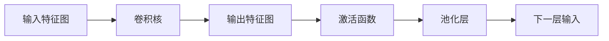

# 卷积层 (Convolutional Layer) 原理与代码实例讲解

## 1. 背景介绍
### 1.1 卷积神经网络的发展历程
#### 1.1.1 早期的神经网络模型
#### 1.1.2 LeNet-5 的提出
#### 1.1.3 AlexNet 的突破
### 1.2 卷积层在深度学习中的重要性
#### 1.2.1 卷积层的核心作用
#### 1.2.2 卷积层在图像识别中的应用
#### 1.2.3 卷积层在其他领域的应用

## 2. 核心概念与联系
### 2.1 卷积的数学定义
#### 2.1.1 连续卷积
#### 2.1.2 离散卷积
### 2.2 卷积层的组成部分
#### 2.2.1 输入特征图
#### 2.2.2 卷积核
#### 2.2.3 输出特征图
### 2.3 卷积层与其他层的联系
#### 2.3.1 卷积层与池化层
#### 2.3.2 卷积层与全连接层
#### 2.3.3 卷积层在网络中的位置

## 3. 核心算法原理具体操作步骤
### 3.1 卷积的计算过程
#### 3.1.1 卷积核的滑动
#### 3.1.2 卷积的计算公式
#### 3.1.3 边界填充
### 3.2 卷积的反向传播
#### 3.2.1 卷积层的梯度计算
#### 3.2.2 卷积核的更新
### 3.3 卷积的优化技巧
#### 3.3.1 稀疏连接
#### 3.3.2 权重共享
#### 3.3.3 等价卷积核

## 4. 数学模型和公式详细讲解举例说明 
### 4.1 二维卷积的数学模型
#### 4.1.1 输入特征图与卷积核的数学表示
#### 4.1.2 卷积计算的数学公式
#### 4.1.3 输出特征图的数学表示
### 4.2 多通道卷积的数学模型
#### 4.2.1 多通道输入与卷积核的数学表示
#### 4.2.2 多通道卷积的计算过程
#### 4.2.3 输出特征图的维度计算
### 4.3 卷积的数学性质
#### 4.3.1 卷积的交换性
#### 4.3.2 卷积的结合性
#### 4.3.3 卷积的分配律

## 5. 项目实践：代码实例和详细解释说明
### 5.1 使用 NumPy 实现卷积层
#### 5.1.1 导入必要的库
#### 5.1.2 定义卷积函数
#### 5.1.3 测试卷积函数
### 5.2 使用 PyTorch 实现卷积层
#### 5.2.1 定义卷积层类
#### 5.2.2 实例化卷积层
#### 5.2.3 前向传播与反向传播
### 5.3 卷积神经网络的实现
#### 5.3.1 定义卷积神经网络类
#### 5.3.2 训练卷积神经网络
#### 5.3.3 评估模型性能

## 6. 实际应用场景
### 6.1 图像分类
#### 6.1.1 CIFAR-10 数据集
#### 6.1.2 ResNet 网络结构
#### 6.1.3 训练与测试结果
### 6.2 目标检测
#### 6.2.1 COCO 数据集
#### 6.2.2 YOLO 网络结构
#### 6.2.3 训练与测试结果
### 6.3 语义分割
#### 6.3.1 PASCAL VOC 数据集
#### 6.3.2 FCN 网络结构 
#### 6.3.3 训练与测试结果

## 7. 工具和资源推荐
### 7.1 深度学习框架
#### 7.1.1 TensorFlow
#### 7.1.2 PyTorch
#### 7.1.3 Keras
### 7.2 预训练模型库
#### 7.2.1 TorchVision
#### 7.2.2 TensorFlow Hub
#### 7.2.3 Model Zoo
### 7.3 数据集资源
#### 7.3.1 ImageNet
#### 7.3.2 COCO
#### 7.3.3 CIFAR

## 8. 总结：未来发展趋势与挑战
### 8.1 卷积层的变体与改进
#### 8.1.1 可分离卷积
#### 8.1.2 空洞卷积
#### 8.1.3 转置卷积
### 8.2 卷积神经网络的发展方向
#### 8.2.1 网络结构的设计
#### 8.2.2 注意力机制的引入
#### 8.2.3 模型压缩与加速
### 8.3 卷积神经网络面临的挑战
#### 8.3.1 小样本学习
#### 8.3.2 域适应问题
#### 8.3.3 可解释性问题

## 9. 附录：常见问题与解答
### 9.1 卷积层的超参数如何设置？
### 9.2 卷积核的大小如何选择？
### 9.3 如何避免卷积神经网络过拟合？
### 9.4 卷积层和全连接层的区别是什么？
### 9.5 如何理解卷积的感受野？



卷积层是卷积神经网络 (CNN) 的核心组成部分，它通过卷积操作提取输入特征图中的局部特征。卷积层的输入是一个多维数组，通常是图像或前一层的输出特征图。卷积核是一组可学习的参数，用于对输入进行卷积操作。卷积核在输入特征图上滑动，对覆盖的局部区域进行点积计算，生成输出特征图中的对应位置的值。

卷积操作可以看作是一种特殊的线性变换，它具有稀疏连接和权重共享的特性。稀疏连接是指每个输出神经元只与输入特征图中的一个局部区域相连，而不是与所有输入神经元相连。这种稀疏连接大大减少了网络的参数数量，使得卷积神经网络能够处理大尺寸的输入图像。权重共享是指在同一个卷积层中，所有卷积核共享相同的权重参数。这种权重共享的方式使得卷积神经网络能够学习到图像中的平移不变性特征。

卷积层的数学模型可以用以下公式表示：

$$
\mathbf{Y}[i, j] = \sum_{m=0}^{M-1} \sum_{n=0}^{N-1} \mathbf{X}[i+m, j+n] \cdot \mathbf{K}[m, n]
$$

其中，$\mathbf{X}$ 表示输入特征图，$\mathbf{K}$ 表示卷积核，$\mathbf{Y}$ 表示输出特征图，$M$ 和 $N$ 分别表示卷积核的高度和宽度。

下面是使用 PyTorch 实现卷积层的示例代码：

```python
import torch
import torch.nn as nn

class ConvLayer(nn.Module):
    def __init__(self, in_channels, out_channels, kernel_size, stride=1, padding=0):
        super(ConvLayer, self).__init__()
        self.conv = nn.Conv2d(in_channels, out_channels, kernel_size, stride, padding)
        
    def forward(self, x):
        out = self.conv(x)
        return out

# 实例化卷积层
conv_layer = ConvLayer(in_channels=3, out_channels=16, kernel_size=3, stride=1, padding=1)

# 创建输入特征图
input_tensor = torch.randn(1, 3, 32, 32)

# 前向传播
output_tensor = conv_layer(input_tensor)

print(output_tensor.shape)  # 输出：torch.Size([1, 16, 32, 32])
```

在上面的代码中，我们定义了一个名为 `ConvLayer` 的卷积层类，它继承自 `nn.Module`。在构造函数中，我们使用 `nn.Conv2d` 创建了一个二维卷积层，并指定了输入通道数、输出通道数、卷积核大小、步幅和填充。在前向传播函数 `forward` 中，我们将输入特征图传递给卷积层，并返回输出特征图。

接着，我们实例化了一个卷积层对象 `conv_layer`，并创建了一个随机的输入特征图 `input_tensor`。通过调用 `conv_layer(input_tensor)`，我们对输入特征图进行卷积操作，得到输出特征图 `output_tensor`。最后，我们打印输出特征图的形状，可以看到经过卷积层后，特征图的通道数发生了变化，而高度和宽度保持不变。

卷积层在深度学习中有着广泛的应用，特别是在计算机视觉领域。它能够有效地提取图像中的局部特征，并通过多层卷积和池化操作，逐步提取出更加抽象和高级的特征表示。卷积神经网络在图像分类、目标检测、语义分割等任务中取得了显著的成果。

未来，卷积层的研究方向包括设计更加高效和精简的卷积层变体，如可分离卷积、空洞卷积等；探索注意力机制与卷积层的结合，提高网络的表达能力；研究模型压缩和加速技术，使卷积神经网络能够在资源受限的设备上实时运行。同时，卷积神经网络也面临着一些挑战，如小样本学习、域适应问题和可解释性问题等，需要研究者们继续探索和攻克。

总之，卷积层是深度学习中一个极其重要的组成部分，它为计算机视觉和其他领域的发展提供了强大的工具。通过深入理解卷积层的原理，并结合实际项目经验，我们可以更好地应用卷积神经网络解决实际问题，推动人工智能技术的进步。

作者：禅与计算机程序设计艺术 / Zen and the Art of Computer Programming