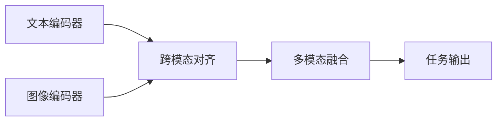

# 多模态大模型：技术原理与实战 国内多模态大模型介绍

## 1. 背景介绍
### 1.1 多模态大模型的兴起
近年来,随着人工智能技术的飞速发展,大模型(Large Language Model,LLM)在自然语言处理领域取得了突破性进展。而多模态大模型作为大模型的进一步延伸,通过融合文本、图像、音频等不同模态的信息,展现出更加强大的感知理解和生成能力,引发了学术界和工业界的广泛关注。

### 1.2 多模态大模型的优势
与单一模态的大模型相比,多模态大模型具有以下优势:

1. 更全面的感知能力:通过融合不同模态的信息,多模态大模型能够更全面地感知和理解现实世界,捕捉到更丰富的语义信息。

2. 更强的跨模态推理能力:多模态大模型能够在不同模态之间建立联系,实现跨模态的信息融合和推理,解决单一模态难以处理的复杂任务。

3. 更自然的人机交互:多模态大模型能够同时处理文本、图像、语音等多种形式的输入,使人机交互更加自然和便捷。

### 1.3 国内多模态大模型的发展现状
近年来,国内科技巨头和研究机构纷纷投入多模态大模型的研究和应用,涌现出一批具有代表性的模型和系统,如百度的ERNIE-ViLG、华为的 Pangu-PALM 、阿里的M6等。这些模型在多模态理解、跨模态生成等任务上取得了优异的表现,展现出我国在该领域的研究实力。

## 2. 核心概念与联系
### 2.1 多模态学习
多模态学习(Multimodal Learning)是指利用不同模态的数据(如文本、图像、音频等)进行联合学习,捕捉不同模态数据之间的内在联系,从而获得更全面、更准确的信息表示。

### 2.2 跨模态对齐
跨模态对齐(Cross-modal Alignment)是指在多模态学习中,将不同模态的数据映射到一个共同的语义空间,使它们在语义层面上对齐。这是实现跨模态信息融合和推理的关键。

### 2.3 多模态融合
多模态融合(Multimodal Fusion)是指将不同模态提取的特征进行有效融合,充分利用不同模态信息的互补性,从而得到更加准确和鲁棒的预测结果。常见的融合方式包括早期融合、晚期融合和混合融合等。

### 2.4 注意力机制
注意力机制(Attention Mechanism)是深度学习中的一种重要技术,通过动态地调整不同区域或不同模态的权重,使模型能够更加关注重要的信息。在多模态大模型中,注意力机制被广泛用于跨模态对齐和融合。

### 2.5 预训练与微调
预训练(Pre-training)是指在大规模无标注数据上进行自监督学习,使模型学习到通用的特征表示。微调(Fine-tuning)是指在特定任务的标注数据上对预训练模型进行进一步训练,使其适应特定任务。这种"预训练+微调"的范式已成为多模态大模型的主流训练方式。

### 2.6 多模态大模型架构
下图展示了一个典型的多模态大模型架构,包括文本编码器、图像编码器、跨模态对齐模块、多模态融合模块和任务输出模块。



## 3. 核心算法原理具体操作步骤
### 3.1 文本编码
1. 将输入文本进行分词和编码,转化为数字化表示。
2. 使用预训练的语言模型(如BERT、GPT等)对文本进行编码,得到文本特征向量。
3. 引入位置编码,捕捉文本中的位置信息。

### 3.2 图像编码
1. 将输入图像进行预处理,如缩放、归一化等。
2. 使用预训练的视觉模型(如ResNet、ViT等)对图像进行编码,得到图像特征向量。
3. 引入位置编码,捕捉图像中的位置信息。

### 3.3 跨模态对齐
1. 使用注意力机制计算文本特征和图像特征之间的相似度。
2. 根据相似度对文本特征和图像特征进行加权融合,得到对齐后的跨模态特征。
3. 引入额外的对比学习损失,促进跨模态特征的语义对齐。

### 3.4 多模态融合
1. 将对齐后的文本特征和图像特征进行拼接或元素级融合。
2. 使用多层感知机(MLP)或Transformer等结构对融合后的特征进行进一步编码。
3. 引入门控机制或残差连接,增强特征的表达能力。

### 3.5 任务输出
1. 根据具体任务的需求,设计相应的输出层结构,如分类、回归、生成等。
2. 使用融合后的多模态特征进行预测或生成。
3. 计算任务相关的损失函数,并进行梯度反向传播和参数更新。

## 4. 数学模型和公式详细讲解举例说明
### 4.1 注意力机制
注意力机制可以用下面的公式表示:

$$Attention(Q,K,V) = softmax(\frac{QK^T}{\sqrt{d_k}})V$$

其中,$Q$表示查询向量,$K$表示键向量,$V$表示值向量,$d_k$表示向量维度。该公式计算查询向量和所有键向量之间的相似度,然后用softmax函数将相似度转化为注意力权重,最后用注意力权重对值向量进行加权求和。

举例说明:在跨模态对齐中,可以将文本特征作为查询向量,将图像特征作为键向量和值向量,通过注意力机制计算文本和图像之间的相似度,并对图像特征进行加权融合。

### 4.2 对比学习损失
对比学习损失可以用下面的公式表示:

$$L_{contrast} = -log\frac{exp(sim(v_i,v_j)/\tau)}{\sum_{k=1}^Nexp(sim(v_i,v_k)/\tau)}$$

其中,$v_i$和$v_j$表示一对正样本的特征向量,$v_k$表示负样本的特征向量,$sim$表示相似度函数(如点积或余弦相似度),$\tau$表示温度超参数,$N$表示负样本数量。该损失函数鼓励正样本之间的相似度大于正样本与负样本之间的相似度。

举例说明:在跨模态对齐中,可以将同一图文对的文本特征和图像特征视为正样本,将不同图文对的特征视为负样本,通过最小化对比学习损失来促进跨模态特征的语义对齐。

## 5. 项目实践：代码实例和详细解释说明
下面是一个基于PyTorch实现的简单多模态大模型代码示例:

```python
import torch
import torch.nn as nn

class MultimodalModel(nn.Module):
    def __init__(self, text_dim, image_dim, hidden_dim):
        super(MultimodalModel, self).__init__()
        self.text_encoder = nn.LSTM(text_dim, hidden_dim, batch_first=True)
        self.image_encoder = nn.Linear(image_dim, hidden_dim)
        self.attention = nn.MultiheadAttention(hidden_dim, num_heads=8)
        self.fusion = nn.Linear(2*hidden_dim, hidden_dim)
        self.output = nn.Linear(hidden_dim, num_classes)
        
    def forward(self, text, image):
        # 文本编码
        text_feat, _ = self.text_encoder(text)
        # 图像编码
        image_feat = self.image_encoder(image)
        # 跨模态对齐
        attn_output, _ = self.attention(text_feat, image_feat, image_feat)
        # 多模态融合
        fused_feat = torch.cat([text_feat, attn_output], dim=-1)
        fused_feat = self.fusion(fused_feat)
        # 任务输出
        output = self.output(fused_feat[:, -1, :])
        return output
```

代码解释:
1. 定义了一个名为`MultimodalModel`的多模态大模型类,包含文本编码器、图像编码器、跨模态注意力模块、多模态融合模块和任务输出模块。
2. 文本编码器使用LSTM对文本进行编码,图像编码器使用线性层对图像进行编码。
3. 跨模态注意力模块使用多头注意力机制计算文本特征和图像特征之间的相似度,并对图像特征进行加权融合。
4. 多模态融合模块将文本特征和注意力输出拼接,并使用线性层进行融合。
5. 任务输出模块根据融合后的特征进行最终的预测。

使用示例:
```python
model = MultimodalModel(text_dim=100, image_dim=2048, hidden_dim=512)
text = torch.randn(32, 20, 100)  # 假设batch_size=32,文本长度为20,词向量维度为100
image = torch.randn(32, 2048)    # 假设图像特征维度为2048
output = model(text, image)
```

## 6. 实际应用场景
多模态大模型可以应用于以下场景:

1. 图像描述生成:给定一张图像,自动生成对应的文本描述。
2. 视觉问答:给定一张图像和一个问题,自动生成问题的答案。
3. 图文检索:给定一段文本,从图像库中检索出与文本语义相关的图像,或给定一张图像,从文本库中检索出与图像语义相关的文本。
4. 多模态对话:在对话系统中引入图像等多模态信息,实现更自然、更丰富的人机交互。
5. 多模态内容生成:根据文本描述自动生成对应的图像,或根据图像自动生成对应的文本、音频等。

## 7. 工具和资源推荐
1. 预训练模型:BERT、GPT、CLIP、ViT等。
2. 开源框架:PyTorch、TensorFlow、Hugging Face Transformers等。
3. 数据集:MS COCO、Flickr30K、Visual Genome等。
4. 评测基准:VQA、Image Captioning、Text-to-Image Retrieval等。

## 8. 总结：未来发展趋势与挑战
多模态大模型是人工智能领域的重要发展方向,具有广阔的应用前景。未来的研究趋势可能包括:

1. 更大规模、更多模态的预训练模型。
2. 更高效、更灵活的跨模态对齐和融合方法。
3. 更好的可解释性和可控性。
4. 更广泛的实际应用场景。

同时,多模态大模型也面临着一些挑战:

1. 计算和存储资源的瓶颈。
2. 跨模态信息的异构性和鸿沟。
3. 数据标注和模型评估的难度。
4. 模型的公平性、隐私性和安全性。

## 9. 附录：常见问题与解答
1. 问:多模态大模型与单模态大模型相比有什么优势?
   答:多模态大模型能够融合不同模态的信息,具有更全面的感知能力、更强的跨模态推理能力和更自然的人机交互方式。

2. 问:多模态大模型的训练需要哪些数据?
   答:多模态大模型的训练通常需要大规模的文本-图像对齐数据,如图像描述数据集、图文问答数据集等。此外,还可以利用单模态数据进行预训练,再在多模态数据上进行微调。

3. 问:多模态融合有哪些常见的方法?
   答:常见的多模态融合方法包括早期融合(特征拼接)、晚期融合(分别提取特征再融合)和混合融合(多次交互融合)。此外,注意力机制、门控机制等技术也被广泛用于多模态融合。

4. 问:如何评估多模态大模型的性能?
   答:可以在标准的多模态任务数据集上进行评测,如VQA、Image Captioning等。评估指标包括准确率、BLEU、METEOR、CIDEr等。此外,还可以通过人工评估的方式,从生成质量、语义一致性等方面进行主观评判。

作者：禅与计