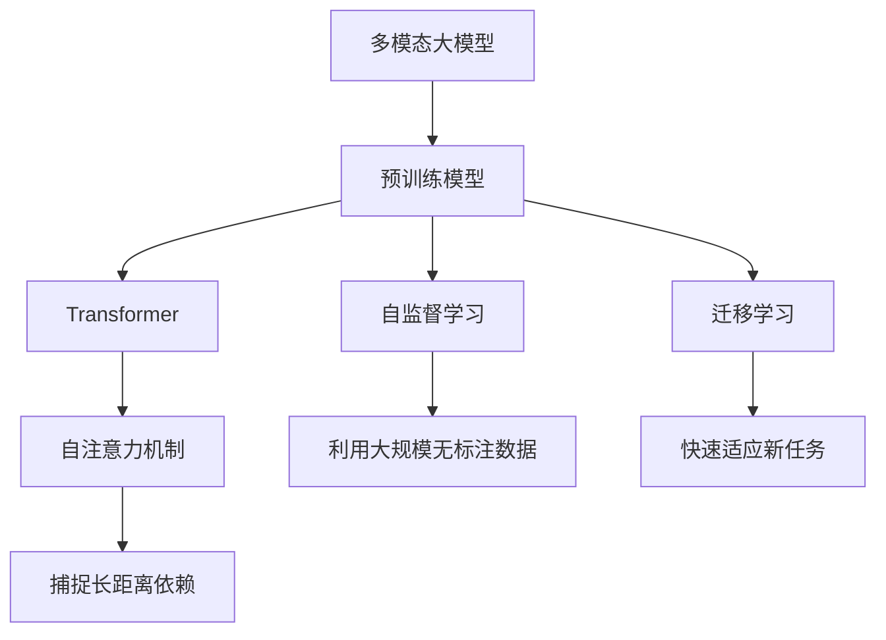
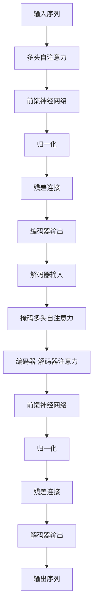

# 多模态大模型：技术原理与实战 基于Transformer的预训练语言模型

## 1. 背景介绍

### 1.1 人工智能的发展历程

人工智能(Artificial Intelligence, AI)是当代科技发展的重要领域,旨在创造出能够模仿人类智能行为的机器系统。自20世纪50年代诞生以来,AI经历了几个重要的发展阶段。

- 早期阶段(1950s-1960s):专家系统、博弈理论等奠基性工作。
- 知识迷阵期(1970s-1980s):由于计算能力和算法的局限性,AI发展陷入低谷。
- 统计学习时代(1990s-2010s):机器学习、神经网络等统计方法推动AI重新兴起。
- 深度学习时代(2010s-):benefiting from大数据、强大计算能力和新算法,深度学习在多个领域取得突破性进展。

### 1.2 深度学习的兴起

深度学习(Deep Learning)是机器学习的一个新的研究热点,它模仿人脑的结构和功能,通过构建神经网络模型对大规模数据进行训练,自动学习数据特征表示,并用于分析和预测。近年来,受益于算力、数据和新算法的推动,深度学习在计算机视觉、自然语言处理、语音识别等领域取得了突破性进展。

### 1.3 大模型的兴起

随着深度学习的不断发展,模型规模也在不断扩大。大模型(Large Model)指参数量在数十亿甚至上百亿的巨大神经网络模型。大模型能够从海量数据中学习到更丰富、更复杂的知识表示,在自然语言处理、计算机视觉等领域展现出超越小模型的卓越性能。著名的大模型有GPT-3、DALL-E、PaLM等。

### 1.4 多模态大模型的崛起  

传统的深度学习模型大多专注于单一模态(如文本、图像、语音等)的任务,而多模态大模型(Multimodal Large Model)则旨在同时处理多种模态的输入,并生成多模态的输出。多模态大模型能够捕捉并利用不同模态之间的相关性,为人机交互、内容理解与生成等应用场景带来新的可能性。

## 2. 核心概念与联系



### 2.1 预训练模型(Pre-trained Model)

预训练模型是多模态大模型的核心部分。它通过在大规模无标注数据上进行自监督学习,获得通用的表示能力,然后再通过迁移学习快速适应具体的下游任务。

常见的预训练模型包括BERT(自然语言处理)、Vision Transformer(计算机视觉)等。

### 2.2 Transformer

Transformer是一种全新的基于注意力机制的神经网络架构,能够更好地捕捉输入序列中的长距离依赖关系。自2017年被提出以来,Transformer及其变体广泛应用于自然语言处理、计算机视觉等领域,成为构建大型预训练模型的主流选择。

### 2.3 自监督学习(Self-Supervised Learning)

自监督学习是一种无需人工标注的学习范式。它通过构建预测任务,利用数据本身的信号作为监督信号,使模型学习到有用的数据表示。常见的自监督学习方法包括掩码语言模型、对比学习等。

### 2.4 迁移学习(Transfer Learning)

迁移学习指将在源领域学习到的知识迁移到目标领域,从而加速模型在新任务上的训练。预训练模型经过自监督学习获得通用的表示能力后,可以通过迁移学习快速适应下游任务,避免从头开始训练。

### 2.5 自注意力机制(Self-Attention)

自注意力机制是Transformer的核心部件,它能够捕捉输入序列中任意两个位置之间的依赖关系,解决了RNN等序列模型难以学习长距离依赖的问题。自注意力机制赋予了Transformer强大的表示学习能力。

## 3. 核心算法原理具体操作步骤

### 3.1 Transformer模型架构

Transformer由编码器(Encoder)和解码器(Decoder)组成。编码器将输入序列映射为中间表示,解码器则基于该中间表示生成输出序列。两者均由多个相同的层组成,每一层包含多头自注意力子层和前馈神经网络子层。



### 3.2 自注意力机制计算过程

1) 计算Query、Key和Value矩阵
2) 计算注意力权重: $$\mathrm{Attention}(Q, K, V) = \mathrm{softmax}(\frac{QK^T}{\sqrt{d_k}})V$$
3) 多头注意力机制将多个注意力头的结果拼接
4) 添加残差连接和层归一化

### 3.3 BERT 模型

BERT(Bidirectional Encoder Representations from Transformers)是一种基于Transformer的预训练语言模型,通过掩码语言模型和下一句预测两个自监督任务在大规模文本语料上进行预训练,获得了强大的语义表示能力。

### 3.4 Vision Transformer

Vision Transformer(ViT)将Transformer应用到计算机视觉领域。它将图像分割为多个patch,并将每个patch投影到一个向量,作为Transformer的输入序列。ViT在大规模图像数据集上进行自监督预训练,学习到了强大的视觉表示能力。

## 4. 数学模型和公式详细讲解举例说明

### 4.1 自注意力机制数学原理

给定一个输入序列$X = (x_1, x_2, ..., x_n)$,自注意力机制首先将其映射到Query($Q$)、Key($K$)和Value($V$)矩阵:

$$Q = X W^Q, K = X W^K, V = X W^V$$

其中$W^Q, W^K, W^V$是可训练的权重矩阵。

然后计算注意力权重:

$$\mathrm{Attention}(Q, K, V) = \mathrm{softmax}(\frac{QK^T}{\sqrt{d_k}})V$$

其中$d_k$是缩放因子,用于防止内积值过大导致梯度消失。

最终,注意力机制的输出是注意力权重与Value矩阵的加权和:

$$\mathrm{Attention}(X) = \mathrm{Attention}(Q, K, V) = \sum_{i=1}^n \alpha_i v_i$$

其中$\alpha_i$是对应$x_i$的注意力权重。

### 4.2 多头注意力机制

为了捕捉不同子空间的信息,Transformer采用了多头注意力机制。具体地,将Query、Key和Value矩阵分别投影到$h$个子空间,对每个子空间分别计算注意力,最后将所有头的注意力输出拼接起来:

$$\mathrm{MultiHead}(Q, K, V) = \mathrm{Concat}(\mathrm{head}_1, ..., \mathrm{head}_h) W^O$$
$$\mathrm{where}\ \mathrm{head}_i = \mathrm{Attention}(QW_i^Q, KW_i^K, VW_i^V)$$

其中$W_i^Q, W_i^K, W_i^V$是第$i$个头对应的投影矩阵,$W^O$是可训练的输出权重矩阵。

### 4.3 掩码语言模型

BERT的掩码语言模型任务是将一部分输入token随机用[MASK]标记替换,然后让模型基于上下文预测被掩码的token。形式化地,给定一个输入序列$X = (x_1, x_2, ..., x_n)$,其中一些token被掩码为[MASK],模型的目标是最大化掩码token的条件概率:

$$\mathcal{L}_\mathrm{mlm} = -\mathbb{E}_{X, X_\mathrm{mask}} \left[ \sum_{i \in \mathrm{mask}} \log P(x_i | X_\mathrm{mask}) \right]$$

其中$X_\mathrm{mask}$是掩码后的输入序列。

通过这种方式,BERT能够学习到双向的上下文表示,从而获得强大的语义理解能力。

## 5. 项目实践:代码实例和详细解释说明

以下是使用PyTorch实现的一个简化版Transformer模型:

```python
import torch
import torch.nn as nn

class MultiHeadAttention(nn.Module):
    def __init__(self, d_model, num_heads):
        super().__init__()
        self.num_heads = num_heads
        self.d_model = d_model
        
        self.W_q = nn.Linear(d_model, d_model)
        self.W_k = nn.Linear(d_model, d_model)
        self.W_v = nn.Linear(d_model, d_model)
        self.fc = nn.Linear(d_model, d_model)
        
    def forward(self, x):
        batch_size = x.size(0)
        
        # 1. 计算 Q, K, V
        q = self.W_q(x)
        k = self.W_k(x)
        v = self.W_v(x)
        
        # 2. 分头
        q = q.view(batch_size, -1, self.num_heads, self.d_model // self.num_heads).permute(0, 2, 1, 3)
        k = k.view(batch_size, -1, self.num_heads, self.d_model // self.num_heads).permute(0, 2, 1, 3)
        v = v.view(batch_size, -1, self.num_heads, self.d_model // self.num_heads).permute(0, 2, 1, 3)
        
        # 3. 计算注意力
        attn_scores = torch.matmul(q, k.permute(0, 1, 3, 2)) / (self.d_model // self.num_heads) ** 0.5
        attn_probs = nn.Softmax(dim=-1)(attn_scores)
        attn_output = torch.matmul(attn_probs, v)
        
        # 4. 合并头
        attn_output = attn_output.permute(0, 2, 1, 3).contiguous().view(batch_size, -1, self.d_model)
        
        # 5. 前馈层
        out = self.fc(attn_output)
        
        return out

class TransformerBlock(nn.Module):
    def __init__(self, d_model, num_heads):
        super().__init__()
        self.mha = MultiHeadAttention(d_model, num_heads)
        self.ffn = nn.Sequential(
            nn.Linear(d_model, d_model * 4),
            nn.ReLU(),
            nn.Linear(d_model * 4, d_model)
        )
        self.layernorm1 = nn.LayerNorm(d_model)
        self.layernorm2 = nn.LayerNorm(d_model)
        
    def forward(self, x):
        # 多头自注意力
        attn_out = self.mha(x)
        out1 = self.layernorm1(x + attn_out)
        
        # 前馈神经网络
        ffn_out = self.ffn(out1)
        out2 = self.layernorm2(out1 + ffn_out)
        
        return out2
```

这个示例实现了Transformer的核心组件:多头自注意力机制和前馈神经网络。

- `MultiHeadAttention`模块实现了多头自注意力的计算过程,包括计算Query、Key、Value,计算注意力权重,以及合并多头的输出。
- `TransformerBlock`模块组合了多头自注意力和前馈神经网络,并添加了残差连接和层归一化。

通过堆叠多个`TransformerBlock`,我们就可以构建出编码器或解码器。在实际应用中,我们还需要添加位置编码、掩码等机制,并根据任务需求设计不同的输入输出表示。

## 6. 实际应用场景

多模态大模型在多个领域展现出了卓越的性能,为众多应用场景带来了新的可能性: