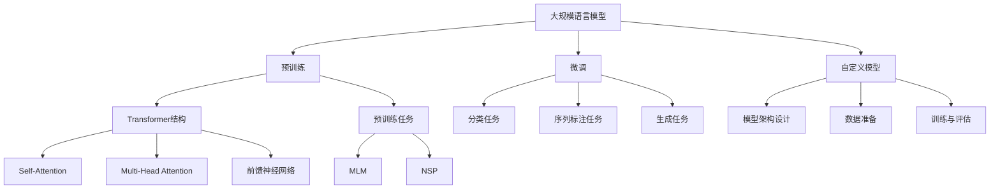

# 大规模语言模型从理论到实践 自定义模型

## 1. 背景介绍
### 1.1 大规模语言模型的发展历程
#### 1.1.1 早期的语言模型
#### 1.1.2 Transformer的出现
#### 1.1.3 预训练语言模型的崛起
### 1.2 大规模语言模型的应用现状  
#### 1.2.1 自然语言处理领域的应用
#### 1.2.2 知识图谱构建与问答系统
#### 1.2.3 智能对话与内容生成

## 2. 核心概念与联系
### 2.1 大规模语言模型的定义与特点
#### 2.1.1 语言模型的基本概念
#### 2.1.2 大规模语言模型的定义
#### 2.1.3 大规模语言模型的特点
### 2.2 预训练与微调
#### 2.2.1 预训练的概念与目的
#### 2.2.2 微调的概念与方法
#### 2.2.3 预训练与微调的关系
### 2.3 自定义模型的概念与意义
#### 2.3.1 自定义模型的定义
#### 2.3.2 自定义模型的优势
#### 2.3.3 自定义模型的应用场景

## 3. 核心算法原理与具体操作步骤
### 3.1 Transformer结构详解
#### 3.1.1 Self-Attention机制
#### 3.1.2 Multi-Head Attention
#### 3.1.3 前馈神经网络
### 3.2 预训练算法
#### 3.2.1 Masked Language Model (MLM)
#### 3.2.2 Next Sentence Prediction (NSP)
#### 3.2.3 其他预训练任务
### 3.3 微调算法
#### 3.3.1 分类任务微调
#### 3.3.2 序列标注任务微调
#### 3.3.3 生成任务微调
### 3.4 自定义模型的构建步骤
#### 3.4.1 确定模型架构
#### 3.4.2 准备训练数据
#### 3.4.3 模型训练与评估

## 4. 数学模型和公式详细讲解举例说明
### 4.1 Transformer中的数学公式
#### 4.1.1 Scaled Dot-Product Attention
$Attention(Q,K,V) = softmax(\frac{QK^T}{\sqrt{d_k}})V$
#### 4.1.2 Multi-Head Attention
$MultiHead(Q,K,V) = Concat(head_1,...,head_h)W^O$
$head_i = Attention(QW_i^Q, KW_i^K, VW_i^V)$
#### 4.1.3 Position-wise Feed-Forward Networks
$FFN(x) = max(0, xW_1 + b_1)W_2 + b_2$
### 4.2 预训练中的数学公式
#### 4.2.1 Masked Language Model (MLM)
$L_{MLM}(\theta) = -\sum_{i=1}^{n}log P(w_i|w_{-i};\theta)$
#### 4.2.2 Next Sentence Prediction (NSP) 
$L_{NSP}(\theta) = -log P(IsNext|s_1,s_2;\theta)$
### 4.3 微调中的数学公式
#### 4.3.1 分类任务
$L_{cls}(\theta) = -\sum_{i=1}^{n}log P(y_i|x_i;\theta)$
#### 4.3.2 序列标注任务
$L_{tag}(\theta) = -\sum_{i=1}^{n}\sum_{j=1}^{m}log P(y_{ij}|x_i;\theta)$
#### 4.3.3 生成任务  
$L_{gen}(\theta) = -\sum_{i=1}^{n}log P(y_i|x,y_{<i};\theta)$

## 5. 项目实践：代码实例和详细解释说明
### 5.1 预训练代码实例
#### 5.1.1 数据准备
#### 5.1.2 模型定义
#### 5.1.3 训练过程
### 5.2 微调代码实例
#### 5.2.1 分类任务微调
#### 5.2.2 序列标注任务微调
#### 5.2.3 生成任务微调
### 5.3 自定义模型代码实例
#### 5.3.1 模型架构定义
#### 5.3.2 数据处理与加载
#### 5.3.3 训练与评估

## 6. 实际应用场景
### 6.1 智能客服
#### 6.1.1 客户意图识别
#### 6.1.2 自动回复生成
#### 6.1.3 情感分析
### 6.2 个性化推荐
#### 6.2.1 用户画像构建
#### 6.2.2 物品描述生成
#### 6.2.3 推荐解释生成
### 6.3 智能写作助手
#### 6.3.1 文本续写
#### 6.3.2 文本纠错与优化
#### 6.3.3 文本风格转换

## 7. 工具和资源推荐
### 7.1 开源工具包
#### 7.1.1 Transformers
#### 7.1.2 Fairseq
#### 7.1.3 OpenNMT
### 7.2 预训练模型
#### 7.2.1 BERT
#### 7.2.2 GPT系列
#### 7.2.3 XLNet
### 7.3 数据集资源
#### 7.3.1 通用语料库
#### 7.3.2 任务特定数据集
#### 7.3.3 数据标注工具

## 8. 总结：未来发展趋势与挑战
### 8.1 模型效率与性能提升
#### 8.1.1 模型压缩与加速
#### 8.1.2 低资源场景下的模型训练
#### 8.1.3 跨语言与多模态模型
### 8.2 可解释性与可控性
#### 8.2.1 模型决策解释
#### 8.2.2 生成内容控制
#### 8.2.3 公平性与隐私保护
### 8.3 领域知识融合
#### 8.3.1 领域自适应
#### 8.3.2 知识增强学习
#### 8.3.3 人机协同学习

## 9. 附录：常见问题与解答
### 9.1 如何选择合适的预训练模型？
### 9.2 微调过程中出现过拟合怎么办？
### 9.3 自定义模型的训练数据需要多大规模？
### 9.4 如何平衡模型的通用性和任务特异性？
### 9.5 大规模语言模型在部署过程中需要注意哪些问题？

大规模语言模型的发展经历了从早期的简单语言模型到Transformer结构的出现,再到预训练语言模型的崛起。这些模型在自然语言处理、知识图谱构建、智能对话等领域得到了广泛应用。

大规模语言模型通过预训练和微调两个阶段来实现强大的语言理解和生成能力。预训练阶段使用大规模无标注语料进行自监督学习,学习语言的通用表示。微调阶段在特定任务上使用少量标注数据对预训练模型进行调整,使其适应任务的需求。

自定义模型是在预训练模型的基础上,根据特定领域或任务的需求进行定制化设计和训练。通过融入领域知识、设计任务特异性的模型结构和目标函数,自定义模型能够在特定场景下取得更好的性能。

Transformer结构是大规模语言模型的核心,其中的Self-Attention机制能够捕捉词之间的长距离依赖关系,Multi-Head Attention 能够从不同的子空间学习到丰富的特征表示,前馈神经网络增强了模型的非线性表达能力。

预训练任务如MLM和NSP能够帮助模型学习到语言的通用表示。MLM通过随机遮挡部分词并预测被遮挡的词来学习上下文信息。NSP则通过预测两个句子是否相邻来学习句子之间的关系。

微调过程中,分类任务通过在预训练模型的基础上添加分类器来实现,序列标注任务通过为每个词预测对应的标签,生成任务则是根据输入的上下文生成目标文本。

在实际应用中,大规模语言模型可用于智能客服、个性化推荐、智能写作助手等场景。通过构建行业特定的知识库,并在此基础上微调预训练模型,可以显著提升这些应用的效果。

未来大规模语言模型的发展将围绕模型效率、可解释性、知识融合等方面展开。通过模型压缩、跨语言学习、领域自适应等技术,不断提升模型的性能和适用范围。同时,研究模型决策的可解释性、生成内容的可控性以及隐私和公平性问题,让大规模语言模型更加可信、可靠和安全。

总之,大规模语言模型为自然语言处理领域带来了革命性的变化。从理论到实践,从预训练到微调,从通用模型到自定义模型,这一系列的技术进展正在不断拓展语言智能的边界,为人机交互和知识挖掘开辟了新的可能。

作者：禅与计算机程序设计艺术 / Zen and the Art of Computer Programming