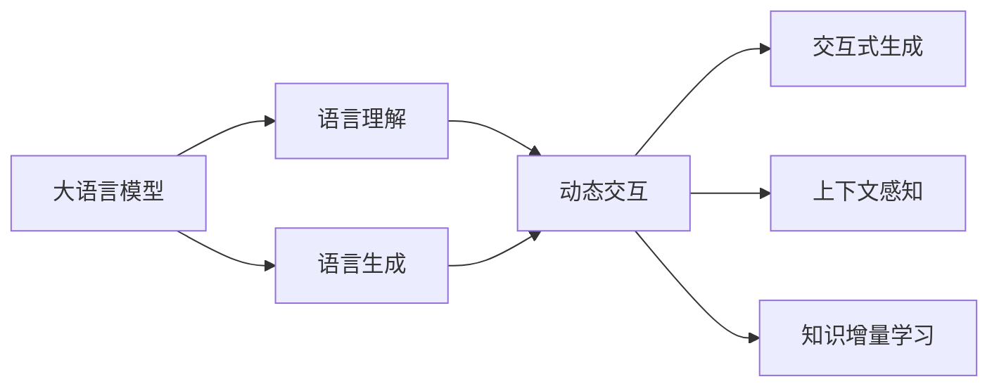

# 大语言模型原理与工程实践：动态交互

## 1. 背景介绍

### 1.1 大语言模型的兴起

近年来,随着深度学习和自然语言处理技术的飞速发展,大语言模型(Large Language Model,LLM)逐渐成为了人工智能领域的研究热点。从2018年谷歌发布的BERT模型,到2019年OpenAI推出的GPT-2模型,再到2020年微软和NVIDIA合作推出的Megatron-LM,大语言模型的规模和性能不断刷新着业界的认知。

### 1.2 大语言模型的应用前景

大语言模型强大的语言理解和生成能力,使其在智能问答、机器翻译、文本摘要、情感分析等诸多自然语言处理任务中取得了突破性的进展。同时,大语言模型也为构建通用人工智能系统奠定了坚实的基础。随着模型规模的不断扩大和训练数据的持续积累,大语言模型有望在未来实现更加智能化、个性化的人机交互。

### 1.3 动态交互的意义

尽管大语言模型已经展现出了惊人的能力,但目前大多数模型仍是以静态方式进行推理和生成,缺乏与用户进行动态交互的能力。引入动态交互机制,让大语言模型能够根据用户的实时反馈动态调整其输出,将极大提升模型的实用性和用户体验。本文将重点探讨如何在大语言模型中实现动态交互,并分享相关的工程实践经验。

## 2. 核心概念与联系

### 2.1 大语言模型的核心概念

- Transformer架构:大语言模型的主流架构,通过Self-Attention机制实现并行计算和长距离依赖捕捉。
- 预训练和微调:先在大规模无标注语料上进行自监督预训练,再在下游任务数据上进行微调。  
- 参数高效性:通过参数共享、稀疏注意力等技术降低模型参数量,提高训练和推理效率。

### 2.2 动态交互的核心概念

- 交互式生成:根据用户的输入和反馈,实时调整模型的生成策略和输出结果。
- 上下文感知:模型能够理解和记忆之前的对话上下文,生成连贯一致的多轮对话。
- 知识增量学习:模型可以在交互过程中不断吸收新知识,扩充自身的知识库。

### 2.3 大语言模型与动态交互的关系



如上图所示,大语言模型的语言理解和生成能力是实现动态交互的基础。通过在大语言模型中引入交互式生成、上下文感知和知识增量学习等机制,可以赋予其动态交互的能力,使其能够更好地适应实际应用场景。

## 3. 核心算法原理与具体操作步骤

### 3.1 交互式生成算法

交互式生成旨在根据用户的输入和反馈,动态调整模型的生成过程。其核心思想是将用户反馈作为额外的输入,引导模型生成符合用户意图的内容。具体操作步骤如下:

1. 模型根据当前对话上下文生成初始回复。
2. 将生成的回复呈现给用户,收集用户的反馈(如评分、修改建议等)。
3. 将用户反馈编码为向量,与模型的隐藏状态进行融合。
4. 基于融合后的隐藏状态,调整模型的生成策略(如Beam Search的得分函数),生成修正后的回复。
5. 重复步骤2-4,直到用户满意或达到预设的交互轮数。

### 3.2 上下文感知算法

上下文感知算法让模型能够理解和记忆之前的对话内容,生成连贯一致的多轮对话。主要有以下两种实现方式:

1. 基于Transformer-XL的上下文感知:
   - 在Transformer的基础上引入Segment-Level Recurrence机制,让模型能够捕捉跨越多个输入片段的长距离依赖。
   - 在推理时,将之前的对话内容作为额外的输入片段,与当前的用户输入一起送入模型。
   - 模型通过Self-Attention机制捕捉对话历史与当前输入之间的依赖关系,生成上下文相关的回复。

2. 基于显式对话状态跟踪的上下文感知:
   - 引入一个外部的对话状态跟踪器,显式地维护对话历史中的关键信息(如用户意图、提及的实体等)。
   - 在生成回复时,将当前的对话状态编码为向量,与模型的输入进行拼接。
   - 模型根据对话状态和用户输入生成回复,同时更新对话状态。

### 3.3 知识增量学习算法

知识增量学习让模型能够在交互过程中不断吸收新知识,扩充自身的知识库。主要有以下两种实现方式:

1. 基于梯度更新的增量学习:
   - 在交互过程中,收集用户反馈中包含的新知识(如新的事实、定义等)。
   - 将新知识组织成训练样本,与模型的原有知识库一起构建增量训练集。
   - 通过梯度下降等优化算法,在增量训练集上对模型进行微调,使其学习新知识。

2. 基于外部知识库的增量学习:
   - 构建一个外部的结构化知识库,用于存储模型在交互过程中获取的新知识。
   - 在生成回复时,模型先从外部知识库中检索与当前对话相关的知识。
   - 将检索到的知识编码为向量,与模型的输入进行融合,指导回复的生成。
   - 在交互过程中,不断更新外部知识库,实现知识的增量学习。

## 4. 数学模型和公式详细讲解举例说明

### 4.1 交互式生成的数学模型

交互式生成可以看作是一个条件语言模型,其目标是最大化生成序列在给定用户反馈下的条件概率:

$$
\hat{y} = \arg\max_y P(y|x,f) = \arg\max_y \prod_{t=1}^T P(y_t|y_{<t},x,f)
$$

其中,$x$表示当前对话上下文,$f$表示用户反馈,$y$表示生成的回复序列,$y_t$表示回复序列中的第$t$个token。

在实际实现中,我们可以将用户反馈$f$编码为一个向量$v_f$,并将其与模型的隐藏状态$h$进行融合:

$$
h' = \tanh(W_h h + W_f v_f + b)
$$

其中,$W_h$和$W_f$是可学习的权重矩阵,$b$是偏置项。融合后的隐藏状态$h'$将用于指导模型的生成过程。

### 4.2 上下文感知的数学模型

以Transformer-XL为例,其核心思想是在Self-Attention计算时引入Segment-Level Recurrence。具体而言,对于第$s$个输入片段的第$t$个位置,其隐藏状态$h_{s,t}$的计算公式为:

$$
\begin{aligned}
\tilde{h}_{s,t} &= \text{SelfAttention}(h_{s,\leq t}, h_{s-1,\leq m}) \\
h_{s,t} &= \text{LayerNorm}(\tilde{h}_{s,t} + \text{FFN}(\tilde{h}_{s,t}))
\end{aligned}
$$

其中,$h_{s,\leq t}$表示第$s$个片段前$t$个位置的隐藏状态,$h_{s-1,\leq m}$表示上一个片段的隐藏状态(即对话历史),$m$是上一个片段的长度。通过这种方式,模型可以捕捉跨片段的长距离依赖,实现对话历史的上下文感知。

### 4.3 知识增量学习的数学模型

以基于梯度更新的增量学习为例,其目标是最小化模型在增量训练集上的损失函数:

$$
\mathcal{L}(\theta) = -\sum_{(x,y)\in \mathcal{D}} \log P(y|x;\theta)
$$

其中,$\mathcal{D}$表示增量训练集,包含原有知识库和新增知识,$(x,y)$表示训练样本,包括输入$x$和目标输出$y$,$\theta$表示模型参数。

通过梯度下降算法,我们可以不断更新模型参数$\theta$,使其在增量训练集上的损失函数最小化:

$$
\theta \leftarrow \theta - \alpha \nabla_\theta \mathcal{L}(\theta)
$$

其中,$\alpha$表示学习率。通过多次迭代优化,模型可以逐步学习新增知识,实现知识的增量学习。

## 5. 项目实践：代码实例和详细解释说明

下面我们通过一个简单的PyTorch代码实例,演示如何实现基于Transformer的交互式生成。

```python
import torch
import torch.nn as nn

class InteractiveTransformer(nn.Module):
    def __init__(self, vocab_size, hidden_size, num_layers, num_heads, max_len):
        super(InteractiveTransformer, self).__init__()
        self.embedding = nn.Embedding(vocab_size, hidden_size)
        self.positional_encoding = PositionalEncoding(hidden_size, max_len)
        self.transformer_layers = nn.ModuleList([
            TransformerLayer(hidden_size, num_heads) for _ in range(num_layers)
        ])
        self.feedback_encoder = nn.Linear(hidden_size, hidden_size)
        self.output_layer = nn.Linear(hidden_size, vocab_size)

    def forward(self, input_ids, feedback_ids):
        # 对输入进行嵌入和位置编码
        input_emb = self.embedding(input_ids)
        input_emb = self.positional_encoding(input_emb)

        # 对用户反馈进行编码
        feedback_emb = self.embedding(feedback_ids)
        feedback_vec = torch.mean(feedback_emb, dim=1)
        feedback_vec = self.feedback_encoder(feedback_vec)

        # 通过Transformer层进行编码
        hidden_states = input_emb
        for layer in self.transformer_layers:
            hidden_states = layer(hidden_states)

        # 融合用户反馈向量
        hidden_states = torch.tanh(hidden_states + feedback_vec.unsqueeze(1))

        # 输出层进行解码
        output_logits = self.output_layer(hidden_states)
        return output_logits
```

在上述代码中,我们定义了一个`InteractiveTransformer`类,实现了基于Transformer的交互式生成。主要包括以下几个部分:

1. 输入嵌入层(`self.embedding`):将输入token ID映射为连续的向量表示。
2. 位置编码层(`self.positional_encoding`):为输入序列添加位置信息。
3. Transformer编码层(`self.transformer_layers`):通过多个Transformer层对输入进行编码。
4. 用户反馈编码层(`self.feedback_encoder`):将用户反馈编码为向量表示。
5. 输出层(`self.output_layer`):将编码后的隐藏状态解码为输出token的概率分布。

在前向传播过程中,模型首先对输入序列进行嵌入和位置编码。然后,对用户反馈进行编码,得到反馈向量。接着,输入序列通过多个Transformer层进行编码。在编码后的隐藏状态中,我们融合用户反馈向量,得到最终的隐藏表示。最后,通过输出层将隐藏表示解码为输出token的概率分布。

通过这种方式,模型可以根据用户的反馈动态调整生成过程,实现交互式生成。在实际应用中,我们还需要设计合适的用户界面和反馈机制,以便收集用户的反馈并将其传递给模型。

## 6. 实际应用场景

大语言模型与动态交互技术的结合,在以下场景中具有广阔的应用前景:

### 6.1 智能客服

- 通过交互式生成,客服系统可以根据用户的问题和反馈,动态生成个性化的回复。
- 利用上下文感知能力,客服系统可以理解多轮对话的上下文,提供连贯一致的服务。
- 通过知识增量学习,客服系统可以不断吸收新的产品信息和服务知识,持续提升服务质