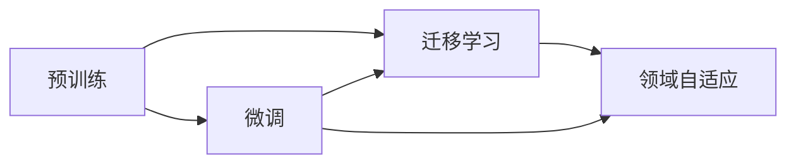

# 大语言模型原理与工程实践：有监督微调的作用与意义

## 1. 背景介绍

### 1.1 大语言模型概述

大语言模型(Large Language Model, LLM)是近年来自然语言处理(Natural Language Processing, NLP)领域的重大突破。它们是在海量文本数据上训练的深度神经网络模型,具有强大的语言理解和生成能力。代表性的大语言模型有GPT系列、BERT、XLNet等。

### 1.2 大语言模型面临的挑战

尽管大语言模型取得了令人瞩目的成就,但它们在实际应用中仍然面临一些挑战:

- 领域适应性:预训练的大语言模型难以直接应用于特定领域,需要进行适应性微调。
- 资源消耗:训练和推理大语言模型需要大量的计算资源和存储空间。  
- 可解释性:大语言模型的决策过程通常是黑盒的,缺乏可解释性。
- 公平性和偏见:模型可能会放大训练数据中的偏见,产生不公平的结果。

### 1.3 有监督微调的作用

针对上述挑战,有监督微调(Supervised Fine-tuning)是一种行之有效的方法。通过在特定任务的标注数据上微调预训练模型,可以显著提升模型在该任务上的性能,同时降低资源消耗。微调还可以引入先验知识,提高模型的可解释性和公平性。

## 2. 核心概念与联系

### 2.1 预训练(Pre-training)

- 定义:在大规模无标注语料上训练通用语言表示的过程。
- 目标:学习语言的一般性特征和规律,捕捉词汇、句法、语义等不同层面的信息。
- 方法:常见的预训练方法有语言模型、去噪自编码、对比学习等。

### 2.2 微调(Fine-tuning)

- 定义:在预训练模型的基础上,使用任务特定的标注数据进一步训练模型的过程。
- 目标:使预训练模型适应特定任务,学习任务相关的知识和技能。
- 方法:常见的微调方法有特定任务输出层替换、参数冻结/解冻等。

### 2.3 迁移学习(Transfer Learning)

- 定义:将在源任务上学到的知识迁移到目标任务,提高目标任务的性能。
- 与微调的关系:微调是迁移学习的一种常见形式,通过微调实现知识的迁移。

### 2.4 领域自适应(Domain Adaptation) 

- 定义:使模型适应不同领域数据分布的过程,提高模型的泛化能力。
- 与微调的关系:微调可以看作是一种有监督的领域自适应方法。

### 2.5 概念之间的联系

下图展示了预训练、微调、迁移学习和领域自适应之间的关系:



预训练是基础,微调和迁移学习在此基础上进一步提升模型性能,领域自适应则着眼于提高模型的泛化能力。它们相互依存、密切关联,共同推动了大语言模型的发展和应用。

## 3. 核心算法原理具体操作步骤

### 3.1 预训练算法

#### 3.1.1 语言模型预训练

- 步骤1:构建大规模无标注语料库
- 步骤2:定义语言模型的目标函数,如最大化句子概率
- 步骤3:选择合适的神经网络架构,如Transformer
- 步骤4:在语料库上训练语言模型,优化目标函数
- 步骤5:保存预训练的语言模型参数

#### 3.1.2 去噪自编码预训练

- 步骤1:构建大规模无标注语料库
- 步骤2:定义编码器-解码器架构和重建目标函数
- 步骤3:对输入文本进行随机噪声扰动,如随机遮挡、置换等  
- 步骤4:训练编码器-解码器模型以重建原始文本
- 步骤5:保存预训练的编码器参数

### 3.2 微调算法

#### 3.2.1 特定任务输出层替换

- 步骤1:加载预训练模型参数
- 步骤2:移除原有输出层,根据任务设置新的输出层  
- 步骤3:使用任务标注数据训练新的输出层,同时微调预训练参数
- 步骤4:评估微调后模型在任务验证集上的性能
- 步骤5:根据性能调整超参数,如学习率、批大小等,重复步骤3-4

#### 3.2.2 参数冻结/解冻微调

- 步骤1:加载预训练模型参数  
- 步骤2:根据任务设置新的输出层
- 步骤3:冻结预训练模型的部分参数,如底层的embedding层
- 步骤4:使用任务标注数据训练可训练参数,如顶层的Transformer block
- 步骤5:逐步解冻更多的预训练参数,重复训练过程
- 步骤6:评估微调后模型在任务验证集上的性能

## 4. 数学模型和公式详细讲解举例说明

### 4.1 语言模型的概率公式

给定一个句子 $s=(w_1,w_2,...,w_n)$,语言模型的目标是估计该句子的概率 $P(s)$。根据链式法则,可以将联合概率分解为一系列条件概率的乘积:

$$P(s)=P(w_1,w_2,...,w_n)=\prod_{i=1}^n P(w_i|w_1,w_2,...,w_{i-1})$$

其中 $P(w_i|w_1,w_2,...,w_{i-1})$ 表示在给定前 $i-1$ 个词的条件下,第 $i$ 个词为 $w_i$ 的条件概率。语言模型的任务就是学习估计这些条件概率。

### 4.2 Transformer 的注意力机制

Transformer 是一种基于自注意力机制的神经网络架构,广泛用于大语言模型的预训练和微调。其核心是计算 query $Q$, key $K$, value $V$ 三者之间的注意力权重:

$$Attention(Q,K,V)=softmax(\frac{QK^T}{\sqrt{d_k}})V$$

其中 $d_k$ 是 key 向量的维度,用于缩放点积结果,避免 softmax 函数的梯度消失。注意力权重决定了不同位置之间的依赖关系,使 Transformer 能够捕捉长距离依赖。

### 4.3 微调的损失函数

假设微调的任务是文本分类,类别集合为 $C={c_1,c_2,...,c_m}$。给定一个输入句子 $s$,模型的输出是一个 $m$ 维的概率分布 $\hat{y}=f(s;\theta)$,其中 $\theta$ 表示模型参数。真实标签为 one-hot 向量 $y\in\{0,1\}^m$。微调的损失函数通常选择交叉熵:

$$L(\theta)=-\sum_{i=1}^m y_i \log(\hat{y}_i)$$

通过最小化损失函数,模型学习将输入句子映射到正确的类别概率分布。

## 5. 项目实践：代码实例和详细解释说明

下面是一个使用 PyTorch 和 Hugging Face 库进行文本分类微调的示例代码:

```python
from transformers import AutoTokenizer, AutoModelForSequenceClassification, TrainingArguments, Trainer
from datasets import load_dataset

# 加载预训练模型和分词器
model_name = "bert-base-uncased"
tokenizer = AutoTokenizer.from_pretrained(model_name)
model = AutoModelForSequenceClassification.from_pretrained(model_name, num_labels=2)

# 加载数据集
dataset = load_dataset("glue", "mrpc")

# 定义数据预处理函数
def preprocess_function(examples):
    return tokenizer(examples["sentence1"], examples["sentence2"], truncation=True, padding=True)

# 应用预处理函数
encoded_dataset = dataset.map(preprocess_function, batched=True)

# 定义训练参数
training_args = TrainingArguments(
    output_dir="./results",
    evaluation_strategy="epoch",
    learning_rate=2e-5,
    per_device_train_batch_size=16,
    per_device_eval_batch_size=16,
    num_train_epochs=3,
)

# 定义 Trainer 对象
trainer = Trainer(
    model=model,
    args=training_args,
    train_dataset=encoded_dataset["train"],
    eval_dataset=encoded_dataset["validation"],
)

# 开始训练
trainer.train()
```

代码解释:

1. 加载预训练模型(`bert-base-uncased`)和对应的分词器。
2. 加载 MRPC 数据集,它是一个句子对二分类任务。 
3. 定义数据预处理函数,使用分词器对句子对进行编码。
4. 对数据集应用预处理函数,生成模型可接受的输入格式。
5. 定义训练参数,如优化器的学习率、每个设备的批大小、训练轮数等。
6. 定义 Trainer 对象,传入模型、训练参数、训练集和验证集等。
7. 调用 `trainer.train()` 开始微调过程,模型会在每个 epoch 结束后在验证集上进行评估。

微调完成后,可以使用 `trainer.evaluate()` 在测试集上评估模型性能,或使用 `trainer.predict()` 对新的句子对进行预测。

## 6. 实际应用场景

有监督微调在各种自然语言处理任务中得到了广泛应用,显著提升了模型性能。一些典型的应用场景包括:

### 6.1 文本分类

微调预训练模型用于情感分析、主题分类、意图识别等分类任务。如使用 BERT 微调进行 IMDB 电影评论的情感极性分类,准确率可达 95% 以上。

### 6.2 命名实体识别

在预训练模型的基础上微调,可以有效识别文本中的人名、地名、机构名等命名实体。如使用 RoBERTa 微调进行 CoNLL-2003 命名实体识别任务,F1 值可达 93% 以上。

### 6.3 问答系统

微调后的预训练模型可以用于构建问答系统,根据给定的问题和上下文生成答案。如在 SQuAD 数据集上微调 ALBERT 模型,F1 值可达 92% 以上。  

### 6.4 机器翻译

将预训练的语言模型如 BART 微调用于机器翻译任务,可以显著提高翻译质量。如在 WMT14 英德翻译任务上,微调后的 BART 模型 BLEU 值可达 39.9。

### 6.5 文本摘要

基于预训练语言模型的微调方法可以生成高质量的摘要。如在 CNN/Daily Mail 数据集上微调 PEGASUS 模型,ROUGE-1 值可达 44.17。

## 7. 工具和资源推荐

以下是一些常用的大语言模型微调工具和资源:

- Hugging Face Transformers:提供了大量预训练模型和便捷的微调API
- PyTorch Lightning:简化了深度学习模型的训练流程,可与 Transformers 库无缝集成  
- FastAI:提供了高级API,使用Transformer等模型进行文本分类等任务的微调
- TensorFlow Hub:提供了多种预训练的 TensorFlow 模型,可用于微调
- Google BERT:Google 发布的预训练 BERT 模型,包括多种语言版本
- SpanBERT:针对span提取任务优化的预训练模型,可用于命名实体识别等
- ALBERT:参数共享和嵌入分解技术压缩的 BERT 模型,在多个任务上达到SOTA

## 8. 总结：未来发展趋势与挑战

有监督微调是大语言模型实际应用的重要手段,极大地促进了自然语言处理技术的进步。展望未来,微调技术还有以下发展趋势和挑战:

### 8.1 参数高效微调

随着预训练模型规模不断增大,微调的参数量和计算开销也在增加。因此,亟需设计参数高效的微调算法,如 Adapter、Prefix Tuning 等,在保证性能的同时降低资源消耗。

### 8.2 低资源微调

现有的微调方法通常需要大量标注数据才能达到理想的性能。如何在少量标注数据的