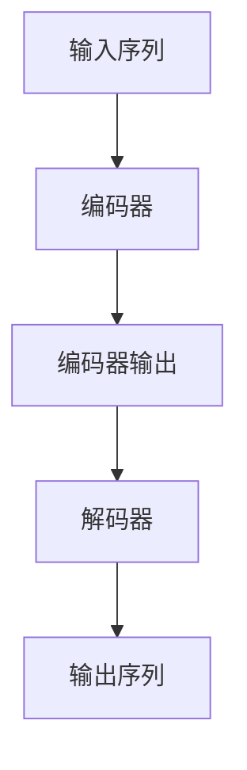

# 大语言模型原理基础与前沿 环境影响

## 1. 背景介绍

### 1.1 人工智能的发展历程

人工智能(Artificial Intelligence, AI)是当代科技发展的重要领域,其起源可以追溯到20世纪40年代。在过去的几十年里,AI技术取得了长足的进步,逐渐渗透到我们生活的方方面面。

### 1.2 大语言模型的兴起

近年来,benefiting from大量数据、强大的计算能力和创新的机器学习算法,大语言模型(Large Language Model, LLM)成为AI领域的一股重要力量。大语言模型通过对海量文本数据进行训练,学习语言的语义和语法规则,从而获得对自然语言的深入理解和生成能力。

### 1.3 大语言模型的影响

大语言模型在自然语言处理、内容生成、问答系统等领域展现出了卓越的性能,为人类的工作和生活带来了诸多便利。然而,大语言模型的发展也引发了一些值得关注的问题和挑战,如隐私保护、算法公平性、环境影响等,需要我们进一步探讨和应对。

## 2. 核心概念与联系

### 2.1 大语言模型的核心概念

大语言模型的核心概念包括:

- **自然语言处理(Natural Language Processing, NLP)**: 指让计算机能够理解和生成人类语言的技术。
- **语言模型(Language Model)**: 用于捕捉语言的统计规律,预测下一个词或字符出现的概率。
- **预训练(Pre-training)**: 在大规模文本数据上对模型进行初始训练,获得通用的语言理解能力。
- **微调(Fine-tuning)**: 在特定任务数据上对预训练模型进行进一步调整,使其适应具体的应用场景。
- **注意力机制(Attention Mechanism)**: 一种神经网络架构,能够自动学习输入序列中不同位置的重要性权重。
- **transformer**: 一种基于注意力机制的序列到序列模型,是大语言模型的核心架构。

### 2.2 大语言模型与其他AI技术的联系

大语言模型与其他AI技术存在紧密的联系:

- **机器学习**: 大语言模型本质上是一种基于深度学习的机器学习模型。
- **计算机视觉**: 视觉语言模型结合了计算机视觉和自然语言处理技术。
- **知识图谱**: 知识图谱可以为大语言模型提供结构化的知识补充。
- **人工智能伦理**: 大语言模型的发展需要考虑伦理、隐私等方面的问题。

## 3. 核心算法原理具体操作步骤 

### 3.1 transformer架构

transformer是大语言模型的核心架构,主要由编码器(encoder)和解码器(decoder)两部分组成。编码器将输入序列编码为向量表示,解码器则根据编码器的输出生成目标序列。



### 3.2 自注意力机制

自注意力机制是transformer的关键部分,它允许模型在计算目标位置的表示时,关注输入序列中所有位置的信息。

具体操作步骤如下:

1. 计算查询(Query)、键(Key)和值(Value)向量。
2. 计算查询与所有键的点积,得到注意力分数。
3. 对注意力分数进行缩放和softmax操作,得到注意力权重。
4. 将注意力权重与值向量相乘,得到加权和作为目标位置的表示。

$$\text{Attention}(Q, K, V) = \text{softmax}(\frac{QK^T}{\sqrt{d_k}})V$$

其中$Q$为查询向量,$K$为键向量,$V$为值向量,$d_k$为缩放因子。

### 3.3 预训练和微调

大语言模型通常采用两阶段训练策略:

1. **预训练(Pre-training)**:在大规模无标注文本数据上训练模型,获得通用的语言理解能力。常用的预训练目标包括:
   - 掩码语言模型(Masked Language Model)
   - 下一句预测(Next Sentence Prediction)
   - 序列到序列预训练(Sequence-to-Sequence Pre-training)

2. **微调(Fine-tuning)**:在特定任务的标注数据上,对预训练模型进行进一步调整和优化,使其适应具体的应用场景。

## 4. 数学模型和公式详细讲解举例说明

### 4.1 语言模型的数学表示

语言模型旨在计算一个序列的概率$P(x_1, x_2, \dots, x_n)$,通常基于链式法则将其分解为条件概率的乘积:

$$P(x_1, x_2, \dots, x_n) = \prod_{t=1}^n P(x_t | x_1, \dots, x_{t-1})$$

其中$x_t$表示第$t$个词或字符。

### 4.2 transformer中的注意力计算

在transformer的自注意力机制中,注意力分数的计算公式为:

$$\text{Attention}(Q, K, V) = \text{softmax}(\frac{QK^T}{\sqrt{d_k}})V$$

- $Q$为查询向量,表示当前位置需要关注的信息。
- $K$为键向量,表示其他位置的信息。
- $V$为值向量,表示其他位置的实际值。
- $d_k$为缩放因子,用于防止点积过大导致梯度饱和。

softmax函数用于将注意力分数转化为概率分布,确保所有权重之和为1。

### 4.3 交叉熵损失函数

在语言模型的训练过程中,常用的损失函数是交叉熵损失(Cross-Entropy Loss),它衡量了模型预测的概率分布与真实分布之间的差异。

对于一个长度为$n$的序列,交叉熵损失可表示为:

$$\mathcal{L} = -\frac{1}{n}\sum_{t=1}^n \log P(x_t | x_1, \dots, x_{t-1})$$

其中$P(x_t | x_1, \dots, x_{t-1})$为模型预测的第$t$个词或字符的条件概率。

训练目标是最小化这个损失函数,使模型的预测尽可能接近真实分布。

## 5. 项目实践: 代码实例和详细解释说明

以下是一个使用PyTorch实现transformer模型的简化示例,用于机器翻译任务。

```python
import torch
import torch.nn as nn

# 定义transformer模型
class TransformerModel(nn.Module):
    def __init__(self, src_vocab_size, tgt_vocab_size, d_model, nhead, num_layers):
        super(TransformerModel, self).__init__()
        self.encoder = nn.Transformer(d_model, nhead, num_layers)
        self.decoder = nn.Transformer(d_model, nhead, num_layers)
        self.src_embedding = nn.Embedding(src_vocab_size, d_model)
        self.tgt_embedding = nn.Embedding(tgt_vocab_size, d_model)
        self.out = nn.Linear(d_model, tgt_vocab_size)

    def forward(self, src, tgt, src_mask=None, tgt_mask=None):
        src_emb = self.src_embedding(src)
        tgt_emb = self.tgt_embedding(tgt)
        memory = self.encoder(src_emb, mask=src_mask)
        output = self.decoder(tgt_emb, memory, tgt_mask=tgt_mask)
        return self.out(output)

# 准备数据
src_vocab_size = 10000  # 源语言词汇量
tgt_vocab_size = 8000   # 目标语言词汇量
d_model = 512           # embedding维度
nhead = 8               # 注意力头数
num_layers = 6          # transformer层数

# 实例化模型
model = TransformerModel(src_vocab_size, tgt_vocab_size, d_model, nhead, num_layers)

# 模拟输入数据
src = torch.randint(0, src_vocab_size, (32, 60))  # 批量大小为32,序列长度为60
tgt = torch.randint(0, tgt_vocab_size, (32, 50))  # 批量大小为32,序列长度为50

# 前向传播
output = model(src, tgt)
```

这个示例定义了一个简化版的transformer模型,包括编码器(encoder)和解码器(decoder)两部分。

1. 首先,通过`nn.Embedding`层将源语言和目标语言的词汇映射到embedding向量。
2. 将源语言序列输入编码器,获得编码后的memory表示。
3. 将目标语言序列和编码器的输出作为解码器的输入,进行解码操作。
4. 最后,通过一个线性层将解码器的输出映射到目标语言的词汇空间,得到预测的概率分布。

在实际应用中,还需要添加掩码(mask)机制、位置编码(positional encoding)等组件,并对模型进行训练和优化。

## 6. 实际应用场景

大语言模型在自然语言处理领域有广泛的应用场景,包括但不限于:

### 6.1 机器翻译

利用大语言模型的强大语言生成能力,可以实现高质量的机器翻译系统。例如,谷歌的神经机器翻译系统就是基于transformer架构的大语言模型。

### 6.2 文本生成

大语言模型可以生成流畅、连贯的文本内容,如新闻报道、小说故事、广告文案等。OpenAI的GPT系列模型就是著名的文本生成模型。

### 6.3 问答系统

通过预训练和微调,大语言模型可以理解自然语言问题,从知识库中检索相关信息并生成答案。例如,谷歌的LaMBDA模型就是一个强大的问答系统。

### 6.4 代码生成

大语言模型不仅可以处理自然语言,还可以应用于代码生成领域。例如,OpenAI的Codex模型可以根据自然语言描述生成对应的代码。

### 6.5 语音识别和合成

将大语言模型与语音技术相结合,可以实现高精度的语音识别和自然语音合成系统。

### 6.6 知识提取和推理

大语言模型可以从大量文本数据中提取知识,并进行推理和知识reasoning。这为构建智能知识库系统奠定了基础。

## 7. 工具和资源推荐

在大语言模型的研究和应用过程中,有许多优秀的工具和资源可以使用:

### 7.1 开源模型

- **BERT**: 谷歌开源的预训练语言模型,在多项NLP任务上表现出色。
- **GPT-3**: OpenAI开发的大型语言模型,具有强大的文本生成能力。
- **T5**: 谷歌开源的统一文本到文本转换框架,支持多种NLP任务。
- **BLOOM**: 由斯坦福和谷歌合作开发的大型语言模型,支持多种语言。

### 7.2 模型训练和优化工具

- **Hugging Face Transformers**: 提供了大量预训练模型和用于训练和微调的工具。
- **AllenNLP**: 一个强大的NLP研究平台,包含多种模型和数据集。
- **PyTorch Lightning**: 简化PyTorch模型的训练和优化过程。

### 7.3 数据集和基准测试

- **GLUE**: 通用语言理解评估基准,包含多种NLP任务的数据集。
- **SuperGLUE**: 更具挑战性的语言理解基准测试集。
- **SQuAD**: 阅读理解数据集,用于问答系统的评估。

### 7.4 在线演示和API

- **GPT-3 Playground**: OpenAI提供的GPT-3在线演示平台。
- **Hugging Face Spaces**: 展示基于Hugging Face模型的各种应用。
- **Google Cloud Natural Language API**: 谷歌云提供的自然语言处理API服务。

## 8. 总结: 未来发展趋势与挑战

### 8.1 模型规模持续增长

未来,大语言模型的规模将继续扩大,参数量和训练数据量将进一步增长。这将提高模型的性能,但也带来更高的计算和存储成本。

### 8.2 多模态融合

将视觉、语音等其他模态信息与大语言模型相结合,形成多模态模型,是未来的一个重要发展方向。这将使AI系统具备更全面的理解和生成能力。

### 8.3 知识增强

通过知识图谱、外部知识库等方式,为大语言模型注入结构化的知识,提高其