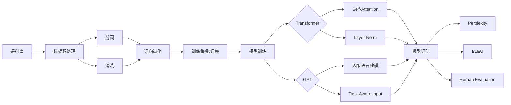

# 大语言模型应用指南：ChatEval

## 1. 背景介绍
### 1.1 大语言模型的兴起
### 1.2 ChatEval的诞生
### 1.3 ChatEval的意义和价值

## 2. 核心概念与联系
### 2.1 大语言模型
#### 2.1.1 定义和特点
#### 2.1.2 训练方法和数据集
#### 2.1.3 主流的大语言模型
### 2.2 ChatEval
#### 2.2.1 ChatEval的定位和目标
#### 2.2.2 ChatEval的评估维度和指标
#### 2.2.3 ChatEval的技术架构

## 3. 核心算法原理具体操作步骤
### 3.1 数据预处理
#### 3.1.1 语料库的选择和清洗
#### 3.1.2 分词和词向量化
#### 3.1.3 构建训练集和验证集
### 3.2 模型训练
#### 3.2.1 模型结构设计
#### 3.2.2 损失函数和优化器选择
#### 3.2.3 超参数调优
### 3.3 模型评估
#### 3.3.1 perplexity指标
#### 3.3.2 human evaluation
#### 3.3.3 自动化评估指标

## 4. 数学模型和公式详细讲解举例说明
### 4.1 Transformer模型
#### 4.1.1 self-attention机制
$Attention(Q,K,V) = softmax(\frac{QK^T}{\sqrt{d_k}})V$
#### 4.1.2 位置编码
$PE_{(pos,2i)} = sin(pos/10000^{2i/d_{model}})$
$PE_{(pos,2i+1)} = cos(pos/10000^{2i/d_{model}})$
#### 4.1.3 Layer Normalization
$\mu = \frac{1}{H}\sum_{i=1}^{H}a_i$
$\sigma = \sqrt{\frac{1}{H}\sum_{i=1}^{H}(a_i-\mu)^2}$
$y = \frac{g}{\sigma}(x-\mu)+b$
### 4.2 GPT模型
#### 4.2.1 因果语言建模
$L_1(U) = \sum_{i} \log P(u_i|u_{i-k},...,u_{i-1};\Theta)$
#### 4.2.2 Task-Aware Input Transformations
$h_0 = UW_e + W_p$
$P(y|x^1,...,x^m) = softmax(h_lW_y)$
### 4.3 评估指标
#### 4.3.1 Perplexity
$PPL(W) = P(w_1w_2...w_N)^{-\frac{1}{N}} = \sqrt[N]{\frac{1}{P(w_1w_2...w_N)}}$
#### 4.3.2 BLEU
$p_n = \frac{\sum_{C\in\{Candidates\}} \sum_{n-gram \in C} Count_{clip}(n-gram)}{\sum_{C'\in\{Candidates\}} \sum_{n-gram' \in C'} Count(n-gram')}$
$BLEU = BP \cdot exp(\sum_{n=1}^N w_n \log p_n)$

## 5. 项目实践：代码实例和详细解释说明
### 5.1 数据预处理
```python
import re
import jieba

def clean_text(text):
    text = re.sub(r"[^\u4e00-\u9fa5A-Za-z0-9]", "", text)
    text = jieba.lcut(text)
    return text

corpus = [
    "ChatEval是一个开源的对话系统评估平台",
    "它支持多种评估维度和指标",
    "包括human evaluation和自动化指标"
]

corpus = [clean_text(text) for text in corpus]
```
这段代码使用正则表达式去除了文本中的非中英文和数字字符，然后用jieba分词库对中文文本进行了分词处理，最终得到干净的语料库用于后续的训练。

### 5.2 模型训练
```python
import torch
import torch.nn as nn
from transformers import GPT2LMHeadModel, GPT2Tokenizer

tokenizer = GPT2Tokenizer.from_pretrained('gpt2')
model = GPT2LMHeadModel.from_pretrained('gpt2')

optimizer = torch.optim.Adam(model.parameters(), lr=1e-5)
loss_fn = nn.CrossEntropyLoss()

for epoch in range(num_epochs):
    for batch in data_loader:
        inputs = tokenizer(batch, return_tensors='pt', padding=True)
        outputs = model(**inputs, labels=inputs['input_ids'])
        loss = outputs[0]
        
        optimizer.zero_grad()
        loss.backward()
        optimizer.step()
```
这里使用了HuggingFace的transformers库中的GPT2模型和分词器，通过Adam优化器和交叉熵损失函数来训练模型。每个epoch遍历数据集，将一个batch的文本输入到模型中计算loss，然后反向传播更新参数，不断优化模型。

### 5.3 模型评估
```python
from evaluate import load

perplexity = load("perplexity", module_type="metric")
bleu = load("bleu", module_type="metric")

def evaluate(model, eval_data):
    ppl_scores = []
    bleu_scores = []
    
    for text, ref in eval_data:
        input_ids = tokenizer.encode(text, return_tensors='pt')
        with torch.no_grad():
            outputs = model.generate(input_ids)
        gen_text = tokenizer.decode(outputs[0])
        
        ppl = perplexity.compute(predictions=[gen_text], references=[text])
        ppl_scores.append(ppl)
        
        bleu_score = bleu.compute(predictions=[gen_text], references=[[ref]])
        bleu_scores.append(bleu_score)
        
    print(f"Perplexity: {sum(ppl_scores)/len(ppl_scores):.2f}")  
    print(f"BLEU: {sum(bleu_scores)/len(bleu_scores):.4f}")
    
evaluate(model, eval_data)
```
使用HuggingFace的evaluate库来计算perplexity和BLEU指标。对于评估集中的每个文本，用训练好的模型生成对应的输出文本，然后计算其与原文的perplexity和与参考答案的BLEU值，最后取平均得到整体的评估指标。

## 6. 实际应用场景
### 6.1 智能客服
### 6.2 虚拟助手
### 6.3 智能写作助手
### 6.4 智能教育

## 7. 工具和资源推荐
### 7.1 开源工具包
- HuggingFace Transformers
- Fairseq
- OpenAI GPT-3 API
### 7.2 开放数据集
- OpenWebText Corpus
- Reddit Comments Dataset
- Wikipedia Dataset
### 7.3 评估平台
- ChatEval
- GLUE Benchmark
- SuperGLUE Benchmark

## 8. 总结：未来发展趋势与挑战
### 8.1 大语言模型的发展趋势
#### 8.1.1 参数规模将进一步增大
#### 8.1.2 多模态预训练成为主流
#### 8.1.3 模型效率和性能不断提升
### 8.2 ChatEval的未来规划
#### 8.2.1 扩展评估任务和数据集
#### 8.2.2 引入更多评估指标
#### 8.2.3 优化评估流程和用户体验
### 8.3 挑战和展望
#### 8.3.1 缓解偏见和安全隐患
#### 8.3.2 提高小样本学习能力
#### 8.3.3 探索更通用的人工智能

## 9. 附录：常见问题与解答
### 9.1 如何选择合适的预训练模型？
### 9.2 评估指标PPL和BLEU分别衡量了什么？
### 9.3 ChatEval支持哪些对话任务的评估？
### 9.4 如何提高生成文本的多样性？
### 9.5 大语言模型的潜在风险有哪些？



大语言模型的崛起为自然语言处理领域带来了革命性的变化。ChatEval作为一个专门的对话系统评估平台应运而生，为研究者和开发者提供了一个全面、规范、高效的评测工具。本文从ChatEval的技术架构入手，重点介绍了其中的核心概念、算法原理、评估指标以及实践案例。

在算法原理部分，我们详细讲解了Transformer和GPT等主流语言模型的内部结构和数学原理，并给出了attention、位置编码、层归一化等关键技术的公式推导。在评估指标部分，我们重点分析了perplexity和BLEU的计算方法和适用场景。同时，我们还提供了一些实际的代码示例，演示了如何使用现有的开源工具包来快速搭建和评估对话系统。

展望未来，大语言模型的参数规模将进一步扩大，多模态预训练也将成为主流趋势。与此同时，我们还需要关注模型的效率、偏见、安全等问题。ChatEval作为对话系统评估的重要平台，也将不断扩展评估任务、引入更多指标、优化用户体验，为推动人工智能的健康发展贡献力量。

作者：禅与计算机程序设计艺术 / Zen and the Art of Computer Programming