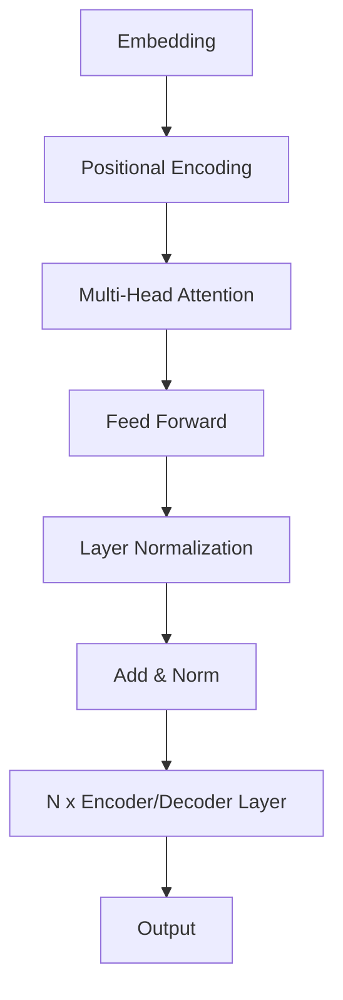

# 大语言模型应用指南：什么是机器学习

## 1. 背景介绍

### 1.1 人工智能的崛起

人工智能(Artificial Intelligence, AI)作为一个研究领域,已经存在了几十年。近年来,随着计算能力的飞速提升、海量数据的积累以及机器学习算法的不断优化,人工智能取得了长足的进步,并在多个领域展现出超乎想象的能力。从无人驾驶、语音识别到医疗诊断,人工智能系统正在彻底改变着我们的生活方式。

### 1.2 机器学习的核心地位

在人工智能的多个分支中,机器学习(Machine Learning)扮演着核心角色。它赋予计算机以学习的能力,使之可以从海量数据中自动分析规律,并对未知数据做出准确预测。机器学习已广泛应用于计算机视觉、自然语言处理、推荐系统等诸多领域,为人工智能的发展贡献了强大的算法引擎。

### 1.3 大语言模型的兴起

近年来,以GPT(Generative Pre-trained Transformer)为代表的大语言模型取得了突破性进展,展现出令人惊叹的自然语言理解和生成能力。这些模型通过在海量文本数据上预训练,掌握了丰富的语言知识,可以完成翻译、问答、文本续写等复杂任务。大语言模型的出现,标志着机器学习在自然语言处理领域取得了重大突破,为人工智能的发展开辟了新的视野。

## 2. 核心概念与联系

### 2.1 机器学习的定义

机器学习是一门研究如何从数据中学习的科学,它赋予了计算机在没有明确程序的情况下,通过利用数据或经验自动分析并获取规律的能力。

机器学习算法的工作原理可以概括为:

1. 收集数据集
2. 从数据集中提取特征
3. 训练机器学习模型
4. 对新数据进行预测或决策

### 2.2 监督学习与非监督学习

根据训练数据的性质,机器学习可分为监督学习(Supervised Learning)和非监督学习(Unsupervised Learning)两大类。

- 监督学习: 利用带有标签的训练数据集,学习将输入映射到期望输出的规律。典型任务包括分类、回归等。
- 非监督学习: 仅利用未标注的训练数据集,自动发现数据内在的模式和规律。典型任务包括聚类、降维等。

### 2.3 大语言模型的本质

大语言模型本质上是一种基于自然语言的监督学习模型。它们通过在大规模文本语料库上预训练,学习语言的语义和语法规则,从而获得强大的语言理解和生成能力。

大语言模型的核心是基于Transformer的序列到序列(Seq2Seq)模型架构,通过Self-Attention机制捕捉长距离依赖关系,实现对上下文的高效建模。

### 2.4 机器学习与大语言模型的关系

大语言模型是机器学习在自然语言处理领域的杰出应用,它们利用了机器学习的核心思想和方法,同时也推动了机器学习算法和模型的创新发展。

机器学习为大语言模型提供了理论基础和算法支持,而大语言模型则为机器学习开辟了新的应用场景,促进了算法和模型的优化与创新。二者相辅相成,共同推动着人工智能的发展进程。

## 3. 核心算法原理具体操作步骤

### 3.1 Transformer模型架构

Transformer是大语言模型的核心架构,它完全基于Attention机制,摒弃了传统的RNN和CNN结构。Transformer的主要组成部分包括:

1. **Embedding层**: 将输入序列(如单词或子词)映射为向量表示。
2. **Positional Encoding**: 引入位置信息,使模型能够捕捉序列的顺序关系。
3. **Multi-Head Attention**: 通过多个注意力头并行计算,捕捉不同表示子空间的依赖关系。
4. **Feed Forward层**: 对每个位置的表示进行非线性变换,提供更强的建模能力。
5. **Layer Normalization**: 加速训练收敛,提高模型性能。

Transformer模型通过堆叠多个编码器(Encoder)或解码器(Decoder)层,形成深度网络结构,实现对输入序列的高效编码和输出序列的生成。



### 3.2 Self-Attention机制

Self-Attention是Transformer模型的核心机制,它通过计算查询(Query)、键(Key)和值(Value)之间的相似性,捕捉序列中任意两个位置之间的依赖关系。

对于序列中的每个位置,Self-Attention计算步骤如下:

1. 将位置embedding分别线性映射为查询Q、键K和值V。
2. 计算Q和K的点积,得到注意力分数矩阵。
3. 对注意力分数矩阵进行缩放和软最大化,得到注意力权重矩阵。
4. 将注意力权重矩阵与V相乘,得到加权和表示。

通过Self-Attention,模型可以自适应地为每个位置分配注意力权重,聚焦于与当前位置相关的其他位置,从而实现对长距离依赖关系的建模。

### 3.3 预训练与微调

大语言模型通常采用两阶段训练策略:预训练(Pre-training)和微调(Fine-tuning)。

1. **预训练阶段**:
    - 在大规模无标注文本语料库上训练模型,目标是学习通用的语言表示。
    - 常用的预训练目标包括掩码语言模型(Masked Language Modeling)和下一句预测(Next Sentence Prediction)等。

2. **微调阶段**:
    - 在特定的下游任务数据集上,对预训练模型进行微调。
    - 根据任务目标设计相应的损失函数,对模型进行进一步训练。
    - 微调阶段通常只需少量标注数据和较少的训练时间,即可获得良好的性能。

预训练和微调的两阶段策略,使得大语言模型可以在通用语料库上学习通用知识,再转移到特定任务上,实现了知识的高效迁移和模型的快速适应。

## 4. 数学模型和公式详细讲解举例说明

### 4.1 Attention计算公式

Self-Attention是Transformer模型的核心机制,其数学计算公式如下:

对于序列中的第i个位置,其Attention计算过程为:

$$
\begin{aligned}
Q_i &= X_iW^Q \\
K_i &= X_iW^K \\
V_i &= X_iW^V \\
\text{Attention}(Q_i, K, V) &= \text{softmax}\left(\frac{Q_iK^T}{\sqrt{d_k}}\right)V
\end{aligned}
$$

其中:

- $X_i$是序列中第i个位置的embedding向量
- $W^Q, W^K, W^V$分别是查询、键和值的线性变换矩阵
- $d_k$是缩放因子,用于防止点积过大导致梯度消失
- $\text{softmax}$函数对每一行的注意力分数进行归一化,得到注意力权重

Multi-Head Attention通过并行计算多个注意力头,可以关注不同的表示子空间,公式如下:

$$
\begin{aligned}
\text{MultiHead}(Q, K, V) &= \text{Concat}(head_1, \dots, head_h)W^O\\
\text{where } head_i &= \text{Attention}(QW_i^Q, KW_i^K, VW_i^V)
\end{aligned}
$$

其中$W_i^Q, W_i^K, W_i^V$是第i个注意力头的线性变换矩阵,$W^O$是最终的线性变换矩阵。

通过Self-Attention机制,Transformer模型可以自适应地为每个位置分配注意力权重,聚焦于与当前位置相关的其他位置,从而实现对长距离依赖关系的高效建模。

### 4.2 掩码语言模型目标函数

掩码语言模型(Masked Language Modeling, MLM)是大语言模型预训练的常用目标之一。其目标是根据上下文,预测被掩码的词元(token)。

设输入序列为$X = (x_1, x_2, \dots, x_n)$,其中某些词元被随机掩码,记为$\tilde{X}$。模型的目标是最大化掩码位置的条件概率:

$$
\mathcal{L}_\text{MLM} = \mathbb{E}_{X}\left[\sum_{i=1}^n \mathbb{1}_{x_i\text{ is masked}} \log P(x_i|\tilde{X})\right]
$$

其中$P(x_i|\tilde{X})$是模型预测的第i个位置为$x_i$的条件概率。

通过最大化该目标函数,模型可以学习到捕捉上下文语义的能力,从而实现对被掩码词元的准确预测。

## 5. 项目实践:代码实例和详细解释说明

以下是一个使用Hugging Face的Transformers库实现BERT模型微调的Python代码示例:

```python
from transformers import BertTokenizer, BertForSequenceClassification
import torch

# 加载预训练模型和分词器
model_name = "bert-base-uncased"
tokenizer = BertTokenizer.from_pretrained(model_name)
model = BertForSequenceClassification.from_pretrained(model_name)

# 示例输入数据
text = "This is a great movie!"
input_ids = tokenizer.encode(text, return_tensors="pt")

# 获取模型输出
output = model(input_ids)
logits = output.logits

# 对输出进行后处理(如softmax)
probabilities = torch.softmax(logits, dim=-1)
predicted_class = torch.argmax(probabilities, dim=-1)

print(f"Input text: {text}")
print(f"Predicted class: {predicted_class.item()}")
```

代码解释:

1. 首先导入必要的模块,包括`BertTokenizer`用于文本分词,`BertForSequenceClassification`用于序列分类任务。

2. 使用`from_pretrained`方法加载预训练的BERT模型和分词器。

3. 定义示例输入文本`"This is a great movie!"`并使用分词器将其转换为模型可接受的输入张量`input_ids`。

4. 将`input_ids`输入到模型中,获取模型输出`logits`。

5. 对`logits`进行softmax操作,得到每个类别的概率分布`probabilities`。

6. 使用`torch.argmax`获取概率最大的类别索引`predicted_class`。

7. 打印输入文本和预测的类别索引。

注意,这只是一个简单的示例,实际应用中可能需要进行数据预处理、模型微调、评估等额外步骤。但是,该示例展示了如何使用Hugging Face的Transformers库加载预训练模型并进行推理。

## 6. 实际应用场景

大语言模型在自然语言处理领域拥有广泛的应用场景,包括但不限于:

### 6.1 文本生成

利用大语言模型的强大语言生成能力,可以实现多种文本生成任务,如新闻报道自动写作、小说续写、对话系统响应生成等。这为内容创作和智能交互带来了新的可能性。

### 6.2 机器翻译

将大语言模型应用于机器翻译任务,可以显著提升翻译质量。模型可以同时捕捉源语言和目标语言的语义和语法特征,实现高精度的跨语言转换。

### 6.3 问答系统

大语言模型可以作为问答系统的核心组件,通过对问题和知识库的语义理解,给出准确的答案。这在智能助手、客户服务等场景中有着广泛的应用前景。

### 6.4 文本摘要

针对长文本,大语言模型可以自动提取关键信息,生成高质量的文本摘要。这对于信息过载时代的知识获取和内容浓缩至关重要。

### 6.5 情感分析

通过对文本的语义和情感倾向的建模,大语言模型可以实现精准的情感分析,广泛应用于社交媒体监测、客户反馈分析等领域。

### 6.6 其他应用

大语言模型的