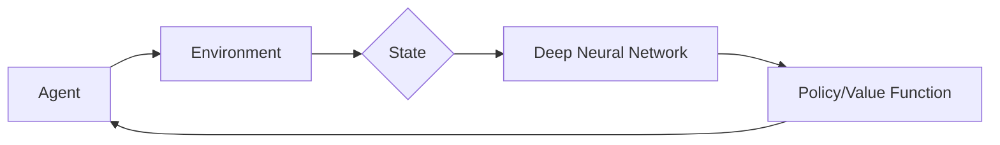

# 强化学习Reinforcement Learning与深度学习的结合之路

## 1.背景介绍

强化学习(Reinforcement Learning, RL)是机器学习的一个重要分支,它研究如何让智能体(Agent)通过与环境的交互来学习最优策略,从而获得最大的累积奖励。强化学习在很多领域都取得了突破性的进展,如AlphaGo击败世界围棋冠军、机器人控制、自动驾驶、游戏AI等。

近年来,随着深度学习的蓬勃发展,将深度神经网络与强化学习相结合,即深度强化学习(Deep Reinforcement Learning, DRL)开始崭露头角。DRL利用深度神经网络强大的表示学习能力,来逼近强化学习中的值函数、策略函数等,极大地提升了强化学习的性能表现。DRL在Atari游戏、机器人控制、自然语言处理等任务上都取得了瞩目的成绩。

本文将深入探讨强化学习与深度学习结合的前世今生,揭示DRL的核心原理与最新进展,并展望其未来发展方向。让我们一起走进DRL的世界,感受人工智能的魅力。

## 2.核心概念与联系

### 2.1 强化学习的核心要素

- 环境(Environment):智能体所处的环境,用状态集S表示。
- 智能体(Agent):与环境交互的主体,根据当前状态选择动作。 
- 状态(State):环境的状态,用s表示。
- 动作(Action):智能体可执行的动作,用a表示。
- 策略(Policy):智能体选择动作的策略,用π表示。
- 奖励(Reward):环境对智能体动作的即时反馈,用r表示。
- 值函数(Value Function):衡量状态的好坏,用V(s)表示。
- 动作值函数(Q-function):衡量在某状态下采取某动作的好坏,用Q(s,a)表示。

### 2.2 深度学习中的关键技术

- 多层感知机(MLP):由输入层、隐藏层、输出层组成的前馈神经网络。
- 卷积神经网络(CNN):擅长处理图像、语音等结构化数据。
- 循环神经网络(RNN):擅长处理序列数据。
- 长短期记忆网络(LSTM):RNN的一种,能缓解梯度消失问题。

### 2.3 DRL的核心思想

DRL的核心思想是用深度神经网络来逼近强化学习中的值函数、策略函数等。传统RL需要大量的特征工程,而DRL可以端到端地学习最优策略。DRL分为以下三大类:

- 值函数方法:用神经网络逼近值函数,如DQN、DDQN等。
- 策略梯度方法:用神经网络逼近策略函数,如REINFORCE、Actor-Critic等。 
- 值函数+策略梯度:同时学习值函数和策略函数,如DDPG、PPO等。

下图展示了DRL的总体框架:



## 3.核心算法原理具体操作步骤

### 3.1 DQN算法

DQN是DRL的开山之作,其创新点在于:

1. 用CNN逼近Q函数
2. 经验回放(Experience Replay) 
3. 目标网络(Target Network)

DQN的具体步骤如下:

1. 随机初始化Q网络的参数θ
2. 初始化经验回放池D
3. for episode=1 to M do 
4.     初始化初始状态s1
5.     for t=1 to T do
6.         用ε-greedy策略选择动作at
7.         执行动作at,观察奖励rt和下一状态st+1
8.         将(st,at,rt,st+1)存入D
9.         从D中随机采样一个minibatch
10.        计算目标值 yj=rj+γ*max(Q(sj+1,a;θ'))
11.        最小化损失函数 L=(yj-Q(sj,aj;θ))^2
12.        每C步将θ'更新为θ
13.    end for
14. end for

### 3.2 DDPG算法

DDPG结合了DQN和Actor-Critic,分别用Actor网络μ(s)逼近策略函数,Critic网络Q(s,a)逼近动作值函数。DDPG在连续动作空间表现出色。

DDPG的具体步骤如下:

1. 随机初始化Actor网络μ(s)和Critic网络Q(s,a)的参数θμ和θQ
2. 初始化目标网络μ'和Q'的参数θμ'=θμ,θQ'=θQ
3. 初始化经验回放池D
4. for episode = 1 to M do
5.     初始化初始状态s1,初始化OU噪声N
6.     for t = 1 to T do 
7.         根据μ(st)和Nt选择动作at=μ(st)+Nt
8.         执行动作at,观察奖励rt和下一状态st+1
9.         将(st,at,rt,st+1)存入D
10.        从D中随机采样一个minibatch 
11.        计算目标值 yj=rj+γ*Q'(sj+1,μ'(sj+1))
12.        更新Critic:最小化损失 L=(yj-Q(sj,aj))^2
13.        更新Actor:最大化Q(s,μ(s))
14.        软更新目标网络参数:
            θμ'=τθμ+(1-τ)θμ'
            θQ'=τθQ+(1-τ)θQ'
15.    end for
16. end for

## 4.数学模型和公式详细讲解举例说明

### 4.1 MDP数学模型

RL问题通常被建模为马尔科夫决策过程(Markov Decision Process, MDP),一个MDP由(S,A,P,R,γ)五元组构成:

- 状态集S:有限个状态的集合
- 动作集A:每个状态下可采取的有限个动作
- 状态转移概率P:从状态s执行动作a后转移到状态s'的概率,即$P(s'|s,a)$
- 奖励函数R:在状态s下采取动作a后获得的即时奖励,即$R(s,a)$
- 折扣因子γ:未来奖励的折扣率,γ∈[0,1]

MDP的目标是寻找一个最优策略π*(s),使得从任意初始状态s0出发,智能体执行该策略后获得的期望累积奖励最大化:

$$V^*(s)=\max_{\pi} \mathbb{E}\left[\sum_{t=0}^{\infty} \gamma^t R\left(s_t, \pi\left(s_t\right)\right) | s_0=s\right]$$

其中,V*(s)称为最优状态值函数。

### 4.2 Bellman最优方程

RL的核心是学习最优值函数V*(s)或最优动作值函数Q*(s,a)。它们满足Bellman最优方程:

$$V^*(s)=\max_a \left[R(s,a)+\gamma \sum_{s'} P(s'|s,a)V^*(s')\right]$$

$$Q^*(s,a)=R(s,a)+\gamma \sum_{s'} P(s'|s,a) \max_{a'} Q^*(s',a')$$

Bellman方程揭示了最优值函数的递归性质,即当前状态的最优值等于采取最优动作后的即时奖励加上下一状态的最优值。

### 4.3 策略梯度定理

策略梯度方法通过参数化策略函数πθ(a|s),并最大化期望累积奖励J(θ)来直接学习最优策略。策略梯度定理给出了J(θ)对θ的梯度:

$$\nabla_{\theta} J(\theta)=\mathbb{E}_{\tau \sim \pi_{\theta}}\left[\sum_{t=0}^T \nabla_{\theta} \log \pi_{\theta}\left(a_t | s_t\right) \hat{Q}^{\pi_{\theta}}\left(s_t, a_t\right)\right]$$

其中,τ表示一条轨迹(s0,a0,r0,...,sT),T是终止时间步,$\hat{Q}^{\pi_{\theta}}(s_t,a_t)$是轨迹τ从t时刻开始的累积回报。

策略梯度定理说明,一个好的动作应该既具有高的选择概率,又能获得高的累积回报。因此,我们可以沿着策略梯度的方向更新策略网络,不断提高策略的期望回报。

## 5.项目实践:代码实例和详细解释说明

下面我们用PyTorch实现REINFORCE算法,该算法是策略梯度方法的代表。我们以经典的CartPole环境为例。

```python
import gym
import numpy as np
import torch
import torch.nn as nn
import torch.nn.functional as F
import torch.optim as optim
from torch.distributions import Categorical

# 策略网络
class Policy(nn.Module):
    def __init__(self):
        super(Policy, self).__init__()
        self.fc1 = nn.Linear(4, 128)  
        self.fc2 = nn.Linear(128, 2)

    def forward(self, x):
        x = F.relu(self.fc1(x))
        x = self.fc2(x)
        return F.softmax(x, dim=1)
      
    def act(self, state):
        state = torch.from_numpy(state).float().unsqueeze(0)
        probs = self.forward(state)
        m = Categorical(probs)
        action = m.sample()
        return action.item(), m.log_prob(action)
    
# 策略梯度
def reinforce(policy, optimizer, n_episodes=1000, max_t=1000, gamma=1.0):
    scores_deque = deque(maxlen=100)
    scores = []
    for i_episode in range(1, n_episodes+1):
        saved_log_probs = []
        rewards = []
        state = env.reset()
        for t in range(max_t):
            action, log_prob = policy.act(state)
            saved_log_probs.append(log_prob)
            state, reward, done, _ = env.step(action)
            rewards.append(reward)
            if done:
                break 
        scores_deque.append(sum(rewards))
        scores.append(sum(rewards))
        
        discounts = [gamma**i for i in range(len(rewards)+1)]
        R = sum([a*b for a,b in zip(discounts, rewards)])
        
        policy_loss = []
        for log_prob in saved_log_probs:
            policy_loss.append(-log_prob * R)
        policy_loss = torch.cat(policy_loss).sum()
        
        optimizer.zero_grad()
        policy_loss.backward()
        optimizer.step()
        
        if i_episode % 100 == 0:
            print('Episode {}\tAverage Score: {:.2f}'.format(i_episode, np.mean(scores_deque)))
        if np.mean(scores_deque)>=195.0:
            print('Environment solved in {:d} episodes!\tAverage Score: {:.2f}'.format(i_episode-100, np.mean(scores_deque)))
            break
    return scores
            
env = gym.make('CartPole-v0')
policy = Policy()
optimizer = optim.Adam(policy.parameters(), lr=1e-2)
scores = reinforce(policy, optimizer)
```

代码解释:

- 首先定义一个策略网络Policy,它是一个两层的MLP,输入状态,输出在该状态下采取各个动作的概率。act函数根据策略网络的输出概率采样动作,并返回动作和对应的log概率。

- reinforce函数实现了REINFORCE算法。每个episode的主要步骤如下:
    1. 用Policy采样一条完整的轨迹,记录动作的log概率和奖励
    2. 计算每个时间步的折扣累积回报R
    3. 计算策略梯度的损失函数,即用-log_prob*R鼓励高回报动作,抑制低回报动作
    4. 反向传播梯度,更新Policy网络参数
    
- 最后,我们在CartPole环境中运行REINFORCE算法。当100个episode的平均分达到195分以上时,说明智能体已经学会了平衡杆的策略。

## 6.实际应用场景

DRL在很多领域展现出了巨大的应用前景,下面列举几个典型应用:

1. 游戏AI:DRL可以通过自我对弈来学习游戏策略,AlphaGo就是一个著名的例子。
2. 机器人控制:DRL可以让机器人学会复杂的运动技能,如行走、抓取等。
3. 自动驾驶:DRL可以训练自动驾驶汽车在复杂环境中做出最优决策。
4. 推荐系统:DRL可以学习用户的偏好,动态调整推荐策略。
5. 智能电网:DRL可以优化电网的调度和能源管理。
6. 通信网络:DRL可以自适应地调整网络参数,提高通信质量。