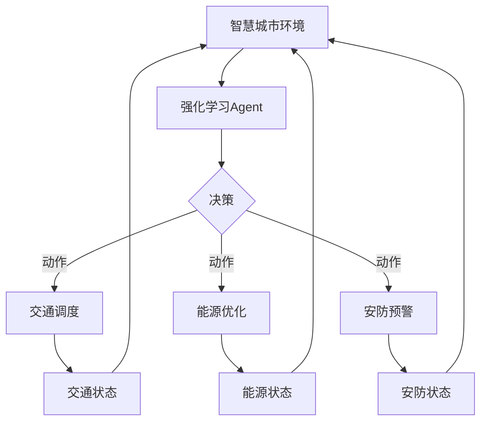

# 强化学习Reinforcement Learning在智慧城市中的应用案例

## 1. 背景介绍

### 1.1 智慧城市的发展现状与挑战
#### 1.1.1 智慧城市的定义与内涵
#### 1.1.2 智慧城市建设的现状
#### 1.1.3 智慧城市发展面临的挑战

### 1.2 强化学习在智慧城市中的应用前景
#### 1.2.1 强化学习的基本概念
#### 1.2.2 强化学习在智慧城市中的应用潜力
#### 1.2.3 强化学习在智慧城市中的应用现状

## 2. 核心概念与联系

### 2.1 强化学习的核心概念
#### 2.1.1 Agent、Environment、State、Action、Reward
#### 2.1.2 Policy、Value Function、Q-Function
#### 2.1.3 Exploration与Exploitation

### 2.2 强化学习与智慧城市的关联
#### 2.2.1 智慧交通中的强化学习应用
#### 2.2.2 智慧能源中的强化学习应用
#### 2.2.3 智慧安防中的强化学习应用

### 2.3 强化学习在智慧城市中的应用框架

## 3. 核心算法原理与具体操作步骤

### 3.1 Q-Learning算法
#### 3.1.1 Q-Learning的基本原理
#### 3.1.2 Q-Learning的更新公式
#### 3.1.3 Q-Learning的伪代码

### 3.2 DQN(Deep Q-Network)算法
#### 3.2.1 DQN的基本原理
#### 3.2.2 DQN的网络结构
#### 3.2.3 DQN的训练过程

### 3.3 DDPG(Deep Deterministic Policy Gradient)算法
#### 3.3.1 DDPG的基本原理 
#### 3.3.2 Actor-Critic架构
#### 3.3.3 DDPG的训练过程

## 4. 数学模型和公式详细讲解举例说明

### 4.1 MDP(Markov Decision Process)模型
#### 4.1.1 MDP的定义与组成
$$
\mathcal{M}=\langle\mathcal{S}, \mathcal{A}, \mathcal{P}, \mathcal{R}, \gamma\rangle
$$
#### 4.1.2 MDP的状态转移概率
$P\left(s^{\prime} \mid s, a\right)=\operatorname{Pr}\left\{S_{t+1}=s^{\prime} \mid S_{t}=s, A_{t}=a\right\}$
#### 4.1.3 MDP的价值函数
$V^{\pi}(s)=\mathbb{E}_{\pi}\left[\sum_{k=0}^{\infty} \gamma^{k} R_{t+k+1} \mid S_{t}=s\right]$

### 4.2 Bellman方程
#### 4.2.1 状态价值函数的Bellman方程
$V^{\pi}(s)=\sum_{a} \pi(a \mid s) \sum_{s^{\prime}, r} p\left(s^{\prime}, r \mid s, a\right)\left[r+\gamma V^{\pi}\left(s^{\prime}\right)\right]$
#### 4.2.2 动作价值函数的Bellman方程  
$Q^{\pi}(s, a)=\sum_{s^{\prime}, r} p\left(s^{\prime}, r \mid s, a\right)\left[r+\gamma \sum_{a^{\prime}} \pi\left(a^{\prime} \mid s^{\prime}\right) Q^{\pi}\left(s^{\prime}, a^{\prime}\right)\right]$

### 4.3 策略梯度定理
#### 4.3.1 策略梯度定理的推导
$\nabla_{\theta} J(\theta)=\mathbb{E}_{\tau \sim p_{\theta}(\tau)}\left[\sum_{t=0}^{T} \nabla_{\theta} \log \pi_{\theta}\left(a_{t} \mid s_{t}\right) Q^{\pi_{\theta}}\left(s_{t}, a_{t}\right)\right]$
#### 4.3.2 策略梯度定理在DDPG中的应用

## 5. 项目实践：代码实例和详细解释说明

### 5.1 基于Q-Learning的智能交通信号灯控制
#### 5.1.1 问题描述与建模
#### 5.1.2 Q-Learning算法实现
#### 5.1.3 实验结果与分析

### 5.2 基于DQN的智能建筑能源管理
#### 5.2.1 问题描述与建模
#### 5.2.2 DQN算法实现
#### 5.2.3 实验结果与分析

### 5.3 基于DDPG的智能安防巡逻路径规划
#### 5.3.1 问题描述与建模
#### 5.3.2 DDPG算法实现  
#### 5.3.3 实验结果与分析

## 6. 实际应用场景

### 6.1 智慧交通
#### 6.1.1 交通信号灯控制优化
#### 6.1.2 交通流量预测与疏导
#### 6.1.3 车辆路径规划

### 6.2 智慧能源
#### 6.2.1 建筑能耗预测与优化
#### 6.2.2 可再生能源发电调度
#### 6.2.3 电力需求侧管理

### 6.3 智慧安防
#### 6.3.1 智能视频监控
#### 6.3.2 异常行为检测
#### 6.3.3 巡逻路径优化

## 7. 工具和资源推荐

### 7.1 强化学习框架
#### 7.1.1 OpenAI Gym
#### 7.1.2 TensorFlow Agents
#### 7.1.3 PyTorch RL

### 7.2 智慧城市数据集
#### 7.2.1 城市交通数据集
#### 7.2.2 建筑能耗数据集
#### 7.2.3 城市安防数据集

### 7.3 学习资源
#### 7.3.1 在线课程
#### 7.3.2 教程与博客
#### 7.3.3 论文与书籍

## 8. 总结：未来发展趋势与挑战

### 8.1 强化学习在智慧城市中的发展趋势
#### 8.1.1 多智能体强化学习
#### 8.1.2 强化学习与其他AI技术的结合
#### 8.1.3 强化学习在更多智慧城市场景中的应用

### 8.2 强化学习在智慧城市中面临的挑战
#### 8.2.1 数据质量与隐私保护
#### 8.2.2 算法的可解释性与鲁棒性
#### 8.2.3 实时性与计算效率

### 8.3 展望未来
#### 8.3.1 强化学习推动智慧城市的发展
#### 8.3.2 智慧城市促进强化学习的进步
#### 8.3.3 强化学习与智慧城市的共同繁荣

## 9. 附录：常见问题与解答

### 9.1 强化学习与监督学习、无监督学习的区别
### 9.2 强化学习中探索与利用的平衡问题
### 9.3 强化学习算法的收敛性与稳定性问题
### 9.4 强化学习在实际应用中的部署与优化问题
### 9.5 强化学习在智慧城市中的伦理与安全问题

作者：禅与计算机程序设计艺术 / Zen and the Art of Computer Programming