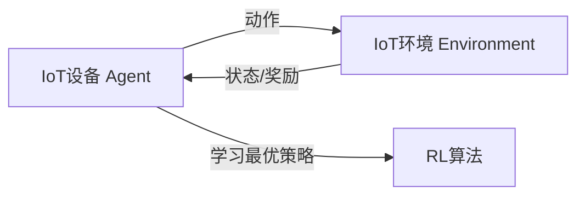

# 强化学习Reinforcement Learning在物联网IoT的创新应用方案

## 1. 背景介绍

### 1.1 物联网IoT的发展现状与挑战

物联网(Internet of Things, IoT)作为新一代信息技术的重要组成部分,正在引领新一轮科技革命和产业变革。据Gartner预测,到2025年全球物联网连接数将达到250亿。然而,随着IoT设备的爆炸式增长,IoT系统面临着资源受限、环境动态变化、安全隐患等诸多挑战。传统的IoT系统难以适应复杂多变的应用场景,亟需创新的技术方案来增强IoT系统的智能性和自适应性。

### 1.2 强化学习在IoT中的应用前景

强化学习(Reinforcement Learning, RL)是一种重要的机器学习范式,它通过智能体(Agent)与环境的交互,学习最优策略以获得最大累积奖励。RL具有自主学习、在线优化的特点,非常适合解决IoT领域中的动态决策问题。将RL引入IoT系统,可以使IoT设备像人一样从经验中学习,自主适应环境变化,从而大幅提升IoT系统的智能化水平。目前,RL已经在IoT的资源管理、网络控制、安全防护等方面展现出广阔的应用前景。

## 2. 核心概念与联系

### 2.1 强化学习的核心概念

- 智能体(Agent):自主学习和决策的实体,如无人车、机器人等。
- 环境(Environment):智能体所处的环境,提供观测信息和奖励反馈。
- 状态(State):环境的完整描述,反映智能体所处的状况。
- 动作(Action):智能体对环境采取的行为,如移动、购买等。
- 奖励(Reward):量化动作效果的即时反馈,引导智能体学习。 
- 策略(Policy):将状态映射为动作的函数,决定智能体的行为模式。
- 价值函数(Value Function):评估状态或动作的长期累积奖励。

### 2.2 强化学习与IoT的关联

在IoT场景中应用RL,可以将IoT设备视为智能体,IoT环境作为RL环境。IoT设备通过传感器感知环境状态,并根据RL算法学习到的策略执行相应动作,以优化系统性能和用户体验。RL为IoT系统的感知、决策、控制和优化提供了新的思路和方法。

下图展示了RL在IoT系统中的运作机制:



## 3. 核心算法原理具体操作步骤

### 3.1 Q-learning算法

Q-learning是一种经典的无模型RL算法,它通过值迭代来学习最优的状态-动作价值函数Q(s,a)。Q-learning的更新公式为:

$$Q(s_t,a_t) \leftarrow Q(s_t,a_t)+\alpha[r_{t+1}+\gamma \max_{a}Q(s_{t+1},a)-Q(s_t,a_t)]$$

其中,$s_t$为当前状态,$a_t$为当前动作,$r_{t+1}$为执行$a_t$后获得的即时奖励,$s_{t+1}$为下一状态,$\alpha$为学习率,$\gamma$为折扣因子。

Q-learning算法的具体步骤如下:

1. 初始化Q表格Q(s,a),设置学习率$\alpha$和折扣因子$\gamma$
2. 重复以下步骤直到收敛:
   - 根据$\epsilon-greedy$策略选择一个动作$a_t$
   - 执行动作$a_t$,观察奖励$r_{t+1}$和下一状态$s_{t+1}$ 
   - 根据Q-learning更新公式更新Q(s,a)
   - $s_t \leftarrow s_{t+1}$

### 3.2 Deep Q-Network算法

Q-learning在状态和动作空间较大时会遇到维度灾难问题。为此,Deep Q-Network(DQN)算法使用深度神经网络来逼近Q函数,从而实现端到端的策略学习。DQN的损失函数为:

$$L(\theta)=\mathbb{E}_{s,a,r,s'}[(r+\gamma \max_{a'}Q(s',a';\theta^-)-Q(s,a;\theta))^2]$$

其中,$\theta$为当前Q网络的参数,$\theta^-$为目标Q网络的参数。DQN引入了经验回放和目标网络两大机制来提升训练稳定性。

DQN算法的主要步骤如下:

1. 初始化经验回放缓冲区D,当前Q网络参数$\theta$和目标Q网络参数$\theta^-$
2. 重复以下步骤直到收敛:
   - 根据$\epsilon-greedy$策略选择一个动作$a_t$
   - 执行动作$a_t$,观察奖励$r_{t+1}$和下一状态$s_{t+1}$
   - 将转移样本$(s_t,a_t,r_{t+1},s_{t+1})$存入D
   - 从D中随机采样一个批次的转移样本 
   - 计算Q学习目标$y=r+\gamma \max_{a'}Q(s',a';\theta^-)$
   - 最小化损失函数$L(\theta)$,更新当前Q网络参数$\theta$
   - 每隔C步将$\theta^-$更新为$\theta$

## 4. 数学模型和公式详细讲解举例说明

### 4.1 马尔可夫决策过程

RL问题通常被建模为马尔可夫决策过程(Markov Decision Process, MDP)。一个MDP由状态集合S、动作集合A、状态转移概率P、奖励函数R和折扣因子$\gamma$组成,记为$\mathcal{M}=\langle\mathcal{S},\mathcal{A},\mathcal{P},\mathcal{R},\gamma\rangle$。

在MDP中,环境的状态转移满足马尔可夫性质,即下一状态$s_{t+1}$只取决于当前状态$s_t$和动作$a_t$:

$$\mathcal{P}(s_{t+1}|s_t,a_t)=\mathcal{P}(s_{t+1}|s_1,a_1,...,s_t,a_t)$$

奖励函数$\mathcal{R}$定义了在状态$s$下执行动作$a$后获得的即时奖励的期望:

$$\mathcal{R}(s,a)=\mathbb{E}[r_{t+1}|s_t=s,a_t=a]$$

RL的目标是学习一个最优策略$\pi^*$,使得从任意状态出发获得的期望累积奖励最大化:

$$\pi^*=\arg\max_{\pi}\mathbb{E}_{\pi}[\sum_{t=0}^{\infty}\gamma^tr_t|s_0]$$

其中,$\gamma \in [0,1]$为折扣因子,用于平衡即时奖励和长期奖励。

### 4.2 状态-动作价值函数

在RL中,我们通过价值函数来评估策略的优劣。状态-动作价值函数$Q^{\pi}(s,a)$表示从状态$s$开始,执行动作$a$并遵循策略$\pi$的期望回报:

$$Q^{\pi}(s,a)=\mathbb{E}_{\pi}[\sum_{k=0}^{\infty}\gamma^kr_{t+k+1}|s_t=s,a_t=a]$$

最优状态-动作价值函数$Q^*(s,a)$对应最优策略$\pi^*$,满足贝尔曼最优方程:

$$Q^*(s,a)=\mathcal{R}(s,a)+\gamma \sum_{s' \in \mathcal{S}}\mathcal{P}(s'|s,a)\max_{a'}Q^*(s',a')$$

直观地说,$Q^*(s,a)$表示在状态$s$下执行动作$a$,然后在每个后续状态下选择最优动作所获得的最大期望回报。一旦我们学习到$Q^*$,最优策略可以通过在每个状态下选择Q值最大的动作得到:

$$\pi^*(s)=\arg\max_{a}Q^*(s,a)$$

## 5. 项目实践：代码实例和详细解释说明

下面我们通过一个简单的网格世界导航任务来演示如何使用Q-learning算法解决RL问题。考虑一个4x4的网格环境,智能体的目标是从起点S走到终点G。

```python
import numpy as np

# 定义网格世界环境
class GridWorld:
    def __init__(self):
        self.grid = np.array([
            [0, 0, 0, 0], 
            [0, -1, 0, 0],
            [0, 0, 0, 0],
            [0, 0, 0, 1]
        ])
        self.state = (0, 0)
        
    def reset(self):
        self.state = (0, 0)
        return self.state
    
    def step(self, action):
        i, j = self.state
        if action == 0:  # 向上
            next_state = (max(i - 1, 0), j)
        elif action == 1:  # 向右
            next_state = (i, min(j + 1, 3))
        elif action == 2:  # 向下
            next_state = (min(i + 1, 3), j)
        else:  # 向左
            next_state = (i, max(j - 1, 0))
            
        reward = self.grid[next_state]
        self.state = next_state
        done = (next_state == (3, 3))
        return next_state, reward, done

# 定义Q-learning智能体
class QLearningAgent:
    def __init__(self, env, alpha=0.5, gamma=0.9, epsilon=0.1):
        self.env = env
        self.alpha = alpha
        self.gamma = gamma
        self.epsilon = epsilon
        self.Q = np.zeros((4, 4, 4))  # 初始化Q表格
        
    def choose_action(self, state):
        if np.random.uniform() < self.epsilon:
            action = np.random.choice(4)  # 探索：随机选择动作
        else:
            action = np.argmax(self.Q[state])  # 利用：选择Q值最大的动作
        return action
    
    def update(self, state, action, reward, next_state):
        td_target = reward + self.gamma * np.max(self.Q[next_state])
        td_error = td_target - self.Q[state][action]
        self.Q[state][action] += self.alpha * td_error
        
# 训练Q-learning智能体
env = GridWorld()
agent = QLearningAgent(env)

num_episodes = 500
for episode in range(num_episodes):
    state = env.reset()
    done = False
    while not done:
        action = agent.choose_action(state)
        next_state, reward, done = env.step(action)
        agent.update(state, action, reward, next_state)
        state = next_state
        
# 测试训练好的智能体
state = env.reset()
done = False
while not done:
    action = np.argmax(agent.Q[state])  # 选择Q值最大的动作
    next_state, reward, done = env.step(action)
    print(f"State: {state}, Action: {action}, Next State: {next_state}, Reward: {reward}")
    state = next_state
```

在这个示例中,我们首先定义了一个简单的网格世界环境`GridWorld`,其中-1表示障碍物,1表示目标,0表示可通行的格子。智能体可以执行上下左右四个动作,每走一步奖励为当前格子的值。

然后我们定义了一个Q-learning智能体`QLearningAgent`,使用Q表格来存储状态-动作值函数。智能体根据$\epsilon-greedy$策略选择动作,并在每个时间步更新Q表格。

在训练阶段,我们让智能体与环境交互500个episode,不断更新Q表格。在测试阶段,我们让智能体根据学习到的最优策略(即在每个状态下选择Q值最大的动作)与环境交互,并打印出每一步的状态、动作、下一状态和奖励。

通过这个简单的例子,我们演示了如何使用Q-learning算法来训练智能体解决RL问题。在实际的IoT应用中,我们可以将IoT设备建模为RL智能体,IoT环境建模为RL环境,使用类似的思路来优化IoT系统的决策和控制。

## 6. 实际应用场景

RL在IoT领域有广泛的应用前景,下面列举几个具体的应用场景:

### 6.1 智能交通控制

在智慧城市中,RL可以用于优化交通信号灯的控制策略。将交通信号灯视为智能体,交通流量状态作为环境状态,信号灯的配时方案作为动作,通过车辆的平均通