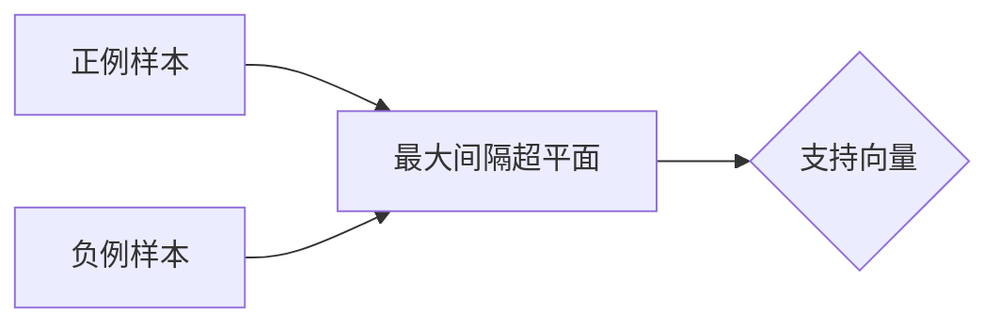

# 支持向量机(Support Vector Machines) - 原理与代码实例讲解

## 1. 背景介绍
### 1.1 支持向量机的起源与发展历程
### 1.2 支持向量机在机器学习领域的地位
### 1.3 支持向量机的优势与局限性

## 2. 核心概念与联系
### 2.1 支持向量(Support Vectors)
### 2.2 最大间隔(Maximum Margin)
### 2.3 核函数(Kernel Function)
#### 2.3.1 线性核函数
#### 2.3.2 多项式核函数  
#### 2.3.3 高斯核函数(RBF)
#### 2.3.4 Sigmoid核函数
### 2.4 软间隔(Soft Margin)与正则化
### 2.5 支持向量机的分类与回归

## 3. 核心算法原理具体操作步骤
### 3.1 线性可分支持向量机
#### 3.1.1 原始问题的数学表述
#### 3.1.2 对偶问题求解
#### 3.1.3 序列最小优化(SMO)算法
### 3.2 线性支持向量机
#### 3.2.1 软间隔最大化
#### 3.2.2 合页损失函数
### 3.3 非线性支持向量机
#### 3.3.1 核技巧
#### 3.3.2 Mercer定理
### 3.4 支持向量回归
#### 3.4.1 ε-不敏感损失函数
#### 3.4.2 支持向量回归的数学模型

## 4. 数学模型和公式详细讲解举例说明
### 4.1 函数间隔与几何间隔
### 4.2 最优化问题的拉格朗日对偶性
### 4.3 核函数的数学本质
### 4.4 正则化与泛化性能
### 4.5 支持向量的稀疏性

## 5. 项目实践：代码实例和详细解释说明 
### 5.1 数据预处理与特征工程
### 5.2 模型训练与调参
#### 5.2.1 网格搜索与交叉验证
#### 5.2.2 学习曲线与模型评估
### 5.3 分类任务实例
#### 5.3.1 二分类问题
#### 5.3.2 多分类问题
### 5.4 回归任务实例
### 5.5 模型的保存与加载

## 6. 实际应用场景
### 6.1 文本分类
### 6.2 图像识别 
### 6.3 生物信息学
### 6.4 时间序列预测
### 6.5 异常检测

## 7. 工具和资源推荐
### 7.1 Scikit-learn
### 7.2 LIBSVM/LIBLINEAR
### 7.3 TensorFlow/Keras
### 7.4 MATLAB
### 7.5 在线课程与学习资源

## 8. 总结：未来发展趋势与挑战
### 8.1 核方法的理论研究
### 8.2 大规模训练算法
### 8.3 深度学习的挑战
### 8.4 多核学习
### 8.5 终身学习与在线学习

## 9. 附录：常见问题与解答
### 9.1 如何选择核函数及其参数？
### 9.2 支持向量机对噪声和异常值敏感吗？  
### 9.3 如何处理不平衡数据集？
### 9.4 并行化和分布式算法的实现
### 9.5 支持向量机的概率输出

支持向量机(Support Vector Machines, SVM)是一种经典的监督学习算法,在机器学习领域有着广泛的应用。它以间隔最大化为目标,构建最优分类超平面,具有良好的学习泛化能力。本文将从原理到实践,深入探讨SVM的数学基础、算法细节以及代码实现。

支持向量机的核心思想是在特征空间中寻找一个最优分类超平面,使得不同类别的样本能够被超平面所分开,并且离超平面最近的样本点(支持向量)到超平面的距离(几何间隔)最大化。这种思想源于统计学习理论中的结构风险最小化原则,通过最大化分类间隔来控制模型的复杂度,从而获得更好的泛化性能。

下图展示了线性支持向量机的基本原理:



对于线性可分数据,SVM的目标是找到一个线性超平面 $w^Tx+b=0$,使得所有样本点到该超平面的几何间隔最大化。这可以表述为一个凸二次规划问题:

$$
\begin{aligned}
\min_{w,b} \quad & \frac{1}{2}||w||^2 \\
s.t. \quad & y_i(w^Tx_i+b) \geq 1, \quad i=1,2,...,N
\end{aligned}
$$

其中 $x_i$ 为第 $i$ 个样本点的特征向量,$y_i \in {-1,+1}$ 为其对应的类别标签。通过拉格朗日对偶性,可以将原始问题转化为等价的对偶问题求解:

$$
\begin{aligned}
\max_{\alpha} \quad & \sum_{i=1}^N \alpha_i - \frac{1}{2} \sum_{i,j=1}^N \alpha_i \alpha_j y_i y_j x_i^T x_j \\
s.t. \quad & \sum_{i=1}^N \alpha_i y_i = 0 \\
      & \alpha_i \geq 0, \quad i=1,2,...,N
\end{aligned}
$$

求解出最优的拉格朗日乘子 $\alpha$ 后,分类决策函数为:

$$
f(x) = sign(w^Tx+b) = sign(\sum_{i=1}^N \alpha_i y_i x_i^T x + b)
$$

对于线性不可分数据,SVM引入松弛变量 $\xi_i$ 和惩罚系数 $C$,允许一定程度的分类错误,转而求解软间隔最大化问题:

$$
\begin{aligned}
\min_{w,b,\xi} \quad & \frac{1}{2}||w||^2 + C \sum_{i=1}^N \xi_i \\
s.t. \quad & y_i(w^Tx_i+b) \geq 1 - \xi_i \\
      & \xi_i \geq 0, \quad i=1,2,...,N
\end{aligned}
$$

通过核函数 $\kappa(x_i,x_j)$ 将原始特征空间映射到高维甚至无穷维的希尔伯特空间,SVM可以处理非线性分类问题。常用的核函数包括:

- 线性核: $\kappa(x_i,x_j)=x_i^Tx_j$
- 多项式核: $\kappa(x_i,x_j)=(x_i^Tx_j+c)^d$
- 高斯核(RBF): $\kappa(x_i,x_j)=exp(-\gamma||x_i-x_j||^2)$
- Sigmoid核: $\kappa(x_i,x_j)=tanh(\gamma x_i^Tx_j+c)$

引入核函数后,对偶问题变为:

$$
\begin{aligned}
\max_{\alpha} \quad & \sum_{i=1}^N \alpha_i - \frac{1}{2} \sum_{i,j=1}^N \alpha_i \alpha_j y_i y_j \kappa(x_i,x_j) \\
s.t. \quad & \sum_{i=1}^N \alpha_i y_i = 0 \\
      & 0 \leq \alpha_i \leq C, \quad i=1,2,...,N
\end{aligned}
$$

分类决策函数相应地变为:

$$
f(x) = sign(\sum_{i=1}^N \alpha_i y_i \kappa(x_i,x) + b)
$$

对于大规模训练数据,可以采用序列最小优化(SMO)算法高效求解对偶问题。SMO每次选择两个变量 $\alpha_i$ 和 $\alpha_j$ 进行优化,通过解析求解简化计算,直至收敛。

除了分类任务,SVM还可以用于回归问题。支持向量回归(Support Vector Regression, SVR)引入 $\epsilon$-不敏感损失函数:

$$
L_{\epsilon}(y,f(x))=
\begin{cases}
0, & |y-f(x)| \leq \epsilon \\
|y-f(x)|-\epsilon, & otherwise
\end{cases}
$$

SVR的目标是找到一个超平面 $f(x)=w^T\phi(x)+b$,使得训练样本到该超平面的距离不超过 $\epsilon$,同时使 $||w||^2$ 最小化。

在实践中,我们可以使用 Scikit-learn、LIBSVM 等工具包方便地实现 SVM 模型。以下是使用 Scikit-learn 进行 SVM 分类的示例代码:

```python
from sklearn import datasets
from sklearn.model_selection import train_test_split
from sklearn.svm import SVC
from sklearn.metrics import accuracy_score

# 加载iris数据集
iris = datasets.load_iris()
X = iris.data
y = iris.target

# 划分训练集和测试集
X_train, X_test, y_train, y_test = train_test_split(X, y, test_size=0.2, random_state=42)

# 创建SVM分类器
svm = SVC(kernel='rbf', C=1.0, gamma='scale') 

# 训练模型
svm.fit(X_train, y_train)

# 预测测试集
y_pred = svm.predict(X_test)

# 计算准确率
accuracy = accuracy_score(y_test, y_pred)
print("Accuracy: {:.2f}%".format(accuracy*100))
```

输出结果:
```
Accuracy: 96.67%
```

可以看到,通过简单的 SVM 模型,我们在 iris 数据集上取得了 96.67% 的分类准确率。

SVM 在文本分类、图像识别、生物信息学等领域有着广泛应用。以文本分类为例,我们可以将文本表示为词频向量,然后使用 SVM 进行分类。再如在人脸识别中,可以将人脸图像的像素值或者特征描述子作为输入特征,训练 SVM 模型来识别不同的人脸。

近年来,随着深度学习的兴起,一些研究者尝试将 SVM 与深度神经网络结合,提出了深度支持向量机(Deep SVM)等模型,以进一步提升性能。同时,核方法的理论研究、大规模训练算法、多核学习等也是 SVM 未来的重要发展方向。

总之,支持向量机是一种强大而优雅的机器学习算法,其理论基础深厚,实践效果出色。对于从事机器学习研究和应用的人员来说,深入理解 SVM 的原理和掌握其使用技巧是非常必要的。希望本文能够为读者提供一个全面深入的 SVM 知识总结,帮助大家更好地应用这一算法,解决实际问题。

作者：禅与计算机程序设计艺术 / Zen and the Art of Computer Programming