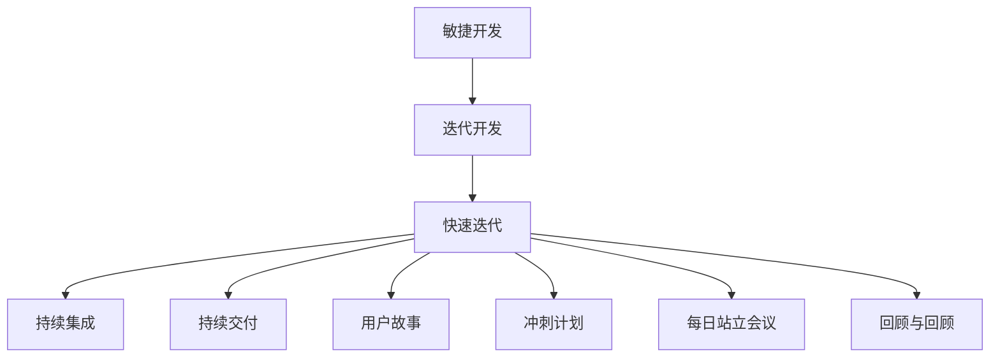
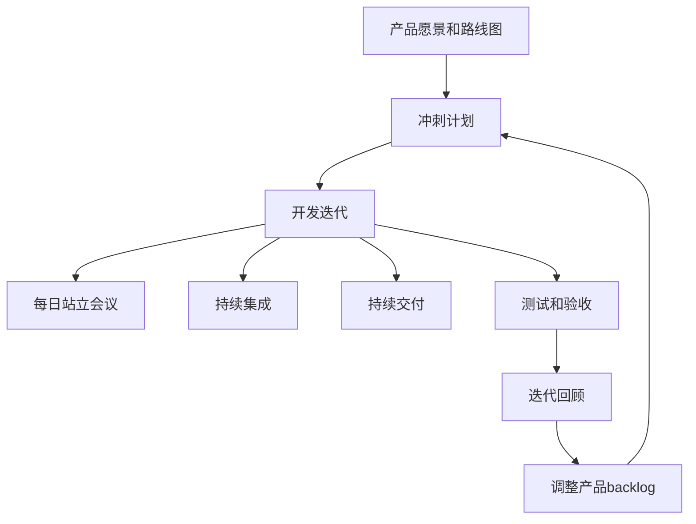

# 敏捷开发与快速迭代原理与代码实战案例讲解

## 1. 背景介绍

### 1.1 软件开发的挑战

在当今快节奏的商业环境中,软件开发面临着许多挑战。用户需求不断变化,技术快速迭代,市场竞争加剧,这些都要求软件开发团队能够快速响应,持续交付高质量的软件产品。传统的瀑布式开发模型已经无法满足这种需求,因为它过于僵化,反应迟缓,难以适应需求的变化。

### 1.2 敏捷开发的兴起

为了应对这些挑战,敏捷开发(Agile Development)应运而生。敏捷开发是一种迭代式、增量式的软件开发方法,强调人员之间的协作、面对变化的能力和频繁交付可工作的软件。它旨在通过短周期的迭代开发,快速获取反馈并及时调整,从而提高软件开发的效率和质量。

### 1.3 快速迭代的重要性

快速迭代(Rapid Iteration)是敏捷开发的核心实践之一。它强调在短时间内完成一个完整的开发周期,包括需求分析、设计、编码、测试和交付。每个迭代都会交付一个可工作的软件增量,从而获取用户反馈,并根据反馈调整后续的开发方向。快速迭代有助于降低风险,提高软件质量,并加强团队的协作和学习能力。

## 2. 核心概念与联系

敏捷开发和快速迭代涉及了多个核心概念,它们之间存在着密切的联系。下面是一些关键概念及其关系:



1. **敏捷开发(Agile Development)**: 一种以人为本,迭代式增量式的软件开发方法。
2. **迭代开发(Iterative Development)**: 将软件开发过程分为多个迭代,每个迭代都会交付一个可工作的软件增量。
3. **快速迭代(Rapid Iteration)**: 在短时间内(通常为1-4周)完成一个完整的开发周期,包括需求分析、设计、编码、测试和交付。
4. **持续集成(Continuous Integration)**: 频繁地将代码变更合并到主干分支,并通过自动化构建和测试来检测集成错误。
5. **持续交付(Continuous Delivery)**: 确保代码在任何时候都可以被可靠地发布到生产环境。
6. **用户故事(User Story)**: 一种简洁的需求描述方式,用于捕获用户的需求。
7. **冲刺计划(Sprint Planning)**: 在每个迭代开始时,团队会进行冲刺计划,确定本次迭代要完成的工作。
8. **每日站立会议(Daily Standup)**: 团队每天进行简短的会议,讨论工作进展和遇到的障碍。
9. **回顾与回顾(Retrospective)**: 在每个迭代结束时,团队会进行回顾,讨论本次迭代的经验教训,并制定改进措施。

这些概念相互关联,共同构成了敏捷开发和快速迭代的核心实践。通过有效地结合和执行这些实践,团队可以提高软件开发的效率、质量和响应能力。

## 3. 核心算法原理具体操作步骤

虽然敏捷开发和快速迭代并不涉及算法的概念,但它们确实有一套明确的原理和操作步骤。下面是快速迭代的核心操作步骤:



1. **产品愿景和路线图**:首先需要明确产品的总体愿景和发展路线图,为后续的迭代开发提供指导。

2. **冲刺计划**:在每个迭代开始时,团队会进行冲刺计划,从产品backlog中选择本次迭代要完成的用户故事,并估算工作量。

3. **开发迭代**:在规定的时间框架内(通常为1-4周),团队会按照计划执行开发任务,包括编码、测试和集成。

4. **每日站立会议**:团队每天进行简短的会议,讨论工作进展和遇到的障碍,以确保迭代顺利进行。

5. **持续集成**:频繁地将代码变更合并到主干分支,并通过自动化构建和测试来检测集成错误。

6. **持续交付**:确保代码在任何时候都可以被可靠地发布到生产环境。

7. **测试和验收**:在迭代结束时,进行全面的测试和验收,确保交付的软件增量满足预期需求。

8. **迭代回顾**:团队回顾本次迭代的过程和结果,讨论经验教训,并制定改进措施。

9. **调整产品backlog**:根据迭代回顾的结果,调整产品backlog,优先排列下一个迭代的工作任务。

10. **循环迭代**:重复上述步骤,进行下一个迭代的开发。

通过不断地快速迭代,团队可以持续交付高质量的软件增量,及时获取用户反馈,并根据反馈调整开发方向,从而更好地满足用户需求。

## 4. 数学模型和公式详细讲解举例说明

虽然敏捷开发和快速迭代主要是一种软件开发实践,但它们也涉及一些数学模型和公式,用于估算工作量、优化迭代计划等。下面是一些常见的数学模型和公式:

### 4.1 故事点估算

在敏捷开发中,我们通常使用"故事点"(Story Point)来估算用户故事的工作量,而不是使用传统的工时估算。故事点是一个相对的估算单位,它反映了完成一个用户故事的复杂程度,而不是具体的工时。

估算故事点的公式如下:

$$
故事点 = 复杂度 \times 不确定性 \times 风险
$$

其中:

- **复杂度**:反映了实现该用户故事的技术难度。通常使用斐波那契数列(1、2、3、5、8、13...)来表示复杂度等级。
- **不确定性**:反映了对需求理解的程度。如果需求描述清晰,不确定性较低;反之,不确定性较高。
- **风险**:反映了实现该用户故事可能带来的风险程度,如对现有系统的影响、技术风险等。

通过估算故事点,团队可以更好地规划迭代,并跟踪工作进度。

### 4.2 迭代燃尽图

迭代燃尽图(Sprint Burndown Chart)是一种可视化工具,用于跟踪迭代过程中剩余工作量的变化情况。它可以帮助团队监控迭代进度,及时发现问题并采取纠正措施。

迭代燃尽图的横轴表示时间(通常以天为单位),纵轴表示剩余工作量(通常以故事点为单位)。在迭代开始时,图表显示本次迭代的总工作量。随着时间推移,剩余工作量应该逐渐减少,直至迭代结束时降至零。

理想情况下,剩余工作量的下降应该呈现一条直线,称为"理想燃尽线"。如果实际燃尽线偏离理想燃尽线,则可能意味着存在问题,需要团队采取相应的措施。

### 4.3 技术债务管理

在快速迭代过程中,为了满足时间约束,团队有时会采取一些技术权衡,导致代码质量下降或架构设计不佳。这种情况被称为"技术债务"(Technical Debt)。如果不加以管理,技术债务会逐渐累积,最终导致代码难以维护,开发效率降低。

为了管理技术债务,我们可以使用以下公式:

$$
技术债务 = 主要工作 + 利息支付
$$

其中:

- **主要工作**:指完成当前迭代的工作量,通常以故事点来估算。
- **利息支付**:指为了偿还以前累积的技术债务而需要付出的额外工作量。

通过估算和跟踪技术债务,团队可以合理安排偿还债务的时间和资源,避免债务过度累积。

这些数学模型和公式为敏捷开发和快速迭代提供了量化和可视化的支持,有助于团队更好地规划和管理迭代过程。

## 5. 项目实践:代码实例和详细解释说明

为了更好地理解敏捷开发和快速迭代的实践,我们以一个简单的在线商城项目为例,展示如何应用这些概念和实践。

### 5.1 项目概述

我们将开发一个在线商城网站,允许用户浏览商品、加入购物车、下单和支付。该项目将采用敏捷开发和快速迭代的方式进行开发。

### 5.2 产品backlog和用户故事

首先,我们需要明确产品backlog和用户故事。以下是一些示例用户故事:

- 作为一个买家,我希望能够浏览商品列表,以便查看商品信息。
- 作为一个买家,我希望能够将商品加入购物车,以便下单购买。
- 作为一个买家,我希望能够查看购物车中的商品,以便进行下一步操作。
- 作为一个买家,我希望能够从购物车中移除商品,以便调整购买清单。
- 作为一个买家,我希望能够完成下单和支付流程,以便购买商品。

### 5.3 冲刺计划和迭代开发

接下来,我们进行冲刺计划,选择本次迭代要完成的用户故事,并估算故事点。例如,我们可以将上述用户故事分为两个迭代:

**迭代1**:

- 浏览商品列表 (3故事点)
- 加入购物车 (5故事点)
- 查看购物车 (3故事点)

**迭代2**:

- 从购物车中移除商品 (2故事点)
- 完成下单和支付流程 (8故事点)

在每个迭代中,团队将按照计划执行开发任务,包括编码、测试和集成。以下是一些示例代码:

**浏览商品列表**:

```python
from flask import Flask, render_template
from models import Product

app = Flask(__name__)

@app.route('/')
def index():
    products = Product.query.all()
    return render_template('index.html', products=products)
```

**加入购物车**:

```python
from flask import session

@app.route('/add_to_cart/<int:product_id>')
def add_to_cart(product_id):
    product = Product.query.get(product_id)
    if product:
        if 'cart' not in session:
            session['cart'] = []
        session['cart'].append(product.id)
    return redirect(url_for('index'))
```

**查看购物车**:

```python
@app.route('/cart')
def cart():
    cart_items = []
    if 'cart' in session:
        for product_id in session['cart']:
            product = Product.query.get(product_id)
            if product:
                cart_items.append(product)
    return render_template('cart.html', cart_items=cart_items)
```

在每个迭代结束时,我们将进行测试和验收,确保交付的软件增量满足预期需求。同时,我们也会进行迭代回顾,讨论经验教训,并根据反馈调整产品backlog和后续的开发计划。

通过快速迭代,我们可以持续交付可工作的软件增量,及时获取用户反馈,并根据反馈调整开发方向,从而更好地满足用户需求。

## 6. 实际应用场景

敏捷开发和快速迭代广泛应用于各种软件开发项目,尤其是那些需求变化频繁、需要快速响应的项目。以下是一些典型的应用场景:

### 6.1 Web应用程序开发

Web应用程序通常需要快速迭代