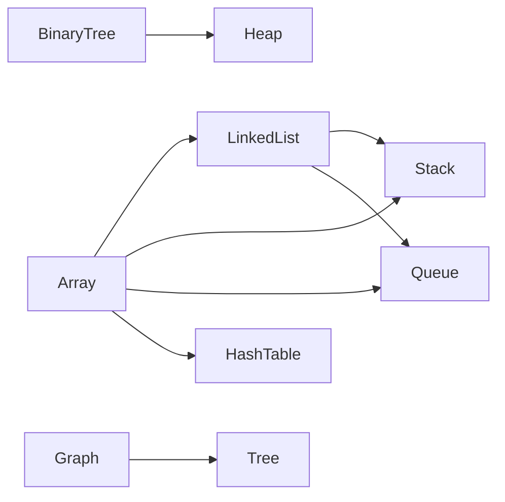

# 数据结构与算法原理与代码实战案例讲解

## 1. 背景介绍

### 1.1 数据结构与算法的重要性

在计算机科学领域,数据结构与算法是两个最基础也是最重要的概念。它们是编写高效、可扩展程序的基石。无论是在日常的软件开发中,还是在机器学习、人工智能等前沿领域,扎实的数据结构与算法功底都是不可或缺的。

### 1.2 学习数据结构与算法的意义

- 培养逻辑思维和问题解决能力
- 为学习其他计算机科学课程打下良好基础  
- 掌握常见数据结构与算法,有助于高效开发和性能优化
- 在求职面试中,数据结构与算法通常是考察重点

### 1.3 本文的主要内容

本文将从数据结构和算法的基本概念出发,介绍几种常见的数据结构,如数组、链表、栈、队列、树、图等,并结合具体的算法来分析它们的特点和应用场景。同时,本文还将通过代码实例来讲解算法的实现细节,帮助读者加深理解。

## 2. 核心概念与联系

### 2.1 数据结构

数据结构是指相互之间存在一种或多种特定关系的数据元素的集合。通俗地说,数据结构就是设计合理的数据存储方式。常见的数据结构包括:

- 数组(Array)
- 链表(Linked List) 
- 栈(Stack)
- 队列(Queue)
- 树(Tree)
- 图(Graph)
- 哈希表(Hash Table)
- 堆(Heap)

### 2.2 算法

算法是为了解决特定问题而规定的一系列操作步骤。一个好的算法应该具备以下特点:

- 正确性:算法能够正确地解决问题
- 可读性:算法应该易于理解和实现
- 健壮性:算法能够处理各种边界情况和异常输入
- 效率:算法的时间复杂度和空间复杂度应尽可能低

### 2.3 数据结构和算法的关系

数据结构为算法提供了数据存储的逻辑模型,而算法则利用合适的数据结构来高效地解决问题。二者相辅相成,缺一不可。

下图展示了几种常见数据结构之间的联系:



## 3. 核心算法原理具体操作步骤

### 3.1 排序算法

#### 3.1.1 冒泡排序

冒泡排序的基本思想是,重复地遍历要排序的数列,每次比较两个元素,如果它们的顺序错误就交换过来。

具体步骤如下:
1. 比较相邻的两个元素,如果第一个比第二个大,就交换它们
2. 对每一对相邻元素做同样的工作,从开始第一对到结尾的最后一对。这步做完后,最后的元素会是最大的数
3. 针对所有的元素重复以上的步骤,除了最后一个
4. 持续每次对越来越少的元素重复上面的步骤,直到没有任何一对数字需要比较

#### 3.1.2 快速排序

快速排序使用分治法来把一个数组分为两个子数组,具体步骤如下:

1. 从数列中挑出一个元素,称为"基准"(pivot)
2. 重新排序数列,所有比基准值小的元素摆放在基准前面,所有比基准值大的元素摆在基准后面。在这个分区结束之后,该基准就处于数列的中间位置。这个称为分区(partition)操作
3. 递归地(recursively)把小于基准值元素的子数列和大于基准值元素的子数列排序

### 3.2 查找算法

#### 3.2.1 二分查找

二分查找也称折半查找,它是一种在有序数组中查找某一特定元素的搜索算法。

具体步骤如下:
1. 比较数组中间元素与目标值大小:
   - 如果相等,返回中间元素下标
   - 如果中间元素大于目标值,则目标值在左半部分,对左半部分执行二分查找
   - 如果中间元素小于目标值,则目标值在右半部分,对右半部分执行二分查找
2. 重复步骤1,直到找到目标值或子数组为空

### 3.3 图算法

#### 3.3.1 广度优先搜索(BFS)

广度优先搜索是一种遍历或搜索树或图数据结构的算法。它从根节点开始,沿着树的宽度遍历树的节点。如果所有节点均被访问,则算法中止。

具体步骤如下:
1. 创建一个队列 Q
2. 将根节点标记为已访问,然后将根节点入队 Q
3. 如果 Q 非空,则执行以下步骤:
   - 将队首节点 A 出队
   - 将 A 的所有未访问过的邻接节点标记为已访问,然后将它们入队 Q
4. 重复步骤3,直到队列为空

#### 3.3.2 深度优先搜索(DFS)  

深度优先搜索是一种用于遍历或搜索树或图的算法。它从根节点开始,在回溯之前尽可能沿着每个分支探索。

具体步骤如下:
1. 创建一个递归函数,接受一个节点作为参数
2. 将当前节点标记为已访问
3. 对于当前节点的每个未访问过的邻接节点:
   - 递归地调用该函数,传入邻接节点作为参数
4. 如果所有节点都被访问,则算法结束

## 4. 数学模型和公式详细讲解举例说明

### 4.1 大O符号

在分析算法的效率时,我们通常使用大O符号来表示算法的时间复杂度和空间复杂度。大O符号描述了算法的运行时间如何随着输入大小的增加而增长。

常见的时间复杂度有:

- $O(1)$:常数时间复杂度,表示算法的运行时间与输入大小无关
- $O(n)$:线性时间复杂度,表示算法的运行时间与输入大小成正比
- $O(n^2)$:平方时间复杂度,表示算法的运行时间与输入大小的平方成正比
- $O(\log n)$:对数时间复杂度,表示算法的运行时间与输入大小的对数成正比

例如,二分查找的时间复杂度为 $O(\log n)$,而冒泡排序的时间复杂度为 $O(n^2)$。

### 4.2 递归

递归是一种解决问题的方法,它将问题分解为更小的子问题,直到子问题可以直接求解。然后,将子问题的解组合起来,得到原问题的解。

递归函数通常包含两个部分:

1. 基本情况(Base Case):直接求解的简单情况
2. 递归情况(Recursive Case):将问题分解为子问题,递归地求解子问题

例如,计算斐波那契数列的递归公式为:

$$
F(n) = 
\begin{cases}
0, & n = 0 \\
1, & n = 1 \\
F(n-1) + F(n-2), & n > 1
\end{cases}
$$

其中,$F(0)=0$ 和 $F(1)=1$ 是基本情况,$F(n)=F(n-1)+F(n-2)$ 是递归情况。

## 5. 项目实践:代码实例和详细解释说明

下面我们通过具体的代码实例来演示几种常见算法的实现。

### 5.1 冒泡排序

```python
def bubble_sort(arr):
    n = len(arr)
    
    for i in range(n):
        # 标记本轮是否发生交换
        swapped = False
        
        for j in range(0, n-i-1):
            if arr[j] > arr[j+1]:
                arr[j], arr[j+1] = arr[j+1], arr[j]
                swapped = True
        
        # 如果本轮没有发生交换,说明数组已经有序
        if not swapped:
            break
    
    return arr
```

在这个实现中,我们使用两个嵌套循环来比较相邻元素并交换它们的位置。外层循环控制排序轮数,内层循环负责比较和交换相邻元素。如果在某一轮中没有发生任何交换,说明数组已经有序,我们可以提前结束排序过程。

### 5.2 快速排序

```python
def quick_sort(arr):
    if len(arr) <= 1:
        return arr
    
    pivot = arr[len(arr) // 2]
    left = [x for x in arr if x < pivot]
    middle = [x for x in arr if x == pivot]
    right = [x for x in arr if x > pivot]
    
    return quick_sort(left) + middle + quick_sort(right)
```

这个快速排序的实现使用了递归和分治的思想。我们选择数组中间的元素作为基准(pivot),然后将数组分为三部分:小于基准的元素、等于基准的元素和大于基准的元素。接着,我们递归地对左右两个子数组进行快速排序,最后将三部分拼接起来得到有序数组。

### 5.3 二分查找

```python
def binary_search(arr, target):
    left = 0
    right = len(arr) - 1
    
    while left <= right:
        mid = (left + right) // 2
        
        if arr[mid] == target:
            return mid
        elif arr[mid] < target:
            left = mid + 1
        else:
            right = mid - 1
    
    return -1
```

这个二分查找的实现使用了两个指针 `left` 和 `right` 来表示查找区间的边界。我们计算中间位置 `mid`,然后将中间元素与目标值进行比较。如果相等,直接返回下标;如果中间元素小于目标值,说明目标值在右半部分,我们将 `left` 更新为 `mid+1`;否则,目标值在左半部分,我们将 `right` 更新为 `mid-1`。重复这个过程,直到找到目标值或查找区间为空。

## 6. 实际应用场景

数据结构与算法在实际开发中有着广泛的应用,下面列举几个典型场景:

- 搜索引擎:使用倒排索引、B+树等数据结构来存储和检索网页信息
- 数据库:使用B+树、哈希表等数据结构来组织和查询数据
- 编译器:使用语法树、符号表等数据结构来表示和处理源代码
- 操作系统:使用进程树、内存分配算法等来管理系统资源
- 计算机网络:使用最短路径算法、拥塞控制算法等来优化网络性能
- 人工智能:使用决策树、神经网络等算法来进行机器学习和预测分析

## 7. 工具和资源推荐

下面推荐一些学习数据结构与算法的工具和资源:

- 书籍:《算法导论》、《数据结构与算法分析》、《编程珠玑》
- 在线课程:Coursera 的《算法》专项课程、MIT 的《算法导论》公开课
- 在线刷题平台:LeetCode、牛客网、CodeForces
- 可视化工具:VisuAlgo、Algorithm Visualizer、Data Structure Visualizations
- 开源库:C++ 的 STL、Java 的 Collections、Python 的内置数据结构

## 8. 总结:未来发展趋势与挑战

数据结构与算法作为计算机科学的基础,在未来仍将扮演重要角色。随着大数据、人工智能等技术的兴起,对高效算法的需求将进一步增加。同时,随着计算机硬件的发展,一些传统的算法可能面临新的挑战和机遇。

未来的趋势和挑战包括:

- 并行算法:如何设计和实现能够充分利用多核 CPU 和 GPU 的并行算法
- 近似算法:在可接受的误差范围内,使用近似算法来解决 NP 难问题
- 量子算法:探索量子计算机带来的新的算法设计范式
- 机器学习算法:改进和优化深度学习、强化学习等算法,提高训练效率和预测精度

## 9. 附录:常见问题与解答

### Q1:学习数据结构与算法需要什么先修知识?

A1:学习数据结构与算法需要具备以下