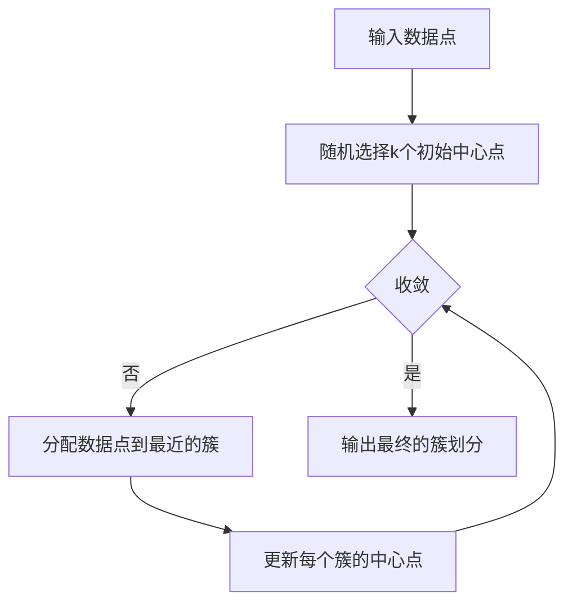

# 无监督学习(Unsupervised Learning) - 原理与代码实例讲解

## 1.背景介绍
无监督学习是机器学习的一个重要分支,与监督学习不同,无监督学习不需要标注数据,而是通过对数据内在结构和分布的学习,从而发现数据的隐藏模式。无监督学习在数据挖掘、模式识别、推荐系统等领域有广泛应用。

### 1.1 无监督学习的定义
无监督学习是一种机器学习方法,它不需要标注数据,而是通过学习数据的内在结构和分布,从而发现数据的隐藏模式。与监督学习相比,无监督学习更加灵活,可以处理更加复杂和多样化的数据。

### 1.2 无监督学习的应用场景
无监督学习在许多领域都有广泛应用,例如:
- 数据聚类:将相似的数据点聚合在一起,形成不同的簇。
- 降维:将高维数据映射到低维空间,同时保留数据的主要特征。
- 异常检测:识别数据中的异常点或离群点。
- 关联规则学习:发现数据中的频繁模式和关联规则。

### 1.3 无监督学习的挑战
无监督学习面临着一些独特的挑战,例如:
- 缺乏标注数据:无监督学习需要从未标注的数据中学习,这增加了学习的难度。
- 评估困难:由于缺乏标注数据,评估无监督学习算法的性能比较困难。
- 可解释性:无监督学习的结果可能难以解释,需要专业知识来理解。

## 2.核心概念与联系
无监督学习涉及几个核心概念,包括聚类、降维、密度估计等。这些概念之间有着密切的联系。

### 2.1 聚类
聚类是将相似的数据点聚合在一起,形成不同的簇。常见的聚类算法包括:
- K-means聚类
- 层次聚类
- DBSCAN聚类

### 2.2 降维 
降维是将高维数据映射到低维空间,同时保留数据的主要特征。常见的降维算法包括:
- 主成分分析(PCA)
- t-SNE
- 自编码器

### 2.3 密度估计
密度估计是估计数据的概率密度函数。常见的密度估计算法包括:
- 核密度估计
- 高斯混合模型

### 2.4 概念之间的联系
聚类、降维和密度估计之间有着密切的联系。聚类可以看作是离散的密度估计,即将数据空间划分为不同的区域。降维可以帮助可视化高维聚类结果,同时也可以作为聚类的预处理步骤。密度估计可以用于异常检测,即识别密度较低的异常点。

## 3.核心算法原理具体操作步骤
下面以K-means聚类算法为例,介绍其原理和具体操作步骤。

### 3.1 K-means聚类算法原理
K-means聚类算法的目标是将n个数据点划分为k个簇,使得每个数据点到其所属簇的中心点的距离平方和最小。算法交替执行两个步骤:
1. 分配步骤:将每个数据点分配到距离最近的簇。
2. 更新步骤:更新每个簇的中心点,即该簇内所有点的均值。

### 3.2 K-means聚类算法操作步骤
1. 随机选择k个初始中心点。 
2. 重复以下步骤,直到收敛:
   - 对每个数据点,计算其到各个中心点的距离,并将其分配到距离最近的簇。
   - 对每个簇,更新其中心点为簇内所有点的均值。
3. 输出最终的簇划分。

### 3.3 K-means聚类算法的 Mermaid 流程图


## 4.数学模型和公式详细讲解举例说明
下面以主成分分析(PCA)为例,介绍其数学模型和公式。

### 4.1 PCA的数学模型
设$X=(x_1,\cdots,x_n)$为$d$维数据集,PCA的目标是找到一个$d'$维子空间($d'<d$),使得数据点在该子空间上的投影损失最小。

令$W=(w_1,\cdots,w_{d'})$为$d\times d'$维矩阵,其中$w_i$为子空间的第$i$个基向量。数据点$x_i$在子空间上的投影为:

$$\hat{x}_i=WW^Tx_i$$

投影损失可以表示为原始数据点与投影点之间的距离平方和:

$$\mathcal{L}=\sum_{i=1}^n\|x_i-\hat{x}_i\|^2$$

PCA的目标是最小化投影损失$\mathcal{L}$,即:

$$\min_W \mathcal{L}=\min_W \sum_{i=1}^n\|x_i-WW^Tx_i\|^2$$

### 4.2 PCA的求解
可以证明,上述优化问题的解为数据协方差矩阵$X^TX$的前$d'$个最大特征值对应的特征向量。具体步骤如下:
1. 将数据中心化,即减去均值:$x_i\leftarrow x_i-\frac{1}{n}\sum_{i=1}^n x_i$。
2. 计算数据的协方差矩阵:$C=\frac{1}{n}X^TX$。
3. 对协方差矩阵$C$进行特征分解,得到特征值$\lambda_1\geq\cdots\geq\lambda_d$和对应的特征向量$u_1,\cdots,u_d$。
4. 取前$d'$个最大特征值对应的特征向量构成矩阵$W=(u_1,\cdots,u_{d'})$。
5. 将数据点投影到子空间:$\hat{x}_i=W^Tx_i$。

### 4.3 PCA的应用举例
下面以MNIST手写数字数据集为例,说明PCA的应用。MNIST数据集包含60,000个训练样本和10,000个测试样本,每个样本是一个28x28的灰度图像,表示一个手写数字。

我们可以将每个图像展开为784维向量,然后对整个数据集进行PCA降维。下图显示了将数据降到2维时的可视化结果:


可以看出,不同数字的样本在降维后的空间中呈现出不同的分布,说明PCA可以有效地提取数据的主要特征。

## 5.项目实践:代码实例和详细解释说明
下面以Python和scikit-learn库为例,展示K-means聚类和PCA的代码实现。

### 5.1 K-means聚类代码实例
```python
from sklearn.cluster import KMeans
from sklearn.datasets import make_blobs

# 生成样本数据
X, y = make_blobs(n_samples=1000, centers=4, random_state=42)

# 构建K-means聚类器
kmeans = KMeans(n_clusters=4, random_state=42)

# 训练聚类器
kmeans.fit(X)

# 获得聚类结果
labels = kmeans.labels_
centers = kmeans.cluster_centers_

# 评估聚类性能
from sklearn.metrics import silhouette_score
score = silhouette_score(X, labels)
print(f"Silhouette score: {score:.3f}")
```

代码解释:
1. 首先从`sklearn.cluster`中导入`KMeans`类,从`sklearn.datasets`中导入`make_blobs`函数用于生成聚类样本数据。
2. 使用`make_blobs`生成1000个样本,设置聚类中心数为4。
3. 构建`KMeans`聚类器,设置聚类数为4。
4. 调用`fit`方法训练聚类器。
5. 通过`labels_`属性获得每个样本的聚类标签,通过`cluster_centers_`属性获得聚类中心点。
6. 从`sklearn.metrics`中导入`silhouette_score`函数,计算聚类结果的轮廓系数,作为聚类性能的评估指标。

### 5.2 PCA代码实例
```python
from sklearn.decomposition import PCA
from sklearn.datasets import load_digits

# 加载MNIST手写数字数据集
X, y = load_digits(return_X_y=True)

# 构建PCA
pca = PCA(n_components=2)

# 对数据进行PCA降维
X_pca = pca.fit_transform(X)

# 可视化降维后的数据
import matplotlib.pyplot as plt
plt.figure(figsize=(8, 6))
plt.scatter(X_pca[:, 0], X_pca[:, 1], c=y, cmap='viridis')
plt.colorbar()
plt.xlabel("PCA Component 1")
plt.ylabel("PCA Component 2")
plt.show()
```

代码解释:
1. 首先从`sklearn.decomposition`中导入`PCA`类,从`sklearn.datasets`中导入`load_digits`函数用于加载MNIST手写数字数据集。
2. 使用`load_digits`加载MNIST数据集,获得样本特征矩阵`X`和标签向量`y`。
3. 构建`PCA`降维器,设置降维后的维度为2。
4. 调用`fit_transform`方法对数据进行PCA降维,得到降维后的数据`X_pca`。
5. 使用Matplotlib绘制降维后数据的散点图,不同颜色表示不同的数字类别。

## 6.实际应用场景
无监督学习在许多实际场景中都有广泛应用,例如:
- 客户细分:通过对客户数据进行聚类,将客户划分为不同的群体,制定针对性的营销策略。
- 图像分割:通过对图像像素进行聚类,将图像分割为不同的区域,例如前景和背景。
- 主题抽取:通过对文本数据进行主题模型学习,自动发现文本中的主题。
- 异常检测:通过学习正常数据的分布,识别异常数据点,例如欺诈检测、设备故障检测等。

## 7.工具和资源推荐
下面推荐一些无监督学习相关的工具和资源:
- scikit-learn:Python机器学习库,提供了丰富的无监督学习算法实现。
- ELKI:Java语言编写的数据挖掘工具,专注于聚类、异常检测等无监督学习任务。
- Stanford CS229课程:斯坦福大学机器学习课程,包含无监督学习的相关内容。
- 《Pattern Recognition and Machine Learning》:经典的机器学习教材,对无监督学习有深入讲解。
- 《Unsupervised Learning Algorithms》:专门讲解无监督学习算法的教材。

## 8.总结:未来发展趋势与挑战
无监督学习是机器学习的重要分支,在许多领域都有广泛应用。未来无监督学习的研究趋势包括:
- 深度无监督学习:利用深度神经网络进行无监督表示学习,自动提取高级特征。
- 多视图学习:同时学习多个数据视图的隐藏表示,捕捉不同视角的信息。
- 主动学习:通过主动询问用户标注数据,减少无监督学习所需的数据量。
- 迁移学习:利用已有的无监督学习模型,快速适应新的任务和数据。

无监督学习也面临着一些挑战,例如:
- 评估困难:缺乏客观的评估指标,难以比较不同算法的性能。
- 可解释性差:无监督学习的结果往往难以解释,需要借助领域知识。
- 数据质量要求高:无监督学习对数据质量比较敏感,需要进行数据预处理和清洗。

## 9.附录:常见问题与解答
1. 问:无监督学习和监督学习有什么区别?
   答:监督学习需要标注数据,而无监督学习不需要标注数据,通过学习数据的内在结构和分布来发现模式。
2. 问:如何选择K-means聚类的聚类数?
   答:可以使用手肘法、轮廓系数等方法,通过比较不同聚类数下的聚类性能来选择最优的