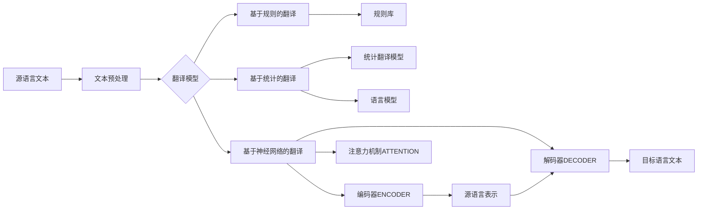

# 机器翻译(Machine Translation) - 原理与代码实例讲解

## 1. 背景介绍
### 1.1 机器翻译的发展历程
### 1.2 机器翻译的重要性和应用场景
### 1.3 机器翻译面临的主要挑战

## 2. 核心概念与联系
### 2.1 机器翻译的定义和分类
#### 2.1.1 基于规则的机器翻译
#### 2.1.2 基于统计的机器翻译
#### 2.1.3 基于神经网络的机器翻译
### 2.2 机器翻译与自然语言处理的关系
### 2.3 机器翻译与深度学习的关系

## 3. 核心算法原理具体操作步骤
### 3.1 基于规则的机器翻译算法
#### 3.1.1 词典查询和替换
#### 3.1.2 语法分析和转换
#### 3.1.3 语义分析和生成
### 3.2 基于统计的机器翻译算法
#### 3.2.1 IBM模型
#### 3.2.2 短语统计翻译模型
#### 3.2.3 基于语法的统计机器翻译
### 3.3 基于神经网络的机器翻译算法
#### 3.3.1 序列到序列模型(Seq2Seq)
#### 3.3.2 注意力机制(Attention Mechanism)
#### 3.3.3 Transformer模型

## 4. 数学模型和公式详细讲解举例说明
### 4.1 语言模型
#### 4.1.1 N-gram语言模型
$$ P(w_1, w_2, ..., w_n) = \prod_{i=1}^{n} P(w_i | w_1, ..., w_{i-1}) $$
#### 4.1.2 神经网络语言模型
### 4.2 翻译模型 
#### 4.2.1 词对齐模型
$$ P(f|e) = \sum_{a} P(f,a|e) $$
#### 4.2.2 短语翻译模型
### 4.3 解码算法
#### 4.3.1 贪心解码
#### 4.3.2 束搜索解码

## 5. 项目实践：代码实例和详细解释说明
### 5.1 数据预处理
#### 5.1.1 文本清洗和标准化
#### 5.1.2 分词和词性标注
#### 5.1.3 构建词汇表
### 5.2 模型训练
#### 5.2.1 Seq2Seq模型训练
#### 5.2.2 Transformer模型训练
#### 5.2.3 模型评估和优化
### 5.3 模型推理和部署
#### 5.3.1 模型导出和加载
#### 5.3.2 实时翻译接口开发
#### 5.3.3 性能优化和扩展

## 6. 实际应用场景
### 6.1 在线翻译平台
### 6.2 跨语言信息检索
### 6.3 多语言内容生成

## 7. 工具和资源推荐
### 7.1 开源机器翻译工具包
#### 7.1.1 Moses
#### 7.1.2 OpenNMT
#### 7.1.3 Fairseq
### 7.2 机器翻译数据集
#### 7.2.1 WMT数据集
#### 7.2.2 OPUS数据集
#### 7.2.3 NIST数据集
### 7.3 机器翻译评测平台
#### 7.3.1 BLEU
#### 7.3.2 METEOR
#### 7.3.3 TER

## 8. 总结：未来发展趋势与挑战
### 8.1 无监督和半监督机器翻译
### 8.2 多语言和零样本翻译 
### 8.3 融合知识和常识的机器翻译
### 8.4 个性化和领域自适应机器翻译

## 9. 附录：常见问题与解答
### 9.1 如何选择合适的机器翻译模型？
### 9.2 如何处理机器翻译中的歧义问题？
### 9.3 如何提高机器翻译的流畅度和可读性？
### 9.4 机器翻译能否达到人工翻译的质量？



机器翻译是自然语言处理领域的一个重要分支,其目标是利用计算机程序自动将一种自然语言(源语言)转换为另一种自然语言(目标语言),从而实现不同语言之间的信息交流和知识共享。机器翻译技术的发展经历了基于规则、基于统计和基于神经网络三个主要阶段,每个阶段都有其独特的优势和局限性。

基于规则的机器翻译主要依赖人工构建的双语词典和语法规则,通过词典查询、语法分析和语义转换等步骤生成目标语言文本。这种方法对语言学知识依赖较强,适用于语法结构相似的语言对,但泛化能力有限,难以处理语言的灵活性和多样性。

基于统计的机器翻译利用大规模双语语料库,通过统计学习方法自动构建翻译模型和语言模型。其中,翻译模型刻画了源语言和目标语言之间的对应关系,语言模型则刻画了目标语言的流畅度。代表性的统计翻译模型包括IBM模型、短语统计翻译模型和基于语法的统计翻译模型等。基于统计的方法大大减少了人工规则构建的成本,但仍然依赖于高质量的双语语料,且翻译质量受限于局部特征和平坦结构。

近年来,随着深度学习技术的发展,基于神经网络的机器翻译(NMT)成为了主流方法。NMT利用神经网络构建端到端的翻译模型,通过编码器将源语言句子编码为语义向量,再由解码器根据语义向量生成目标语言句子。引入注意力机制后,NMT模型能够自动学习源语言和目标语言之间的对齐关系,生成更加准确和流畅的翻译结果。代表性的NMT模型包括序列到序列模型(Seq2Seq)、注意力机制模型和Transformer模型等。

以Transformer模型为例,其采用了多头自注意力机制和前馈神经网络,通过自注意力计算序列中不同位置之间的相关性,从而捕捉到全局的上下文信息。Transformer抛弃了传统的循环神经网络结构,通过位置编码和残差连接等技术,实现了高效的并行计算和长程依赖建模。Transformer模型在多个机器翻译任务上取得了state-of-the-art的性能,成为了当前NMT领域的主流架构。

下面是一个基于Transformer的机器翻译模型的简化代码实现示例:

```python
import tensorflow as tf

class Transformer(tf.keras.Model):
    def __init__(self, num_layers, d_model, num_heads, dff, input_vocab_size, 
                 target_vocab_size, max_seq_length, rate=0.1):
        super(Transformer, self).__init__()

        self.encoder = Encoder(num_layers, d_model, num_heads, dff, 
                               input_vocab_size, max_seq_length, rate)

        self.decoder = Decoder(num_layers, d_model, num_heads, dff, 
                               target_vocab_size, max_seq_length, rate)

        self.final_layer = tf.keras.layers.Dense(target_vocab_size)
    
    def call(self, inp, tar, training, enc_padding_mask, 
             look_ahead_mask, dec_padding_mask):

        enc_output = self.encoder(inp, training, enc_padding_mask)
        
        dec_output, attention_weights = self.decoder(
            tar, enc_output, training, look_ahead_mask, dec_padding_mask)
        
        final_output = self.final_layer(dec_output)
        
        return final_output, attention_weights
```

以上代码定义了一个基本的Transformer模型类,包含了编码器(Encoder)、解码器(Decoder)和输出层(Dense)。编码器负责将输入序列编码为隐向量表示,解码器根据编码器的输出和之前的解码结果生成下一个目标词。通过在编码器和解码器中引入自注意力机制和前馈神经网络,Transformer能够有效地建模序列之间的长程依赖关系。

在实际应用中,机器翻译技术已经广泛应用于在线翻译平台、跨语言搜索、多语言内容生成等场景,极大地促进了全球信息交流和知识共享。但机器翻译仍然面临着语义理解、语用分析、领域自适应等诸多挑战。未来,机器翻译技术将向着无监督学习、多语言建模、知识融合等方向发展,不断提升翻译质量和实用性,为构建人机交互的智能时代贡献力量。

常见问题:
1. 如何选择合适的机器翻译模型?
   - 考虑语言对的特点,如语法结构、词汇差异等
   - 评估数据资源的质量和规模
   - 权衡模型的性能、效率和部署成本
2. 如何处理机器翻译中的歧义问题?  
   - 引入上下文信息和语用知识辅助消歧
   - 采用集成学习方法结合多个翻译系统的优势
   - 通过人机交互引入人工反馈和后编辑
3. 如何提高机器翻译的流畅度和可读性?
   - 引入更大规模和更多样化的训练数据
   - 优化模型结构和目标函数,如引入覆盖率、相关性等指标
   - 采用数据增强、迁移学习等方法提升模型的泛化能力
4. 机器翻译能否达到人工翻译的质量?
   - 目前在一些通用领域和语言对上,机器翻译已经接近人工翻译质量
   - 但在专业领域、低资源语言、语义理解等方面还有较大差距
   - 机器翻译与人工翻译优势互补,可采用人机协作的方式提升翻译效率和质量

作者：禅与计算机程序设计艺术 / Zen and the Art of Computer Programming