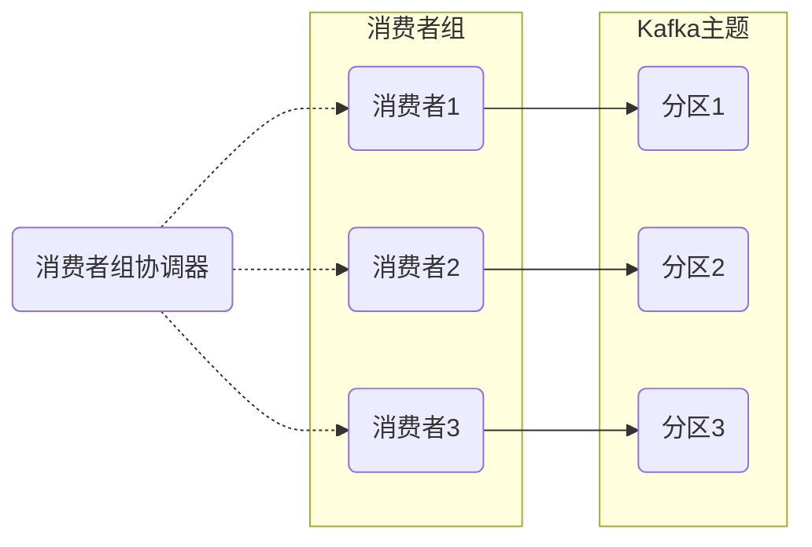
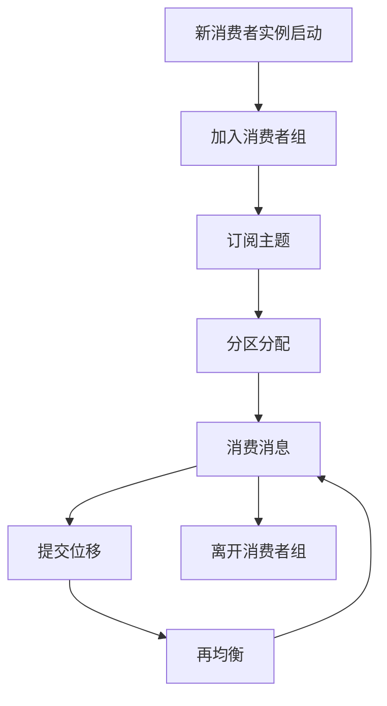

# 消费者组 原理与代码实例讲解

## 1.背景介绍

在现代分布式系统中,消息队列扮演着关键角色,用于在不同组件之间可靠地传递数据。Apache Kafka作为一种流行的分布式流处理平台,提供了消费者组(Consumer Group)的概念,使得多个消费者可以高效地从同一个主题(Topic)中读取消息。消费者组的引入解决了消息分发和负载均衡的问题,同时确保了消息的有序性和容错性。本文将深入探讨消费者组的原理、设计思想和实现细节,并通过代码示例帮助读者更好地理解和运用这一重要特性。

## 2.核心概念与联系

### 2.1 消费者组(Consumer Group)

消费者组是Kafka中的一个逻辑概念,它由多个消费者实例组成,这些实例共同订阅同一个主题,并且协作消费该主题的所有分区。每个消费者实例在消费者组内都被分配了一个唯一的消费者ID(Consumer ID)。

### 2.2 分区(Partition)和消费者实例(Consumer Instance)

Kafka主题被分为多个分区,每个分区是一个有序、不可变的消息序列。消费者组中的每个消费者实例只能消费被分配给它的分区。这种设计确保了消息在消费者组内的并行消费,从而提高了整体吞吐量。

### 2.3 消费位移(Offset)

Kafka为每个消费者组维护了一个消费位移(Offset),用于跟踪每个分区中已经被消费的最后一条消息的位置。当消费者实例重新启动或加入消费者组时,它会从该位移处继续消费消息,确保不会丢失或重复消费消息。

### 2.4 分区再均衡(Partition Rebalance)

当消费者组中的消费者实例数量发生变化时(如新增或离开消费者实例),Kafka会触发分区再均衡过程,以重新分配分区给每个消费者实例。这个过程由消费者组协调器(Group Coordinator)管理,确保在再均衡期间不会丢失消息。



## 3.核心算法原理具体操作步骤

消费者组的核心算法原理可以概括为以下几个步骤:

1. **加入消费者组**:当一个新的消费者实例启动时,它会向消费者组协调器发送加入组的请求。协调器会将该消费者加入到对应的消费者组中。

2. **订阅主题**:消费者实例加入消费者组后,会向协调器发送订阅主题的请求。协调器会将该消费者组订阅的主题信息发送给所有消费者实例。

3. **分区分配**:协调器根据当前消费者组中的消费者实例数量,以及订阅的主题的分区数量,计算出一个分区分配方案。每个消费者实例将被分配一个或多个分区。

4. **消费消息**:每个消费者实例开始从分配给它的分区中消费消息。消费者实例维护一个本地的消费位移,用于跟踪已消费的最后一条消息的位置。

5. **提交位移**:消费者实例定期将本地消费位移提交给Kafka,以便在发生故障时能够从上次提交的位置继续消费。

6. **再均衡**:当消费者组中的消费者实例数量发生变化时,协调器会触发分区再均衡过程。新的分区分配方案将被计算出来,并发送给所有消费者实例。在再均衡期间,消费者实例会暂停消费,直到分区重新分配完成。

7. **离开消费者组**:当消费者实例关闭时,它会向协调器发送离开消费者组的请求。协调器会将该消费者从消费者组中移除,并触发分区再均衡过程。



## 4.数学模型和公式详细讲解举例说明

在分区分配过程中,Kafka使用了一种称为"Range Partitioning"的算法,该算法旨在实现分区的均匀分布。具体来说,该算法将所有分区按照编号排序,然后将它们均匀地分配给消费者实例。

假设我们有一个主题包含N个分区,并且有C个消费者实例在消费者组中。我们可以使用以下公式计算每个消费者实例应该被分配的分区范围:

$$
\begin{aligned}
&\text{分区范围大小} = \left\lceil \frac{N}{C} \right\rceil \\
&\text{消费者实例 } i \text{ 的分区范围} = \left[ (i-1) \times \text{分区范围大小}, \min(i \times \text{分区范围大小} - 1, N-1) \right]
\end{aligned}
$$

其中$\lceil x \rceil$表示向上取整。

例如,假设我们有一个主题包含12个分区,并且有3个消费者实例在消费者组中。根据上述公式,我们可以计算出每个消费者实例应该被分配的分区范围:

- 消费者实例1的分区范围: $\left[ 0, 3 \right]$,包含分区0、1、2和3
- 消费者实例2的分区范围: $\left[ 4, 7 \right]$,包含分区4、5、6和7
- 消费者实例3的分区范围: $\left[ 8, 11 \right]$,包含分区8、9、10和11

通过这种方式,Kafka可以确保分区被均匀地分配给消费者实例,从而实现更好的负载均衡和吞吐量。

## 5.项目实践:代码实例和详细解释说明

以下是一个使用Java编写的Kafka消费者组示例代码,展示了如何创建消费者实例、加入消费者组、订阅主题、消费消息和提交位移等操作。

```java
import org.apache.kafka.clients.consumer.ConsumerConfig;
import org.apache.kafka.clients.consumer.ConsumerRecord;
import org.apache.kafka.clients.consumer.ConsumerRecords;
import org.apache.kafka.clients.consumer.KafkaConsumer;
import org.apache.kafka.common.serialization.StringDeserializer;

import java.time.Duration;
import java.util.Collections;
import java.util.Properties;

public class ConsumerGroupExample {
    public static void main(String[] args) {
        // 配置Kafka消费者属性
        Properties props = new Properties();
        props.put(ConsumerConfig.BOOTSTRAP_SERVERS_CONFIG, "kafka-broker-1:9092,kafka-broker-2:9092");
        props.put(ConsumerConfig.GROUP_ID_CONFIG, "my-consumer-group");
        props.put(ConsumerConfig.KEY_DESERIALIZER_CLASS_CONFIG, StringDeserializer.class.getName());
        props.put(ConsumerConfig.VALUE_DESERIALIZER_CLASS_CONFIG, StringDeserializer.class.getName());

        // 创建Kafka消费者实例
        KafkaConsumer<String, String> consumer = new KafkaConsumer<>(props);

        // 订阅主题
        consumer.subscribe(Collections.singletonList("my-topic"));

        try {
            while (true) {
                // 拉取消息
                ConsumerRecords<String, String> records = consumer.poll(Duration.ofMillis(100));

                // 处理消息
                for (ConsumerRecord<String, String> record : records) {
                    System.out.printf("Received message: partition=%d, offset=%d, key=%s, value=%s%n",
                            record.partition(), record.offset(), record.key(), record.value());
                }

                // 手动提交位移
                consumer.commitSync();
            }
        } finally {
            // 关闭消费者实例
            consumer.close();
        }
    }
}
```

代码解释:

1. 首先,我们配置Kafka消费者属性,包括`bootstrap.servers`(Kafka集群地址)、`group.id`(消费者组ID)和序列化/反序列化类。

2. 然后,我们创建一个`KafkaConsumer`实例,并订阅要消费的主题`my-topic`。

3. 在无限循环中,我们使用`consumer.poll()`方法从Kafka拉取消息。该方法返回一个`ConsumerRecords`对象,其中包含了从所有分区拉取的消息。

4. 对于每条消息,我们打印出它所属的分区、位移、键和值。

5. 在处理完所有消息后,我们调用`consumer.commitSync()`方法手动提交位移。这确保了即使消费者实例发生故障,也不会丢失已处理的消息。

6. 最后,我们在`finally`块中调用`consumer.close()`方法,确保在程序退出时正确关闭消费者实例。

需要注意的是,在实际应用中,您可能需要根据具体需求进行额外的配置和处理,例如设置消费者组的重平衡监听器、自动提交位移等。Kafka提供了丰富的配置选项和API,以满足不同场景的需求。

## 6.实际应用场景

消费者组在许多实际应用场景中扮演着重要角色,以下是一些常见的使用案例:

1. **日志处理系统**: 在日志处理系统中,日志数据通常被发送到Kafka主题。多个消费者实例组成消费者组,并行消费这些日志数据,进行实时分析、存储或其他处理操作。

2. **流处理管道**: Kafka常被用作流处理管道的消息传输层。消费者组可以从Kafka主题中消费原始数据,并将其传递给下游的流处理应用程序,如Apache Spark Streaming或Apache Flink。

3. **微服务架构**: 在微服务架构中,不同的微服务可以通过Kafka进行异步通信。每个微服务可以作为消费者实例加入相应的消费者组,从而实现事件驱动的架构和松耦合。

4. **数据集成和ETL**: Kafka可用于构建数据集成和ETL(提取、转换、加载)管道。消费者组从Kafka主题中消费原始数据,对其进行转换和处理,然后将结果数据加载到数据仓库或其他存储系统中。

5. **物联网(IoT)和传感器数据处理**: 在物联网和传感器数据处理场景中,大量的传感器数据被发送到Kafka主题。消费者组可以并行消费这些数据,进行实时监控、分析或存储。

6. **订单处理系统**: 在电子商务或金融领域,订单数据通常被发送到Kafka主题。消费者组可以从中消费订单数据,进行处理、验证或持久化存储。

无论是在何种场景下,消费者组都可以提供可靠的消息传递、高吞吐量、容错性和可扩展性,使其成为构建分布式系统的关键组件之一。

## 7.工具和资源推荐

在使用Kafka消费者组时,以下工具和资源可能会对您有所帮助:

1. **Kafka工具**:
   - **Kafka Tool**: 一个基于Web的Kafka集群管理工具,可以方便地查看和管理主题、消费者组等。
   - **Kafka Manager**: 另一个流行的Kafka集群管理工具,提供了丰富的监控和操作功能。

2. **监控工具**:
   - **Prometheus**: 一个开源的监控系统,可以收集Kafka的指标数据,用于监控和警报。
   - **Grafana**: 一个开源的数据可视化工具,可以与Prometheus集成,为Kafka提供丰富的监控仪表盘。

3. **测试工具**:
   - **Kafka-ETE (End-to-End)**: 一个用于测试Kafka应用程序的端到端测试框架。
   - **Kafka Unit**: 一个用于单元测试Kafka应用程序的测试框架。

4. **学习资源**:
   - **Kafka官方文档**: Kafka官方文档提供了详细的概念介绍、配置指南和API参考。
   - **Kafka: The Definitive Guide**: 一本深入探讨Kafka原理和实践的权威书籍。
   - **Confluent开发者社区**: Confluent(Kafka的商业公司)提供了丰富的博客、教程和培训资源。

5. **开源库和框架**:
   - **Kafka