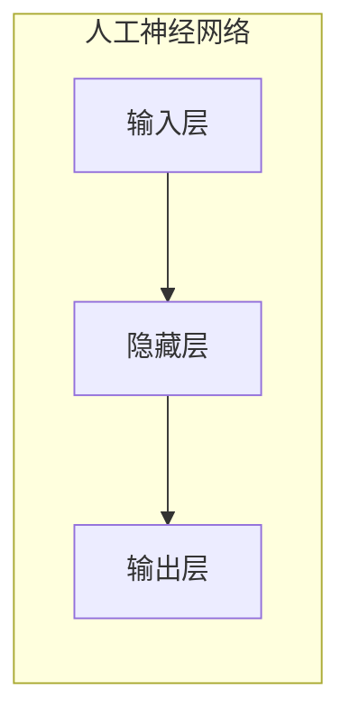
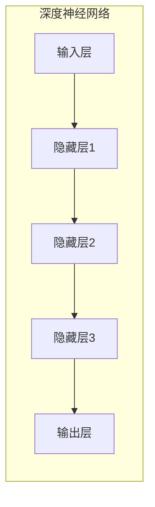
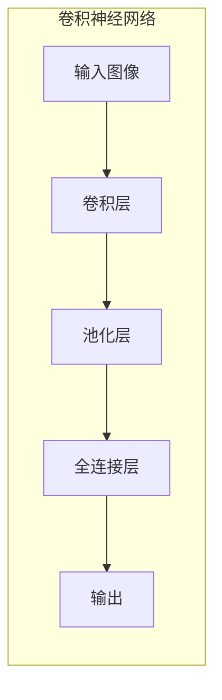
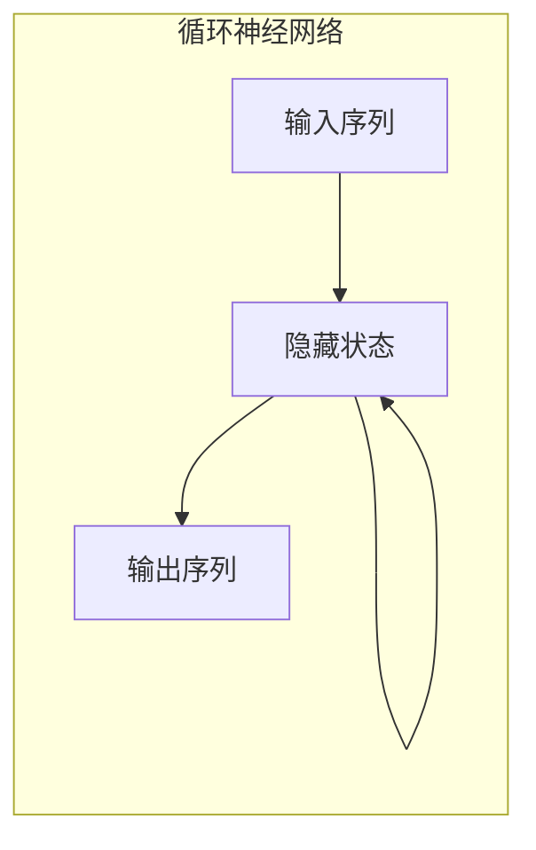
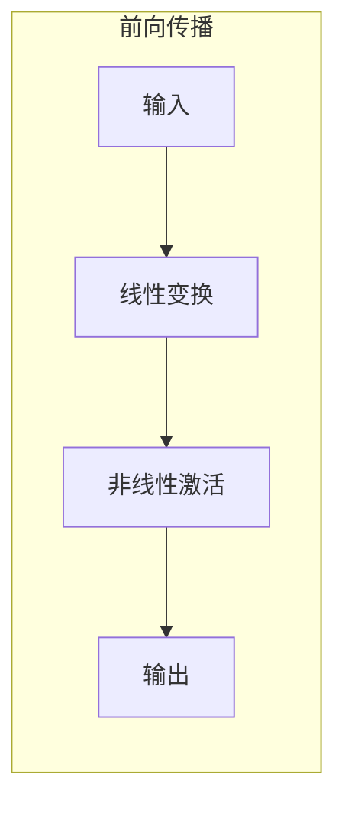
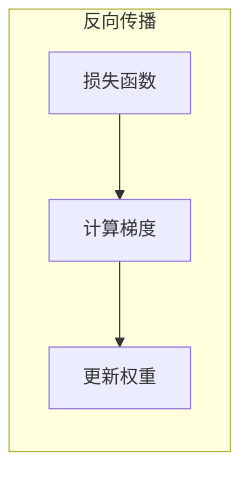

# 深度学习原理与代码实例讲解

## 1. 背景介绍

### 1.1 人工智能的崛起

人工智能(Artificial Intelligence, AI)是当代科技发展的热点领域之一。近年来,AI技术在语音识别、图像处理、自然语言处理等多个领域取得了令人瞩目的成就,深度学习(Deep Learning)作为AI的核心技术之一,功不可没。

### 1.2 深度学习的重要性

深度学习是机器学习(Machine Learning)的一个新的研究方向,它模仿人脑的机制来解释数据,通过对数据进行表征学习,捕捉数据的分布式特征表示,从而完成预测和决策等任务。深度学习已经广泛应用于计算机视觉、自然语言处理、语音识别、推荐系统等领域,取得了非常优异的表现。

## 2. 核心概念与联系

### 2.1 人工神经网络

人工神经网络(Artificial Neural Network, ANN)是深度学习的基础模型,它借鉴了生物神经网络的工作原理,通过构建由节点(神经元)和连接(权重)组成的网络结构,对输入数据进行处理和学习。



### 2.2 深度神经网络

深度神经网络(Deep Neural Network, DNN)是一种包含多个隐藏层的人工神经网络,通过增加网络的深度,可以提高模型对复杂数据的表达能力。



### 2.3 卷积神经网络

卷积神经网络(Convolutional Neural Network, CNN)是一种专门用于处理网格结构数据(如图像)的深度神经网络。它通过卷积操作和池化操作来提取数据的局部特征,从而实现对图像的识别和分类。



### 2.4 循环神经网络

循环神经网络(Recurrent Neural Network, RNN)是一种专门用于处理序列数据(如文本、语音)的深度神经网络。它通过引入循环连接,使得网络可以记住之前的状态,从而更好地处理序列数据。



## 3. 核心算法原理具体操作步骤

### 3.1 前向传播

前向传播(Forward Propagation)是深度学习模型的基本运算过程,它将输入数据通过网络层层传递,最终得到输出结果。具体步骤如下:

1. 初始化网络权重和偏置
2. 输入数据进入输入层
3. 在隐藏层,进行线性变换和非线性激活函数运算
4. 重复第3步,直至输出层
5. 输出层得到最终结果



### 3.2 反向传播

反向传播(Backpropagation)是深度学习模型的核心训练算法,它通过计算损失函数对网络权重的梯度,并使用优化算法(如梯度下降)来更新网络权重,从而使模型逐步拟合训练数据。具体步骤如下:

1. 计算输出层与真实标签的损失函数
2. 计算输出层权重梯度
3. 反向传播,计算隐藏层权重梯度
4. 使用优化算法更新网络权重
5. 重复第1-4步,直至收敛



## 4. 数学模型和公式详细讲解举例说明

### 4.1 线性变换

在深度神经网络中,线性变换是最基本的操作之一。给定输入向量$\mathbf{x}$和权重矩阵$\mathbf{W}$,线性变换的数学表达式为:

$$\mathbf{y} = \mathbf{W}\mathbf{x} + \mathbf{b}$$

其中$\mathbf{b}$是偏置向量。

### 4.2 激活函数

激活函数引入了非线性,使得神经网络能够拟合复杂的函数。常用的激活函数包括:

- Sigmoid函数: $\sigma(x) = \frac{1}{1 + e^{-x}}$
- Tanh函数: $\tanh(x) = \frac{e^x - e^{-x}}{e^x + e^{-x}}$
- ReLU函数: $\text{ReLU}(x) = \max(0, x)$

```mermaid
graph LR
    subgraph 激活函数
        线性变换 --> 激活函数 --> 非线性输出
    end
```

### 4.3 损失函数

损失函数(Loss Function)用于衡量模型预测值与真实值之间的差异。常用的损失函数包括:

- 均方误差(MSE): $\text{MSE}(\mathbf{y}, \hat{\mathbf{y}}) = \frac{1}{n}\sum_{i=1}^{n}(y_i - \hat{y}_i)^2$
- 交叉熵(Cross-Entropy): $\text{CE}(\mathbf{y}, \hat{\mathbf{y}}) = -\sum_{i=1}^{n}y_i\log(\hat{y}_i)$

其中$\mathbf{y}$是真实值,$\hat{\mathbf{y}}$是预测值。

### 4.4 优化算法

优化算法用于根据损失函数的梯度,更新网络权重。常用的优化算法包括:

- 梯度下降(Gradient Descent): $\mathbf{w}_{t+1} = \mathbf{w}_t - \eta\nabla_{\mathbf{w}}J(\mathbf{w}_t)$
- 动量(Momentum): $\mathbf{v}_{t+1} = \gamma\mathbf{v}_t + \eta\nabla_{\mathbf{w}}J(\mathbf{w}_t)$
- Adam: $\mathbf{m}_{t+1} = \beta_1\mathbf{m}_t + (1 - \beta_1)\nabla_{\mathbf{w}}J(\mathbf{w}_t)$

其中$\eta$是学习率,$\gamma$是动量参数,$\beta_1$和$\beta_2$是Adam算法的超参数。

## 5. 项目实践:代码实例和详细解释说明

本节将通过一个实际的代码示例,演示如何使用Python和PyTorch框架构建并训练一个简单的深度神经网络模型。

### 5.1 导入必要的库

```python
import torch
import torch.nn as nn
import torch.optim as optim
```

### 5.2 定义神经网络模型

```python
class Net(nn.Module):
    def __init__(self):
        super(Net, self).__init__()
        self.fc1 = nn.Linear(784, 256)
        self.fc2 = nn.Linear(256, 128)
        self.fc3 = nn.Linear(128, 10)

    def forward(self, x):
        x = x.view(-1, 784)
        x = torch.relu(self.fc1(x))
        x = torch.relu(self.fc2(x))
        x = self.fc3(x)
        return x
```

在这个示例中,我们定义了一个包含三个全连接层的深度神经网络模型。第一个全连接层将784维的输入数据映射到256维的隐藏层,第二个全连接层将256维的隐藏层映射到128维的隐藏层,最后一个全连接层将128维的隐藏层映射到10维的输出层。在每个隐藏层之后,我们使用ReLU激活函数引入非线性。

### 5.3 准备数据

```python
from torchvision import datasets, transforms

transform = transforms.Compose([transforms.ToTensor(), transforms.Normalize((0.1307,), (0.3081,))])
train_dataset = datasets.MNIST(root='./data', train=True, download=True, transform=transform)
test_dataset = datasets.MNIST(root='./data', train=False, download=True, transform=transform)

train_loader = torch.utils.data.DataLoader(train_dataset, batch_size=64, shuffle=True)
test_loader = torch.utils.data.DataLoader(test_dataset, batch_size=64, shuffle=False)
```

在这个示例中,我们使用PyTorch内置的MNIST手写数字数据集。我们首先定义一个数据转换器,将原始图像数据转换为PyTorch张量,并进行归一化处理。然后,我们将数据集分为训练集和测试集,并使用`DataLoader`将数据分批加载。

### 5.4 训练模型

```python
net = Net()
criterion = nn.CrossEntropyLoss()
optimizer = optim.SGD(net.parameters(), lr=0.01, momentum=0.9)

for epoch in range(10):
    running_loss = 0.0
    for inputs, labels in train_loader:
        optimizer.zero_grad()
        outputs = net(inputs)
        loss = criterion(outputs, labels)
        loss.backward()
        optimizer.step()
        running_loss += loss.item()
    print(f"Epoch {epoch+1}, Loss: {running_loss/len(train_loader):.4f}")
```

在这个示例中,我们实例化了神经网络模型、损失函数和优化器。然后,我们进入训练循环,在每个epoch中,我们遍历训练数据集,计算模型输出与真实标签之间的损失,并使用反向传播算法更新模型参数。我们使用交叉熵损失函数和随机梯度下降优化器。

### 5.5 评估模型

```python
correct = 0
total = 0
with torch.no_grad():
    for inputs, labels in test_loader:
        outputs = net(inputs)
        _, predicted = torch.max(outputs.data, 1)
        total += labels.size(0)
        correct += (predicted == labels).sum().item()

print(f"Accuracy: {100 * correct / total:.2f}%")
```

在训练完成后,我们使用测试数据集评估模型的性能。我们遍历测试数据集,计算模型输出的预测值,并与真实标签进行比较,最终得到模型在测试集上的准确率。

通过这个示例,您可以了解如何使用PyTorch构建和训练一个简单的深度神经网络模型。当然,在实际应用中,您可能需要构建更复杂的模型结构,并进行更多的超参数调整和优化。

## 6. 实际应用场景

深度学习技术已经在各个领域取得了广泛的应用,下面列举了一些典型的应用场景:

### 6.1 计算机视觉

- 图像分类: 识别图像中的物体、场景等
- 目标检测: 定位图像中的目标物体并给出边界框
- 语义分割: 对图像中的每个像素进行分类,实现像素级别的目标识别
- 图像生成: 基于给定的条件或噪声生成逼真的图像

### 6.2 自然语言处理

- 机器翻译: 将一种语言的文本翻译成另一种语言
- 文本生成: 根据给定的主题或上下文生成连贯的文本
- 情感分析: 分析文本中蕴含的情感倾向(积极、消极等)
- 问答系统: 根据问题从知识库中检索相关答案

### 6.3 语音识别

- 语音转文本: 将语音信号转录为文本
- 语音合成: 根据给定的文本生成自然的语音
- 说话人识别: 识别语音中的说话人身份

### 6.4 推荐系统

- 个性化推荐: 根据用户的历史行为和偏好,推荐感兴趣的商品或内容
- 协同过滤: 基于用户之间的相似性,推荐其他用户喜欢的项目

### 6.5 其他应用

- 医疗影像分析: 辅助医生诊断疾病
- 金融风险管理: 预测金融市场的走势
- 自动驾驶: 感知环境并做出决策
- 游戏AI: 控制游戏中的智能体行为

## 7. 工具和资源推荐

### 7.1 深度学习框架

- PyTorch: 一个基于Python的开源深度学习框架,具有动态计算图和良好的可扩展性。
- TensorFlow: 由Google开发的开源深度学习框架,支持多种语言,具有丰富的工具和库。
- Keras: 一个高级的神经网络API,可以在TensorFlow或