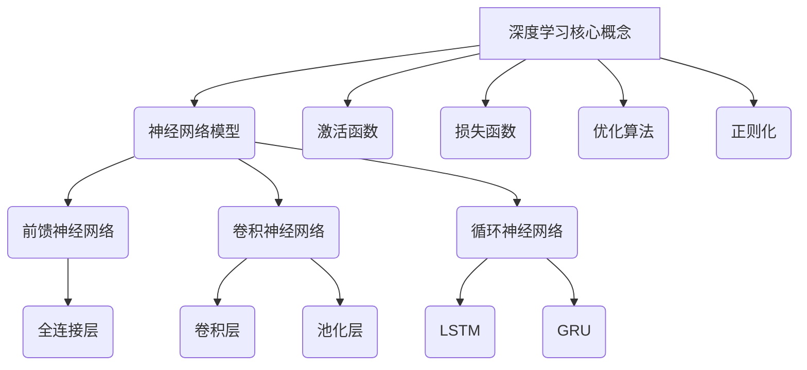

# 深度学习基础原理与代码实战案例讲解

## 1.背景介绍

### 1.1 人工智能的发展历程

人工智能(Artificial Intelligence, AI)是计算机科学的一个分支领域,旨在研究模拟人类智能的理论、技术及应用系统。人工智能的发展经历了几个重要阶段:

- 1950年代,人工智能概念被正式提出,主要研究博弈、推理和机器学习等基础理论。
- 1980年代,专家系统和知识库系统获得广泛应用,推动了人工智能的发展。
- 1990年代,机器学习和神经网络技术逐渐兴起,为人工智能的发展注入新的活力。
- 2010年以后,深度学习技术取得突破性进展,成为人工智能领域的主流方向。

### 1.2 深度学习的兴起

深度学习(Deep Learning)是机器学习的一个分支,它模仿人脑神经网络的工作原理,通过对数据进行表征学习,捕捉数据的分布式特征表示,从而实现系统地对复杂数据进行处理和学习。深度学习的核心思想是利用神经网络模型对数据进行多层次的特征表示和变换,并通过组合低层特征形成更加抽象的高层次特征表示。

深度学习技术在近年来取得了突破性进展,主要原因包括:

1. 算力的飞速发展,强大的并行计算能力为训练深度神经网络提供了硬件支持。
2. 大规模标注数据的积累,为深度神经网络模型提供了充足的训练数据。
3. 新型神经网络模型的不断涌现,如卷积神经网络、循环神经网络等,极大提高了模型的表达能力。
4. 优化算法的改进,如随机梯度下降、自适应学习率等,加速了模型的训练过程。

深度学习技术在计算机视觉、自然语言处理、语音识别等领域取得了卓越的成就,推动了人工智能的快速发展。

## 2.核心概念与联系



深度学习的核心概念主要包括:

### 2.1 神经网络模型

神经网络模型是深度学习的基础,它由多层神经元组成,每层神经元通过权重参数相互连接。常见的神经网络模型包括:

- 前馈神经网络(Feed-Forward Neural Network, FNN):信息只沿一个方向传播,包括全连接层等。
- 卷积神经网络(Convolutional Neural Network, CNN):擅长处理图像等高维数据,包括卷积层和池化层等。
- 循环神经网络(Recurrent Neural Network, RNN):擅长处理序列数据,包括LSTM、GRU等门控单元。

### 2.2 激活函数

激活函数引入非线性因素,增加神经网络的表达能力。常用的激活函数包括Sigmoid、Tanh、ReLU等。

### 2.3 损失函数

损失函数用于衡量模型预测值与真实值之间的差异,是模型优化的驱动力。常见的损失函数有均方误差、交叉熵等。

### 2.4 优化算法

优化算法用于调整神经网络的参数,使损失函数最小化。常用的优化算法有随机梯度下降、Adam等。

### 2.5 正则化

正则化技术旨在防止过拟合,提高模型的泛化能力。常见的正则化方法包括L1/L2正则化、Dropout等。

## 3.核心算法原理具体操作步骤

### 3.1 前馈神经网络

前馈神经网络是最基本的神经网络结构,信息只沿一个方向传播。其核心算法步骤如下:

1. 网络初始化:随机初始化网络权重和偏置参数。
2. 前向传播:输入数据通过网络层层传递,每层神经元根据上一层输出和权重计算加权和,并通过激活函数得到输出。
3. 损失计算:将网络输出与真实标签计算损失函数值。
4. 反向传播:根据损失函数对网络参数进行梯度计算,利用链式法则层层传递误差梯度。
5. 参数更新:根据优化算法更新网络权重和偏置参数。
6. 重复2-5步骤,直至收敛或达到最大迭代次数。

### 3.2 卷积神经网络

卷积神经网络在图像等高维数据处理中表现出色,其核心算法步骤如下:

1. 卷积层:使用多个滤波器(kernel)在输入数据上滑动,提取局部特征。
2. 激活函数:对卷积结果应用非线性激活函数,增强特征表达能力。
3. 池化层:对特征图进行下采样,减少数据量,提取主要特征。
4. 全连接层:将提取的特征展平,连接到全连接层进行分类或回归。
5. 损失计算、反向传播和参数更新同前馈神经网络。

### 3.3 循环神经网络

循环神经网络擅长处理序列数据,其核心算法步骤如下:

1. 序列输入:将序列数据一个时间步一个时间步地输入网络。
2. 递归计算:每个时间步的隐藏状态由当前输入和上一时间步的隐藏状态计算得到。
3. 输出计算:根据当前隐藏状态计算输出。
4. 损失计算:将序列输出与真实标签计算损失函数值。
5. 反向传播:通过反向传播算法计算每个时间步的梯度。
6. 参数更新:根据累积梯度更新网络参数。

## 4.数学模型和公式详细讲解举例说明

### 4.1 神经元模型

神经元是神经网络的基本计算单元,其数学模型可表示为:

$$
y = \phi\left(\sum_{i=1}^{n}w_ix_i + b\right)
$$

其中:
- $x_i$是第$i$个输入
- $w_i$是第$i$个输入对应的权重
- $b$是偏置项
- $\phi$是激活函数

常用的激活函数包括:

- Sigmoid函数: $\phi(x) = \frac{1}{1 + e^{-x}}$
- Tanh函数: $\phi(x) = \frac{e^x - e^{-x}}{e^x + e^{-x}}$
- ReLU函数: $\phi(x) = \max(0, x)$

### 4.2 损失函数

损失函数用于衡量模型预测值与真实值之间的差异,是模型优化的驱动力。

- 均方误差(Mean Squared Error, MSE):
  $$
  \mathcal{L}(y, \hat{y}) = \frac{1}{n}\sum_{i=1}^{n}(y_i - \hat{y}_i)^2
  $$

- 交叉熵损失函数(Cross-Entropy Loss):
  $$
  \mathcal{L}(y, \hat{y}) = -\frac{1}{n}\sum_{i=1}^{n}\left[y_i\log(\hat{y}_i) + (1 - y_i)\log(1 - \hat{y}_i)\right]
  $$

其中$y$是真实标签,$\hat{y}$是模型预测值。

### 4.3 优化算法

优化算法用于调整神经网络的参数,使损失函数最小化。

- 随机梯度下降(Stochastic Gradient Descent, SGD):
  $$
  \theta_{t+1} = \theta_t - \eta\nabla_\theta\mathcal{L}(\theta_t)
  $$
  其中$\theta$是网络参数,$\eta$是学习率,$\nabla_\theta\mathcal{L}(\theta_t)$是损失函数关于$\theta$的梯度。

- Adam优化算法:
  $$
  \begin{aligned}
  m_t &= \beta_1 m_{t-1} + (1 - \beta_1)g_t\\
  v_t &= \beta_2 v_{t-1} + (1 - \beta_2)g_t^2\\
  \hat{m}_t &= \frac{m_t}{1 - \beta_1^t}\\
  \hat{v}_t &= \frac{v_t}{1 - \beta_2^t}\\
  \theta_{t+1} &= \theta_t - \eta\frac{\hat{m}_t}{\sqrt{\hat{v}_t} + \epsilon}
  \end{aligned}
  $$
  其中$m_t$和$v_t$分别是一阶矩估计和二阶矩估计,$\beta_1$和$\beta_2$是相应的指数衰减率,$\epsilon$是一个很小的常数,用于避免除以零。

### 4.4 正则化

正则化技术旨在防止过拟合,提高模型的泛化能力。

- L1正则化:
  $$
  \Omega(\theta) = \lambda\sum_{i=1}^{n}|\theta_i|
  $$

- L2正则化:
  $$
  \Omega(\theta) = \lambda\sum_{i=1}^{n}\theta_i^2
  $$

其中$\lambda$是正则化系数,控制正则化强度。正则化项$\Omega(\theta)$会加到损失函数中,惩罚模型参数的大小。

## 5.项目实践:代码实例和详细解释说明

本节将通过一个实例项目,演示如何使用Python和PyTorch框架实现一个简单的前馈神经网络,并在MNIST手写数字识别任务上进行训练和测试。

### 5.1 导入必要的库

```python
import torch
import torch.nn as nn
import torchvision
import torchvision.transforms as transforms
```

### 5.2 加载和预处理数据

```python
# 下载MNIST数据集
train_dataset = torchvision.datasets.MNIST(root='./data', train=True, transform=transforms.ToTensor(), download=True)
test_dataset = torchvision.datasets.MNIST(root='./data', train=False, transform=transforms.ToTensor())

# 创建数据加载器
batch_size = 64
train_loader = torch.utils.data.DataLoader(dataset=train_dataset, batch_size=batch_size, shuffle=True)
test_loader = torch.utils.data.DataLoader(dataset=test_dataset, batch_size=batch_size, shuffle=False)
```

### 5.3 定义神经网络模型

```python
class MNISTNet(nn.Module):
    def __init__(self):
        super(MNISTNet, self).__init__()
        self.fc1 = nn.Linear(28 * 28, 512)
        self.fc2 = nn.Linear(512, 256)
        self.fc3 = nn.Linear(256, 10)

    def forward(self, x):
        x = x.view(-1, 28 * 28)
        x = torch.relu(self.fc1(x))
        x = torch.relu(self.fc2(x))
        x = self.fc3(x)
        return x

model = MNISTNet()
```

### 5.4 定义损失函数和优化器

```python
criterion = nn.CrossEntropyLoss()
optimizer = torch.optim.Adam(model.parameters(), lr=0.001)
```

### 5.5 训练模型

```python
num_epochs = 10
for epoch in range(num_epochs):
    for i, (images, labels) in enumerate(train_loader):
        outputs = model(images)
        loss = criterion(outputs, labels)
        
        optimizer.zero_grad()
        loss.backward()
        optimizer.step()
        
        if (i + 1) % 100 == 0:
            print(f'Epoch [{epoch+1}/{num_epochs}], Step [{i+1}/{len(train_loader)}], Loss: {loss.item():.4f}')
```

### 5.6 测试模型

```python
correct = 0
total = 0
with torch.no_grad():
    for images, labels in test_loader:
        outputs = model(images)
        _, predicted = torch.max(outputs.data, 1)
        total += labels.size(0)
        correct += (predicted == labels).sum().item()

print(f'Accuracy on test set: {100 * correct / total}%')
```

上述代码实现了一个简单的前馈神经网络,用于MNIST手写数字识别任务。代码中包括数据加载、模型定义、损失函数和优化器设置、模型训练和测试等步骤。通过运行这段代码,你可以了解深度学习模型的基本实现流程。

## 6.实际应用场景

深度学习技术在许多领域得到了广泛应用,下面列举了一些典型的应用场景:

### 