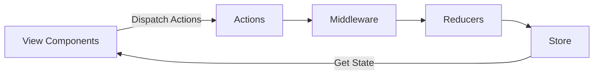

# 状态管理 原理与代码实例讲解

## 1.背景介绍

### 1.1 什么是状态管理?

在现代前端开发中,状态管理是一个至关重要的概念。状态(State)可以理解为应用程序在某个时间点的数据快照,它描述了应用程序的当前状态。随着应用程序的运行,状态会不断发生变化。状态管理就是有效地管理这些状态变化的过程。

随着Web应用程序变得越来越复杂,状态管理的重要性也日益凸显。在传统的前端开发中,状态通常存储在组件的内部状态中,并通过props在组件层次结构中传递。然而,这种方式在大型应用程序中变得难以维护和扩展。

### 1.2 状态管理的必要性

有效的状态管理可以带来以下好处:

1. **可维护性**: 将状态集中管理,使代码更加模块化和可维护。
2. **可预测性**: 状态的变化遵循严格的规则,使应用程序的行为更加可预测。
3. **可测试性**: 集中式状态管理使测试变得更加容易。
4. **性能优化**: 通过优化状态更新,可以提高应用程序的性能。
5. **跨组件通信**: 状态管理解决了跨组件通信的问题,使组件之间的数据流更加清晰。

### 1.3 状态管理模式

目前,前端开发中常见的状态管理模式有以下几种:

1. **React Context API**: React内置的上下文API,用于跨层级组件传递数据。
2. **Redux**: 一个流行的状态管理库,遵循单一数据源原则。
3. **MobX**: 一个响应式状态管理库,基于观察者模式。
4. **Vuex**: Vue.js的官方状态管理库,灵感来自于Redux。
5. **NgRx**: Angular的状态管理库,基于Redux模式。

在本文中,我们将重点介绍Redux,因为它是最广为人知和使用的状态管理库之一。

## 2.核心概念与联系

### 2.1 Redux核心概念

Redux是一个可预测的状态容器,它遵循三大核心原则:

1. **单一数据源(Single Source of Truth)**: 整个应用程序的状态存储在单一的存储区(store)中。
2. **状态是只读的(State is Read-only)**: 唯一改变状态的方式是发出一个动作(action)。
3. **使用纯函数执行状态修改(Changes are made with Pure Functions)**: 通过reducer纯函数来执行状态修改。

Redux的核心概念包括:

- **Store**: 存储应用程序状态的单一数据源。
- **Action**: 描述要执行的操作的普通JavaScript对象。
- **Reducer**: 根据action来更新状态的纯函数。
- **Middleware**: 在action到达reducer之前,可以对action进行处理的函数。



### 2.2 Redux数据流

Redux遵循严格的单向数据流:

1. **View Components**触发**Actions**。
2. **Actions**通过**Middleware**处理后传递给**Reducers**。
3. **Reducers**根据当前状态和Actions计算出新的状态。
4. 新的状态存储在**Store**中。
5. **Store**通知**View Components**状态已更新。
6. **View Components**根据新状态重新渲染。

这种单向数据流使应用程序的状态变化变得可预测和透明,从而提高了可维护性和可测试性。

## 3.核心算法原理具体操作步骤

### 3.1 创建Store

Redux提供了`createStore`函数来创建Store。它接受reducer函数作为参数,以及可选的初始状态和enhancer(如middleware)。

```javascript
import { createStore } from 'redux';
import rootReducer from './reducers';

const store = createStore(rootReducer);
```

### 3.2 定义Actions

Actions是描述要执行操作的普通JavaScript对象。它们通常具有一个type属性,用于标识要执行的操作类型,以及可选的payload属性,用于传递数据。

```javascript
const ADD_TODO = 'ADD_TODO';

const addTodo = (text) => ({
  type: ADD_TODO,
  payload: { text }
});
```

### 3.3 编写Reducers

Reducers是纯函数,它接收当前状态和action作为参数,并返回新的状态。Redux中的所有状态变化都由reducers处理。

```javascript
const initialState = [];

const todoReducer = (state = initialState, action) => {
  switch (action.type) {
    case ADD_TODO:
      return [...state, { text: action.payload.text, completed: false }];
    default:
      return state;
  }
};
```

### 3.4 使用Middleware

Middleware提供了一种在action到达reducer之前对其进行处理的方式。常见的middleware包括日志记录、异步操作处理(如Redux Thunk或Redux Saga)和崩溃报告等。

```javascript
import { createStore, applyMiddleware } from 'redux';
import thunkMiddleware from 'redux-thunk';
import rootReducer from './reducers';

const store = createStore(
  rootReducer,
  applyMiddleware(thunkMiddleware)
);
```

### 3.5 连接React组件

Redux提供了`react-redux`库来连接React组件和Redux Store。`connect`函数用于将组件映射到Redux状态和dispatch函数。

```javascript
import { connect } from 'react-redux';
import { addTodo } from './actions';

const mapStateToProps = (state) => ({
  todos: state.todos
});

const mapDispatchToProps = {
  addTodo
};

const TodoList = connect(
  mapStateToProps,
  mapDispatchToProps
)(TodoListComponent);
```

## 4.数学模型和公式详细讲解举例说明

Redux并没有涉及复杂的数学模型或公式。它是一个基于函数式编程原则的状态管理库,主要依赖于纯函数和不可变数据结构。然而,我们可以探讨一下Redux的一些核心概念背后的数学原理。

### 4.1 纯函数

纯函数是Redux的核心概念之一。纯函数是指给定相同的输入,总是返回相同的输出,且没有任何可观察到的副作用。数学上,纯函数可以表示为:

$$
f(x) = y
$$

其中,$x$是输入,$y$是输出,并且对于相同的$x$,函数$f$总是返回相同的$y$。

在Redux中,reducer就是一个纯函数,它接收当前状态和action作为输入,并返回新的状态作为输出。

$$
newState = reducer(currentState, action)
$$

由于reducer是纯函数,因此对于相同的`currentState`和`action`,它总是返回相同的`newState`。这使得Redux的状态变化变得可预测和可测试。

### 4.2 不可变数据结构

Redux强制使用不可变数据结构来存储状态。这意味着当状态需要更新时,我们不能直接修改现有的状态对象,而是必须创建一个新的状态对象。这可以通过对象扩展运算符或数组方法(如`concat`、`slice`和`map`)来实现。

不可变数据结构的优点包括:

1. **简化复杂功能**: 避免了对可变数据的跟踪,从而简化了检测数据变化的过程。
2. **防止数据竞争**: 通过创建新的数据副本,可以避免多个线程同时修改同一份数据,从而防止了数据竞争问题。
3. **方便实现撤销/重做**: 由于每次状态更新都会创建一个新的数据副本,因此可以轻松实现撤销/重做功能。
4. **性能优化**: 通过引用相等性检查,可以快速确定哪些部分需要重新渲染。

在Redux中,我们可以使用像Immutable.js这样的库来创建不可变数据结构。

## 5.项目实践:代码实例和详细解释说明

为了更好地理解Redux的工作原理,让我们通过一个简单的Todo应用程序来实践一下。

### 5.1 安装依赖

首先,我们需要安装Redux和React-Redux:

```bash
npm install redux react-redux
```

### 5.2 创建Store

在`store.js`文件中,我们创建Redux Store:

```javascript
import { createStore } from 'redux';
import rootReducer from './reducers';

const store = createStore(rootReducer);

export default store;
```

### 5.3 定义Actions和Reducers

在`actions.js`文件中,我们定义了两个actions:

```javascript
export const ADD_TODO = 'ADD_TODO';
export const TOGGLE_TODO = 'TOGGLE_TODO';

export const addTodo = (text) => ({
  type: ADD_TODO,
  payload: { text }
});

export const toggleTodo = (id) => ({
  type: TOGGLE_TODO,
  payload: { id }
});
```

在`reducers.js`文件中,我们定义了todoReducer:

```javascript
import { ADD_TODO, TOGGLE_TODO } from './actions';

const initialState = [];

const todoReducer = (state = initialState, action) => {
  switch (action.type) {
    case ADD_TODO:
      return [...state, { id: state.length, text: action.payload.text, completed: false }];
    case TOGGLE_TODO:
      return state.map((todo) =>
        todo.id === action.payload.id ? { ...todo, completed: !todo.completed } : todo
      );
    default:
      return state;
  }
};

export default todoReducer;
```

### 5.4 连接React组件

在`TodoList.js`文件中,我们创建了一个React组件并连接到Redux Store:

```javascript
import React from 'react';
import { connect } from 'react-redux';
import { addTodo, toggleTodo } from './actions';

const TodoList = ({ todos, addTodo, toggleTodo }) => {
  const handleAddTodo = () => {
    const text = prompt('Enter a new todo item');
    if (text) {
      addTodo(text);
    }
  };

  return (
    <div>
      <button onClick={handleAddTodo}>Add Todo</button>
      <ul>
        {todos.map((todo) => (
          <li
            key={todo.id}
            style={{ textDecoration: todo.completed ? 'line-through' : 'none' }}
            onClick={() => toggleTodo(todo.id)}
          >
            {todo.text}
          </li>
        ))}
      </ul>
    </div>
  );
};

const mapStateToProps = (state) => ({
  todos: state
});

const mapDispatchToProps = {
  addTodo,
  toggleTodo
};

export default connect(mapStateToProps, mapDispatchToProps)(TodoList);
```

### 5.5 在React应用程序中使用Redux

在`index.js`文件中,我们将Redux Store提供给React应用程序:

```javascript
import React from 'react';
import ReactDOM from 'react-dom';
import { Provider } from 'react-redux';
import store from './store';
import TodoList from './TodoList';

ReactDOM.render(
  <Provider store={store}>
    <TodoList />
  </Provider>,
  document.getElementById('root')
);
```

通过这个示例,我们可以看到Redux如何在React应用程序中工作。用户与TodoList组件交互时,会触发actions,这些actions会传递给reducer,reducer会根据当前状态和action计算出新的状态,新的状态会存储在Redux Store中,TodoList组件会重新渲染以反映新的状态。

## 6.实际应用场景

Redux可以应用于各种前端应用程序,尤其是那些需要管理复杂状态的应用程序。以下是一些常见的应用场景:

1. **单页应用(SPA)**: 由于SPA通常具有复杂的状态管理需求,Redux可以很好地满足这些需求。
2. **大型应用程序**: 随着应用程序规模的增长,有效的状态管理变得越来越重要。Redux可以帮助管理大型应用程序的状态。
3. **实时数据应用程序**: 对于需要实时更新数据的应用程序(如聊天应用程序或股票交易应用程序),Redux可以提供一种有效的方式来管理这些实时数据。
4. **多用户协作应用程序**: 在多用户协作应用程序中,Redux可以帮助同步多个用户之间的状态。
5. **可测试性要求高的应用程序**: 由于Redux的可预测性和纯函数特性,它使得应用程序更容易测试。

除了Web应用程序之外,Redux也可以应用于其他领域,如移动应用程序开发(React Native)和服务器端渲染(Next.js、Gatsby等)。

## 7.工具和资源推荐

Redux生态系统中有许多有用的工具和资源可以帮助您更好地使用Redux:

1. **Redux DevTools**: 一个浏览器扩展,可以让您直观地查看Redux Store的状态变化,并提供时间旅行调试功能。
2. **Redux Toolkit**: 官方推荐的Redux开发实践,提供了一些实用程序函数和最佳实践,可以简化Redux的使用。
3. **React Redux**: 官方的React绑定库,用于连接React组件和Redux Store