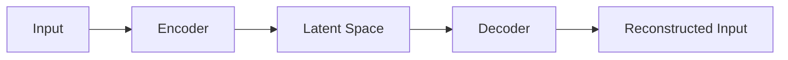

# 自动编码器 (Autoencoder) 原理与代码实例讲解

## 1. 背景介绍
### 1.1 自动编码器的起源与发展
#### 1.1.1 自动编码器的诞生
#### 1.1.2 自动编码器的发展历程
#### 1.1.3 自动编码器在深度学习中的地位

### 1.2 自动编码器的应用场景
#### 1.2.1 数据降维
#### 1.2.2 特征提取
#### 1.2.3 异常检测
#### 1.2.4 图像去噪
#### 1.2.5 生成模型

## 2. 核心概念与联系
### 2.1 编码器 (Encoder)
#### 2.1.1 编码器的定义
#### 2.1.2 编码器的作用
#### 2.1.3 编码器的结构

### 2.2 解码器 (Decoder)  
#### 2.2.1 解码器的定义
#### 2.2.2 解码器的作用
#### 2.2.3 解码器的结构

### 2.3 潜在空间 (Latent Space)
#### 2.3.1 潜在空间的定义
#### 2.3.2 潜在空间的维度
#### 2.3.3 潜在空间的性质

### 2.4 重构误差 (Reconstruction Error)
#### 2.4.1 重构误差的定义
#### 2.4.2 重构误差的计算方法
#### 2.4.3 重构误差的作用

### 2.5 自动编码器的架构图


## 3. 核心算法原理具体操作步骤
### 3.1 自动编码器的训练过程
#### 3.1.1 前向传播
#### 3.1.2 计算重构误差
#### 3.1.3 反向传播
#### 3.1.4 更新参数

### 3.2 自动编码器的推理过程
#### 3.2.1 编码阶段
#### 3.2.2 解码阶段

### 3.3 自动编码器的损失函数
#### 3.3.1 均方误差损失
#### 3.3.2 交叉熵损失
#### 3.3.3 KL散度损失

### 3.4 自动编码器的优化算法
#### 3.4.1 梯度下降法
#### 3.4.2 Adam优化器
#### 3.4.3 RMSprop优化器

## 4. 数学模型和公式详细讲解举例说明
### 4.1 编码器的数学表示
#### 4.1.1 线性变换
$$z = Wx + b$$
其中，$W$为权重矩阵，$b$为偏置向量，$x$为输入向量，$z$为潜在向量。

#### 4.1.2 非线性激活函数
$$a = f(z)$$
其中，$f$为非线性激活函数，如sigmoid、tanh、ReLU等。

### 4.2 解码器的数学表示  
#### 4.2.1 线性变换
$$\hat{x} = W'a + b'$$
其中，$W'$为权重矩阵，$b'$为偏置向量，$a$为潜在向量，$\hat{x}$为重构向量。

#### 4.2.2 非线性激活函数
$$\hat{x} = f(\hat{x})$$
其中，$f$为非线性激活函数，如sigmoid、tanh、ReLU等。

### 4.3 重构误差的数学表示
#### 4.3.1 均方误差
$$L_{MSE} = \frac{1}{n}\sum_{i=1}^n(x^{(i)} - \hat{x}^{(i)})^2$$
其中，$x^{(i)}$为第$i$个样本的输入向量，$\hat{x}^{(i)}$为第$i$个样本的重构向量，$n$为样本数。

#### 4.3.2 交叉熵误差
$$L_{CE} = -\frac{1}{n}\sum_{i=1}^n[x^{(i)}\log\hat{x}^{(i)} + (1-x^{(i)})\log(1-\hat{x}^{(i)})]$$
其中，$x^{(i)}$为第$i$个样本的输入向量，$\hat{x}^{(i)}$为第$i$个样本的重构向量，$n$为样本数。

### 4.4 梯度下降法的数学表示
$$\theta := \theta - \alpha\nabla_{\theta}J(\theta)$$
其中，$\theta$为模型参数，$\alpha$为学习率，$\nabla_{\theta}J(\theta)$为损失函数$J(\theta)$对参数$\theta$的梯度。

## 5. 项目实践：代码实例和详细解释说明
### 5.1 基于PyTorch实现自动编码器
#### 5.1.1 定义编码器和解码器
```python
class Encoder(nn.Module):
    def __init__(self, input_size, hidden_size, latent_size):
        super(Encoder, self).__init__()
        self.fc1 = nn.Linear(input_size, hidden_size)
        self.fc2 = nn.Linear(hidden_size, latent_size)
        
    def forward(self, x):
        x = F.relu(self.fc1(x))
        x = self.fc2(x)
        return x

class Decoder(nn.Module):
    def __init__(self, latent_size, hidden_size, output_size):
        super(Decoder, self).__init__()
        self.fc1 = nn.Linear(latent_size, hidden_size)
        self.fc2 = nn.Linear(hidden_size, output_size)
        
    def forward(self, x):
        x = F.relu(self.fc1(x))
        x = torch.sigmoid(self.fc2(x))
        return x
```

#### 5.1.2 定义自动编码器模型
```python
class Autoencoder(nn.Module):
    def __init__(self, input_size, hidden_size, latent_size):
        super(Autoencoder, self).__init__()
        self.encoder = Encoder(input_size, hidden_size, latent_size)
        self.decoder = Decoder(latent_size, hidden_size, input_size)
        
    def forward(self, x):
        z = self.encoder(x)
        x_hat = self.decoder(z)
        return x_hat
```

#### 5.1.3 训练自动编码器
```python
def train(model, dataloader, optimizer, criterion, device, num_epochs):
    model.train()
    for epoch in range(num_epochs):
        running_loss = 0.0
        for data in dataloader:
            inputs = data.to(device)
            optimizer.zero_grad()
            outputs = model(inputs)
            loss = criterion(outputs, inputs)
            loss.backward()
            optimizer.step()
            running_loss += loss.item()
        print(f"Epoch {epoch+1}, Loss: {running_loss / len(dataloader):.4f}")
```

#### 5.1.4 测试自动编码器
```python
def test(model, dataloader, device):
    model.eval()
    with torch.no_grad():
        for data in dataloader:
            inputs = data.to(device)
            outputs = model(inputs)
            # 可视化重构结果
            visualize(inputs, outputs)
```

### 5.2 基于TensorFlow实现自动编码器
#### 5.2.1 定义编码器和解码器
```python
def encoder(inputs):
    x = tf.keras.layers.Dense(hidden_size, activation='relu')(inputs)
    z = tf.keras.layers.Dense(latent_size)(x)
    return z

def decoder(inputs):
    x = tf.keras.layers.Dense(hidden_size, activation='relu')(inputs)
    x_hat = tf.keras.layers.Dense(input_size, activation='sigmoid')(x)
    return x_hat
```

#### 5.2.2 定义自动编码器模型
```python
def autoencoder(input_size, hidden_size, latent_size):
    inputs = tf.keras.layers.Input(shape=(input_size,))
    z = encoder(inputs)
    x_hat = decoder(z)
    model = tf.keras.Model(inputs=inputs, outputs=x_hat)
    return model
```

#### 5.2.3 训练自动编码器
```python
def train(model, dataset, optimizer, loss_fn, num_epochs):
    for epoch in range(num_epochs):
        for data in dataset:
            with tf.GradientTape() as tape:
                x_hat = model(data)
                loss = loss_fn(data, x_hat)
            gradients = tape.gradient(loss, model.trainable_variables)
            optimizer.apply_gradients(zip(gradients, model.trainable_variables))
        print(f"Epoch {epoch+1}, Loss: {loss.numpy():.4f}")
```

#### 5.2.4 测试自动编码器
```python
def test(model, dataset):
    for data in dataset:
        x_hat = model(data)
        # 可视化重构结果
        visualize(data, x_hat)
```

## 6. 实际应用场景
### 6.1 图像压缩
#### 6.1.1 使用自动编码器进行图像压缩的原理
#### 6.1.2 图像压缩的实现步骤
#### 6.1.3 图像压缩的效果评估

### 6.2 异常检测
#### 6.2.1 使用自动编码器进行异常检测的原理
#### 6.2.2 异常检测的实现步骤 
#### 6.2.3 异常检测的性能评估

### 6.3 数据去噪
#### 6.3.1 使用自动编码器进行数据去噪的原理
#### 6.3.2 数据去噪的实现步骤
#### 6.3.3 数据去噪的效果评估

### 6.4 数据生成
#### 6.4.1 使用自动编码器进行数据生成的原理
#### 6.4.2 数据生成的实现步骤
#### 6.4.3 生成数据的质量评估

## 7. 工具和资源推荐
### 7.1 深度学习框架
#### 7.1.1 PyTorch
#### 7.1.2 TensorFlow
#### 7.1.3 Keras

### 7.2 数据集
#### 7.2.1 MNIST
#### 7.2.2 CIFAR-10
#### 7.2.3 ImageNet

### 7.3 预训练模型
#### 7.3.1 VGG
#### 7.3.2 ResNet
#### 7.3.3 Inception

### 7.4 可视化工具
#### 7.4.1 TensorBoard
#### 7.4.2 Visdom
#### 7.4.3 Matplotlib

## 8. 总结：未来发展趋势与挑战
### 8.1 自动编码器的变体与改进
#### 8.1.1 稀疏自动编码器
#### 8.1.2 去噪自动编码器
#### 8.1.3 变分自动编码器

### 8.2 自动编码器与其他模型的结合
#### 8.2.1 自动编码器与卷积神经网络
#### 8.2.2 自动编码器与循环神经网络
#### 8.2.3 自动编码器与生成对抗网络

### 8.3 自动编码器面临的挑战
#### 8.3.1 模型的可解释性
#### 8.3.2 模型的稳定性
#### 8.3.3 模型的泛化能力

## 9. 附录：常见问题与解答
### 9.1 自动编码器与PCA的区别与联系
### 9.2 如何选择自动编码器的潜在空间维度
### 9.3 如何处理自动编码器训练过程中的过拟合问题
### 9.4 如何评估自动编码器的重构质量
### 9.5 自动编码器能否用于监督学习任务

作者：禅与计算机程序设计艺术 / Zen and the Art of Computer Programming