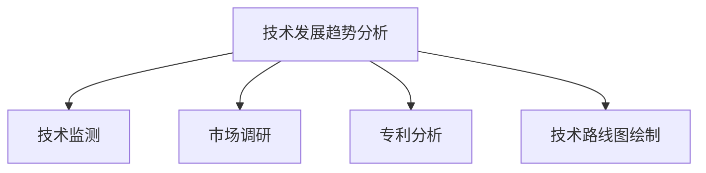
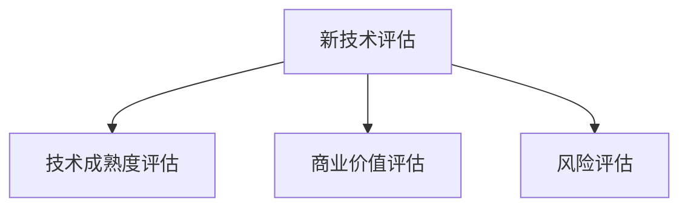
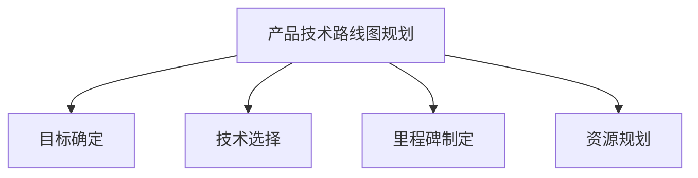
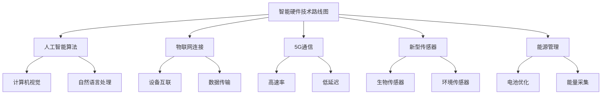

# 行业最新产品的技术发展方向研究方案

## 1.背景介绍

在当今快节奏的技术发展时代，企业需要紧跟行业最新产品的技术发展趋势,以保持竞争优势。本文将探讨如何制定行业最新产品的技术发展方向研究方案,旨在帮助企业洞察未来技术趋势,制定有效的产品战略。

### 1.1 行业现状与挑战

现代企业面临着日益激烈的市场竞争,技术创新是保持竞争力的关键。然而,技术发展日新月异,企业难以准确预测未来趋势。此外,新兴技术的出现也带来了新的挑战,如人工智能、物联网等技术的应用场景和潜在风险等。

### 1.2 研究意义

制定行业最新产品的技术发展方向研究方案,可以帮助企业:

1. 洞悉行业技术发展趋势
2. 评估新技术的商业价值
3. 制定科学的产品技术路线图
4. 优化资源配置,提高研发效率
5. 降低技术风险,增强竞争优势

## 2.核心概念与联系

制定行业最新产品的技术发展方向研究方案,需要理解以下核心概念及其关联:

### 2.1 技术发展趋势分析

技术发展趋势分析是研究方案的基础,包括技术监测、市场调研、专利分析和技术路线图绘制等环节。

### 2.2 新技术评估

新技术评估旨在全面考量新技术的技术成熟度、商业价值和潜在风险,为企业制定技术战略提供决策依据。

### 2.3 产品技术路线图规划

产品技术路线图规划将企业战略目标与技术发展趋势相结合,明确技术选择、里程碑和资源配置计划。

## 3.核心算法原理具体操作步骤

制定行业最新产品的技术发展方向研究方案,需要遵循以下核心算法原理和具体操作步骤:

### 3.1 技术发展趋势分析算法

1. 技术监测
   - 建立技术监测体系,持续跟踪行业内外的技术动态
   - 收集技术相关的论文、专利、新闻等信息
   - 分析技术发展趋势和热点领域

2. 市场调研
   - 调研目标市场的需求和痛点
   - 分析竞争对手的技术布局
   - 评估新技术的市场潜力

3. 专利分析
   - 检索与目标技术相关的专利
   - 分析专利的技术原理和应用场景
   - 评估专利的有效性和风险

4. 技术路线图绘制
   - 综合技术监测、市场调研和专利分析结果
   - 绘制技术发展路线图
   - 确定关键技术节点和里程碑

### 3.2 新技术评估算法

1. 技术成熟度评估
   - 评估技术的理论基础和科学原理
   - 分析技术的实现难度和可行性
   - 考虑技术的发展历程和现状

2. 商业价值评估
   - 分析技术的应用场景和市场需求
   - 评估技术带来的经济效益
   - 考虑技术的竞争优势和壁垒

3. 风险评估
   - 识别技术实现过程中的潜在风险
   - 评估技术应用带来的法律、伦理和社会风险
   - 制定风险缓解和应对策略

### 3.3 产品技术路线图规划算法

1. 目标确定
   - 明确企业的战略目标和产品愿景
   - 结合技术发展趋势分析结果
   - 制定技术发展目标和里程碑

2. 技术选择
   - 根据新技术评估结果
   - 选择适合企业发展的关键技术
   - 制定技术采纳和落地计划

3. 里程碑制定
   - 将技术发展目标分解为可执行的里程碑
   - 确定每个里程碑的时间节点和交付物
   - 建立里程碑追踪和调整机制

4. 资源规划
   - 评估技术实现所需的人力、财力和物力资源
   - 制定资源配置计划
   - 建立资源监控和优化机制

## 4.数学模型和公式详细讲解举例说明

在制定行业最新产品的技术发展方向研究方案过程中,可以应用多种数学模型和公式,以量化分析和优化决策。

### 4.1 技术生命周期模型

技术生命周期模型描述了技术从出现到被替代的整个过程,可用于预测技术的发展趋势和时间节点。常见的技术生命周期模型包括S曲线模型和Gartner曲线模型。

S曲线模型使用logistics函数来描述技术的发展过程:

$$
f(t) = \frac{L}{1 + e^{-k(t-t_0)}}
$$

其中:
- $f(t)$表示技术在时间$t$的发展水平
- $L$表示技术的最大发展水平
- $k$表示技术发展的速率
- $t_0$表示技术发展的中点时间

通过对历史数据的拟合,可以估计模型参数,并预测技术的未来发展趋势。

### 4.2 技术重要性评估模型

技术重要性评估模型可用于量化评估技术的重要性,为技术选择提供依据。常见的模型包括层次分析法(AHP)和技术重要度评分卡模型。

AHP模型将技术重要性分解为多个标准,并通过两两比较的方式确定每个标准的权重,最终计算技术的综合重要性得分:

$$
S_i = \sum_{j=1}^n w_j r_{ij}
$$

其中:
- $S_i$表示第$i$项技术的综合得分
- $w_j$表示第$j$个标准的权重
- $r_{ij}$表示第$i$项技术在第$j$个标准下的得分

通过比较不同技术的综合得分,可以确定技术的相对重要性排序。

### 4.3 技术路线图优化模型

技术路线图优化模型旨在确定最优的技术发展路线,以实现既定目标并最大化收益。常见的优化模型包括整数规划模型和动态规划模型。

整数规划模型可用于技术选择和资源分配的优化:

$$
\begin{aligned}
\max \quad & \sum_{i=1}^m \sum_{j=1}^n r_{ij} x_{ij} \\
\text{s.t.} \quad & \sum_{i=1}^m c_i x_i \leq B \\
             & x_i \in \{0, 1\} \quad \forall i=1,\ldots,m
\end{aligned}
$$

其中:
- $r_{ij}$表示采用第$i$项技术在第$j$个里程碑的收益
- $x_{ij}$是决策变量,表示是否采用第$i$项技术
- $c_i$表示采用第$i$项技术的成本
- $B$表示可用的预算

通过求解该整数规划模型,可以获得最优的技术组合方案。

## 5.项目实践:代码实例和详细解释说明

为了更好地理解和应用上述算法和模型,我们将通过一个实际项目案例进行说明。假设某科技公司希望制定其智能硬件产品线的技术发展方向研究方案,以保持行业领先地位。

### 5.1 技术发展趋势分析

我们首先进行技术发展趋势分析,包括技术监测、市场调研、专利分析和技术路线图绘制。

1. 技术监测

通过对学术论文、行业报告和技术博客的分析,我们发现人工智能、物联网、5G通信和新型传感器等技术正在快速发展,并逐渐应用于智能硬件产品中。

2. 市场调研

通过对用户需求和竞争对手产品的调研,我们发现消费者越来越追求智能硬件产品的便携性、智能化和可穿戴性。同时,竞争对手也在加大对这些技术的投入。

3. 专利分析

我们检索了与智能硬件相关的专利,发现人工智能算法、传感器集成和能源管理等领域的专利数量快速增长。这些专利为智能硬件产品的技术创新提供了重要支撑。

4. 技术路线图绘制

基于上述分析结果,我们绘制了智能硬件产品线的技术路线图,确定了人工智能算法、物联网连接、5G通信、新型传感器和能源管理等关键技术领域。

### 5.2 新技术评估

接下来,我们对上述关键技术进行评估,以确定采纳优先级。

1. 技术成熟度评估

我们评估了每项技术的理论基础、实现难度和发展历程,结果显示人工智能算法和5G通信技术相对成熟,而新型传感器和能源采集技术仍处于发展初期。

2. 商业价值评估

通过分析技术的应用场景和市场需求,我们发现人工智能算法和物联网连接技术具有较高的商业价值,可以显著提升产品的智能化和互联性。

3. 风险评估

我们还评估了每项技术的潜在风险,如人工智能算法的伦理和隐私风险、5G通信的健康风险等,并制定了相应的风险缓解策略。

### 5.3 产品技术路线图规划

基于上述分析和评估结果,我们制定了智能硬件产品线的技术路线图。

1. 目标确定

我们确定了产品线的战略目标是成为智能硬件行业的领导者,提供高度智能化、互联化和可穿戴性的产品。

2. 技术选择

根据新技术评估结果,我们优先选择人工智能算法、物联网连接和5G通信技术,同时关注新型传感器和能源管理技术的发展。

3. 里程碑制定

我们将技术发展目标分解为以下里程碑:

- 2024年:集成人工智能算法,实现基本的智能化功能
- 2025年:实现物联网连接,支持设备互联和数据传输
- 2026年:升级至5G通信,提高网络速率和响应速度
- 2027年:集成新型传感器,增强产品的感知能力
- 2028年:优化能源管理,提高产品的续航能力

4. 资源规划

我们评估了实现上述里程碑所需的人力、财力和物力资源,制定了资源配置计划。同时,我们还建立了资源监控和优化机制,以确保资源的高效利用。

通过实际项目案例,我们展示了如何应用算法和模型来制定行业最新产品的技术发展方向研究方案。该方案为公司的产品技术发展提供了清晰的路线图和决策依据。

## 6.实际应用场景

制定行业最新产品的技术发展方向研究方案,可以广泛应用于各个行业和领域,包括但不限于:

1. 消费电子行业
   - 智能手机、可穿戴设备、家用电器等产品线
   - 评估新兴技术如人工智能、5G通信、柔性显示等的应用前景

2. 汽车行业
   - 智能网联汽车、自动