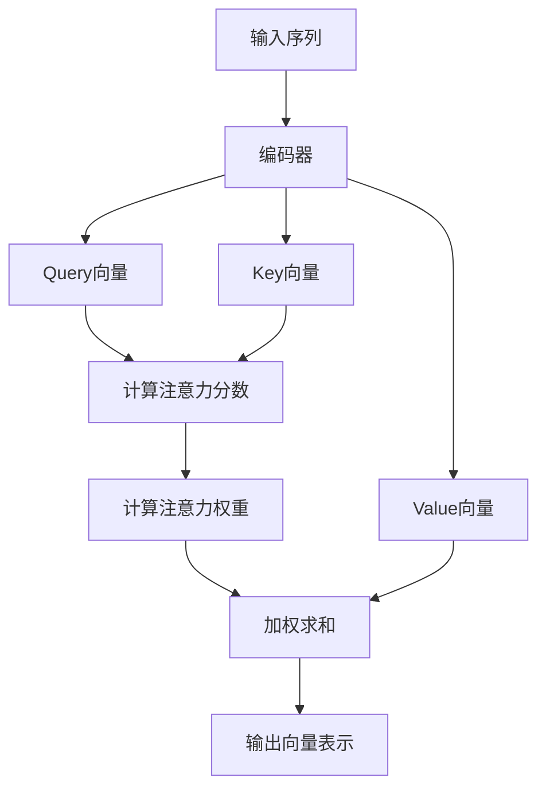

# 见微知著开慧眼：引入注意力机制

## 1.背景介绍

在深度学习的浪潮中,注意力机制作为一种全新的神经网络架构,正在引领着人工智能的新潮流。传统的神经网络模型在处理序列数据时存在局限性,无法很好地捕捉长期依赖关系。而注意力机制则能够让模型自适应地为每个输出分配注意力权重,从而更好地关注相关的输入部分,有效克服了长期依赖问题。

注意力机制最初被提出用于机器翻译任务,旨在帮助神经网络更好地关注输入序列中与当前翻译相关的部分。随后,注意力机制在计算机视觉、自然语言处理、语音识别等多个领域展现出卓越的性能,成为深度学习的关键技术之一。

## 2.核心概念与联系

注意力机制的核心思想是允许模型在对输入序列进行编码时,对不同位置的输入赋予不同的注意力权重。具体来说,注意力机制包含以下三个核心概念:

### 2.1 Query (查询向量)

Query向量代表了当前需要处理的输入,是注意力机制的查询目标。在机器翻译任务中,Query向量可以是当前需要翻译的源语言词语;在图像分类任务中,Query向量可以是当前需要识别的图像区域。

### 2.2 Key (键向量)

Key向量代表了输入序列的不同位置编码,是注意力机制的查询源。注意力机制需要计算Query向量与所有Key向量的相似性,从而确定应该关注输入序列的哪些部分。

### 2.3 Value (值向量)

Value向量对应于输入序列的不同位置的实际特征信息。注意力机制根据Query向量与Key向量的相似性,对应地获取并综合不同位置的Value向量,形成最终的输出表示。

这三个核心概念相互关联、环环相扣,共同构成了注意力机制的基本运作框架。

## 3.核心算法原理具体操作步骤 

注意力机制的计算过程可以概括为以下几个步骤:

1. **准备输入**:将输入序列(如文本序列或图像)通过某种编码方式(如RNN或CNN)转换为一系列的向量表示,分别对应于Query、Key和Value。

2. **计算注意力分数**:计算Query向量与每个Key向量之间的相似性分数,常用的方法有点积运算或缩放点积运算。这些分数反映了Query向量与不同位置Key向量的关联程度。

   $$
   \text{Attention}(Q, K, V) = \text{softmax}\left(\frac{QK^T}{\sqrt{d_k}}\right)V
   $$

   其中,$Q$为Query向量,$K$为Key向量,$V$为Value向量,$d_k$为缩放因子,用于防止点积值过大导致梯度消失或爆炸。

3. **计算注意力权重**:通过Softmax函数将注意力分数转换为注意力权重,确保所有权重之和为1。较大的权重意味着对应位置的输入对当前Query更加相关。

4. **计算加权和**:将每个Value向量根据对应的注意力权重进行加权求和,得到最终的输出向量表示。这一步相当于对输入序列中不同位置的信息进行加权融合。

5. **后续处理**:根据具体任务,可以将注意力机制的输出向量表示送入下游的神经网络层(如全连接层或解码器)进行进一步处理。

注意力机制的计算过程可以用以下Mermaid流程图直观表示:



这种自适应分配注意力权重的机制,使得模型能够更好地关注输入序列中与当前任务相关的部分,从而提高了模型的性能和泛化能力。

## 4.数学模型和公式详细讲解举例说明

为了更好地理解注意力机制的数学原理,我们来具体分析一下注意力分数的计算公式:

$$\text{Attention}(Q, K, V) = \text{softmax}\left(\frac{QK^T}{\sqrt{d_k}}\right)V$$

其中:

- $Q$是Query向量,表示当前需要处理的输入;
- $K$是Key向量组,表示输入序列在不同位置的编码;
- $V$是Value向量组,表示输入序列在不同位置的实际特征信息;
- $d_k$是缩放因子,通常取$K$向量的维度$\sqrt{d_k}$,目的是防止点积值过大导致梯度消失或爆炸。

这个公式可以拆解为以下几个步骤:

1. **计算注意力分数**:通过计算Query向量$Q$与每个Key向量$K_i$的点积,得到一个注意力分数向量$e$:

   $$e_i = \frac{Q \cdot K_i}{\sqrt{d_k}}$$

   其中,$e_i$表示$Q$与第$i$个$K_i$的注意力分数。点积运算可以反映两个向量之间的相似性,分数越大,说明$Q$与$K_i$越相关。

2. **应用Softmax函数**:将注意力分数向量$e$输入到Softmax函数中,得到一个概率分布向量$\alpha$:

   $$\alpha = \text{softmax}(e) = \left[\frac{e^{e_1}}{\sum_j e^{e_j}}, \frac{e^{e_2}}{\sum_j e^{e_j}}, \ldots, \frac{e^{e_n}}{\sum_j e^{e_j}}\right]$$

   其中,$\alpha_i$表示第$i$个位置的注意力权重,所有权重之和为1。较大的$\alpha_i$意味着模型将更多地关注输入序列中的第$i$个位置。

3. **加权求和**:使用注意力权重向量$\alpha$对Value向量组$V$进行加权求和,得到最终的输出向量表示$z$:

   $$z = \sum_{i=1}^n \alpha_i V_i$$

   其中,$V_i$是输入序列中第$i$个位置的Value向量。这一步相当于对输入序列中不同位置的信息进行加权融合,得到一个综合的表示。

让我们用一个具体的例子来说明注意力机制的计算过程。假设我们有一个机器翻译任务,需要将英文句子"I love machine learning"翻译成中文。我们使用注意力机制的编码器-解码器框架,其中编码器将英文句子编码为一系列向量表示,解码器则根据这些向量生成中文翻译。

在生成中文句子的第一个词时,解码器需要计算一个Query向量$Q$,表示当前需要生成的是句子的第一个词。然后,编码器生成的英文句子的向量表示就是Key向量组$K$和Value向量组$V$。注意力机制需要计算$Q$与每个$K_i$的相似性分数$e_i$,并通过Softmax函数得到注意力权重$\alpha_i$。

假设计算结果为:$\alpha = [0.1, 0.7, 0.2]$,则解码器将更多地关注英文句子中的第二个词"love",因为它对应的注意力权重最大。解码器将对应的Value向量$V_2$赋予更大的权重,综合英文句子的不同部分信息,生成中文句子的第一个词。

通过这个例子,我们可以直观地看到注意力机制是如何自适应地分配注意力权重,并基于此生成最终的输出表示。这种机制使得模型能够更好地关注与当前任务相关的输入部分,从而提高了翻译或其他任务的性能。

## 5.项目实践:代码实例和详细解释说明

为了更好地理解注意力机制的实现细节,我们来看一个基于PyTorch的代码示例,实现一个简单的注意力层。

```python
import torch
import torch.nn as nn

class AttentionLayer(nn.Module):
    def __init__(self, input_dim, output_dim):
        super(AttentionLayer, self).__init__()
        self.query = nn.Linear(output_dim, input_dim)
        self.key = nn.Linear(input_dim, input_dim)
        self.value = nn.Linear(input_dim, output_dim)
        self.scale = (input_dim ** 0.5)

    def forward(self, query, key, value):
        # 计算注意力分数
        query = self.query(query)
        key = self.key(key)
        attention_scores = torch.matmul(query, key.transpose(-2, -1)) / self.scale

        # 计算注意力权重
        attention_weights = nn.functional.softmax(attention_scores, dim=-1)

        # 加权求和
        output = torch.matmul(attention_weights, self.value(value))

        return output
```

这个代码定义了一个`AttentionLayer`模块,实现了注意力机制的核心计算过程。让我们逐步解释一下代码:

1. **初始化**:在`__init__`方法中,我们定义了三个线性层,分别用于计算Query向量、Key向量和Value向量。`input_dim`是输入向量的维度,`output_dim`是输出向量的维度。`self.scale`是缩放因子,用于防止点积值过大导致梯度消失或爆炸。

2. **前向传播**:在`forward`方法中,我们实现了注意力机制的计算过程。

   - 首先,通过线性层计算Query向量、Key向量和Value向量。
   - 然后,计算Query向量与每个Key向量的点积,得到注意力分数矩阵`attention_scores`。我们使用`torch.matmul`函数计算矩阵乘法,并除以缩放因子`self.scale`。
   - 接下来,使用`nn.functional.softmax`函数将注意力分数矩阵转换为注意力权重矩阵`attention_weights`。这一步确保了所有权重之和为1。
   - 最后,将注意力权重矩阵与Value向量矩阵相乘,得到最终的输出向量表示`output`。

这个示例代码实现了注意力机制的基本功能,但为了简洁起见,我们省略了一些细节,如添加掩码(mask)、多头注意力等高级特性。在实际应用中,您可以根据具体需求对代码进行扩展和优化。

## 6.实际应用场景

注意力机制在多个领域展现出卓越的性能,成为深度学习的关键技术之一。以下是一些典型的应用场景:

### 6.1 机器翻译

注意力机制最初被提出用于机器翻译任务,旨在帮助神经网络更好地关注输入序列中与当前翻译相关的部分。在翻译过程中,注意力机制可以自适应地分配注意力权重,从而更好地捕捉源语言和目标语言之间的对应关系,提高了翻译质量。

### 6.2 图像分类与识别

在计算机视觉领域,注意力机制可以应用于图像分类、目标检测和图像描述生成等任务。注意力机制能够让模型自适应地关注图像中与当前任务相关的区域,从而提高了模型的性能和泛化能力。

### 6.3 自然语言处理

除了机器翻译,注意力机制还广泛应用于自然语言处理的其他任务,如文本摘要、情感分析、问答系统等。注意力机制可以帮助模型更好地捕捉文本序列中的关键信息,提高了模型对自然语言的理解能力。

### 6.4 语音识别

在语音识别领域,注意力机制可以应用于端到端的语音识别模型中,帮助模型更好地关注语音序列中与当前识别相关的部分,提高了识别准确性。

### 6.5 推荐系统

在推荐系统中,注意力机制可以用于捕捉用户历史行为序列中与当前推荐相关的部分,从而生成更加个性化和准确的推荐结果。

### 6.6 其他领域

除了上述领域,注意力机制还在时序预测、强化学习、多模态融合等多个领域展现出优异的性能,成为深度学习的核心技术之一。

## 7.工具和资源推荐

如果您希望进一步学习和实践注意力机制,以下是一些推荐的工具和资源:

###