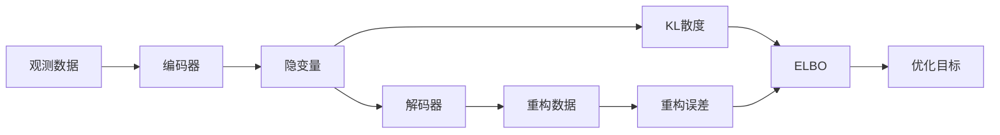

# 贝叶斯深度学习原理与代码实战案例讲解

## 1. 背景介绍
### 1.1 深度学习的发展历程
### 1.2 贝叶斯理论在深度学习中的应用价值
### 1.3 贝叶斯深度学习的研究现状与挑战

## 2. 核心概念与联系
### 2.1 贝叶斯理论基础
#### 2.1.1 先验概率与后验概率
#### 2.1.2 贝叶斯定理
#### 2.1.3 最大似然估计与最大后验估计
### 2.2 深度学习基础
#### 2.2.1 人工神经网络
#### 2.2.2 卷积神经网络
#### 2.2.3 循环神经网络
### 2.3 贝叶斯深度学习核心思想
#### 2.3.1 将贝叶斯推断引入深度学习
#### 2.3.2 不确定性建模与量化
#### 2.3.3 先验知识的引入与利用

## 3. 核心算法原理具体操作步骤
### 3.1 变分推断
#### 3.1.1 变分推断基本原理
#### 3.1.2 证据下界(ELBO)
#### 3.1.3 变分自编码器(VAE)
### 3.2 马尔可夫链蒙特卡洛(MCMC)方法
#### 3.2.1 Metropolis-Hastings采样
#### 3.2.2 Gibbs采样
#### 3.2.3 Hamiltonian Monte Carlo(HMC)
### 3.3 随机梯度MCMC
#### 3.3.1 随机梯度Langevin动力学(SGLD)
#### 3.3.2 随机梯度Hamilton Monte Carlo(SGHMC)
#### 3.3.3 随机梯度Nose-Hoover热力学(SGNHT)

## 4. 数学模型和公式详细讲解举例说明
### 4.1 贝叶斯定理与条件概率
$$P(\theta|X) = \frac{P(X|\theta)P(\theta)}{P(X)}$$
其中，$P(\theta|X)$为后验概率，$P(X|\theta)$为似然函数，$P(\theta)$为先验概率，$P(X)$为归一化因子。
### 4.2 变分推断目标函数
$$\mathcal{L}(q) = \mathbb{E}_{q(\theta)}[\log p(X|\theta)] - KL(q(\theta)||p(\theta))$$
其中，$q(\theta)$是变分分布，用于近似后验分布$p(\theta|X)$，$KL(q||p)$为KL散度，用于衡量两个分布的差异。
### 4.3 随机梯度Langevin动力学(SGLD)更新公式
$$\Delta \theta_t = \frac{\epsilon_t}{2}(\nabla\log p(\theta_t) + \frac{N}{n}\sum_{i=1}^n \nabla\log p(x_i|\theta_t)) + \eta_t$$
其中，$\epsilon_t$为步长，$\eta_t \sim \mathcal{N}(0,\epsilon_t)$为高斯噪声，$N$为数据总量，$n$为小批量数据量。

## 5. 项目实践：代码实例和详细解释说明
### 5.1 使用PyTorch实现贝叶斯神经网络
```python
import torch
import torch.nn as nn
import torch.nn.functional as F
import torch.optim as optim

class BayesianLayer(nn.Module):
    def __init__(self, in_features, out_features):
        super().__init__()
        self.in_features = in_features
        self.out_features = out_features
        
        self.w_mu = nn.Parameter(torch.Tensor(out_features, in_features))
        self.w_rho = nn.Parameter(torch.Tensor(out_features, in_features))
        self.b_mu = nn.Parameter(torch.Tensor(out_features))
        self.b_rho = nn.Parameter(torch.Tensor(out_features))
        
        self.reset_parameters()
        
    def reset_parameters(self):
        stdv = 1. / math.sqrt(self.w_mu.size(1))
        self.w_mu.data.uniform_(-stdv, stdv)
        self.w_rho.data.fill_(-5)
        self.b_mu.data.uniform_(-stdv, stdv) 
        self.b_rho.data.fill_(-5)
        
    def forward(self, x, sample=False):
        if sample:
            w_eps = torch.randn_like(self.w_mu)
            w = self.w_mu + torch.log(1+torch.exp(self.w_rho)) * w_eps
            b_eps = torch.randn_like(self.b_mu) 
            b = self.b_mu + torch.log(1+torch.exp(self.b_rho)) * b_eps
        else:
            w = self.w_mu
            b = self.b_mu
            
        return F.linear(x, w, b)
```
上述代码定义了一个贝叶斯层`BayesianLayer`，其权重参数服从正态分布，均值和标准差由可训练参数`w_mu`、`w_rho`、`b_mu`、`b_rho`决定。在前向传播时，可以选择是否对权重参数进行采样，实现贝叶斯推断。

### 5.2 使用TensorFlow实现变分自编码器(VAE)
```python
import tensorflow as tf

class VAE(tf.keras.Model):
    def __init__(self, latent_dim):
        super(VAE, self).__init__()
        self.latent_dim = latent_dim
        
        self.encoder = tf.keras.Sequential([
            tf.keras.layers.InputLayer(input_shape=(28, 28, 1)),
            tf.keras.layers.Conv2D(filters=32, kernel_size=3, strides=(2, 2), activation='relu'),
            tf.keras.layers.Conv2D(filters=64, kernel_size=3, strides=(2, 2), activation='relu'),
            tf.keras.layers.Flatten(),
            tf.keras.layers.Dense(latent_dim + latent_dim)
        ])
        
        self.decoder = tf.keras.Sequential([
            tf.keras.layers.InputLayer(input_shape=(latent_dim,)),
            tf.keras.layers.Dense(units=7*7*32, activation=tf.nn.relu),
            tf.keras.layers.Reshape(target_shape=(7, 7, 32)),
            tf.keras.layers.Conv2DTranspose(filters=64, kernel_size=3, strides=2, padding='same', activation='relu'),
            tf.keras.layers.Conv2DTranspose(filters=32, kernel_size=3, strides=2, padding='same', activation='relu'),
            tf.keras.layers.Conv2DTranspose(filters=1, kernel_size=3, strides=1, padding='same', activation='sigmoid')
        ])
        
    def encode(self, x):
        mean, logvar = tf.split(self.encoder(x), num_or_size_splits=2, axis=1)
        return mean, logvar
    
    def reparameterize(self, mean, logvar):
        eps = tf.random.normal(shape=mean.shape)
        return eps * tf.exp(logvar * .5) + mean
    
    def decode(self, z):
        return self.decoder(z)
    
    def call(self, x):
        mean, logvar = self.encode(x)
        z = self.reparameterize(mean, logvar)
        return self.decode(z), mean, logvar
```
上述代码使用TensorFlow实现了一个变分自编码器，由编码器和解码器组成。编码器将输入图像压缩到隐变量空间，并输出隐变量的均值和对数方差。解码器将隐变量解码为重构图像。在训练过程中，通过最小化重构误差和KL散度来优化模型参数，实现对数据分布的近似和生成。

## 6. 实际应用场景
### 6.1 图像分类
贝叶斯深度学习可以用于图像分类任务，通过引入先验知识和不确定性估计，提高分类性能并量化预测的置信度。
### 6.2 自然语言处理
在自然语言处理领域，贝叶斯深度学习可以用于文本分类、情感分析、机器翻译等任务，通过建模不确定性提高模型的鲁棒性和可解释性。
### 6.3 推荐系统
贝叶斯深度学习可以应用于推荐系统，通过引入先验知识和建模不确定性，提高推荐的准确性和多样性，并量化推荐的置信度。
### 6.4 异常检测
在工业制造、金融风控等领域，贝叶斯深度学习可以用于异常检测，通过建模数据分布和量化异常分数，及时发现异常情况并进行预警。

## 7. 工具和资源推荐
### 7.1 深度学习框架
- TensorFlow: https://www.tensorflow.org/
- PyTorch: https://pytorch.org/
- Keras: https://keras.io/
### 7.2 贝叶斯深度学习库
- Edward: http://edwardlib.org/
- Pyro: https://pyro.ai/
- ZhuSuan: https://zhusuan.readthedocs.io/
### 7.3 相关论文与教程
- Yarin Gal的博士论文《Uncertainty in Deep Learning》
- NIPS 2016教程《Bayesian Deep Learning》
- NIPS 2017教程《Bayesian Deep Learning: Uncertainty in Deep Learning》

## 8. 总结：未来发展趋势与挑战
### 8.1 研究热点
- 将贝叶斯推断与深度学习相结合，探索新的建模范式
- 提高贝叶斯深度学习的计算效率和可扩展性
- 在更多实际应用场景中验证贝叶斯深度学习的有效性
### 8.2 面临挑战
- 贝叶斯推断的计算复杂度高，难以应用于大规模深度模型
- 先验分布的选择对模型性能影响大，需要专家经验指导
- 缺乏贝叶斯深度学习的理论保证和收敛性分析
### 8.3 未来展望
- 探索更高效的近似推断算法，提高贝叶斯深度学习的实用性
- 研究先验知识的自动学习和优化方法，减少人工设计的依赖
- 加强贝叶斯深度学习的理论基础，为实际应用提供指导和保障

## 9. 附录：常见问题与解答
### 9.1 贝叶斯深度学习与传统深度学习有何区别？
传统深度学习通常只关注模型参数的点估计，而贝叶斯深度学习考虑参数的概率分布，可以量化预测的不确定性，并利用先验知识引导学习。
### 9.2 贝叶斯深度学习的主要优势是什么？
贝叶斯深度学习的主要优势包括：量化模型预测的不确定性、引入先验知识、防止过拟合、增强模型的泛化能力和鲁棒性等。
### 9.3 贝叶斯深度学习的计算效率如何？  
贝叶斯推断通常需要对参数后验分布进行积分，计算复杂度较高。常用的近似推断方法如变分推断、蒙特卡洛采样等，可以在一定程度上提高计算效率，但仍是贝叶斯深度学习面临的一大挑战。



以上是贝叶斯深度学习中变分自编码器(VAE)的核心原理示意图。编码器将观测数据编码为隐变量，解码器将隐变量解码为重构数据。训练过程通过最小化重构误差和隐变量的KL散度来优化ELBO(Evidence Lower Bound)，从而实现对数据分布的近似和生成。

作者：禅与计算机程序设计艺术 / Zen and the Art of Computer Programming