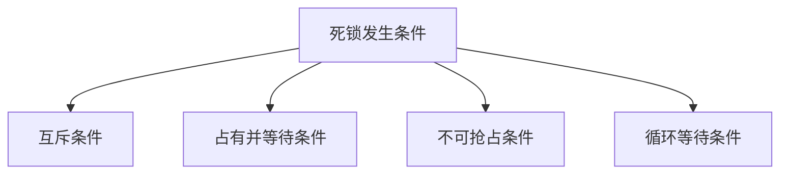
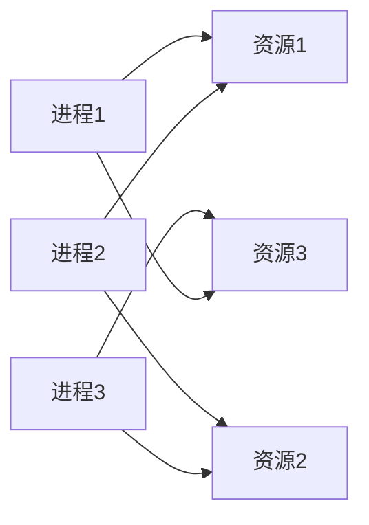

# 资源管理 原理与代码实例讲解

## 1.背景介绍

在现代计算机系统中,资源管理是一个非常重要的概念。资源可以是硬件资源(如CPU、内存、磁盘等)或软件资源(如文件、网络连接等)。有效地管理和分配这些资源对于系统的高效运行至关重要。

资源管理的主要目标是:

1. **共享**:允许多个进程或用户共享有限的资源。
2. **并发**:确保并发访问资源的正确性和一致性。
3. **保护**:防止进程或用户非法访问资源。

在早期的单用户系统中,资源管理相对简单。但随着多任务和多用户系统的出现,资源管理变得更加复杂。操作系统需要在资源利用率、公平性、死锁避免等方面进行权衡和优化。

### 1.1 资源类型

常见的系统资源包括:

- **CPU 周期**: 操作系统需要在进程之间公平分配 CPU 时间片。
- **主存储器**: 内存管理是操作系统的一个关键部分,需要分配和回收内存。
- **文件存储**: 文件系统负责组织和管理磁盘上的文件。
- **I/O 设备**: 需要合理调度对打印机、扫描仪等设备的访问。

除了上述硬件资源,还有一些软件资源需要管理,如信号量、互斥量、管程等同步原语。

## 2.核心概念与联系

资源管理涉及以下几个核心概念:

### 2.1 死锁 (Deadlock)

当两个或多个进程永远相互占用对方所请求的资源时,就产生了死锁。引发死锁的四个必要条件:

1. **互斥 (Mutual Exclusion)**: 某种资源一次只能被一个进程占有。
2. **占有并等待 (Hold and Wait)**: 进程已经占有资源,但又申请新的资源,在新资源可用之前一直等待。
3. **不可抢占 (No Preemption)**: 已占有的资源在使用完之前不能被抢占,只能主动释放。
4. **循环等待 (Circular Wait)**: 存在一个进程等待序列 {P1、P2...Pn},其中 P1 等待 P2 占有的资源,P2 等待 P3 占有的资源,...,Pn 等待 P1 占有的资源。

只要打破上述任何一个条件,就能避免死锁发生。



### 2.2 饥饿 (Starvation)

指某个进程无限期地等待分配某种资源。即使没有发生死锁,也可能出现饥饿现象,这通常是由于资源分配策略不当造成的。

### 2.3 安全序列 (Safe Sequence)

对于某个资源分配状态,如果存在一个重新分配资源的进程序列,使每个进程在运行完毕后都能释放自己占有的资源,那么这个序列就是安全序列。

### 2.4 避免死锁的策略

有以下几种策略可以避免死锁:

- **鸵鸟策略**: 简单地全部忽略死锁的存在。
- **死锁检测与恢复**: 允许死锁发生,但设置死锁检测机制,一旦检测到就恢复到没有死锁的状态。
- **死锁预防**: 破坏产生死锁的四个必要条件中的一个或多个,从根本上预防死锁。
- **死锁避免**: 跟踪资源的分配情况,在有足够资源让进程运行完毕前,一直不会把资源分配给它。

## 3.核心算法原理具体操作步骤 

### 3.1 死锁检测算法

可以使用资源分配图来检测是否存在死锁。该图由两种节点组成:

- 代表进程的矩形节点
- 代表资源的圆形节点

如果存在一条进程资源的环路,就表示发生了死锁。检测算法步骤:

1. 构造资源分配图
2. 从图中选择一个没有邻接边的资源节点(没有进程占用)
3. 释放被该节点指向的矩形节点(进程)占有的所有资源节点
4. 重复步骤2和3,直到所有节点都被释放
5. 如果存在没有被释放的节点,就存在死锁环路



上图中存在一个环路 P1->R1->P2->R2->P3->R3->P1,因此存在死锁。

### 3.2 银行家算法 (Banker's Algorithm)

银行家算法是一种避免死锁的经典算法,它通过预先测试资源分配的安全性来防止系统进入不安全状态。

算法使用两个矩阵来描述进程对资源的最大需求和已占有资源:

- E 矩阵: 每个进程对每种资源的最大需求量
- A 矩阵: 每个进程当前已获得的每种资源数量

算法步骤:

1. 找到一个目前还没有获得所有资源、但能够获得所需资源的进程。
2. 假定把该进程最后需要的所有资源都分配给它。
3. 检查系统是否存在剩余资源供其他进程使用(安全性检查)。
4. 如果安全,就把资源分配给该进程,否则等待。
5. 重复以上步骤,直到系统处于安全状态。

银行家算法可以确保系统永远不会进入不安全状态,但代价是低资源利用率和吞吐量。

## 4.数学模型和公式详细讲解举例说明

### 4.1 进程模型

设有 n 个进程 {P0, P1, ..., Pn-1} 和 m 种资源类型 {R0, R1, ..., Rm-1}。

定义以下向量和矩阵:

- 可利用资源向量 Available: 
  $Available = (Available_0, Available_1, ..., Available_{m-1})$

- 最大需求矩阵 Max:
  $Max = (Max_{ij})_{n \times m}$
  其中 $Max_{ij}$ 表示进程 Pi 对资源 Rj 的最大需求量。

- 分配矩阵 Allocation:
  $Allocation = (Allocation_{ij})_{n \times m}$ 
  其中 $Allocation_{ij}$ 表示系统已分配给进程 Pi 的资源 Rj 数量。

- 需求矩阵 Need:
  $Need = (Need_{ij})_{n \times m}$
  其中 $Need_{ij} = Max_{ij} - Allocation_{ij}$

则有资源分配状态满足:

$$\sum_{i=0}^{n-1}Allocation_{ij} \leq Available_j, (0 \leq j \leq m-1)$$

### 4.2 银行家算法安全性检查

银行家算法通过安全性检查来确保进程运行时不会进入不安全状态。

安全序列指一个进程序列 <P1, P2, ..., Pn>，使得对每个 Pi,系统在满足 Pi 的剩余需求后,仍有足够的资源供剩余的进程使用。

定义需求向量:

$Need_i = (Need_{i0}, Need_{i1}, ..., Need_{im-1})$

则进程 Pi 的需求向量 $Need_i \leq Available$ 时,Pi 就是安全的。

算法通过以下步骤检查安全性:

1. 寻找一个需求向量小于可利用资源向量的进程 Pi。
2. 系统假定把 Pi 所需资源全部分配给它。
3. 修改可利用向量和其他进程的需求向量。
4. 如果找到一个安全序列,则系统处于安全状态。

## 5.项目实践: 代码实例和详细解释说明

下面是用 Python 实现银行家算法的代码示例:

```python
# 可利用资源向量
available = [1, 5, 2, 0]

# 最大需求矩阵
maxm = [[0, 0, 1, 2], 
        [1, 7, 5, 0],
        [2, 3, 5, 6],
        [0, 6, 5, 2],
        [0, 6, 5, 6]]

# 分配矩阵  
allot = [[0, 0, 1, 2],
         [1, 0, 0, 0], 
         [1, 3, 5, 4],
         [0, 6, 3, 2],
         [0, 0, 1, 4]]

def get_need_matrix(maxm, allot):
    """ 计算需求矩阵 """
    need = []
    for i in range(len(maxm)):
        need.append([res_max - allot[i][res] for res, res_max in enumerate(maxm[i])])
    return need

def get_system_status(available, need):
    """ 获取系统状态 """
    curr_mask = [True] * len(need)
    while True:
        try:
            # 寻找需求可满足的进程
            idx = curr_mask.index(True)
            proc_need = need[idx]
            if all(av >= need for av, need in zip(available, proc_need)):
                # 分配资源
                available = [av - need for av, need in zip(available, proc_need)]
                curr_mask[idx] = False
            else:
                # 无资源可分配，退出
                break
        except ValueError:
            # 所有进程需求都已满足
            return True
    # 存在无法满足的进程
    return False

need = get_need_matrix(maxm, allot)
if get_system_status(available, need):
    print("没有死锁")
else:
    print("存在死锁")
```

代码首先计算出需求矩阵 need。然后 get_system_status 函数模拟分配资源的过程:

1. 找到一个当前需求可被满足的进程。
2. 将该进程所需资源从可利用资源中扣除,标记该进程已执行完毕。 
3. 重复上述过程,直到所有进程均执行完毕或无进程可执行。

如果最终所有进程均执行完毕,说明存在安全序列,系统处于安全状态;否则就存在死锁。

该算法的时间复杂度为 O(n*m),其中 n 为进程数,m 为资源种类数。

## 6.实际应用场景

资源管理在实际系统中有着广泛的应用,下面列举一些典型场景:

### 6.1 操作系统

操作系统负责对 CPU、内存、文件等系统资源进行统一管理和调度,是资源管理的核心所在。各种死锁避免、检测和预防算法都在操作系统中得到应用。

### 6.2 数据库系统

在数据库中,事务同时访问数据库对象时可能产生并发问题。数据库管理系统使用锁、时间戳等机制来协调对共享资源的并发访问,防止死锁和其他并发一致性问题。

### 6.3 计算机网络

网络带宽、路由器缓冲区等资源都需要合理分配和管理。拥塞控制算法可以避免网络资源过度使用导致的阻塞。

### 6.4 多线程编程

多线程程序中,线程之间对共享资源的访问需要同步,以防止竞态条件和死锁。常用的同步原语如互斥锁、信号量等,都属于资源管理的范畴。

### 6.5 云计算

云计算平台上的虚拟机、存储、网络等资源需要自动化的调度和管理,以提高资源利用率。诸如 Kubernetes 等编排工具就是资源管理的实际应用。

## 7.工具和资源推荐

以下是一些实用的资源管理工具和学习资源:

- **Valgrind**: 流行的内存管理调试工具,可检测内存泄漏等问题。
- **strace/ltrace**: 跟踪系统调用和库函数调用的工具,有助于诊断资源相关问题。
- **iperf**: 测量网络带宽性能的工具,可评估网络资源利用率。
- **BPMN**: 业务流程建模和标记语言,常用于可视化资源管理流程。
- **Operating Systems: Three Easy Pieces**: 免费的操作系统在线教程,有专门章节讲解资源管理。
- **《现代操作系统》**: 经典的操作系统教材,对资源管理原理阐述全