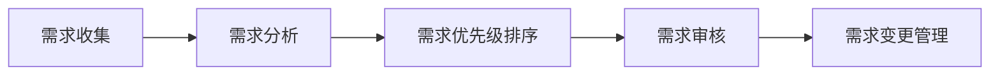
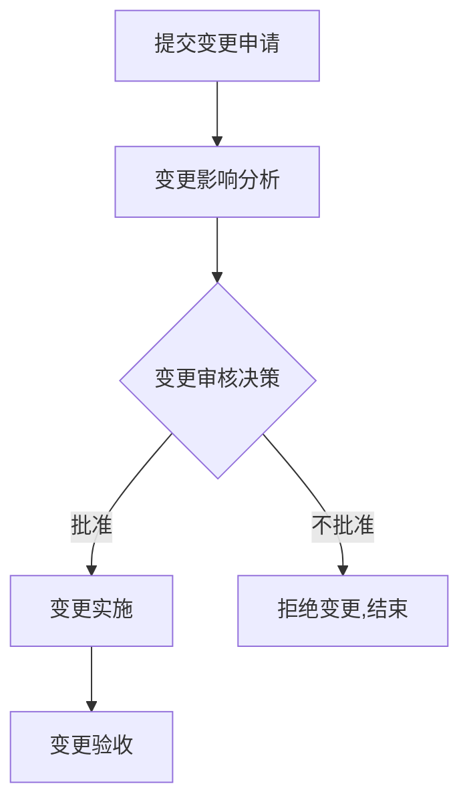

# 跨部门协调资源，依赖对业务的理解对需求进行排序和把控落地节奏

## 1. 背景介绍
### 1.1 企业面临的挑战
在当今快速变化的商业环境中,企业面临着诸多挑战。市场竞争日益激烈,客户需求不断变化,技术革新速度加快。为了保持竞争优势,企业需要快速响应市场变化,高效协调各部门资源,按照业务优先级推进项目落地。

### 1.2 需求管理的重要性
需求管理是企业项目管理的关键环节。有效的需求管理可以确保项目按照业务优先级推进,资源得到合理配置,最终实现企业战略目标。反之,如果需求管理混乱,项目优先级不清晰,会导致资源浪费,项目进度缓慢,无法及时交付客户需求。

### 1.3 跨部门协作的必要性  
随着企业业务的发展,项目往往需要多个部门协同参与。比如一个新产品的开发,需要市场、研发、测试、运营等部门密切配合。跨部门有效协作,对于提高项目效率至关重要。但实践中,由于部门间沟通不畅,各自为政,经常产生部门墙现象,影响项目进度。

## 2. 核心概念与联系
### 2.1 需求的定义与分类
需求是指用户或客户对产品/服务的期望和要求。通常分为功能需求和非功能需求两类。功能需求描述系统应该"做什么",如登录、下单等功能;非功能需求描述系统应该"怎么做",如性能、安全性、可用性等。需求可以进一步细分为业务需求、用户需求、系统需求等。

### 2.2 需求管理流程 
需求管理是一个持续迭代优化的过程,主要包括以下环节:
1. 需求收集:通过访谈、问卷、观察等方式,收集各方的需求
2. 需求分析:对收集到的需求进行分类整理,识别冲突,澄清模糊点 
3. 需求优先级排序:根据业务价值、资源限制等,对需求重要性排序
4. 需求审核:评审需求,确保需求合理、可实现,风险可控
5. 需求变更管理:当需求发生变化时,评估影响,制定应对措施



### 2.3 跨部门协调机制
为了打破部门墙,提高协作效率,需要建立跨部门协调机制:
1. 统一的愿景目标:让各部门形成一致的愿景,朝着共同目标努力
2. 定期沟通机制:建立定期的跨部门沟通会议,同步项目进展
3. 清晰的角色职责:明确各部门在项目中的角色与职责,避免推诿扯皮
4. 统一的绩效考核:将项目整体目标纳入各部门的绩效考核 
5. 高层的支持与推动:高层领导要重视并推动跨部门协作

## 3. 核心算法原理具体操作步骤
### 3.1 需求排序算法
对于海量的需求,如何进行排序优先级,是需求管理的一大难题。常见的需求排序方法有:
1. MoSCoW方法:Must Have、Should Have、Could Have、Won't Have
2. Kano模型:基本型、期望型、兴奋型、无差异型、反向型
3. 价值与风险矩阵:根据需求价值和实现风险,划分为四个象限 

这里重点介绍一下Kano模型的算法步骤:
1. 列出所有需求,设计调查问卷。正向问题"有这个功能你觉得如何",逆向问题"没有这个功能你觉得如何" 
2. 用户填写问卷,根据回答组合,判断需求属于哪种类型
3. 计算每种需求类型的百分比,绘制Kano需求图
4. 分析图形,优先实现兴奋型和期望型需求

### 3.2 需求分解与估算
需求确定优先级后,需要进行分解与估算,制定详细的实施计划。主要步骤如下:
1. 将需求分解为多个功能点或用户故事
2. 根据经验,估算每个功能点的工作量(人天) 
3. 评估功能点间的依赖关系,识别关键路径
4. 结合资源限制,制定项目进度计划
5. 将需求与进度计划录入项目管理工具,跟踪项目执行情况

### 3.3 需求变更管理流程
需求变更在项目中不可避免,关键是要控制变更,降低影响。需求变更管理流程:
1. 提交变更申请:详细描述变更的内容、原因和影响
2. 变更影响分析:评估变更对进度、成本、质量、范围的影响
3. 变更审核决策:变更控制委员会审核变更,决定是否批准
4. 变更实施:批准后,修订项目基线,落实变更
5. 变更验收:验收变更结果,总结经验教训



## 4. 数学模型和公式详细讲解举例说明
### 4.1 需求价值评估模型
对需求进行定量评估,可以借助下面的数学模型:

$需求价值=收益*重要性/(成本*风险)$

其中:
- 收益:需求带来的经济效益、客户满意度提升等
- 重要性:需求对于实现企业战略目标的重要程度
- 成本:需求实现所需的人力、物力、财力等资源投入
- 风险:需求实现过程中可能遇到的技术、进度、质量等风险

举例说明:某需求预计收益100万,重要性为5(满分5分),实现成本50万,风险系数0.8(越接近1风险越小)。则该需求的价值为:

$需求价值=100*5/(50*0.8)=12.5$

可见该需求性价比较高,值得优先实现。

### 4.2 项目进度估算模型
项目进度估算常用PERT(Program Evaluation and Review Technique)模型,通过三点估算法,估算项目完成时间的概率分布。公式如下:

$预期完成时间=(最乐观+4*最可能+最悲观)/6$

$完成时间标准差=(\frac{最悲观-最乐观}{6})^2$

举例说明:项目经理对项目完成时间进行估算,最乐观15天,最可能20天,最悲观30天。则:

$预期完成时间=(15+4*20+30)/6=20.8天$

$完成时间标准差=(\frac{30-15}{6})^2=2.5天$

假设完成时间服从正态分布,则项目在20.8±1.96*2.5天内完成的概率为95%。

### 4.3 资源配置优化模型
项目资源如何优化配置,可以建立如下的整数规划模型:

$$
\begin{aligned}
\max\quad & \sum_{i=1}^n v_ix_i \\
\textrm{s.t.}\quad & \sum_{i=1}^n c_ix_i \leq C \\
& x_i \in \{0,1\}, i=1,2,\cdots,n
\end{aligned}
$$

其中:
- $x_i$:决策变量,表示是否选择实现需求i
- $v_i$:需求i的价值
- $c_i$:需求i的实现成本
- $C$:项目总预算

目标函数是在预算约束下,实现总价值最大化。这是一个典型的背包问题,可以用动态规划、贪心算法等方法求解。

## 5. 项目实践：代码实例和详细解释说明
下面是一个用Python实现的需求优先级排序的示例代码:

```python
# 定义需求类
class Requirement:
    def __init__(self, id, benefit, cost, risk):
        self.id = id
        self.benefit = benefit
        self.cost = cost 
        self.risk = risk
        self.value = benefit / (cost * risk)

# 输入需求列表        
requirements = [
    Requirement(1, 100, 50, 0.8),
    Requirement(2, 80, 60, 0.9),
    Requirement(3, 120, 80, 0.7),
    Requirement(4, 90, 30, 0.6)
]

# 按照需求价值降序排序
sorted_requirements = sorted(requirements, key=lambda x: x.value, reverse=True)

# 输出排序结果
for req in sorted_requirements:
    print(f"Requirement {req.id}, Value: {req.value:.2f}")
```

代码说明:
1. 首先定义了一个需求类Requirement,包含需求的编号、收益、成本、风险等属性,以及根据前面的公式计算需求价值
2. 然后输入一个需求列表,每个需求用Requirement类的实例表示
3. 利用Python内置的sorted函数,根据需求价值对列表进行降序排序。其中key参数指定了排序依据是Requirement实例的value属性
4. 最后遍历排序后的列表,输出每个需求的编号和价值

代码输出如下:
```
Requirement 4, Value: 5.00
Requirement 1, Value: 2.50 
Requirement 2, Value: 1.48
Requirement 3, Value: 1.40
```

可见Requirement 4的性价比最高,因此应该优先实现。这个例子演示了如何用简单的代码,实现需求优先级排序的功能。实际项目中,可以在此基础上,结合数据库、前端界面等,搭建完整的需求管理系统。

## 6. 实际应用场景
需求管理在各行各业的项目实践中都有广泛应用,下面列举几个典型的场景:
### 6.1 互联网产品开发
互联网产品开发是需求管理的一个重要应用领域。产品经理要平衡各方诉求,根据市场反馈和数据分析,确定需求优先级,协调研发、测试、运营等部门,高效迭代产品。比如最小可行产品(MVP)方法,就是优先开发核心功能,快速验证需求假设,然后再迭代优化。

### 6.2 企业信息化项目
企业信息化项目如ERP、CRM等,涉及到多个业务部门,需求复杂多变。需求管理要充分了解业务流程,梳理需求依赖关系,合理安排实施计划。比如可以采用需求分类分级的方式,区分核心需求和锦上添花需求,先保证主干流程的需求落地。

### 6.3 政府公共服务项目 
政府公共服务项目如智慧城市、数字政府,服务对象是广大市民。需求管理要广泛收集民意,平衡不同群体利益,体现以人为本的理念。比如在需求征集阶段,可以通过问卷调查、公众听证等方式,充分了解市民的痛点难点,提升服务质量。

### 6.4 工程建设项目
工程建设项目如基础设施建设,投资规模大,涉及方多,需求管理尤为重要。要全面梳理各相关方需求,协调可能的冲突,控制需求变更。比如可以借助BIM等信息化工具,实现需求的可视化管理,提高各方沟通效率。

## 7. 工具和资源推荐
需求管理离不开工具的支持,下面推荐一些常用的工具:
1. Jira:功能强大的项目与需求管理工具,支持需求池、需求跟踪、看板等
2. Axure:原型设计工具,可以快速绘制需求原型,促进需求理解
3. Visio:流程图绘制工具,可以梳理业务流程,分析需求依赖关系
4. DOORS:大型项目的需求管理工具,支持需求的基线管理、影响分析等
5. Trello:轻量级看板工具,可用于需求任务分解和进度跟踪

除了工具,还有一些需求管理的学习资源值得关注:
1. IIBA(International Institute of Business Analysis):官网有丰富的需求分析相关知识
2. IEEE Software Requirements Specification标准:规范了软件需求规格说明书的编写
3. 需求管理相关的著作,如《掌握需求过程》、