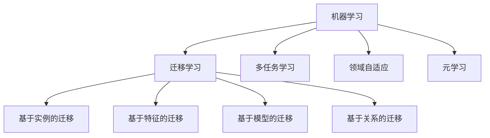

# 迁移学习Transfer Learning原理与代码实例讲解

## 1. 背景介绍
### 1.1 什么是迁移学习
### 1.2 迁移学习的研究意义
### 1.3 迁移学习的发展历程

## 2. 核心概念与联系
### 2.1 迁移学习的定义与分类
#### 2.1.1 基于实例的迁移学习
#### 2.1.2 基于特征的迁移学习  
#### 2.1.3 基于模型的迁移学习
#### 2.1.4 基于关系的迁移学习
### 2.2 源域与目标域
### 2.3 负迁移
### 2.4 迁移学习与其他机器学习范式的关系
#### 2.4.1 迁移学习与多任务学习
#### 2.4.2 迁移学习与领域自适应
#### 2.4.3 迁移学习与元学习



## 3. 核心算法原理具体操作步骤
### 3.1 基于实例的迁移学习算法 
#### 3.1.1 TrAdaBoost算法
#### 3.1.2 TransferBoost算法
### 3.2 基于特征的迁移学习算法
#### 3.2.1 CORAL算法
#### 3.2.2 JDA算法
#### 3.2.3 TCA算法
### 3.3 基于模型的迁移学习算法
#### 3.3.1 MEDA算法 
#### 3.3.2 DANN算法
### 3.4 基于关系的迁移学习算法

## 4. 数学模型和公式详细讲解举例说明
### 4.1 记号与定义
### 4.2 基于实例的迁移学习模型
### 4.3 基于特征的迁移学习模型 
### 4.4 基于深度学习的迁移学习模型

假设源域数据为 $\mathcal{D}_s=\left\{\left(\mathbf{x}_{i}^{s}, y_{i}^{s}\right)\right\}_{i=1}^{n_s}$，目标域数据为 $\mathcal{D}_t=\left\{\left(\mathbf{x}_{i}^{t}, y_{i}^{t}\right)\right\}_{i=1}^{n_t}$，其中 $n_s$ 和 $n_t$ 分别表示源域和目标域的样本数量，$\mathbf{x}$ 表示输入特征，$y$ 表示对应的标签。

深度自适应网络（DANN）的目标是学习一个特征提取器 $G_f$ 和一个分类器 $G_y$，使得：

$$
\begin{aligned}
\min _{G_{f}, G_{y}} \mathcal{L}_{y}\left(G_{y}\left(G_{f}\left(\mathbf{x}^{s}\right)\right), y^{s}\right)-\lambda \mathcal{L}_{d}\left(G_{d}\left(G_{f}\left(\mathbf{x}^{s}\right)\right), G_{d}\left(G_{f}\left(\mathbf{x}^{t}\right)\right)\right)
\end{aligned}
$$

其中 $\mathcal{L}_y$ 表示分类损失，$\mathcal{L}_d$ 表示域判别器的损失，$\lambda$ 为平衡因子，$G_d$ 为域判别器。通过对抗训练，使得特征提取器 $G_f$ 提取的特征具有domain invariant的性质，从而实现迁移学习。

## 5. 项目实践：代码实例和详细解释说明
### 5.1 基于PyTorch的DANN实现
```python
import torch
import torch.nn as nn
import torch.optim as optim

class FeatureExtractor(nn.Module):
    def __init__(self):
        super(FeatureExtractor, self).__init__()
        self.conv1 = nn.Conv2d(3, 64, kernel_size=5)
        self.conv2 = nn.Conv2d(64, 128, kernel_size=5)
        self.fc1 = nn.Linear(128 * 5 * 5, 1024)
        self.fc2 = nn.Linear(1024, 256)
        
    def forward(self, x):
        x = F.relu(self.conv1(x))
        x = F.max_pool2d(x, 2)
        x = F.relu(self.conv2(x))
        x = F.max_pool2d(x, 2)
        x = x.view(-1, 128 * 5 * 5)
        x = F.relu(self.fc1(x))
        x = F.dropout(x, training=self.training)
        x = self.fc2(x)
        return x
        
class Classifier(nn.Module):
    def __init__(self):
        super(Classifier, self).__init__()
        self.fc = nn.Linear(256, 10)
        
    def forward(self, x):
        return self.fc(x)
        
class Discriminator(nn.Module):
    def __init__(self):
        super(Discriminator, self).__init__()
        self.fc1 = nn.Linear(256, 1024)
        self.fc2 = nn.Linear(1024, 1)
        
    def forward(self, x):
        x = F.relu(self.fc1(x))
        x = F.dropout(x, training=self.training)
        x = self.fc2(x)
        return torch.sigmoid(x)
        
# 初始化模型        
feature_extractor = FeatureExtractor()
classifier = Classifier()
discriminator = Discriminator()

# 定义损失函数和优化器
class_criterion = nn.CrossEntropyLoss()
domain_criterion = nn.BCELoss()

optimizer_F = optim.Adam(feature_extractor.parameters())
optimizer_C = optim.Adam(classifier.parameters())
optimizer_D = optim.Adam(discriminator.parameters())

# 训练过程
for epoch in range(num_epochs):
    for (data_s, data_t) in zip(source_dataloader, target_dataloader):
        # 提取特征
        features_s = feature_extractor(data_s)
        features_t = feature_extractor(data_t)
        
        # 分类损失
        class_preds_s = classifier(features_s)
        class_loss = class_criterion(class_preds_s, labels_s)
        
        # 领域判别损失
        domain_preds_s = discriminator(features_s)
        domain_preds_t = discriminator(features_t)
        domain_s_loss = domain_criterion(domain_preds_s, torch.ones(len(domain_preds_s)))
        domain_t_loss = domain_criterion(domain_preds_t, torch.zeros(len(domain_preds_t)))
        domain_loss = domain_s_loss + domain_t_loss
        
        # 反向传播，更新参数
        loss = class_loss + domain_loss
        optimizer_F.zero_grad()
        optimizer_C.zero_grad()
        optimizer_D.zero_grad()
        loss.backward()
        optimizer_F.step()
        optimizer_C.step() 
        optimizer_D.step()
```

以上代码实现了DANN的核心思想。首先定义了三个模块：特征提取器、分类器和领域判别器。在训练过程中，特征提取器将源域和目标域数据映射到特征空间，然后分类器对源域数据进行分类，同时领域判别器试图判断特征来自哪个领域。通过对抗训练，使得特征提取器学习到领域不变的特征表示，从而实现迁移学习。

### 5.2 基于Keras的CORAL实现
```python
from keras.layers import Input, Dense, Lambda
from keras.models import Model
import keras.backend as K

def coral_loss(source, target):
    d = source.shape[1]
    source_mean = K.mean(source, axis=0)
    target_mean = K.mean(target, axis=0)
    source_std = K.std(source, axis=0)
    target_std = K.std(target, axis=0)
    
    source_cov = K.dot((source - source_mean), K.transpose(source - source_mean)) / d
    target_cov = K.dot((target - target_mean), K.transpose(target - target_mean)) / d
    
    loss = K.mean(K.square(source_cov - target_cov))
    return loss

# 构建模型
source_input = Input(shape=(input_dim,))
target_input = Input(shape=(input_dim,))

source_features = Dense(128, activation='relu')(source_input)
target_features = Dense(128, activation='relu')(target_input)

source_preds = Dense(num_classes, activation='softmax')(source_features)

coral_loss_func = Lambda(lambda x: coral_loss(x[0], x[1]))([source_features, target_features])

model = Model(inputs=[source_input, target_input], outputs=[source_preds, coral_loss_func])

model.compile(loss=['categorical_crossentropy', lambda y_true, y_pred: y_pred], 
              optimizer='adam', 
              loss_weights=[1, lambda_coral])
              
# 训练模型              
model.fit([source_data, target_data], [source_labels, np.zeros((len(target_data), 1))],
          batch_size=batch_size, epochs=num_epochs)
```

以上代码实现了CORAL算法的核心思想。首先定义了CORAL损失函数，用于度量源域和目标域特征的分布差异。然后构建了一个包含源域和目标域两个输入的模型，其中源域数据用于分类，目标域数据用于计算CORAL损失。通过联合优化分类损失和CORAL损失，使得模型学习到domain invariant的特征表示，从而实现迁移学习。

## 6. 实际应用场景
### 6.1 计算机视觉中的迁移学习
#### 6.1.1 跨数据集的图像分类
#### 6.1.2 语义分割
#### 6.1.3 目标检测
### 6.2 自然语言处理中的迁移学习 
#### 6.2.1 跨语言的文本分类
#### 6.2.2 命名实体识别
#### 6.2.3 情感分析
### 6.3 语音识别中的迁移学习
### 6.4 推荐系统中的迁移学习

## 7. 工具和资源推荐
### 7.1 数据集
- Office-31
- Office-Home
- VisDA-2017
- Amazon Reviews

### 7.2 开源代码库
- Transfer-Learning-Library
- DeepDA
- Dassl
- Salad

### 7.3 论文与教程
- 《A Survey on Transfer Learning》
- 《Deep Visual Domain Adaptation: A Survey》
- 《Transfer Learning》
- 迁移学习简明手册

## 8. 总结：未来发展趋势与挑战
### 8.1 异构迁移学习
### 8.2 在线迁移学习
### 8.3 对抗迁移学习
### 8.4 元迁移学习
### 8.5 迁移学习的可解释性

## 9. 附录：常见问题与解答
### 9.1 负迁移问题如何解决？
### 9.2 如何选择合适的源域数据？
### 9.3 深度迁移学习中的一些技巧有哪些？
### 9.4 迁移学习与预训练模型的区别？
### 9.5 迁移学习在小样本学习中的应用？

作者：禅与计算机程序设计艺术 / Zen and the Art of Computer Programming