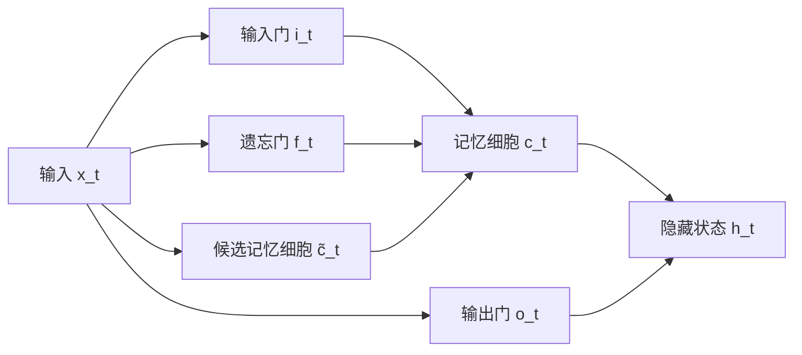

# 长短期记忆网络 (Long Short-Term Memory, LSTM) 原理与代码实例讲解

## 1. 背景介绍
### 1.1 循环神经网络的局限性
#### 1.1.1 梯度消失和梯度爆炸问题
#### 1.1.2 难以捕捉长期依赖关系
### 1.2 LSTM网络的提出
#### 1.2.1 LSTM网络的起源与发展
#### 1.2.2 LSTM网络解决RNN局限性的优势

## 2. 核心概念与联系
### 2.1 LSTM网络的基本结构
#### 2.1.1 输入门(Input Gate)
#### 2.1.2 遗忘门(Forget Gate) 
#### 2.1.3 输出门(Output Gate)
#### 2.1.4 细胞状态(Cell State)
### 2.2 LSTM网络的关键概念
#### 2.2.1 门控机制(Gating Mechanism)
#### 2.2.2 记忆细胞(Memory Cell)
#### 2.2.3 隐藏状态(Hidden State)
### 2.3 LSTM网络与传统RNN的联系与区别

## 3. 核心算法原理具体操作步骤
### 3.1 LSTM前向传播过程
#### 3.1.1 遗忘门
#### 3.1.2 输入门
#### 3.1.3 细胞状态更新
#### 3.1.4 输出门
#### 3.1.5 隐藏状态更新
### 3.2 LSTM反向传播过程
#### 3.2.1 损失函数对隐藏状态的梯度
#### 3.2.2 损失函数对细胞状态的梯度
#### 3.2.3 损失函数对各个门的梯度
#### 3.2.4 损失函数对权重矩阵的梯度

## 4. 数学模型和公式详细讲解举例说明
### 4.1 遗忘门的数学模型与公式
### 4.2 输入门的数学模型与公式
### 4.3 细胞状态更新的数学模型与公式
### 4.4 输出门的数学模型与公式
### 4.5 隐藏状态更新的数学模型与公式
### 4.6 LSTM前向传播与反向传播公式推导

## 5. 项目实践：代码实例和详细解释说明
### 5.1 使用Keras实现LSTM网络
#### 5.1.1 导入必要的库
#### 5.1.2 准备数据集
#### 5.1.3 构建LSTM模型
#### 5.1.4 训练LSTM模型
#### 5.1.5 评估LSTM模型
### 5.2 使用PyTorch实现LSTM网络
#### 5.2.1 导入必要的库
#### 5.2.2 准备数据集
#### 5.2.3 构建LSTM模型
#### 5.2.4 训练LSTM模型 
#### 5.2.5 评估LSTM模型
### 5.3 LSTM网络的调参技巧与优化策略

## 6. 实际应用场景
### 6.1 自然语言处理领域
#### 6.1.1 语言模型
#### 6.1.2 情感分析
#### 6.1.3 机器翻译
### 6.2 时间序列预测领域
#### 6.2.1 股票价格预测
#### 6.2.2 天气预报
#### 6.2.3 设备故障预测
### 6.3 其他应用领域
#### 6.3.1 手写识别
#### 6.3.2 语音识别
#### 6.3.3 视频分类

## 7. 工具和资源推荐
### 7.1 深度学习框架
#### 7.1.1 TensorFlow
#### 7.1.2 PyTorch
#### 7.1.3 Keras
### 7.2 LSTM网络相关论文与资料
### 7.3 开源项目与代码库

## 8. 总结：未来发展趋势与挑战
### 8.1 LSTM网络的优势与局限性
### 8.2 LSTM网络的改进与变体
#### 8.2.1 Peephole LSTM
#### 8.2.2 Bidirectional LSTM
#### 8.2.3 Stacked LSTM
### 8.3 未来研究方向与挑战
#### 8.3.1 更高效的训练方法
#### 8.3.2 更好的长期依赖关系捕捉
#### 8.3.3 更广泛的应用领域拓展

## 9. 附录：常见问题与解答
### 9.1 LSTM网络与GRU网络的区别
### 9.2 如何选择LSTM网络的超参数
### 9.3 LSTM网络在处理长序列时的注意事项
### 9.4 LSTM网络的过拟合问题及解决方法

长短期记忆网络(Long Short-Term Memory, LSTM)是一种特殊类型的循环神经网络(Recurrent Neural Network, RNN),它能够有效地解决传统RNN面临的梯度消失和梯度爆炸问题,从而更好地捕捉长期依赖关系。自从1997年由Hochreiter和Schmidhuber首次提出以来,LSTM网络已经在自然语言处理、语音识别、时间序列预测等领域取得了广泛的应用和巨大的成功。

传统的RNN在处理长序列数据时存在着一些固有的局限性。首先,由于梯度在时间维度上的传播会导致梯度消失或梯度爆炸问题,使得RNN难以捕捉长期依赖关系。其次,RNN将历史信息编码到一个固定长度的隐藏状态向量中,随着序列长度的增加,早期的信息会被后面的信息所覆盖和淹没。这些问题限制了RNN在许多实际任务中的表现。

为了克服RNN的局限性,LSTM网络引入了门控机制和记忆细胞的概念。通过精心设计的输入门、遗忘门和输出门,LSTM能够控制信息的流动,决定哪些信息需要被遗忘,哪些信息需要被记忆。记忆细胞则用于存储长期的信息,使得网络能够在较长的时间跨度内保持重要的状态。这种门控机制和记忆细胞的引入,赋予了LSTM更强大的建模能力。

LSTM网络的核心结构如下图所示:



在每个时间步t,LSTM的前向传播过程可以分为以下几个步骤:

1. 遗忘门(Forget Gate)决定了上一时刻的记忆细胞 $c_{t-1}$ 中的信息有多少需要被遗忘:

$$ f_t = \sigma(W_f \cdot [h_{t-1}, x_t] + b_f) $$

其中 $\sigma$ 是sigmoid激活函数, $W_f$ 和 $b_f$ 分别是遗忘门的权重矩阵和偏置项。

2. 输入门(Input Gate)决定了当前时刻的输入 $x_t$ 有多少信息需要被存储到记忆细胞中:

$$ i_t = \sigma(W_i \cdot [h_{t-1}, x_t] + b_i) $$

$$ c̃_t = \tanh(W_c \cdot [h_{t-1}, x_t] + b_c) $$

其中 $W_i$、$b_i$、$W_c$ 和 $b_c$ 分别是输入门和候选记忆细胞的权重矩阵和偏置项。

3. 更新记忆细胞状态:

$$ c_t = f_t \odot c_{t-1} + i_t \odot c̃_t $$

其中 $\odot$ 表示逐元素相乘。这一步综合了遗忘门和输入门的结果,对记忆细胞状态进行更新。

4. 输出门(Output Gate)控制了记忆细胞中的信息有多少需要输出到隐藏状态:

$$ o_t = \sigma(W_o \cdot [h_{t-1}, x_t] + b_o) $$

$$ h_t = o_t \odot \tanh(c_t) $$

其中 $W_o$ 和 $b_o$ 是输出门的权重矩阵和偏置项。隐藏状态 $h_t$ 综合了输出门和记忆细胞状态的信息。

LSTM的反向传播过程主要是根据损失函数对各个门、记忆细胞和隐藏状态的梯度,利用链式法则自右向左逐层计算,并利用梯度下降等优化算法对网络的权重进行更新。由于LSTM引入了门控机制和记忆细胞,梯度在时间维度上的传播得到了有效控制,从而缓解了梯度消失和梯度爆炸问题。

下面是使用Keras实现LSTM网络进行情感分析的代码示例:

```python
from keras.models import Sequential
from keras.layers import LSTM, Dense, Embedding
from keras.preprocessing.text import Tokenizer
from keras.preprocessing.sequence import pad_sequences

# 准备数据集
texts = [...]  # 文本数据
labels = [...]  # 情感标签(0或1)

# 将文本转换为数字序列
tokenizer = Tokenizer(num_words=5000)
tokenizer.fit_on_texts(texts)
sequences = tokenizer.texts_to_sequences(texts)
data = pad_sequences(sequences, maxlen=100)

# 构建LSTM模型
model = Sequential()
model.add(Embedding(5000, 128, input_length=100))
model.add(LSTM(64, dropout=0.2, recurrent_dropout=0.2))
model.add(Dense(1, activation='sigmoid'))

model.compile(loss='binary_crossentropy', optimizer='adam', metrics=['accuracy'])

# 训练模型
model.fit(data, labels, epochs=10, batch_size=32, validation_split=0.2)

# 评估模型
loss, accuracy = model.evaluate(data, labels)
print('Test loss:', loss)
print('Test accuracy:', accuracy)
```

在自然语言处理领域,LSTM网络被广泛应用于语言模型、情感分析、机器翻译等任务。以情感分析为例,LSTM能够有效地捕捉文本中的上下文信息和长距离依赖关系,从而更准确地判断文本的情感倾向。在时间序列预测领域,如股票价格预测、天气预报等,LSTM网络也展现出了优异的性能,能够从历史数据中学习到有用的模式和趋势。

尽管LSTM网络在许多任务上取得了巨大的成功,但它也存在一些局限性。首先,LSTM网络的训练过程仍然较为耗时,特别是在处理大规模数据集时。其次,LSTM网络对超参数的选择较为敏感,如隐藏单元数、dropout率等,需要进行细致的调参以获得最佳性能。此外,对于一些极端的长序列数据,LSTM网络可能仍然难以完全捕捉到所有的长期依赖关系。

为了进一步改进LSTM网络,研究者们提出了许多变体和扩展,如Peephole LSTM、Bidirectional LSTM、Stacked LSTM等。这些变体在网络结构和信息流动方式上进行了优化,以期获得更好的性能。未来的研究方向可能包括设计更高效的训练方法、探索更好的长期依赖关系捕捉机制、将LSTM网络应用到更广泛的领域等。

总的来说,LSTM网络是一种强大的序列建模工具,在自然语言处理、时间序列预测等领域取得了巨大的成功。通过引入门控机制和记忆细胞,LSTM有效地解决了传统RNN面临的梯度消失和梯度爆炸问题,使得网络能够更好地捕捉长期依赖关系。尽管LSTM网络仍然存在一些局限性和挑战,但它的出现无疑推动了序列建模领域的发展,为许多实际应用提供了有力的支持。相信通过不断的改进和探索,LSTM网络和其他序列模型将会在更多领域发挥重要作用,为人工智能的发展做出更大的贡献。

作者：禅与计算机程序设计艺术 / Zen and the Art of Computer Programming