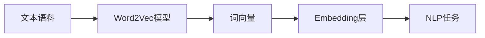

# 问君文本何所似： 词的向量表示Word2Vec和Embedding

## 1. 背景介绍

### 1.1 自然语言处理的挑战
自然语言处理(Natural Language Processing, NLP)是人工智能领域的一个重要分支,旨在让计算机能够理解、处理和生成人类语言。然而,自然语言具有高度的复杂性、歧义性和变化性,对NLP技术提出了巨大的挑战。

### 1.2 词向量表示的意义
在NLP任务中,如何将词语转化为计算机可以理解和处理的数字形式,是一个关键问题。传统的one-hot编码虽然简单直观,但无法刻画词语之间的语义关系。因此,学习词语的分布式表示(distributed representation),也就是将词语映射到一个低维连续的向量空间,成为了NLP领域的重要课题。

### 1.3 Word2Vec和Embedding技术的兴起
近年来,Word2Vec和Embedding等词向量学习技术的兴起,为NLP领域带来了革命性的变化。这些技术能够自动学习词语的语义信息,并将其编码到稠密向量中,极大地推动了NLP技术的发展和应用。本文将深入探讨Word2Vec和Embedding技术的原理、实践和应用,为读者提供全面而深入的认识。

## 2. 核心概念与联系

### 2.1 词向量(Word Vector)
词向量是一种将词语映射为实数向量的方法。通过这种映射,每个词可以用一个固定维度的实数向量来表示。这些向量能够捕捉词语之间的语义关系,如相似性、类比性等。优秀的词向量在语义相关的词之间具有较小的距离。

### 2.2 Word2Vec
Word2Vec是一种高效的词向量学习算法,由Tomas Mikolov等人于2013年提出。它包括两种模型:连续词袋模型(Continuous Bag-of-Words, CBOW)和Skip-Gram模型。CBOW根据上下文词预测中心词,而Skip-Gram则根据中心词预测上下文词。通过这种自监督学习,Word2Vec能够从大规模语料库中学习词向量。

### 2.3 Embedding
Embedding是一种将离散变量映射为连续向量表示的方法。它不仅可以用于词语,还可以用于句子、文档等离散对象。Embedding层通常作为神经网络的输入层,将高维稀疏的离散特征转化为低维稠密的实数向量,从而能够更好地被网络学习和处理。

### 2.4 Word2Vec与Embedding的关系
Word2Vec可以看作是一种特殊的Embedding方法,专门用于学习词向量。通过训练Word2Vec模型,我们可以得到高质量的词向量,然后将其用作其他NLP任务的输入Embedding层,如文本分类、情感分析、机器翻译等。因此,Word2Vec和Embedding是紧密相关的两个概念。



## 3. 核心算法原理具体操作步骤

### 3.1 CBOW模型

#### 3.1.1 模型结构
CBOW模型的目标是根据上下文词来预测中心词。具体来说,对于一个长度为$2c+1$的滑动窗口,模型将中心词的前$c$个词和后$c$个词作为输入,然后输出中心词的概率分布。CBOW模型包含三层:输入层、投影层和输出层。

#### 3.1.2 前向传播
1. 输入层将上下文词one-hot编码为向量,并求平均得到投影层的输入:
$$
\mathbf{x} = \frac{1}{2c}\sum_{i=1}^{2c} \mathbf{v}(w_i)
$$

2. 投影层将输入向量线性变换为隐藏状态:
$$
\mathbf{h} = \mathbf{W}\mathbf{x} + \mathbf{b}
$$

3. 输出层使用softmax函数计算中心词的概率分布:
$$
p(w_j|\mathbf{h}) = \frac{\exp(\mathbf{u}_j^\top \mathbf{h})}{\sum_{k=1}^V \exp(\mathbf{u}_k^\top \mathbf{h})}
$$

#### 3.1.3 训练过程
CBOW模型使用负对数似然损失函数,并通过随机梯度下降算法来优化模型参数。每个训练样本的损失为:
$$
J = -\log p(w_o | w_{1:2c})
$$

其中$w_o$为中心词,$w_{1:2c}$为上下文词。通过反向传播算法计算梯度并更新参数,直到模型收敛。

### 3.2 Skip-Gram模型 

#### 3.2.1 模型结构
Skip-Gram模型与CBOW相反,它的目标是根据中心词来预测上下文词。对于每个中心词,模型将其作为输入,然后输出其上下文词的概率分布。Skip-Gram模型同样包含三层:输入层、投影层和输出层。

#### 3.2.2 前向传播
1. 输入层将中心词one-hot编码为向量$\mathbf{x}$。

2. 投影层将输入向量线性变换为隐藏状态:
$$
\mathbf{h} = \mathbf{W}\mathbf{x}
$$

3. 输出层使用softmax函数计算每个上下文词的概率分布:
$$
p(w_j|\mathbf{h}) = \frac{\exp(\mathbf{u}_j^\top \mathbf{h})}{\sum_{k=1}^V \exp(\mathbf{u}_k^\top \mathbf{h})}
$$

#### 3.2.3 训练过程
Skip-Gram模型同样使用负对数似然损失函数,对于每个中心词$w_c$,其损失为:
$$
J = -\sum_{i=1}^{2c} \log p(w_{c+i} | w_c)
$$

通过随机梯度下降算法优化模型,直到收敛。

### 3.3 负采样(Negative Sampling)
由于softmax计算代价较高,Word2Vec还提出了负采样等加速训练的技巧。负采样将多分类问题转化为二分类问题,对于每个正样本(中心词-上下文词),随机采样$k$个负样本进行训练。这大大减少了计算复杂度,使得模型能够在更大规模的语料上训练。

## 4. 数学模型和公式详细讲解举例说明

### 4.1 词向量的数学表示
给定词表$V$,每个词$w$可以表示为一个$d$维实数向量:
$$
\mathbf{v}(w) = [v_1, v_2, \cdots, v_d]^\top \in \mathbb{R}^d
$$

其中$d$为词向量的维度,通常取值为几十到几百。这样,词表$V$中的所有词向量可以组成一个矩阵$\mathbf{W} \in \mathbb{R}^{|V| \times d}$。

### 4.2 相似度计算
有了词向量表示,我们可以计算词语之间的相似度。常用的相似度度量包括:

1. 欧氏距离:
$$
d(\mathbf{v}_1, \mathbf{v}_2) = \sqrt{\sum_{i=1}^d (v_{1i} - v_{2i})^2}
$$

2. 余弦相似度:
$$
\cos(\mathbf{v}_1, \mathbf{v}_2) = \frac{\mathbf{v}_1^\top \mathbf{v}_2}{||\mathbf{v}_1|| \cdot ||\mathbf{v}_2||}
$$

相似度越高,表示两个词在语义上越接近。

### 4.3 词向量的类比性
优秀的词向量还具有类比性(analogy),即词向量空间中的向量运算能够反映词语之间的类比关系。例如:
$$
\mathbf{v}(king) - \mathbf{v}(man) + \mathbf{v}(woman) \approx \mathbf{v}(queen)
$$

这表明词向量空间中,"king"之于"man",如同"queen"之于"woman"。类比性揭示了词向量空间的内在结构,是评估词向量质量的重要指标。

### 4.4 Softmax函数
Softmax函数将一个实数向量映射为一个概率分布。对于向量$\mathbf{z} = [z_1, z_2, \cdots, z_K]^\top \in \mathbb{R}^K$,其softmax值为:
$$
\mathrm{softmax}(\mathbf{z})_i = \frac{\exp(z_i)}{\sum_{j=1}^K \exp(z_j)}
$$

Softmax函数常用于多分类问题的输出层,将隐藏状态转化为类别的概率分布。在Word2Vec中,softmax函数用于计算中心词(或上下文词)的条件概率分布。

## 5. 项目实践：代码实例和详细解释说明

下面以Python和TensorFlow为例,展示如何训练一个简单的CBOW模型:

```python
import tensorflow as tf
import numpy as np

# 超参数
vocab_size = 5000
embedding_dim = 100
context_size = 2
batch_size = 128
num_epoches = 10

# 构建数据管道
dataset = tf.data.TextLineDataset('text8').map(lambda x: tf.strings.split(x, sep=' '))
dataset = dataset.flat_map(lambda x: tf.data.Dataset.from_tensor_slices(x)).batch(context_size * 2 + 1)
dataset = dataset.map(lambda x: (x[context_size], tf.concat([x[:context_size], x[context_size+1:]], axis=0)))
dataset = dataset.map(lambda x, y: (x, tf.one_hot(y, depth=vocab_size))).shuffle(10000).batch(batch_size)

# 定义模型
model = tf.keras.Sequential([
    tf.keras.layers.Embedding(vocab_size, embedding_dim, input_length=1),
    tf.keras.layers.Reshape((embedding_dim,)),
    tf.keras.layers.Dense(vocab_size, activation='softmax')
])
model.compile(optimizer='adam', loss='categorical_crossentropy')

# 训练模型
model.fit(dataset, epochs=num_epoches)

# 提取Embedding矩阵
embedding_matrix = model.get_weights()[0]
```

代码解释:

1. 设置超参数,包括词表大小、词向量维度、上下文窗口大小、批次大小和训练轮数。

2. 构建数据管道:
   - 读取文本文件,并将每行切分为词列表。
   - 将词列表展平为词流,并按照上下文窗口大小进行分批。
   - 将每个批次转化为(中心词,上下文词)对,并对上下文词进行one-hot编码。
   - 对数据集进行shuffle和batching操作,得到最终的训练数据。

3. 定义CBOW模型:
   - Embedding层将中心词映射为词向量。
   - Reshape层将词向量形状变为(batch_size, embedding_dim)。
   - Dense层使用softmax激活函数,输出上下文词的概率分布。

4. 编译模型,指定优化器和损失函数。

5. 训练模型,将数据集传入fit方法进行训练。

6. 从训练好的模型中提取Embedding矩阵,即为学习到的词向量。

以上代码展示了使用TensorFlow实现CBOW模型的基本流程。在实践中,我们还可以加入更多的技巧,如负采样、层次softmax等,以提高训练效率和词向量质量。

## 6. 实际应用场景

词向量和Embedding技术在NLP领域有广泛的应用,下面列举几个典型场景:

### 6.1 文本分类
将文本(如新闻、评论等)映射为词向量序列,然后通过卷积神经网络(CNN)、循环神经网络(RNN)等模型进行分类。词向量能够提供语义丰富的文本表示,显著提升分类效果。

### 6.2 情感分析
情感分析旨在判断文本的情感倾向(如正面、负面、中性)。将文本映射为词向量序列,再通过神经网络模型进行情感判别。词向量能够刻画词语的情感色彩,有助于提高情感分析的准确性。

### 6.3 命名实体识别
命名实体识别(Named Entity Recognition, NER)aims to locate and classify named entities in text into pre-defined categories such as person names, organizations, locations, etc. By representing words as vectors, NER models can better capture the semantic and syntactic features of entities, thus improving the recognition performance.

### 6.4 机器翻译
机器翻译系统通常采用Encoder-Decoder架构,其中Encoder将源语言句子映射为词向量序列,Decoder根据词向量生成目标语言句子。词向量空间能够建立源语言和目标语言之间的语义桥梁,使得翻译更加准