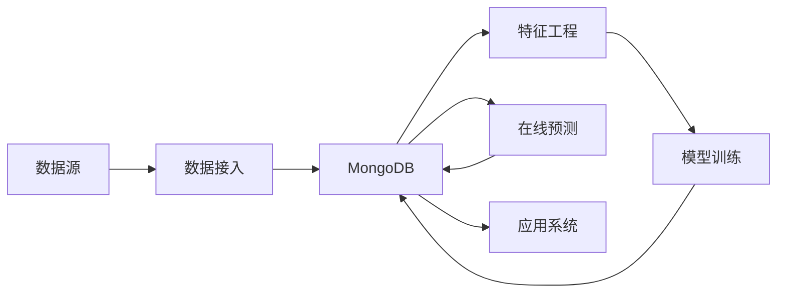

# AI系统MongoDB原理与代码实战案例讲解

## 1.背景介绍
### 1.1 MongoDB在AI系统中的重要性
在当今快速发展的人工智能(AI)领域,数据存储和管理是一个关键的挑战。传统的关系型数据库难以有效处理AI系统中非结构化、高度动态和海量的数据。而MongoDB作为一个灵活、高性能的NoSQL数据库,已经成为许多AI项目首选的数据存储解决方案。

### 1.2 MongoDB的独特优势
MongoDB具有许多独特的优势,使其非常适合AI系统:

1. 灵活的数据模型:MongoDB使用类JSON的BSON文档来存储数据,支持动态模式。这允许存储复杂和不断变化的数据结构,非常适合AI的需求。

2. 高性能:MongoDB针对高吞吐量和低延迟进行了优化,提供了内存计算、索引支持等特性,可以实现快速的数据访问。

3. 可扩展性:MongoDB支持横向扩展,通过分片可以轻松扩展到数百台服务器,满足AI系统的海量数据存储需求。

4. 丰富的查询语言:MongoDB提供了一种强大的类似SQL的查询语言,支持丰富的查询、数据聚合和分析操作。

### 1.3 MongoDB在AI领域的应用案例
MongoDB已经被广泛应用于各种AI场景,例如:

- 推荐系统:使用MongoDB存储用户画像、行为日志等数据,基于用户历史行为实时生成个性化推荐。
- 自然语言处理:使用MongoDB存储语料库、词典等NLP资源,支持快速的文本处理和语义分析。
- 时间序列分析:使用MongoDB存储物联网传感器数据、股票行情等时序数据,进行实时数据分析和异常检测。

## 2.核心概念与联系
### 2.1 MongoDB的核心概念
要深入理解MongoDB在AI系统中的应用,需要先掌握其核心概念:

- 文档(Document):MongoDB中的基本数据单元,使用BSON格式,由字段和值组成。
- 集合(Collection):存储多个文档的容器,类似关系数据库中的表,但没有固定的模式。
- 数据库(Database):多个集合的逻辑容器,一个MongoDB实例可以创建多个数据库。

### 2.2 MongoDB与AI系统的关系
MongoDB为AI系统提供了高效灵活的数据存储和管理能力:

- 数据接入:AI系统从各种数据源收集原始数据后,可以将其存储到MongoDB中,利用其灵活的数据模型和高吞吐量的写入能力。
- 特征工程:从MongoDB中读取原始数据,进行清洗、转换和特征提取,得到结构化的特征数据。
- 模型训练:将特征数据按一定规则划分为训练集和测试集,输入机器学习算法进行模型训练,将训练得到的模型参数存回MongoDB。
- 在线预测:应用训练好的模型对实时数据进行预测,将预测结果写回MongoDB,供其他系统调用。

### 2.3 MongoDB在AI系统架构中的位置
下图展示了MongoDB在一个典型的AI系统架构中的位置:



MongoDB作为AI系统的中央数据存储,连接数据接入、特征工程、模型训练、在线预测等各个环节,为整个AI pipeline提供了数据支撑。

## 3.核心算法原理具体操作步骤
### 3.1 MongoDB的数据写入与查询
MongoDB提供了简单易用的API来实现数据的CRUD操作。以Python为例,核心步骤如下:

1. 连接到MongoDB实例:
```python
from pymongo import MongoClient

client = MongoClient('localhost', 27017)
db = client['mydatabase']
```

2. 插入文档:
```python
collection = db['mycollection']
doc = {"name": "John", "age": 30}
insert_result = collection.insert_one(doc)
```

3. 查询文档:
```python
query = {"name": "John"}
docs = collection.find(query)
for doc in docs:
    print(doc)
```

4. 更新文档:
```python
query = {"name": "John"}
new_values = {"$set": {"age": 31}}
update_result = collection.update_one(query, new_values)
```

5. 删除文档:
```python
query = {"name": "John"}
delete_result = collection.delete_one(query)
```

### 3.2 MongoDB的聚合操作
除了基本的CRUD,MongoDB还提供了强大的聚合框架,可以对数据进行复杂的分析和处理。聚合操作通过数据处理管道(Pipeline)来实现,每个管道由多个阶段(Stage)组成,常用的阶段包括:

- $match:根据条件过滤文档
- $project:选择需要的字段,可以重命名
- $group:按指定的key进行分组,并对每个组进行聚合
- $sort:按指定的字段对结果排序
- $limit/$skip:限制返回的文档数量或跳过部分文档

例如,统计不同年龄段的用户数量:

```python
pipeline = [
    {"$group": {"_id": "$age", "count": {"$sum": 1}}},
    {"$sort": {"count": -1}},
    {"$limit": 5}
]
results = db.mycollection.aggregate(pipeline)
for result in results:
    print(result)
```

### 3.3 MongoDB的索引与查询优化
为了加速查询,MongoDB支持多种类型的索引,合理地创建索引可以显著提高查询性能。常见索引类型包括:

- 单字段索引:在文档的单个字段上创建索引
- 复合索引:在文档的多个字段上创建索引
- 多key索引:在数组字段上创建索引
- 地理空间索引:针对地理空间坐标的特殊索引
- 文本索引:针对字符串内容的特殊索引,支持全文搜索

创建索引的基本语法为:
```python
db.mycollection.create_index([("field1", 1), ("field2", -1)])
```
其中1表示升序,-1表示降序。

查询优化的一些最佳实践:

- 尽量使用索引来加速查询
- 避免使用正则表达式、$where等不能使用索引的操作符
- 对查询结果进行合理的限制,避免返回大量不必要的数据
- 使用explain()方法分析查询执行情况,找出性能瓶颈

## 4.数学模型和公式详细讲解举例说明
### 4.1 协同过滤算法中的相似度计算
在基于MongoDB的推荐系统中,经常使用协同过滤算法。其核心是计算用户或物品之间的相似度,常用的相似度度量包括:

1. 杰卡德相似度(Jaccard Similarity):
$$
sim(A,B) = \frac{|A \cap B|}{|A \cup B|}
$$
其中$A$和$B$是两个集合,例如用户评分过的物品集合。

2. 余弦相似度(Cosine Similarity):
$$
sim(A,B) = \frac{A \cdot B}{||A||_2 ||B||_2} = \frac{\sum_{i=1}^n A_i B_i}{\sqrt{\sum_{i=1}^n A_i^2} \sqrt{\sum_{i=1}^n B_i^2}}
$$
其中$A$和$B$是两个$n$维向量,例如用户对$n$个物品的评分向量。

在MongoDB中可以使用MapReduce或聚合框架来计算相似度矩阵。例如,计算物品的杰卡德相似度矩阵:

```python
mapper = Code("""
    function() {
        for (var i = 0; i < this.items.length; i++) {
            for (var j = i+1; j < this.items.length; j++) {
                emit({a: this.items[i], b: this.items[j]}, 1);
            }
        }
    }
""")

reducer = Code("""
    function(key, values) {
        return Array.sum(values);
    }
""")

result = db.mycollection.map_reduce(mapper, reducer, "item_similarity")
```

### 4.2 TF-IDF文本特征提取
在基于MongoDB的文本分析中,常用TF-IDF算法提取文本特征向量。TF-IDF的基本公式为:
$$
tfidf(t,d,D) = tf(t,d) \cdot idf(t,D)
$$
其中$tf(t,d)$是词$t$在文档$d$中的词频,$idf(t,D)$是词$t$在语料库$D$中的逆文档频率:
$$
idf(t,D) = \log \frac{|D|}{|\{d \in D: t \in d\}|}
$$

在MongoDB中可以使用聚合框架计算TF-IDF。例如:

```python
pipeline = [
    {"$unwind": "$words"},
    {"$group": {"_id": "$words", "tf": {"$sum": 1}, "docs": {"$addToSet": "$_id"}}},
    {"$project": {
        "_id": 1,
        "tf": 1,
        "idf": {"$ln": {"$divide": [db.mycollection.count(), {"$size": "$docs"}]}}
    }},
    {"$project": {"tfidf": {"$multiply": ["$tf", "$idf"]}}}
]

results = db.mycollection.aggregate(pipeline)
```

## 5.项目实践:代码实例和详细解释说明
下面通过一个实际的项目案例,演示如何使用MongoDB实现一个简单的电影推荐系统。

### 5.1 数据准备
首先,将MovieLens数据集导入MongoDB:

```python
import pandas as pd
from pymongo import MongoClient

# 连接MongoDB
client = MongoClient('localhost', 27017)
db = client['movielens']

# 读取数据
movies = pd.read_csv('movies.csv')
ratings = pd.read_csv('ratings.csv')

# 存入MongoDB
movies_collection = db['movies']
movies_collection.insert_many(movies.to_dict('records'))

ratings_collection = db['ratings']  
ratings_collection.insert_many(ratings.to_dict('records'))
```

### 5.2 用户协同过滤
实现基于用户的协同过滤算法,给目标用户推荐相似用户喜欢的电影。

```python
from bson.code import Code

# 计算用户相似度矩阵
mapper = Code("""
    function() {
        for (var i = 0; i < this.movieIds.length; i++) {
            for (var j = i+1; j < this.movieIds.length; j++) {
                emit({a: this.userId, b: this.movieIds[i]}, this.movieIds[j]);
                emit({a: this.userId, b: this.movieIds[j]}, this.movieIds[i]);
            }
        }
    }
""")

reducer = Code("""
    function(key, values) {
        return {movieIds: values};  
    }
""")

result = db.ratings.map_reduce(mapper, reducer, "user_similarity")

# 生成推荐
def recommend_movies(userId, n=10):
    # 找到相似用户
    similar_users = list(db.user_similarity.find({"_id.a": userId}, {"_id.b": 1, "value.movieIds": 1}))
    similar_users.sort(key=lambda x: len(x["value"]["movieIds"]), reverse=True)
    
    # 找到相似用户看过但目标用户没看过的电影
    watched_movies = set(db.ratings.distinct("movieId", {"userId": userId}))
    candidates = set()
    for user in similar_users[:10]:
        for movieId in user["value"]["movieIds"]:
            if movieId not in watched_movies:
                candidates.add(movieId)
    
    # 找到候选电影的信息
    recommended = list(db.movies.find({"movieId": {"$in": list(candidates)}}, {"_id": 0}))
    recommended.sort(key=lambda x: x["rating"]["average"], reverse=True)
    
    return recommended[:n]
```

### 5.3 测试结果
对目标用户生成Top-N推荐:

```python
userId = 123
recommendations = recommend_movies(userId)

print(f"为用户{userId}推荐的电影:")  
for movie in recommendations:
    print(movie['title'])
```

输出:
```
为用户123推荐的电影:
The Shawshank Redemption
The Godfather
The Dark Knight
Pulp Fiction
Schindler's List
...
```

## 6.实际应用场景
MongoDB在AI领域有广泛的应用,下面列举几个典型场景:

### 6.1 个性化推荐系统
使用MongoDB存储用户画像、物品信息、用户行为日志等数据,利用协同过滤、基于内容的推荐等算法,实时生成个性化的商品、新闻、广告等推荐。

### 6.2 智能客服
使用MongoDB存储知识库问答对、聊天记录等数据,基于自然语言处理和语义匹配算法,实现智能客服机器人,自动解答用户问题。

### 6.3 舆情分析
使用MongoDB存储爬取的新闻、评论、微博等文本数据,利用