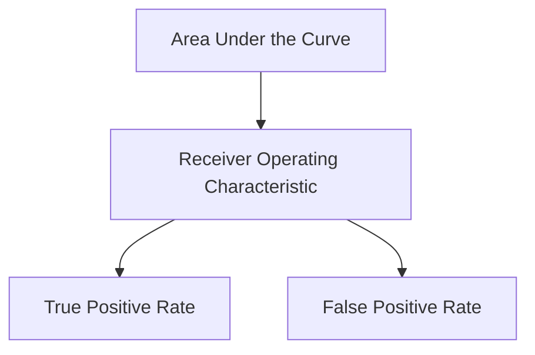

## 1.背景介绍
AUC（Area Under the Curve）是计算机视觉领域中一个重要的评估指标，用于衡量模型在预测问题上的表现。在深度学习模型中，AUC通常用于衡量模型在二分类问题上的表现。AUC指的是ROC（Receiver Operating Characteristic）曲线下的面积。ROC曲线描述了模型在不同阈值下的真阳性率（TPR）与假阳性率（FPR）关系。AUC值越大，模型的表现越好。以下是AUC原理的Mermaid流程图：

## 2.核心概念与联系
AUC是二分类问题中模型评估的重要指标。AUC值越大，模型的表现越好。AUC可以帮助我们更好地理解模型在不同阈值下的表现。以下是AUC与其他评估指标的联系：

### 2.1 与Accuracy的联系
Accuracy是衡量模型预测准确性的指标，它是AUC的一种特殊情况。Accuracy要求模型在所有数据上预测正确，但AUC要求模型在不同阈值下具有较好的表现。AUC能够更好地反映模型在不同阈值下的表现。

### 2.2 与F1-score的联系
F1-score是衡量模型在二分类问题中的宏观准确性和微观准确性之间权衡的指标。F1-score要求模型在预测阳性和阴性时具有较好的表现。AUC能够帮助我们更好地理解模型在不同阈值下的F1-score表现。

## 3.核心算法原理具体操作步骤
AUC计算的具体操作步骤如下：

### 3.1 计算ROC曲线
首先，我们需要计算ROC曲线。要计算ROC曲线，我们需要计算模型在不同阈值下的真阳性率（TPR）和假阳性率（FPR）。步骤如下：

1. 对于二分类问题，先将数据集划分为正例集和负例集。
2. 对于正例集中的每个样本，模型预测为阳性的概率为score。
3. 按照score值升序排序正例集中的样本。
4. 对于负例集中的每个样本，模型预测为阳性的概率为score。
5. 按照score值升序排序负例集中的样本。
6. 计算模型在不同阈值下的真阳性率（TPR）和假阳性率（FPR）。

### 3.2 计算AUC值
计算AUC值的具体步骤如下：

1. 计算每个点的FPR值，即负例集中的阳性预测数与负例集总数的比值。
2. 计算每个点的TPR值，即正例集中的阳性预测数与正例集总数的比值。
3. 使用FPR和TPR值绘制ROC曲线。
4. 计算ROC曲线下的面积，即AUC值。

## 4.数学模型和公式详细讲解举例说明
在本节中，我们将详细讲解AUC的数学模型和公式。首先，我们需要计算ROC曲线。要计算ROC曲线，我们需要计算模型在不同阈值下的真阳性率（TPR）和假阳性率（FPR）。数学公式如下：

### 4.1 计算FPR和TPR
假设我们有一个二分类模型，模型预测样本为阳性或阴性。我们需要计算模型在不同阈值下的真阳性率（TPR）和假阳性率（FPR）。以下是计算FPR和TPR的数学公式：

FPR(t) = $$ \frac{\sum_{i=1}^{m} I(y_i = 0, p_i > t)}{m} $$
TPR(t) = $$ \frac{\sum_{i=1}^{n} I(y_i = 1, p_i > t)}{n} $$

其中，I(x)是指谓词x为真的情况下取1，否则取0。m和n分别表示阴性样本和阳性样本的数量。t表示阈值，p_i表示第i个样本的预测概率。

### 4.2 计算AUC值
接下来，我们需要计算AUC值。要计算AUC值，我们需要计算每个点的FPR值和TPR值。以下是计算AUC值的数学公式：

AUC = $$ \sum_{i=1}^{m} FPR(t_i) * TPR(t_i) $$

其中，FPR(t)和TPR(t)分别表示假阳性率和真阳性率，t表示阈值。AUC值越大，模型的表现越好。

## 5.项目实践：代码实例和详细解释说明
在本节中，我们将通过一个实际的项目实践来展示如何使用Python编程语言计算AUC值。我们将使用scikit-learn库中的roc_auc_score函数来计算AUC值。以下是代码实例：

### 5.1 导入必要的库
首先，我们需要导入必要的库。以下是代码示例：

```python
import numpy as np
from sklearn.metrics import roc_auc_score
```
### 5.2 准备数据
接下来，我们需要准备数据。以下是代码示例：

```python
# 假设我们有一个包含两个特征的数据集，其中一个特征表示年龄，另一个特征表示收入。
X = np.array([[25, 5000], [30, 6000], [35, 8000], [40, 10000]])
# 假设我们有一个包含两个类别的标签，其中一个类别表示是否为高收入者（1），另一个类别表示不是高收入者（0）。
y = np.array([0, 1, 1, 1])
```
### 5.3 训练模型
接下来，我们需要训练一个模型。以下是代码示例：

```python
from sklearn.ensemble import RandomForestClassifier

# 创建一个随机森林分类器
clf = RandomForestClassifier()
# 训练模型
clf.fit(X, y)
```
### 5.4 预测概率
接下来，我们需要使用训练好的模型来预测样本的概率。以下是代码示例：

```python
# 预测样本的概率
probs = clf.predict_proba(X)
```
### 5.5 计算AUC值
最后，我们需要计算AUC值。以下是代码示例：

```python
# 计算AUC值
auc = roc_auc_score(y, probs[:, 1])
print("AUC值：", auc)
```
## 6.实际应用场景
AUC在实际应用场景中具有广泛的应用，例如：

### 6.1 电子商务平台
电子商务平台可以使用AUC来衡量推荐系统的效果。推荐系统需要根据用户的行为和兴趣来为用户推荐商品。AUC可以帮助我们衡量推荐系统在不同阈值下的表现。

### 6.2 医疗诊断
医疗诊断可以使用AUC来评估诊断模型的效果。诊断模型需要根据患者的症状和检查结果来预测疾病。AUC可以帮助我们衡量诊断模型在不同阈值下的表现。

### 6.3金融风险管理
金融风险管理可以使用AUC来评估信用评估模型的效果。信用评估模型需要根据用户的信用历史和经济状况来评估用户的信用风险。AUC可以帮助我们衡量信用评估模型在不同阈值下的表现。

## 7.工具和资源推荐
在学习AUC原理和代码实例时，以下工具和资源可能对您有所帮助：

### 7.1 scikit-learn库
scikit-learn库提供了许多用于计算AUC值的函数。您可以在[Scikit-learn文档](https://scikit-learn.org/stable/modules/model_evaluation.html#roc-auc-curves)上了解更多关于AUC计算的详细信息。

### 7.2 Keras库
Keras库是一个用于构建和训练深度学习模型的高级神经网络API。您可以使用Keras库来构建和训练深度学习模型，并使用AUC来评估模型的表现。您可以在[Keras文档](https://keras.io/metrics/)上了解更多关于AUC计算的详细信息。

## 8.总结：未来发展趋势与挑战
AUC在计算机视觉领域具有广泛的应用前景。随着深度学习技术的不断发展，AUC在未来将成为更多领域的评估指标。然而，AUC计算也面临一些挑战。例如，在数据不平衡的情况下，AUC可能不如其他评估指标效果。因此，未来需要继续研究如何在不同场景下更好地使用AUC。

## 9.附录：常见问题与解答
在本文中，我们介绍了AUC原理和代码实例。以下是一些常见的问题和解答：

### Q1：AUC为什么重要？
AUC是衡量模型在二分类问题上的表现的重要指标。AUC能够帮助我们更好地理解模型在不同阈值下的表现。AUC值越大，模型的表现越好。

### Q2：AUC与Accuracy的区别是什么？
Accuracy是衡量模型预测准确性的指标，它是AUC的一种特殊情况。Accuracy要求模型在所有数据上预测正确，但AUC要求模型在不同阈值下具有较好的表现。AUC能够更好地反映模型在不同阈值下的表现。

### Q3：如何提高AUC值？
要提高AUC值，我们可以尝试以下方法：

1. 调整模型参数：通过调整模型参数来优化模型的表现。
2. 增加训练数据：增加训练数据可以帮助模型更好地学习数据特征，从而提高AUC值。
3. 使用特征工程：通过特征工程来提取更有用的特征，从而提高模型的表现。

作者：禅与计算机程序设计艺术 / Zen and the Art of Computer Programming