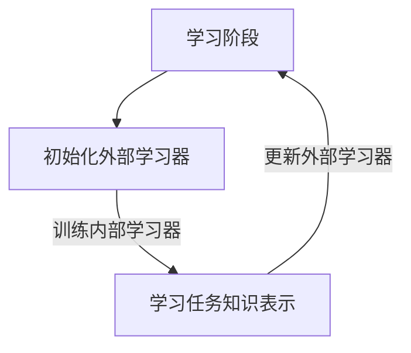

## 背景介绍

近年来，随着大规模数据集和复杂任务的出现，传统机器学习方法已经无法满足我们对人工智能系统的要求。因此，元学习（Meta-Learning）应运而生，这是一种学习如何学习的方法，通过学习不同的学习任务，实现跨任务学习。

本文将从以下几个方面详细介绍Meta-Learning的原理和代码实例：

1. 核心概念与联系
2. 核心算法原理具体操作步骤
3. 数学模型和公式详细讲解举例说明
4. 项目实践：代码实例和详细解释说明
5.实际应用场景
6.工具和资源推荐
7.总结：未来发展趋势与挑战
8.附录：常见问题与解答

## 核心概念与联系

元学习是一种学习方法，旨在学习如何学习。换句话说，它是学习学习算法的算法。通过学习不同的学习任务，元学习实现跨任务学习，可以在不同任务之间找到通用的知识表示，从而提高学习效率和学习效果。

元学习的核心概念包括：

1. 内部学习器（Inductive Learner）：内部学习器负责学习具体任务的模型。
2. 外部学习器（Meta Learner）：外部学习器负责学习如何学习内部学习器。
3. 任务（Task）：任务是学习的目标，例如分类、回归等。
4. 数据集（Dataset）：数据集包含了任务的输入和输出，用于训练和验证内部学习器。

元学习的学习过程可以分为两步：

1. 学习阶段（Learning Phase）：在学习阶段，外部学习器学习如何学习内部学习器。外部学习器通过迭代地训练不同的内部学习器来学习任务的知识表示。
2. 应用阶段（Application Phase）：在应用阶段，经过学习的外部学习器可以根据任务和数据集快速训练出合适的内部学习器，从而实现快速学习和高效的任务解决。

## 核心算法原理具体操作步骤

Meta-Learning的核心算法原理是通过学习不同的学习任务，实现跨任务学习。以下是一个简化的Meta-Learning学习过程的流程图：



学习阶段包括以下几个步骤：

1. 初始化外部学习器：首先，我们需要一个空的外部学习器来存储学习到的任务知识表示。
2. 训练内部学习器：在学习阶段，我们需要多个不同的任务数据集。对于每个任务数据集，我们使用不同的内部学习器来学习任务的知识表示。
3. 学习任务知识表示：通过迭代地训练不同的内部学习器，我们可以学习到任务知识表示，从而更新外部学习器。

应用阶段包括以下几个步骤：

1. 使用外部学习器：在应用阶段，我们需要一个经过学习的外部学习器。外部学习器可以根据任务和数据集快速训练出合适的内部学习器。
2. 解决任务：经过学习的外部学习器可以根据任务和数据集快速训练出合适的内部学习器，从而实现快速学习和高效的任务解决。

## 数学模型和公式详细讲解举例说明

Meta-Learning的数学模型通常使用梯度下降法来学习任务知识表示。以下是一个简化的梯度下降法的数学模型：

$$
\theta := \theta - \alpha \nabla_{\theta} \mathcal{L}(\theta)
$$

其中，$$\theta$$表示模型参数，$$\alpha$$表示学习率，$$\mathcal{L}(\theta)$$表示损失函数。

## 项目实践：代码实例和详细解释说明

以下是一个简化的Meta-Learning项目实践的代码示例：

```python
import torch
import torch.nn as nn
import torch.optim as optim

class MetaLearner(nn.Module):
    def __init__(self, input_size, hidden_size, output_size):
        super(MetaLearner, self).__init__()
        self.net = nn.Sequential(
            nn.Linear(input_size, hidden_size),
            nn.ReLU(),
            nn.Linear(hidden_size, output_size)
        )
    
    def forward(self, x):
        return self.net(x)

def train(meta_learner, dataset, optimizer):
    for task in dataset:
        # 训练内部学习器
        internal_learner = meta_learner.clone()
        internal_learner.train()
        optimizer.zero_grad()
        loss = 0
        for x, y in task:
            y_pred = internal_learner(x)
            loss += criterion(y_pred, y)
        loss.backward()
        optimizer.step()

        # 更新外部学习器
        meta_learner.update_params(optimizer)

def test(meta_learner, dataset):
    meta_learner.eval()
    correct = 0
    total = 0
    with torch.no_grad():
        for x, y in dataset:
            y_pred = meta_learner(x)
            _, predicted = torch.max(y_pred.data, 1)
            total += y.size(0)
            correct += (predicted == y).sum().item()
    print(f'Accuracy: {correct / total}')

# 初始化外部学习器
meta_learner = MetaLearner(input_size, hidden_size, output_size)
optimizer = optim.SGD(meta_learner.parameters(), lr=0.01)

# 训练
train(meta_learner, dataset, optimizer)

# 测试
test(meta_learner, dataset)
```

## 实际应用场景

Meta-Learning的实际应用场景包括但不限于：

1. 快速学习和高效的任务解决：Meta-Learning可以在不同任务之间找到通用的知识表示，从而快速学习和高效地解决任务。
2. 跨任务学习：Meta-Learning可以实现跨任务学习，通过学习不同的学习任务，实现任务间的知识迁移。
3. 自动机器学习（AutoML）：Meta-Learning可以用于自动机器学习，自动选择最佳的模型、超参数和特征，从而提高学习效率和学习效果。

## 工具和资源推荐

1. PyTorch：PyTorch是一款开源的机器学习和深度学习框架，支持Meta-Learning的实现。官方网站：<https://pytorch.org/>
2. Meta-Learning库：有许多Meta-Learning库可以帮助我们实现Meta-Learning，例如Learn2Learn (<https://github.com/learnables/learn2learn>)。
3. 相关论文：如果你想深入了解Meta-Learning的原理和实现，可以参考以下相关论文：

* Ravi & Larochelle (2017): "Optimization as a Model for General Purposes"
* Finn et al. (2017): "Meta-Learning and Provable Generalization with Neural Networks"
* Rusu et al. (2019): "Meta-Learning with Memory-Augmented Neural Networks"

## 总结：未来发展趋势与挑战

Meta-Learning是一种具有巨大潜力的技术，它可以帮助我们实现快速学习和高效的任务解决。未来，Meta-Learning将继续发展，包括但不限于以下几个方面：

1. 更广泛的任务适用性：Meta-Learning将逐渐适用于更多广泛的任务，例如自然语言处理、图像识别等。
2. 更高效的算法：未来，Meta-Learning将继续发展更高效的算法，提高学习效率和学习效果。
3. 更强大的模型：未来，Meta-Learning将继续发展更强大的模型，实现更广泛的任务间的知识迁移。

当然，Meta-Learning也面临着诸多挑战，例如模型复杂性、计算资源消耗、数据需求等。未来，Meta-Learning的研究将继续深入，寻找更好的解决方案。

## 附录：常见问题与解答

1. Meta-Learning与传统机器学习的区别是什么？
答：Meta-Learning是一种学习方法，旨在学习如何学习。传统机器学习则是学习特定任务的模型。Meta-Learning的目标是通过学习不同的学习任务，实现跨任务学习，从而提高学习效率和学习效果。
2. Meta-Learning有什么实际应用场景？
答：Meta-Learning的实际应用场景包括但不限于快速学习和高效的任务解决、跨任务学习和自动机器学习等。
3. 如何选择Meta-Learning的学习任务？
答：选择Meta-Learning的学习任务时，需要考虑任务的相似性、数据量和特点等因素。选择合适的学习任务可以帮助我们实现更广泛的任务间的知识迁移。