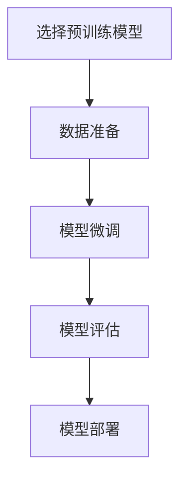

# Python深度学习实践：运用迁移学习提升模型效能

## 1.背景介绍

在深度学习领域中,训练一个高性能的神经网络模型通常需要大量的计算资源和海量的标注数据。然而,在许多实际应用场景中,由于数据采集和标注的困难,获取足够大的数据集往往是一个巨大挑战。为了解决这一问题,迁移学习(Transfer Learning)应运而生。

迁移学习是一种机器学习技术,它利用在源领域学习到的知识来帮助目标领域的任务。通过迁移学习,我们可以将在大型数据集上预先训练好的模型作为起点,然后在较小的目标数据集上进行微调(fine-tuning),从而获得良好的性能表现。这种方法不仅节省了大量的计算资源,而且可以在数据量有限的情况下实现令人满意的结果。

Python作为一种流行的编程语言,在深度学习领域中扮演着重要角色。诸如TensorFlow、PyTorch等知名深度学习框架都提供了Python接口,使得研究人员和开发人员能够方便地构建、训练和部署深度神经网络模型。本文将重点探讨如何在Python生态系统中实践迁移学习,提高深度学习模型的效能。

## 2.核心概念与联系

### 2.1 迁移学习的核心思想

迁移学习的核心思想是利用在源领域学习到的知识来帮助目标领域的任务。在深度学习中,这通常意味着将在大型数据集上预训练的模型作为起点,然后在目标任务的数据集上进行微调。

预训练模型通常是在大型公开数据集(如ImageNet)上训练的,它们已经学习到了一般性的特征表示,如边缘、纹理和形状等。这些特征对于许多视觉任务都是通用的。通过迁移学习,我们可以利用这些预先学习到的特征,并在目标任务的数据集上进行微调,使模型适应新的任务。

### 2.2 迁移学习的优势

相较于从头开始训练模型,迁移学习具有以下优势:

1. **数据效率**:迁移学习可以在较小的数据集上实现良好的性能,这对于数据采集和标注成本高昂的领域尤为重要。
2. **计算效率**:由于模型的大部分参数已经在源任务上进行了预训练,因此微调过程通常比从头训练更加高效。
3. **泛化能力**:预训练模型已经学习到了通用的特征表示,这有助于提高模型在新任务上的泛化能力。

### 2.3 迁移学习的挑战

尽管迁移学习带来了诸多优势,但它也面临一些挑战:

1. **领域差异**:源领域和目标领域之间的差异可能会影响迁移学习的效果。如果两个领域之间存在较大差异,直接迁移可能会导致性能下降。
2. **数据分布偏移**:源数据集和目标数据集之间的数据分布偏移也可能影响迁移学习的效果。
3. **微调策略**:如何有效地微调预训练模型以适应新任务是一个需要探索的问题,包括选择合适的学习率、微调层数等。

## 3.核心算法原理具体操作步骤

迁移学习在深度学习中的实践通常包括以下几个步骤:



### 3.1 选择预训练模型

第一步是选择合适的预训练模型。常见的预训练模型包括:

- **计算机视觉**:VGG、ResNet、Inception、MobileNet等在ImageNet数据集上预训练的模型。
- **自然语言处理**:BERT、GPT、XLNet等在大型语料库上预训练的语言模型。
- **其他领域**:根据具体任务选择合适的预训练模型。

选择预训练模型时,需要考虑模型的性能、计算资源需求以及任务的相似性。

### 3.2 数据准备

接下来,需要准备目标任务的数据集。数据准备包括数据采集、清洗、标注等步骤。对于迁移学习,通常只需要一个相对较小的数据集。

数据准备完成后,需要对数据进行预处理,如归一化、数据增强等,以适应预训练模型的输入要求。

### 3.3 模型微调

模型微调是迁移学习的核心步骤。通常包括以下操作:

1. **加载预训练模型**:使用深度学习框架(如TensorFlow或PyTorch)加载预训练模型的权重。
2. **冻结部分层**:根据任务的复杂程度,可以选择冻结预训练模型的部分层,只微调后面的几层。
3. **构建新的输出层**:根据目标任务的需求,构建新的输出层,并将其连接到预训练模型的输出。
4. **编译模型**:设置损失函数、优化器和评估指标。
5. **微调模型**:使用目标数据集对模型进行微调,通常需要较小的学习率和较少的训练epochs。

### 3.4 模型评估

在微调过程中,需要持续评估模型在验证集上的性能,以防止过拟合。评估指标根据任务的类型而有所不同,如分类任务可以使用准确率、F1分数等,回归任务可以使用均方根误差(RMSE)等。

### 3.5 模型部署

最后,根据评估结果,选择性能最佳的模型进行部署。部署过程包括模型导出、优化和集成到应用程序中。

## 4.数学模型和公式详细讲解举例说明

在深度学习中,神经网络模型通常由多层神经元组成,每一层都对输入进行一系列线性和非线性变换。这些变换可以用数学公式来表示。

### 4.1 前馈神经网络

前馈神经网络(Feed-Forward Neural Network)是最基本的神经网络结构,它由输入层、隐藏层和输出层组成。每一层的输出都是上一层输出经过线性变换和非线性激活函数的结果。

设第 $l$ 层的输入为 $\mathbf{x}^{(l)}$,权重矩阵为 $\mathbf{W}^{(l)}$,偏置向量为 $\mathbf{b}^{(l)}$,激活函数为 $f(\cdot)$,则第 $l+1$ 层的输出可以表示为:

$$\mathbf{x}^{(l+1)} = f(\mathbf{W}^{(l)}\mathbf{x}^{(l)} + \mathbf{b}^{(l)})$$

常见的激活函数包括ReLU(整流线性单元)、Sigmoid和Tanh等。

### 4.2 卷积神经网络

卷积神经网络(Convolutional Neural Network, CNN)是一种专门用于处理图像和视频数据的神经网络结构。它由卷积层、池化层和全连接层组成。

在卷积层中,输入图像通过一个滤波器kernel(也称为卷积核)进行卷积操作,产生一个特征映射(feature map)。卷积操作可以用以下公式表示:

$$\text{output}(n_x, n_y) = \sum_{i=0}^{f_x-1}\sum_{j=0}^{f_y-1}\text{input}(n_x+i, n_y+j) \cdot \text{kernel}(i, j)$$

其中 $n_x$ 和 $n_y$ 表示输出特征映射的坐标,而 $f_x$ 和 $f_y$ 分别表示卷积核的高度和宽度。

池化层通常在卷积层之后,用于降低特征映射的空间维度,从而减少计算量和防止过拟合。常见的池化操作包括最大池化(Max Pooling)和平均池化(Average Pooling)。

### 4.3 递归神经网络

递归神经网络(Recurrent Neural Network, RNN)是一种专门用于处理序列数据(如文本、语音和时间序列)的神经网络结构。它通过引入循环连接,允许信息在序列的不同时间步之间传递。

在RNN中,每个时间步的隐藏状态 $\mathbf{h}_t$ 不仅取决于当前输入 $\mathbf{x}_t$,还取决于前一时间步的隐藏状态 $\mathbf{h}_{t-1}$。这可以用以下公式表示:

$$\mathbf{h}_t = f(\mathbf{W}_{hh}\mathbf{h}_{t-1} + \mathbf{W}_{xh}\mathbf{x}_t + \mathbf{b}_h)$$

其中 $\mathbf{W}_{hh}$ 和 $\mathbf{W}_{xh}$ 分别表示隐藏状态和输入的权重矩阵,而 $\mathbf{b}_h$ 是偏置向量。

基于RNN的变体,如长短期记忆网络(Long Short-Term Memory, LSTM)和门控循环单元(Gated Recurrent Unit, GRU),通过引入门控机制,可以更好地捕获长期依赖关系。

### 4.4 示例:图像分类

现在,让我们通过一个图像分类的示例来更好地理解迁移学习中的数学模型。假设我们要在一个小型数据集上训练一个图像分类模型,用于识别不同种类的花卉。

我们可以选择在ImageNet数据集上预训练的ResNet-50模型作为起点。ResNet-50是一种残差神经网络,它通过引入残差连接来解决深层网络的梯度消失问题。

在ResNet-50中,每个残差块的输出可以表示为:

$$\mathbf{x}_{l+1} = \mathbf{x}_l + \mathcal{F}(\mathbf{x}_l, \{\mathbf{W}_i\})$$

其中 $\mathbf{x}_l$ 和 $\mathbf{x}_{l+1}$ 分别表示残差块的输入和输出,而 $\mathcal{F}(\cdot)$ 是残差块中卷积、批归一化和激活函数的组合操作。

为了适应花卉分类任务,我们需要替换ResNet-50的最后一层全连接层,构建一个新的输出层。设输出层的权重矩阵为 $\mathbf{W}_\text{out}$,偏置向量为 $\mathbf{b}_\text{out}$,则输出层的计算公式为:

$$\mathbf{y} = \text{softmax}(\mathbf{W}_\text{out}\mathbf{x} + \mathbf{b}_\text{out})$$

其中 $\mathbf{x}$ 是ResNet-50的最后一层特征映射,而 $\mathbf{y}$ 是模型的输出,表示每个类别的概率分布。

在微调过程中,我们可以冻结ResNet-50的大部分层,只微调最后几层的权重,以适应新的任务。通过这种方式,我们可以在较小的花卉数据集上获得良好的分类性能,同时节省了大量的计算资源。

## 5.项目实践:代码实例和详细解释说明

在本节中,我们将通过一个实际的代码示例,演示如何在Python中使用迁移学习来提升图像分类模型的效能。我们将使用TensorFlow和Keras框架,并基于预训练的ResNet-50模型进行微调。

### 5.1 导入所需库

```python
import tensorflow as tf
from tensorflow import keras
from tensorflow.keras.applications import ResNet50
from tensorflow.keras.preprocessing.image import ImageDataGenerator
```

我们导入了TensorFlow和Keras库,以及ResNet50预训练模型和ImageDataGenerator用于数据增强和批处理。

### 5.2 准备数据集

假设我们的花卉数据集位于 `./data/flowers` 目录下,包含五个子目录,每个子目录对应一种花卉类别。我们使用ImageDataGenerator来加载和预处理数据:

```python
train_datagen = ImageDataGenerator(
    rescale=1./255,
    rotation_range=20,
    zoom_range=0.2,
    horizontal_flip=True
)

train_generator = train_datagen.flow_from_directory(
    'data/flowers/train',
    target_size=(224, 224),
    batch_size=32,
    class_mode='categorical'
)

val_datagen = ImageDataGenerator(rescale=1./255)

val_generator = val_datagen.flow_from_directory(
    'data/flowers/val',
    target_size=(224, 224),
    batch_size=32,
    class_mode='categorical'
)
```

我们定义了两个数据生成器,一个用于训练集,另一