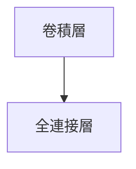

## 背景介绍

随着深度学习技术的不断发展，预训练模型（Pre-trained Models）在各个领域取得了显著的成果。预训练模型是一种在无监督或有监督学习环境下，利用大量数据进行训练的模型，并在特定任务上进行微调，从而提高模型的性能。这种技术在图像识别、自然语言处理、语音识别等领域得到了广泛应用。

## 核心概念与联系

预训练模型的核心概念在于将一个模型在大规模数据集上进行训练，以学习通用的特征表示。这些特征表示可以被进一步用于各种任务，从而提高模型的性能。预训练模型的主要特点如下：

1. **通用性**:预训练模型可以在多个任务上取得较好的性能，因为它们已经学习了通用的特征表示。
2. **可移植性**:预训练模型可以在不同领域和任务上进行迁移学习，从而提高模型的可移植性。
3. **计算效率**:预训练模型可以在较低的计算复杂度下取得较好的性能，因为它们已经学习了通用的特征表示。

预训练模型的核心概念与联系主要体现在以下几个方面：

1. **模型架构**:预训练模型通常采用深度学习架构，如卷积神经网络（CNN）和循环神经网络（RNN）。
2. **学习方法**:预训练模型采用无监督学习或有监督学习方法，在大规模数据集上进行训练，以学习通用的特征表示。
3. **任务迁移**:预训练模型在特定任务上进行微调，以优化模型在该任务上的性能。

## 核心算法原理具体操作步骤

预训练模型的核心算法原理主要包括以下几个步骤：

1. **数据预处理**:将数据集进行预处理，包括数据清洗、数据归一化等。
2. **模型训练**:在大规模数据集上进行训练，以学习通用的特征表示。训练过程中，模型采用无监督学习或有监督学习方法进行优化。
3. **模型微调**:在特定任务上进行微调，以优化模型在该任务上的性能。微调过程中，模型采用监督学习方法进行优化。

## 数学模型和公式详细讲解举例说明

在本节中，我们将详细讲解预训练模型的数学模型和公式。我们将以一个简单的深度学习模型为例进行讲解。

假设我们有一個簡單的深度學習模型，該模型包含一個卷積層和一個全連接層。卷積層包含5x5的卷積核和32個特徵映射，全連接層包含128個單元。

模型的結構可以用以下MERMAID流程圖表示：



卷積層的前向傳播公式可以表示為：

$$
y = f(x, W, b) = ReLU(W * x + b)
$$

其中，$x$是輸入數據，$W$是卷積核，$b$是偏置項，$f$是ReLU激活函數。

全連接層的前向傳播公式可以表示為：

$$
z = W' * y + b'
$$

其中，$y$是卷積層的輸出，$W'$是全連接層的權重矩陣，$b'$是偏置項。

## 项目实践：代码实例和详细解释说明

在本节中，我们将通过一个简单的预训练模型项目实践来详细解释代码实例。

```python
import torch
import torch.nn as nn
import torch.optim as optim

# 定义卷积层
class ConvLayer(nn.Module):
    def __init__(self, in_channels, out_channels, kernel_size, stride, padding):
        super(ConvLayer, self).__init__()
        self.conv = nn.Conv2d(in_channels, out_channels, kernel_size, stride, padding)
        self.relu = nn.ReLU()

    def forward(self, x):
        x = self.conv(x)
        x = self.relu(x)
        return x

# 定义全连接层
class FullyConnectedLayer(nn.Module):
    def __init__(self, in_features, out_features):
        super(FullyConnectedLayer, self).__init__()
        self.fc = nn.Linear(in_features, out_features)

    def forward(self, x):
        x = self.fc(x)
        return x

# 定义预训练模型
class PretrainedModel(nn.Module):
    def __init__(self):
        super(PretrainedModel, self).__init__()
        self.conv_layer = ConvLayer(3, 32, 5, 1, 2)
        self.fc_layer = FullyConnectedLayer(32 * 8 * 8, 128)

    def forward(self, x):
        x = self.conv_layer(x)
        x = x.view(x.size(0), -1)  # Flatten the output
        x = self.fc_layer(x)
        return x

# 实例化模型
model = PretrainedModel()
criterion = nn.CrossEntropyLoss()
optimizer = optim.Adam(model.parameters(), lr=0.001)

# 训练模型
for epoch in range(10):
    optimizer.zero_grad()
    outputs = model(inputs)
    loss = criterion(outputs, labels)
    loss.backward()
    optimizer.step()
```

## 实际应用场景

预训练模型在多个领域取得了显著的成果，以下是一些实际应用场景：

1. **图像识别**:预训练模型可以用于图像识别任务，如图像分类、图像检索等。
2. **自然语言处理**:预训练模型可以用于自然语言处理任务，如文本分类、情感分析等。
3. **语音识别**:预训练模型可以用于语音识别任务，如语音到文本转换等。
4. **机器翻译**:预训练模型可以用于机器翻译任务，如英文到中文的翻译等。

## 工具和资源推荐

以下是一些建议的工具和资源，帮助您更好地理解和实现预训练模型：

1. **深度学习框架**:PyTorch、TensorFlow等深度学习框架。
2. **深度学习库**:Keras、PyTorch Lightning等深度学习库。
3. **数据集**:ImageNet、MNIST、Wikipedia等数据集。
4. **教程**:Deep Learning with PyTorch、Deep Learning with TensorFlow等教程。
5. **博客**:Medium、Towards Data Science等博客。

## 总结：未来发展趋势与挑战

预训练模型在深度学习领域取得了显著的成果，但仍然面临着诸多挑战和发展趋势。以下是未来发展趋势与挑战：

1. **更高效的算法**:未来，预训练模型将不断发展，提出更高效的算法，提高模型性能。
2. **更大规模的数据集**:未来，预训练模型将不断利用更大规模的数据集进行训练，以学习更丰富的特征表示。
3. **更好的性能**:未来，预训练模型将不断提高在各个任务上的性能，实现更好的迁移学习效果。
4. **更强大的模型**:未来，预训练模型将不断发展，提出更强大的模型，以解决更复杂的问题。

## 附录：常见问题与解答

在本节中，我们将回答一些常见的问题，以帮助您更好地理解预训练模型。

1. **Q: 预训练模型的主要优点是什么？**
A: 预训练模型的主要优点是具有通用性、可移植性和计算效率。这些优点使得预训练模型在多个领域取得了显著的成果。

2. **Q: 预训练模型的主要缺点是什么？**
A: 预训练模型的主要缺点是需要大量的计算资源和数据，可能导致数据泄露和模型过拟合等问题。

3. **Q: 预训练模型和微调模型有什么区别？**
A: 预训练模型是在无监督或有监督学习环境下，利用大量数据进行训练的模型。微调模型是在特定任务上进行优化的模型。预训练模型在特定任务上进行微调，以优化模型在该任务上的性能。