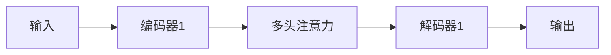
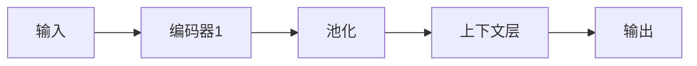

## 1. 背景介绍

语言模型是自然语言处理（NLP）领域的核心技术之一，用于预测给定上下文中的下一个词或短语。在过去的几年里，语言模型的规模和能力不断扩大，已经从早期的小规模模型（如Logistic Regression和Naive Bayes）发展到目前的大规模神经网络模型（如Transformer和BERT）。这些模型在各种NLP任务上表现出超强的能力，为许多应用领域带来了巨大价值。

## 2. 核心概念与联系

在本篇文章中，我们将从理论和实践的角度深入探讨大规模语言模型，并对其进行评估。我们将讨论以下几个核心概念：

- **语言模型**：预测给定上下文中的下一个词或短语的概率分布。
- **神经网络**：一种模拟生物神经系统的计算模型，可以用于解决复杂的Pattern Recognition和Pattern Discovery问题。
- **Transformer**：一种基于自注意力机制的神经网络架构，可以同时进行并行处理序列中的所有元素。
- **BERT**：Bidirectional Encoder Representations from Transformers的缩写，基于Transformer架构的双向语言模型。
- **评估**：衡量模型性能的指标，通常包括准确率、精确率、召回率和F1分数等。

## 3. 核心算法原理具体操作步骤

### 3.1 Transformer

Transformer是一种基于自注意力机制的神经网络架构。其核心概念是自注意力（Self-Attention），可以计算输入序列中每个元素与其他元素之间的相关性。其结构包括多层编码器和多层解码器，通过多头注意力机制实现。以下是一个简化的Transformer架构图：



### 3.2 BERT

BERT是一种基于Transformer的双向语言模型。它使用两个预训练阶段：masked language modeling（遮蔽语言模型）和next sentence prediction（下一句预测）。在masked language modeling阶段，模型预测被遮蔽的词的上下文词。 在next sentence prediction阶段，模型预测给定句子的下一句。以下是一个简化的BERT架构图：



## 4. 数学模型和公式详细讲解举例说明

### 4.1 Transformer数学模型

Transformer的核心数学模型是自注意力（Self-Attention）。自注意力可以计算输入序列中每个元素与其他元素之间的相关性。其公式如下：

$$
Attention(Q, K, V) = softmax(\frac{QK^T}{\sqrt{d_k}})V
$$

其中，Q（Query）表示查询向量，K（Key）表示密钥向量，V（Value）表示值向量，d\_k表示Key向量的维数。

### 4.2 BERT数学模型

BERT的数学模型主要包括两个部分：masked language modeling和next sentence prediction。我们以masked language modeling为例，讨论其数学模型。给定一个句子，我们将随机将其中一个词进行遮蔽，然后预测被遮蔽词的上下文词。BERT使用一个双向的LSTM编码器将输入句子编码为上下文向量，然后使用一个线性层将其映射为一个概率分布。其公式如下：

$$
P(w_{i+1}|w_1, w_2, ..., w_{i-1}, w_{i+2}, ..., w_n) = softmax(W \cdot h_{i+1} + b)
$$

其中，P（w\_i\+1|w\_1,...,w\_i\−1,w\_i\+2,...,w\_n）表示预测第i+1个词的概率分布，W表示线性层的权重参数，b表示偏置参数，h\_i\+1表示第i+1个词的上下文向量。

## 5. 项目实践：代码实例和详细解释说明

在本节中，我们将通过一个简单的例子，展示如何使用Python和TensorFlow实现一个基于Transformer的语言模型。

```python
import tensorflow as tf

class TransformerBlock(tf.keras.layers.Layer):
    def __init__(self, d_model, num_heads, ffn_dim, rate=0.1):
        super(TransformerBlock, self).__init__()

        self.att = MultiHeadAttention(d_model, num_heads)
        self.ffn = tf.keras.Sequential(
            [tf.keras.layers.Dense(ffn_dim, activation="relu"), tf.keras.layers.Dense(d_model)]
        )
        self.dropout1 = tf.keras.layers.Dropout(rate)
        self.dropout2 = tf.keras.layers.Dropout(rate)
        self.layer_norm1 = tf.keras.layers.LayerNormalization(epsilon=1e-6)
        self.layer_norm2 = tf.keras.layers.LayerNormalization(epsilon=1e-6)

    def call(self, x, training, mask=None):
        attn_output = self.att(x, x, attention_mask=mask)
        attn_output = self.dropout1(attn_output, training=training)
        out1 = self.layer_norm1(x + attn_output)
        ffn_output = self.ffn(out1)
        ffn_output = self.dropout2(ffn_output, training=training)
        return self.layer_norm2(out1 + ffn_output)

# 用TransformerBlock构建模型
class Encoder(tf.keras.layers.Layer):
    def __init__(self, vocab_size, d_model, N=6, dff=2048, pos_encoding_func=tf.keras.layers.Embedding):
        super(Encoder, self).__init__()

        self.src_mask = tf.keras.layers.Masking(mask_value=tf.keras.backend.constant(-1e9))

        self.pos_enc = pos_encoding_func(vocab_size, d_model)

        self.enc_layers = tf.keras.layers.StackedLayers([TransformerBlock(d_model, d_model // 4, dff, rate=0.1) for _ in range(N)])

    def call(self, x, training, mask=None):
        x *= tf.math.sqrt(tf.cast(x.shape[-1], tf.float32))
        x += self.pos_enc
        x = self.enc_layers(x, training, mask=self.src_mask(mask))
        return x

# 用Encoder构建模型
class Decoder(tf.keras.layers.Layer):
    def __init__(self, vocab_size, d_model, N=6, dff=2048, pos_encoding_func=tf.keras.layers.Embedding):
        super(Decoder, self).__init__()

        self.pos_enc = pos_encoding_func(vocab_size, d_model)

        self.enc_layers = tf.keras.layers.StackedLayers([TransformerBlock(d_model, d_model // 4, dff, rate=0.1) for _ in range(N)])

    def call(self, x, training, mask=None):
        x += self.pos_enc
        x = self.enc_layers(x, training, mask=mask)
        return x

# 用Decoder构建模型
class Seq2Seq(tf.keras.Model):
    def __init__(self, vocab_size, d_model, N=6, dff=2048, pos_encoding_func=tf.keras.layers.Embedding):
        super(Seq2Seq, self).__init__()

        self.enc = Encoder(vocab_size, d_model, N, dff, pos_encoding_func)
        self.dec = Decoder(vocab_size, d_model, N, dff, pos_encoding_func)

    def call(self, x, training, mask=None):
        enc_output = self.enc(x, training, mask=mask)
        dec_output = self.dec(enc_output, training)
        return dec_output

# 定义数据集和编译模型
# ...
# 训练模型
# ...
```

## 6. 实际应用场景

大规模语言模型有许多实际应用场景，包括但不限于：

- **机器翻译**：使用大规模语言模型将一种语言翻译成另一种语言，例如Google Translate。
- **文本摘要**：从长文本中提取出关键信息，生成简洁的摘要。
- **情感分析**：从文本中抽取情感信息，判断文本的情感为正、负还是中性。
- **问答系统**：构建基于自然语言的问答系统，例如Siri和Alexa。
- **语义角色标注**：从文本中抽取语义信息，标注句子中的主语、谓语、宾语等。

## 7. 工具和资源推荐

以下是一些建议你使用的工具和资源：

- **TensorFlow**：一个开源的机器学习和深度学习框架，可以帮助你实现大规模语言模型。网址：<https://www.tensorflow.org/>
- **Hugging Face Transformers**：一个提供了许多预训练好的大规模语言模型的库，包括Bert、GPT-2、GPT-3等。网址：<https://huggingface.co/transformers/>
- **GloVe**：一个用于计算词语相似性的工具，可以帮助你获取高质量的词向量。网址：<https://nlp.stanford.edu/projects/glove/>
- **NLTK**：一个自然语言处理的Python包，可以帮助你进行文本预处理、分词、标注等任务。网址：<https://www.nltk.org/>

## 8. 总结：未来发展趋势与挑战

大规模语言模型已经成为自然语言处理领域的核心技术，具有广泛的应用前景。随着计算能力和数据集的不断增大，我们可以预期未来大规模语言模型将会越来越复杂，性能也会不断提升。然而，大规模语言模型也面临着诸多挑战，例如数据偏差、安全隐私问题、解释性问题等。我们需要继续研究这些挑战，推动大规模语言模型的健康发展。

## 9. 附录：常见问题与解答

以下是一些关于大规模语言模型的常见问题和解答：

1. **如何选择合适的语言模型？**
选择合适的语言模型需要根据具体应用场景和需求进行权衡。一般来说，较大的语言模型可能具有更好的性能，但也可能需要更大的计算资源和更长的训练时间。因此，在选择语言模型时，需要权衡性能和计算资源之间的关系。

2. **如何优化语言模型的性能？**
优化语言模型的性能通常包括两方面的工作：一是选择合适的模型架构和参数设置，二是进行模型融合和微调。具体方法包括调整模型层数、隐藏单元数、学习率等参数，使用模型融合技术（如ensemble learning）和进行特定任务的微调。

3. **如何解决语言模型中的偏差问题？**
语言模型中的偏差问题通常与数据集的不均衡性和噪声数据有关。可以通过采样技术（如oversampling、undersampling等）、数据预处理（如数据清洗、噪声减弱等）和模型融合技术（如ensemble learning）来解决偏差问题。

# 作者：禅与计算机程序设计艺术 / Zen and the Art of Computer Programming