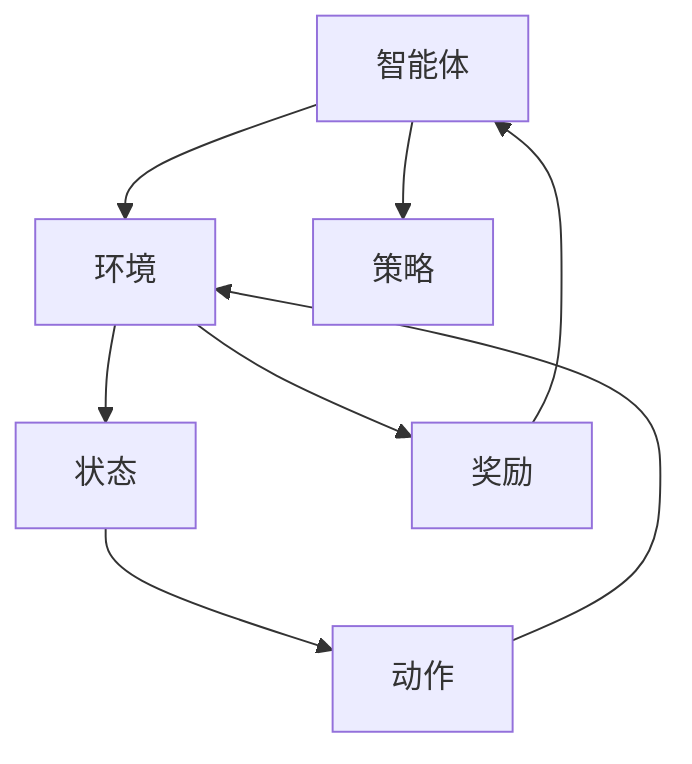

深度强化学习（Deep Reinforcement Learning，DRL）在游戏领域的应用已经非常普及，深度强化学习可以帮助游戏开发者更好地了解用户行为、优化游戏体验，提高用户粘性和留存率。深度强化学习的核心概念是通过不断试错、学习和优化来获得最优策略。下面我们将深入探讨深度强化学习在游戏中的应用原理、核心算法原理、数学模型、公式详细讲解、项目实践、实际应用场景、工具和资源推荐、未来发展趋势与挑战等方面。

## 1. 背景介绍

强化学习（Reinforcement Learning，RL）是人工智能领域的一个子领域，它的核心目标是通过与环境交互学习获得最优策略。在强化学习中，智能体与环境之间的交互是通过一系列的动作和反馈进行的。智能体需要根据环境的反馈来选择最优的动作，以达到最佳的效果。

深度强化学习（DRL）是强化学习的一个分支，它将深度学习与强化学习相结合。深度学习可以用来学习复杂的特征表示，而强化学习则可以用来学习最优策略。深度强化学习可以处理复杂的、非线性的问题，具有很强的实用性和广泛的应用范围。

## 2. 核心概念与联系

深度强化学习的核心概念包括：

* 智能体（Agent）：智能体是与环境进行交互的实体，它可以采取动作，接受环境的反馈，并学习最优策略。

* 环境（Environment）：环境是智能体与之交互的外部世界，环境会根据智能体的动作给出反馈。

* 状态（State）：状态是环境中的一种特征，智能体通过状态来了解环境的当前状况。

* 动作（Action）：动作是智能体可以采取的一种操作，通过动作来改变环境的状态。

* 奖励（Reward）：奖励是智能体根据环境的反馈获得的正反馈，用于指导智能体学习最优策略。

* 策略（Policy）：策略是智能体根据状态选择动作的规则，它是智能体学习最优策略的结果。

深度强化学习的核心概念与联系可以用以下流程图表示：



## 3. 核心算法原理具体操作步骤

深度强化学习的核心算法原理包括：

1. 状态表示：将环境状态表示为向量或矩阵形式，以便于深度学习模型进行处理。

2. 策略网络：构建一个深度神经网络来表示智能体的策略。策略网络接收状态作为输入，并输出动作的概率分布。

3. 目标函数：定义一个损失函数，以便量化智能体与环境交互的效果。损失函数通常是智能体获得的奖励与预期奖励之间的差异。

4. 训练过程：通过最小化损失函数来训练策略网络。训练过程中，智能体与环境交互，根据环境的反馈来更新策略网络的参数。

5. 选择策略：根据策略网络输出的动作概率分布来选择智能体的动作。

## 4. 数学模型和公式详细讲解举例说明

深度强化学习的数学模型可以用马尔可夫决策过程（Markov Decision Process，MDP）来表示。MDP的基本概念包括状态、动作、奖励和状态转移概率。状态表示为$$s$$，动作表示为$$a$$，奖励表示为$$r$$，状态转移概率表示为$$P(s_{t+1}|s_t, a_t)$$。

策略网络的目标是最大化累积奖励$$G_t$$，其中$$G_t=\sum_{t'=t}^{T}\gamma^{t'-t}r_{t'}$$，$$\gamma$$是折扣因子。策略网络的损失函数可以表示为$$J(\pi)=-\mathbb{E}_{\pi}[G_t]$$。

深度强化学习的训练过程可以使用强化学习中的常见算法，例如Q-learning、Deep Q-Network（DQN）等。这些算法的基本流程包括：

1. 初始化智能体的策略网络。

2. 根据策略网络选择动作，并与环境进行交互。

3. 计算智能体与环境交互的奖励。

4. 更新策略网络的参数，以便最小化损失函数。

5. 重复步骤2-4，直到策略网络收敛。

## 5. 项目实践：代码实例和详细解释说明

下面是一个使用Python和Keras实现的深度强化学习游戏案例：

```python
import numpy as np
import keras
from keras.models import Sequential
from keras.layers import Dense, Flatten
from keras.optimizers import Adam

# 环境类
class Environment:
    def __init__(self):
        self.state = 0

    def step(self, action):
        reward = 1 if action == 1 else -1
        self.state = (self.state + 1) % 2
        return self.state, reward

    def reset(self):
        self.state = 0
        return self.state

# 策略网络
def build_model(state_size, action_size):
    model = Sequential()
    model.add(Flatten(input_shape=(1, state_size)))
    model.add(Dense(16, activation='relu'))
    model.add(Dense(action_size, activation='softmax'))
    model.compile(loss='mse', optimizer=Adam(lr=0.001))
    return model

# 训练过程
def train_model(model, env, episodes=1000):
    for episode in range(episodes):
        state = env.reset()
        while True:
            action = np.random.choice([0, 1], p=model.predict(state.reshape(1, 1, env.state_size)))
            next_state, reward = env.step(action)
            model.fit(state, np.array([[reward]]), epochs=1, verbose=0)
            state = next_state
            if state == 0:
                break

# 测试过程
def test_model(model, env):
    state = env.reset()
    done = False
    while not done:
        action = np.argmax(model.predict(state.reshape(1, 1, env.state_size)))
        state, reward = env.step(action)
        print("State: {}, Action: {}, Reward: {}, Next State: {}".format(state, action, reward, env.state))

# 主函数
if __name__ == "__main__":
    env = Environment()
    state_size = 1
    action_size = 2
    model = build_model(state_size, action_size)
    train_model(model, env, episodes=1000)
    test_model(model, env)
```

## 6. 实际应用场景

深度强化学习在游戏领域的实际应用场景包括：

1. 游戏辅助工具：通过深度强化学习来辅助玩家在游戏中取得更好的成绩，例如辅助玩家找到最短路径、解决谜题等。

2. 游戏测试与优化：通过深度强化学习来自动测试游戏，发现bug并优化游戏体验。

3. 游戏广告定位：通过深度强化学习来优化游戏广告的定位，提高广告投放的效果。

4. 游戏分析与推荐：通过深度强化学习来分析玩家行为，提供个性化推荐，提高玩家粘性和留存率。

## 7. 工具和资源推荐

深度强化学习在游戏领域的工具和资源推荐包括：

1. TensorFlow：一个开源的机器学习框架，提供了强大的深度学习功能。

2. Keras：一个高级的神经网络API，简化了深度学习的实现过程。

3. Gym：一个开源的强化学习框架，提供了多种游戏环境和算法实现。

4. OpenAI Baselines：OpenAI提供的强化学习算法库，包含了许多经典的强化学习算法。

## 8. 总结：未来发展趋势与挑战

深度强化学习在游戏领域具有广泛的应用前景，未来发展趋势包括：

1. 更强的智能性：未来深度强化学习将更加强大，能够更好地理解游戏规则和策略。

2. 更高的个人化：通过深度强化学习，游戏可以根据用户的行为和喜好提供更个性化的体验。

3. 更广泛的应用：深度强化学习将不仅仅局限于游戏领域，还将广泛应用于其他领域，如医疗、金融等。

然而，深度强化学习在游戏领域面临一些挑战：

1. 数据匮乏：游戏数据通常有限，可能影响深度强化学习的训练效果。

2. 计算资源消耗：深度强化学习通常需要大量的计算资源，可能限制其在移动设备等平台上的应用。

3. 安全性问题：深度强化学习可能会引起一些安全性问题，如恶意攻击等。

## 9. 附录：常见问题与解答

1. 深度强化学习与传统机器学习的区别？

传统机器学习主要依赖于有标签的数据进行训练，而深度强化学习则通过与环境交互学习获得最优策略。传统机器学习通常采用监督学习、无监督学习等方法，而深度强化学习则采用强化学习的方法。

1. 深度强化学习与人工智能的关系？

深度强化学习是人工智能的一个子领域，它将深度学习与强化学习相结合，实现了智能体与环境之间的交互学习。人工智能是计算机科学的一个分支，致力于模拟和复制人类的智能行为。深度强化学习作为人工智能的一个子领域，为实现更高级别的人工智能提供了新的方法和途径。