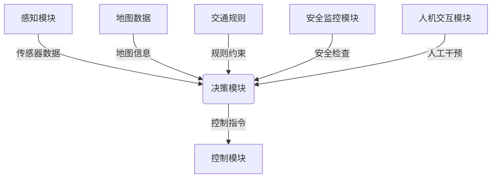

# AI Safety原理与代码实例讲解

## 1.背景介绍

随着人工智能(AI)技术的快速发展,AI系统正在被越来越广泛地应用于各个领域,包括医疗保健、金融、交通运输、国防等关键基础设施。然而,AI系统的安全性和可靠性也成为了人们越来越关注的问题。一旦AI系统出现故障或被恶意利用,可能会带来灾难性的后果。因此,确保AI系统的安全性和可控性,对于保护人类利益至关重要。

AI安全(AI Safety)是一个新兴的研究领域,旨在研究如何设计和开发安全可靠的AI系统,使其行为符合人类的意图和价值观,并且能够在各种情况下保持可控和安全。AI安全涉及多个方面,包括AI系统的稳健性、可解释性、可审计性、伦理性等。

## 2.核心概念与联系

### 2.1 AI安全的核心概念

AI安全的核心概念包括以下几个方面:

1. **AI系统的可靠性和稳健性**:确保AI系统在各种情况下都能够正常运行,不会出现意外行为或失控。
2. **AI系统的可解释性**:使AI系统的决策过程和结果能够被人类理解和解释,以便进行监督和调整。
3. **AI系统的可审计性**:记录和跟踪AI系统的决策过程,以便进行事后分析和问责。
4. **AI系统的伦理性**:确保AI系统的行为符合人类的价值观和伦理准则,不会产生有害或不道德的后果。
5. **AI系统的可控性**:人类能够对AI系统进行有效的监督和控制,以确保其行为符合预期。

### 2.2 AI安全与其他领域的联系

AI安全与多个领域密切相关,包括:

1. **计算机安全**:确保AI系统免受黑客攻击、病毒入侵等网络安全威胁。
2. **软件工程**:采用可靠的软件开发方法和测试技术,提高AI系统的质量和稳定性。
3. **伦理学**:研究AI系统的伦理影响,制定相关的伦理准则和规范。
4. **法律**:制定相关法律法规,规范AI系统的开发和应用。
5. **心理学**:研究人类与AI系统的交互方式,提高AI系统的可用性和可接受性。

## 3.核心算法原理具体操作步骤

为了确保AI系统的安全性,需要在系统的设计、开发和部署的各个阶段采取相应的措施。以下是一些核心算法原理和具体操作步骤:

### 3.1 AI系统的验证和测试

在AI系统的开发过程中,需要进行全面的验证和测试,以确保系统的正确性和稳健性。常用的验证和测试方法包括:

1. **形式化验证**:使用数学方法对AI系统的规格说明和实现进行形式化验证,以检查系统是否满足预期的性质。
2. **模糊测试**:向AI系统输入大量随机或恶意构造的数据,检测系统是否会出现异常行为或崩溃。
3. **压力测试**:在极端条件下测试AI系统的性能和稳定性,如高并发、大数据量等情况。
4. **场景测试**:在模拟真实环境中测试AI系统的行为,评估其在实际应用场景中的表现。

### 3.2 AI系统的可解释性和可审计性

为了提高AI系统的可解释性和可审计性,需要采取以下措施:

1. **可解释的AI模型**:设计和开发能够解释其决策过程的AI模型,如决策树、规则系统等。
2. **模型可视化**:使用可视化技术展示AI模型的内部结构和决策过程,以便人类理解。
3. **决策日志**:记录AI系统的决策过程,包括输入数据、中间计算结果和最终输出,以便进行事后审计。
4. **解释生成**:自动生成AI系统决策的解释说明,帮助人类理解系统的行为。

### 3.3 AI系统的伦理性和可控性

为了确保AI系统的伦理性和可控性,需要采取以下措施:

1. **伦理原则嵌入**:在AI系统的设计和开发过程中,嵌入人类的伦理原则和价值观。
2. **人机协作决策**:在关键决策过程中,让人类和AI系统共同参与,确保决策符合人类的意图。
3. **监控和干预机制**:建立监控AI系统运行状态的机制,并提供人工干预的接口,以便在必要时进行控制和调整。
4. **可信赖的人工智能**:设计和开发可信赖的AI系统,其行为能够被人类理解和预测。

## 4.数学模型和公式详细讲解举例说明

在AI安全领域,数学模型和公式扮演着重要的角色,用于形式化描述和分析AI系统的行为。以下是一些常见的数学模型和公式:

### 4.1 马尔可夫决策过程 (MDP)

马尔可夫决策过程(Markov Decision Process, MDP)是一种广泛应用于强化学习和决策理论的数学框架。它可以用于建模和分析AI系统在不确定环境中的决策过程。

MDP由以下几个要素组成:

- 状态集合 $S$
- 动作集合 $A$
- 转移概率函数 $P(s'|s,a)$,表示在状态 $s$ 下执行动作 $a$ 后,转移到状态 $s'$ 的概率
- 奖励函数 $R(s,a,s')$,表示在状态 $s$ 下执行动作 $a$ 并转移到状态 $s'$ 时获得的奖励

目标是找到一个策略 $\pi: S \rightarrow A$,使得期望累积奖励最大化。

在强化学习中,常用的算法包括Q-Learning、Sarsa等,用于学习最优策略。

### 4.2 形式化验证

形式化验证是一种使用数学方法对系统进行严格证明的技术,可以用于验证AI系统的正确性和安全性。

常用的形式化验证方法包括:

1. **模型检查**:将系统建模为一个有限状态机或过程代数,并使用模型检查工具验证系统是否满足指定的性质。
2. **定理证明**:使用定理证明器对系统的规格说明进行形式化证明,证明系统满足预期的性质。
3. **程序验证**:对系统的实现代码进行形式化验证,证明其符合规格说明。

以下是一个使用线性时临逻辑(Linear Temporal Logic, LTL)表达AI系统安全性质的例子:

$$
\varphi = \square (\text{safe} \rightarrow \bigcirc \text{safe})
$$

该公式表示"如果系统当前处于安全状态,那么在下一个状态它也将保持安全"。通过模型检查,可以验证系统是否满足这一性质。

### 4.3 可解释的AI模型

可解释的AI模型旨在提高AI系统的可解释性,使其决策过程能够被人类理解。常见的可解释AI模型包括:

1. **决策树**:将决策过程表示为一棵树形结构,每个节点代表一个特征,叶节点代表最终决策。
2. **规则系统**:使用一系列规则来描述决策过程,每条规则都有明确的前提条件和结论。
3. **注意力机制**:在深度学习模型中引入注意力机制,使模型能够关注输入数据的关键部分,从而提高可解释性。

以下是一个简单的决策树模型示例:

```
             年龄
            /     \
           /       \
         <=30      >30
         /           \
        /             \
    学历             收入
   /     \           /     \
 高中    大学      <=5万   >5万
 /   \   /   \      /       /
拒绝 批准 拒绝 批准  拒绝   批准
```

该决策树模型用于评估是否批准某人的贷款申请,根据年龄、学历和收入等特征做出决策。这种模型的决策过程是可解释的,便于人类理解。

## 5.项目实践:代码实例和详细解释说明

为了更好地理解AI安全的原理和实践,我们将通过一个实际项目来进行讲解。该项目旨在开发一个安全的自动驾驶系统,能够在各种复杂情况下保持可控和安全。

### 5.1 项目概述

自动驾驶系统是一个典型的AI应用场景,涉及感知、决策和控制等多个模块。系统需要能够实时感知周围环境,做出合理的决策,并控制车辆的行驶。

在该项目中,我们将重点关注决策模块的安全性,确保其能够做出安全可靠的决策,并且决策过程是可解释和可审计的。

### 5.2 系统架构

该自动驾驶系统的架构如下所示:



其中:

- **感知模块**负责从各种传感器(如雷达、摄像头等)获取环境数据,并进行预处理。
- **决策模块**是系统的核心,根据感知数据、地图信息和交通规则等做出行驶决策。
- **控制模块**执行决策模块的指令,控制车辆的实际行驶。
- **安全监控模块**持续监控系统的运行状态,检测潜在的安全风险。
- **人机交互模块**提供人工干预接口,允许人类在必要时接管控制权。

### 5.3 决策模块的实现

决策模块是整个系统的关键部分,我们将重点介绍其实现细节。

#### 5.3.1 行为规划算法

决策模块的核心是行为规划算法,用于计算出安全的行驶路径和速度。我们采用了一种基于马尔可夫决策过程(MDP)的强化学习算法。

算法的主要步骤如下:

1. 将环境建模为MDP,状态包括车辆位置、速度、周围障碍物等信息。
2. 定义奖励函数,鼓励安全行驶,避免碰撞和违规行为。
3. 使用Q-Learning算法学习最优策略,即在给定状态下选择最佳动作(加速、减速、转向等)。
4. 在实际驾驶时,根据当前状态执行学习到的策略。

以下是Q-Learning算法的伪代码:

```python
import numpy as np

# 初始化Q表
Q = np.zeros((num_states, num_actions))

# 设置超参数
alpha = 0.1  # 学习率
gamma = 0.9  # 折现因子
epsilon = 0.1  # 探索概率

# Q-Learning算法
for episode in range(num_episodes):
    state = env.reset()
    done = False
    while not done:
        # 选择动作
        if np.random.uniform() < epsilon:
            action = env.sample_action()  # 探索
        else:
            action = np.argmax(Q[state])  # 利用

        # 执行动作
        next_state, reward, done = env.step(action)

        # 更新Q值
        Q[state, action] += alpha * (reward + gamma * np.max(Q[next_state]) - Q[state, action])

        state = next_state
```

在训练过程中,算法会不断尝试不同的行为策略,并根据获得的奖励来更新Q表,最终学习到一个近似最优的策略。

#### 5.3.2 可解释性和可审计性

为了提高决策模块的可解释性和可审计性,我们采取了以下措施:

1. **可视化决策过程**:使用图形界面展示车辆的感知数据、规划路径和决策细节,便于人类理解系统的行为。
2. **决策日志**:记录每一次决策的输入数据、中间计算结果和最终输出,以便进行事后审计。
3. **解释生成**:基于训练好的Q表,自动生成决策的解释说明,例如"在当前状态下,系统选择加速是因为..."。

以下是一个决策可视化界面的示例:

```mermaid
graph TD
    A[传感器数据可视化] -->