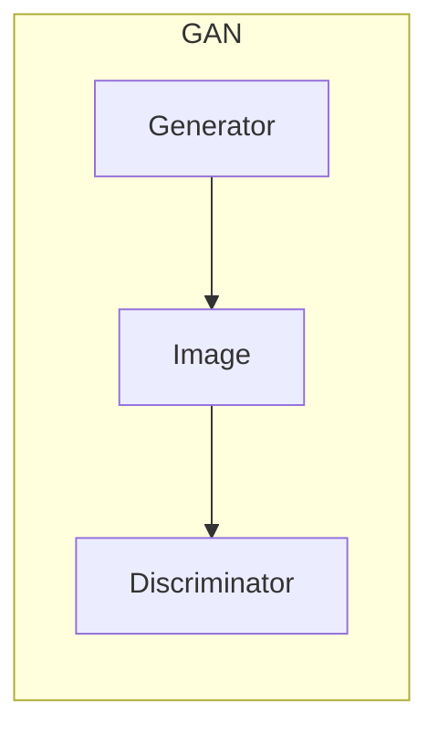
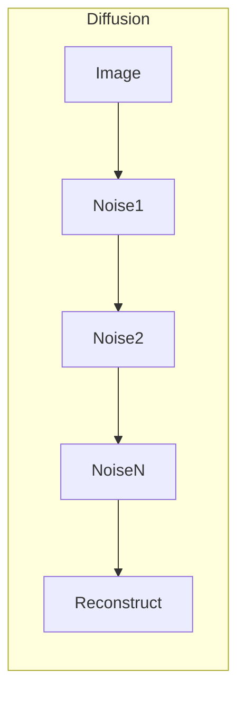
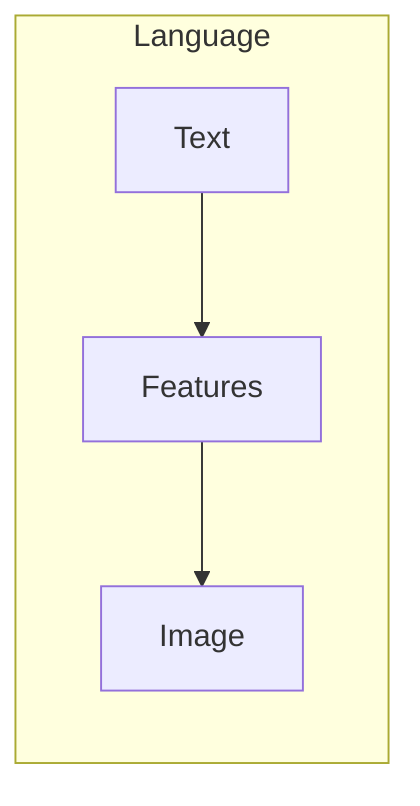
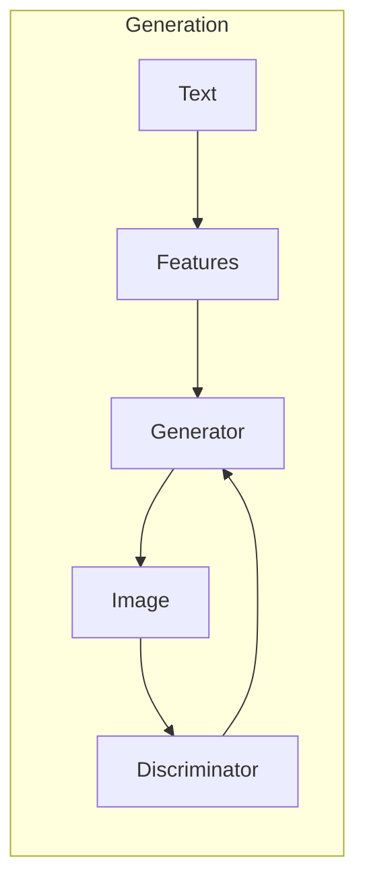
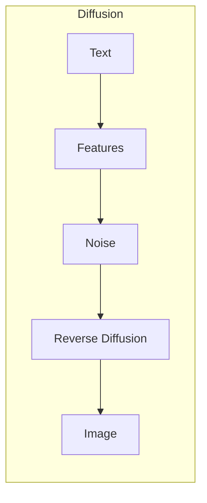

# AIGC从入门到实战：启动AIGC工具中的明星产品Midjourney

## 1.背景介绍

### 1.1 AIGC的兴起

人工智能生成内容(AIGC)是一种利用人工智能技术生成文本、图像、音频和视频等数字内容的新兴技术。近年来,AIGC技术的快速发展正在重塑内容创作和消费的方式,引发了广泛关注。

### 1.2 AIGC的应用前景

AIGC可以应用于多个领域,包括营销、广告、教育、娱乐等,为企业和个人提供高效、经济的内容生成解决方案。根据预测,到2025年,AIGC市场规模将达到490亿美元。

### 1.3 Midjourney的崛起

在AIGC工具中,Midjourney作为一款基于人工智能的图像生成工具脱颖而出。它能够根据用户的文本描述生成逼真的图像,在短时间内获得了大量用户。本文将重点介绍Midjourney的核心技术、使用方法和发展前景。

## 2.核心概念与联系

### 2.1 生成式对抗网络(GAN)

Midjourney的核心技术是生成式对抗网络(GAN)。GAN由两个神经网络组成:生成器(Generator)和判别器(Discriminator)。



生成器从随机噪声中生成图像,判别器则判断生成的图像是真实的还是伪造的。两个网络相互对抗,生成器努力生成更逼真的图像以欺骗判别器,而判别器则努力区分真实和伪造的图像。

### 2.2 扩散模型

除了GAN,Midjourney还采用了扩散模型(Diffusion Model)。扩散模型将图像逐步添加噪声,然后学习从噪声图像中重构原始图像的过程。



通过反向扩散过程,可以从纯噪声中生成逼真图像。扩散模型在图像生成质量上表现优异。

### 2.3 大语言模型

Midjourney利用大语言模型(如GPT-3)将自然语言描述转换为图像特征,指导图像生成过程。这使得用户可以使用自然语言描述期望的图像内容和风格。



通过将自然语言与视觉特征相结合,Midjourney可以生成高度个性化和多样化的图像。

## 3.核心算法原理具体操作步骤

### 3.1 预训练模型

Midjourney使用预训练的GAN和扩散模型作为基础。这些模型在大量数据上进行训练,学习图像的一般特征和生成规则。

### 3.2 文本编码

当用户输入文本描述时,Midjourney使用大语言模型将文本编码为一系列特征向量,表示图像的内容和风格。

### 3.3 条件图像生成

将文本特征向量作为条件输入到GAN和扩散模型中,指导图像生成过程。生成器尝试生成与文本描述相匹配的图像,而判别器评估生成图像的质量和真实性。



### 3.4 反向扩散

对于扩散模型,将文本特征向量与噪声图像结合,然后通过反向扩散过程逐步重构出最终图像。



### 3.5 图像后处理

生成的初始图像可能存在artifact或噪点。Midjourney使用后处理技术(如上采样、去噪等)提高图像质量和分辨率。

## 4.数学模型和公式详细讲解举例说明

### 4.1 生成式对抗网络(GAN)

GAN由生成器G和判别器D组成,它们相互对抗地训练。生成器G从噪声z中生成图像,判别器D则判断输入图像是真实的(来自训练数据)还是伪造的(由G生成)。

生成器和判别器的目标函数如下:

$$\min_G \max_D V(D,G) = \mathbb{E}_{x\sim p_{data}(x)}[\log D(x)] + \mathbb{E}_{z\sim p_z(z)}[\log(1-D(G(z)))]$$

其中,$p_{data}(x)$是真实数据分布,$p_z(z)$是噪声分布。

在训练过程中,判别器D最大化对真实和伪造图像的正确分类概率,而生成器G则最小化判别器对伪造图像的检测概率。

### 4.2 扩散模型

扩散模型通过向图像添加高斯噪声来破坏图像结构,然后学习从噪声图像中重构原始图像。令$x_0$为原始图像,$x_T$为纯噪声图像,扩散过程如下:

$$q(x_t|x_{t-1}) = \mathcal{N}(x_t;\sqrt{1-\beta_t}x_{t-1},\beta_tI)$$

其中,$\beta_t$是方差系数,控制每一步添加的噪声量。

反向扩散过程则是从$x_T$开始,逐步去噪重构$x_0$:

$$p_\theta(x_{t-1}|x_t) = \mathcal{N}(x_{t-1};\mu_\theta(x_t,t),\Sigma_\theta(x_t,t))$$

其中,$\mu_\theta$和$\Sigma_\theta$是神经网络参数化的均值和方差函数。

通过最小化以下损失函数训练扩散模型:

$$\mathcal{L}_{simple}(\theta) = \mathbb{E}_{t,x_0}\big[\left\lVert\epsilon - \epsilon_\theta(x_t,t)\right\rVert_2^2\big]$$

其中,$\epsilon$是从$x_t$到$x_{t-1}$的噪声,$\epsilon_\theta$是模型预测的噪声。

### 4.3 条件图像生成

为了根据文本描述生成图像,Midjourney将文本编码为条件向量$c$,并将其作为额外输入馈送到生成器和扩散模型中。

对于GAN,生成器G的输入变为$(z,c)$,判别器D的输入变为$(x,c)$。对于扩散模型,反向过程变为:

$$p_\theta(x_{t-1}|x_t,c) = \mathcal{N}(x_{t-1};\mu_\theta(x_t,t,c),\Sigma_\theta(x_t,t,c))$$

通过条件向量$c$,模型可以学习将文本描述与图像特征相关联,从而生成符合描述的图像。

## 5.项目实践:代码实例和详细解释说明

虽然Midjourney的完整代码未公开,但我们可以通过一个简化的示例代码来理解其核心原理。这个示例使用PyTorch实现了一个基本的GAN模型,用于生成手写数字图像。

### 5.1 导入库

```python
import torch
import torch.nn as nn
import torch.optim as optim
import torchvision
import torchvision.transforms as transforms
import matplotlib.pyplot as plt
```

### 5.2 定义生成器和判别器

```python
# 生成器
class Generator(nn.Module):
    def __init__(self, z_dim):
        super(Generator, self).__init__()
        self.net = nn.Sequential(
            nn.Linear(z_dim, 256),
            nn.LeakyReLU(0.2),
            nn.Linear(256, 512),
            nn.LeakyReLU(0.2),
            nn.Linear(512, 1024),
            nn.LeakyReLU(0.2),
            nn.Linear(1024, 784),
            nn.Tanh()
        )

    def forward(self, z):
        return self.net(z).view(-1, 1, 28, 28)

# 判别器
class Discriminator(nn.Module):
    def __init__(self):
        super(Discriminator, self).__init__()
        self.net = nn.Sequential(
            nn.Linear(784, 512),
            nn.LeakyReLU(0.2),
            nn.Linear(512, 256),
            nn.LeakyReLU(0.2),
            nn.Linear(256, 1),
            nn.Sigmoid()
        )

    def forward(self, x):
        return self.net(x.view(-1, 784))
```

### 5.3 定义训练函数

```python
def train(G, D, epochs, batch_size, z_dim):
    criterion = nn.BCELoss()
    real_label = 1
    fake_label = 0
    
    optimizerG = optim.Adam(G.parameters(), lr=0.0002)
    optimizerD = optim.Adam(D.parameters(), lr=0.0002)
    
    for epoch in range(epochs):
        for i, (images, _) in enumerate(dataloader):
            
            # 训练判别器
            optimizerD.zero_grad()
            real_data = images.view(-1, 784)
            real_output = D(real_data)
            real_loss = criterion(real_output, torch.ones_like(real_output) * real_label)
            
            z = torch.randn(batch_size, z_dim)
            fake_data = G(z)
            fake_output = D(fake_data.detach())
            fake_loss = criterion(fake_output, torch.zeros_like(fake_output))
            
            d_loss = real_loss + fake_loss
            d_loss.backward()
            optimizerD.step()
            
            # 训练生成器
            optimizerG.zero_grad()
            z = torch.randn(batch_size, z_dim)
            fake_data = G(z)
            fake_output = D(fake_data)
            g_loss = criterion(fake_output, torch.ones_like(fake_output) * real_label)
            
            g_loss.backward()
            optimizerG.step()
            
        print(f"Epoch: {epoch+1}, D Loss: {d_loss.item()}, G Loss: {g_loss.item()}")
```

### 5.4 实例化模型并训练

```python
# 加载数据
transform = transforms.Compose([transforms.ToTensor()])
dataset = torchvision.datasets.MNIST(root='./data', train=True, download=True, transform=transform)
dataloader = torch.utils.data.DataLoader(dataset, batch_size=64, shuffle=True)

# 实例化模型
z_dim = 100
G = Generator(z_dim)
D = Discriminator()

# 训练模型
train(G, D, epochs=20, batch_size=64, z_dim=z_dim)
```

### 5.5 生成图像

```python
# 生成图像
z = torch.randn(16, z_dim)
fake_images = G(z)

# 显示图像
fig, axes = plt.subplots(4, 4, figsize=(12, 12))
for i in range(16):
    row, col = i // 4, i % 4
    axes[row, col].imshow(fake_images[i].squeeze().detach().numpy(), cmap='gray')
    axes[row, col].axis('off')
plt.show()
```

通过这个示例,我们可以了解GAN的基本原理和实现方式。虽然Midjourney使用了更复杂的模型架构和训练技术,但其核心思想与此类似。

## 6.实际应用场景

### 6.1 视觉艺术创作

Midjourney可用于创作各种风格的艺术作品,如插画、概念艺术、漫画等。艺术家可以使用自然语言描述来快速生成草图和概念图,从而加快创作过程。

### 6.2 营销和广告

Midjourney可以为营销和广告活动生成个性化的视觉内容,如产品图像、海报设计等。这有助于提高内容的吸引力和转化率。

### 6.3 游戏和虚拟现实

在游戏和虚拟现实领域,Midjourney可以生成逼真的环境、角色和道具,为用户提供身临其境的体验。开发者可以快速迭代和测试不同的视觉元素。

### 6.4 教育和培训

Midjourney可以生成各种教学材料,如插图、动画和虚拟场景,为学习者提供直观的视觉辅助。这有助于提高教学效果和学习体验。

### 6.5 科研和可视化

在科研领域,Midjourney可以用于生成科学数据的可视化图像,帮助研究人员更好地理解和交流复杂的概念和模型。

## 7.工具和资源推荐

### 7.1 Midjourney官方网站